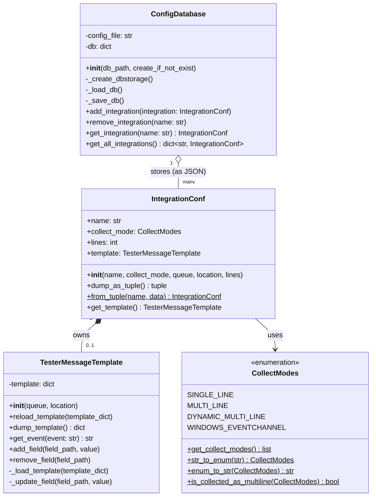
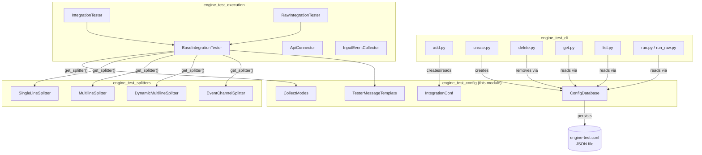
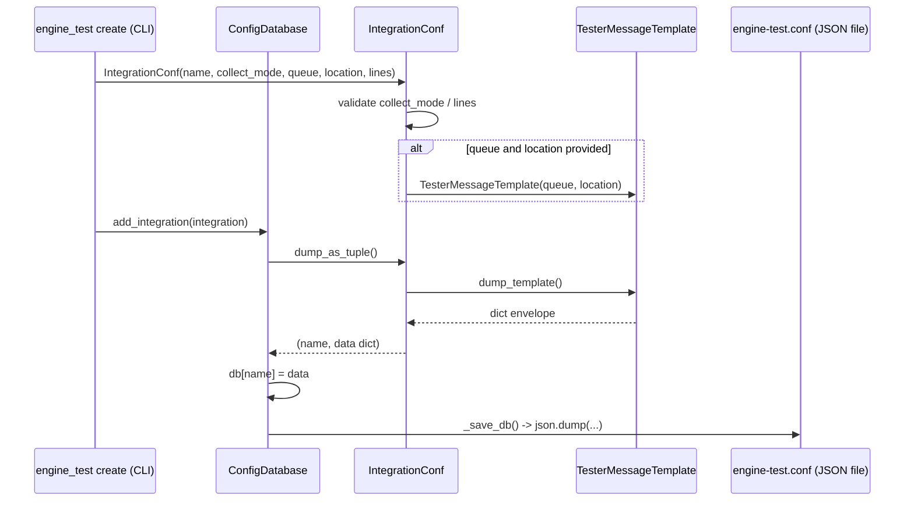
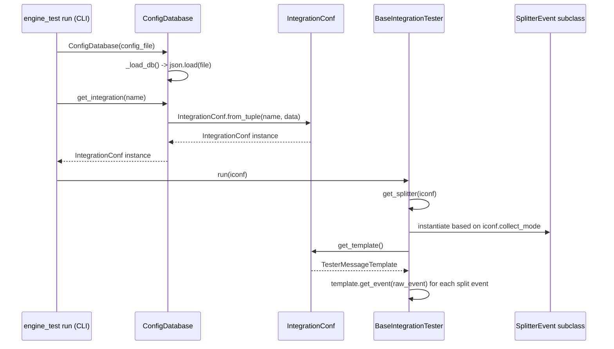

# Engine Test Config

## Introduction

The **`engine_test_config`** module is the configuration-management subsystem of the `engine-test` CLI tool, part of the broader [Engine Administration CLI Tools (Python)](engine_administration_cli_tools.md) suite that ships with the Wazuh Engine (`src/engine/tools/engine-suite`). Its purpose is to define, persist, and retrieve **integration configurations** — the metadata that tells `engine-test` how to collect, group, and wrap raw log lines into events that can be sent to the [Wazuh Engine Core](Wazuh_Engine_Core_(C++).md) for testing rule/decoder pipelines.

Concretely, this module answers three questions for every named integration (e.g. `apache-access`, `windows-eventchannel-security`):

1. **How should raw input be split into discrete events?** (single line, multi-line with a fixed line count, dynamic multi-line, or Windows Event Channel format) — captured by `CollectModes`.
2. **What does a "wrapped" event look like when sent to the engine?** (the `queue`, `location`, and `message` envelope fields) — captured by `TesterMessageTemplate`.
3. **Where and how are these per-integration settings stored, loaded, and mutated on disk?** — captured by `ConfigDatabase`, which persists everything as a single JSON file (by default `/var/ossec/etc/engine-test.conf`).

This module has no runtime/daemon component — it is a pure configuration layer consumed by the CLI commands in [engine_test_cli](engine_test_cli.md) and [engine_test_session_cli](engine_test_session_cli.md), and by the execution layer in [engine_test_execution](engine_test_execution.md) and [engine_test_splitters](engine_test_splitters.md).

## Purpose and Core Functionality

| Component | File | Responsibility |
|---|---|---|
| `ConfigDatabase` | `conf/store.py` | CRUD persistence layer for integration configurations, backed by a JSON file on disk. |
| `IntegrationConf` | `conf/integration.py` | In-memory representation of a single integration's configuration (collect mode, line count, message template). |
| `CollectModes` | `conf/integration.py` | Enum of supported event-collection strategies, with helpers to convert to/from string and to classify multiline-ness. |
| `TesterMessageTemplate` | `conf/event_tester_template.py` | Builds/maintains the JSON "envelope" (`queue`, `location`, `message`) used to wrap a raw event before submission to the engine's tester API. |

Together, these components implement a small **repository pattern**: `IntegrationConf` and `TesterMessageTemplate` are the domain model/value objects, while `ConfigDatabase` is the repository that serializes/deserializes them to a flat JSON store.

## Architecture

### Component Relationships



### Module Position in the Engine Test Tool



## Data Model

### `CollectModes` (Enum)

Defines the four supported strategies for turning raw text input into discrete log events. Each value maps directly to a splitter implementation in [engine_test_splitters](engine_test_splitters.md):

| Enum Value | String | Corresponding Splitter |
|---|---|---|
| `SINGLE_LINE` | `"single-line"` | `SingleLineSplitter` |
| `MULTI_LINE` | `"multi-line"` | `MultilineSplitter` (requires `lines` count) |
| `DYNAMIC_MULTI_LINE` | `"dynamic-multi-line"` | `DynamicMultilineSplitter` |
| `WINDOWS_EVENTCHANNEL` | `"windows-eventchannel"` | `EventChannelSplitter` |

Helper methods:
- `str_to_enum` / `enum_to_str`: bidirectional conversion for JSON (de)serialization.
- `is_collected_as_multiline`: classifies whether a mode requires multi-line buffering logic (all modes except `SINGLE_LINE`).
- `get_collect_modes`: returns all valid string values (used for CLI argument validation/help text).

### `IntegrationConf`

Represents the full configuration of one named integration. Constructed either directly (e.g., from CLI arguments in `engine_test create`) or reconstituted from the JSON store via `from_tuple`.

Key behavior:
- Validates that `collect_mode` is one of the recognized `CollectModes` values.
- Enforces that `MULTI_LINE` mode requires an explicit `lines` count.
- Lazily creates a `TesterMessageTemplate` only if both `queue` and `location` are supplied (both are needed to build the message envelope).
- `dump_as_tuple()` / `from_tuple()` provide the serialization boundary consumed by `ConfigDatabase`.

### `TesterMessageTemplate`

Encapsulates the JSON envelope wrapping each raw event before it is sent to the Engine's tester API (see `api_tester` and `ApiConnector` in [engine_test_execution](engine_test_execution.md)):

```json
{
  "event": {
    "queue": "<queue-char>",
    "location": "<source-path-or-identifier>",
    "message": "<raw event content>"
  }
}
```

Provides generic dotted-path field manipulation (`add_field`, `remove_field`) so that CLI commands can customize the template (e.g., add extra static fields) without needing to know the full JSON structure. `get_event()` produces the final message string that is embedded in the envelope prior to submission.

### `ConfigDatabase`

A minimal JSON-file-backed key/value store where the key is the integration name and the value is the serialized `IntegrationConf` payload.

Responsibilities:
- **Initialization** (`__init__`): optionally creates the storage file (`_create_dbstorage`) with `0640` permissions and `wazuh` group ownership if using the default path, then loads existing content (`_load_db`).
- **CRUD**:
  - `add_integration` — raises if the name already exists; otherwise persists via `_save_db`.
  - `remove_integration` — raises if the name doesn't exist.
  - `get_integration` — reconstructs a single `IntegrationConf` via `IntegrationConf.from_tuple`.
  - `get_all_integrations` — reconstructs all stored integrations into a `dict[str, IntegrationConf]`.
- **Persistence**: `_save_db` writes pretty-printed JSON (`indent=2`) back to disk on every mutation.

## Data Flow

### Creating and Persisting an Integration



### Loading Configuration for Test Execution



## Integration with Other Modules

- **[engine_test_cli](engine_test_cli.md)**: Commands such as `create.py`, `add.py`, `delete.py`, `get.py`, `list.py`, and `run.py`/`run_raw.py` are the primary consumers of `ConfigDatabase` and `IntegrationConf` — they translate CLI arguments into configuration objects and persist/retrieve them.
- **[engine_test_session_cli](engine_test_session_cli.md)**: Session-management commands (`session_add.py`, `session_reload.py`, etc.) rely on the same stored integration configuration to know how to (re)build a test session against the Engine's Router/Tester APIs.
- **[engine_test_execution](engine_test_execution.md)**: `BaseIntegrationTester` (and its subclasses `IntegrationTester`, `RawIntegrationTester`) consume `IntegrationConf.collect_mode` to select the correct splitter and `IntegrationConf.get_template()` to build the request payload sent through `ApiConnector` to the Engine's Tester/Router API (see [engine_api_router_tester](engine_api_router_tester.md) in [Wazuh Engine Core](Wazuh_Engine_Core_(C++).md)).
- **[engine_test_splitters](engine_test_splitters.md)**: `CollectModes` values map one-to-one to splitter classes (`SingleLineSplitter`, `MultilineSplitter`, `DynamicMultilineSplitter`, `EventChannelSplitter`) that implement the `SplitterEvent` interface.
- **[engine_suite_shared](engine_suite_shared.md)**: `EngineDumper` (used for YAML output formatting) and `ResourceHandler` are shared utilities used alongside this configuration layer when formatting test output.

## Storage Format

The on-disk JSON file (default path `/var/ossec/etc/engine-test.conf`) is a flat object keyed by integration name:

```json
{
  "apache-access": {
    "collect_mode": "single-line",
    "template": {
      "event": {
        "queue": "w",
        "location": "/var/log/apache2/access.log",
        "message": ""
      }
    }
  },
  "windows-security": {
    "collect_mode": "multi-line",
    "lines": 3,
    "template": {
      "event": {
        "queue": "d",
        "location": "EventChannel",
        "message": ""
      }
    }
  }
}
```

- File permissions are set to `0640` on creation.
- When using the default config path, group ownership is set to `wazuh` (best-effort; failures are logged as warnings, not fatal).
- The `template` key is optional — an integration without a `queue`/`location` pair will omit it entirely (though this is an edge case, since most integrations require a template to be usable at test-run time).

## Error Handling

All classes in this module favor **fail-fast exceptions** over silent defaults:

- `ConfigDatabase._create_dbstorage`: raises if the file already exists or cannot be created/chmod'd.
- `ConfigDatabase._load_db`: raises if the file content is not valid JSON.
- `ConfigDatabase.add_integration` / `remove_integration` / `get_integration`: raise plain `Exception` with descriptive messages for duplicate/missing integration names (callers in the CLI layer are expected to catch and present these to the user).
- `IntegrationConf.__init__`: raises `ValueError` for invalid/missing `collect_mode`, or missing `lines` when `MULTI_LINE` is selected.
- `TesterMessageTemplate.remove_field` / `get_template` (via `IntegrationConf.get_template`): raise `KeyError`/`RuntimeError` respectively when the requested field/template does not exist.

## Related Documentation

- [engine_test_cli.md](engine_test_cli.md) — CLI commands (`create`, `add`, `delete`, `get`, `list`, `run`, `run_raw`) that operate on this configuration layer.
- [engine_test_session_cli.md](engine_test_session_cli.md) — Session-oriented CLI commands built on top of the same configuration store.
- [engine_test_execution.md](engine_test_execution.md) — Execution engine (`BaseIntegrationTester`, `IntegrationTester`, `RawIntegrationTester`, `ApiConnector`, `InputEventCollector`) that consumes `IntegrationConf` to drive test runs against the Engine.
- [engine_test_splitters.md](engine_test_splitters.md) — Splitter implementations selected based on `CollectModes`.
- [engine_suite_shared.md](engine_suite_shared.md) — Shared utilities (`EngineDumper`, `ResourceHandler`, `Executor`) used across the `engine-suite` CLI tools.
- [Wazuh_Engine_Core_(C++).md](Wazuh_Engine_Core_(C++).md) — The C++ Engine backend (Router, Tester, API) that ultimately receives the events wrapped by `TesterMessageTemplate`.
