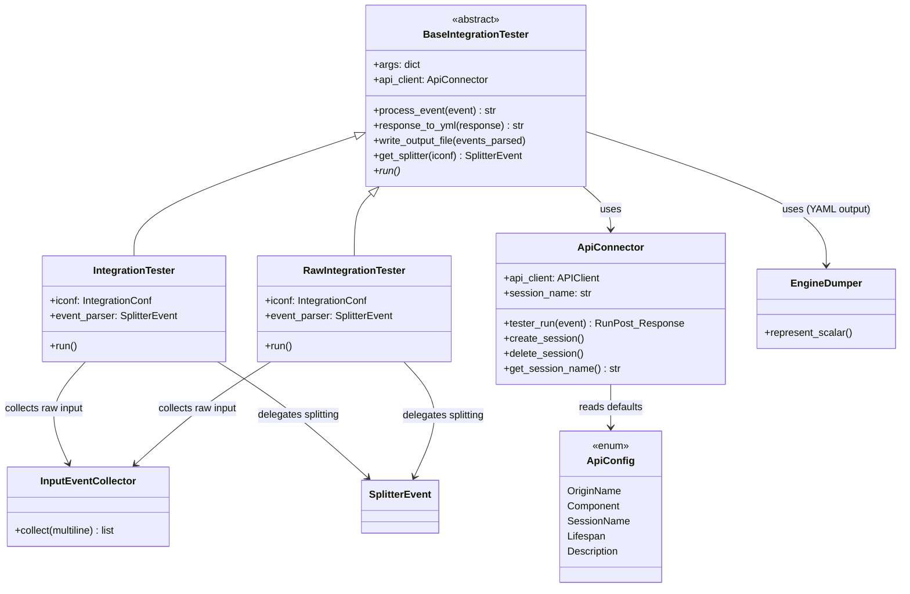
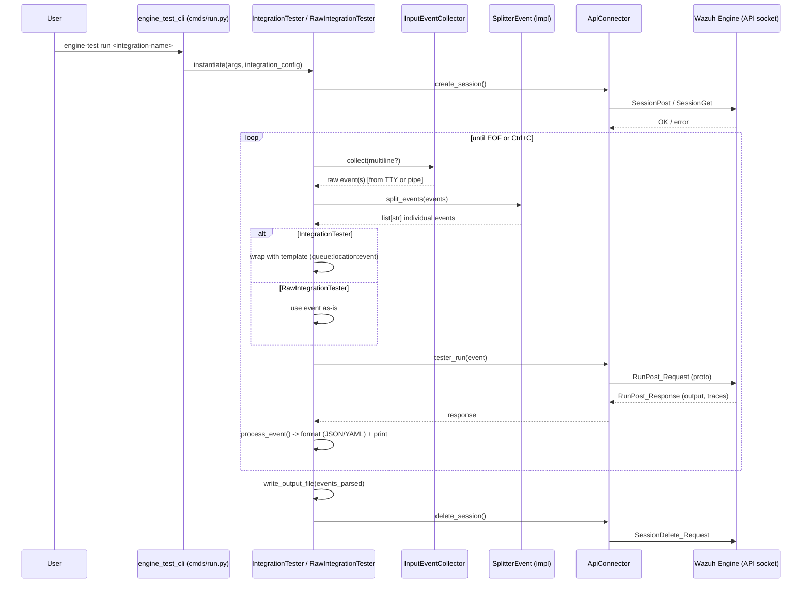
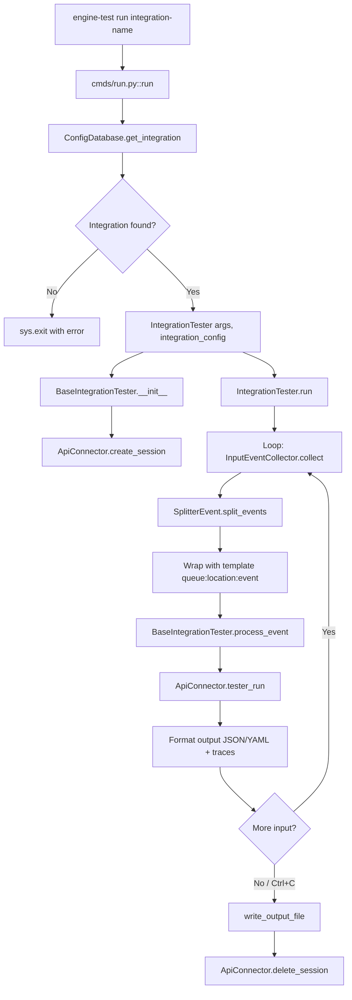

# Engine Test Execution

## Introduction

The **`engine_test_execution`** module is the runtime core of the `engine-test` CLI tool, part of the broader [Engine Administration CLI Tools (Python)](engine_administration_cli_tools_python.md) suite. While sibling modules (`engine_test_cli`, `engine_test_session_cli`, `engine_test_config`) handle command-line parsing and integration/session configuration, this module is responsible for **actually executing a test run**: collecting raw input events from the user, splitting them into individual log lines, wrapping them according to an integration's message template (or sending them raw), dispatching each event to the Wazuh Engine via its HTTP-over-Unix-socket API, and formatting/printing the resulting output and traces.

In short, `engine_test_execution` implements the "verb" of `engine-test run` and `engine-test run-raw`: given a configured integration and a stream of sample events, it drives the interactive/pipe-based testing loop against a running Engine instance.

---

## Purpose and Core Functionality

This module provides:

1. **A shared execution skeleton** (`BaseIntegrationTester`) that all test-runner variants inherit from, encapsulating:
   - API session lifecycle management (via `ApiConnector`)
   - Event-to-API dispatch and response formatting (JSON or YAML, with optional trace output)
   - Output file writing
   - Selection of the correct event splitter based on integration configuration

2. **Two concrete test runners**:
   - `IntegrationTester` — wraps each collected raw log line using the integration's configured message template (queue + location prefix) before sending it to the Engine, simulating how the integration's decoder would actually receive the event in production.
   - `RawIntegrationTester` — sends collected events to the Engine **unmodified**, useful for testing decoders/rules directly with pre-formatted or synthetic event strings.

3. **API connectivity** (`ApiConnector`, `ApiConfig`) — a thin wrapper that creates/deletes ephemeral or named testing sessions on the Engine and submits individual events for evaluation through the `tester` API (protobuf-based, `RunPost_Request`/`RunPost_Response`).

4. **Input collection** (`InputEventCollector`) — reads events either interactively from a TTY (prompting the user) or in bulk from piped/redirected stdin, supporting both single-line and multi-line collection modes.

---

## Architecture and Component Relationships

### Component Overview

### Relationship to Sibling & Dependency Modules

| Module | Relationship |
|---|---|
| [engine_test_cli](engine_test_cli.md) | Parses CLI args (`engine-test run`, `run-raw`) and invokes `cmds/run.py::run`, which instantiates `IntegrationTester`/`RawIntegrationTester` from this module. |
| [engine_test_session_cli](engine_test_session_cli.md) | Manages long-lived named sessions on the Engine that this module's `ApiConnector` can attach to via `session_name`, instead of creating an ephemeral one. |
| [engine_test_config](engine_test_config.md) | Supplies `IntegrationConf` (via `ConfigDatabase`) describing collect mode, queue, and location — consumed by `get_splitter()` and the message template logic in `IntegrationTester`. |
| [engine_test_splitters](engine_test_splitters.md) | Provides the concrete `SplitterEvent` implementations (`SingleLineSplitter`, `MultilineSplitter`, `DynamicMultilineSplitter`, `EventChannelSplitter`) selected by `BaseIntegrationTester.get_splitter()`. |
| [engine_suite_shared](engine_suite_shared.md) | Source of the canonical `ResourceHandler`/`EngineDumper`/`Format` utilities that this module's local `EngineDumper` mirrors (marked as TODO to be unified). |
| [engine_api](engine_api.md) / [engine_api_router_tester](engine_api_router_tester.md) | The Engine-side C++ components (`api/tester/handlers.hpp`, `router` tester) that receive and process the protobuf `RunPost_Request` sent by `ApiConnector.tester_run()`, execute the policy pipeline, and return `output` + `asset_traces`. |
| [engine_misc_tools](engine_misc_tools.md) | Contains the standalone `api_communication.client.APIClient`, the low-level HTTP-over-Unix-socket transport used internally by `ApiConnector`. |

---

## Data Flow

The following diagram illustrates the end-to-end flow of a single `engine-test run <integration>` invocation:

---

## Component Details

### `BaseIntegrationTester` (`base_tester_integration.py`)

Abstract base class implementing the shared logic for all test runners:

- **`__init__(args)`**: stores CLI arguments, creates an `ApiConnector`, and immediately calls `create_session()`.
- **`process_event(event)`**: sends the event to the Engine via `ApiConnector.tester_run()`, then formats the response as either:
  - **JSON** (`--json-format`), optionally including asset traces converted via `MessageToDict`.
  - **YAML** (default), using the local `EngineDumper` for readable multi-line/quoted string formatting, optionally prefixed with a human-readable trace section (🟢/🔴 markers per asset).
- **`response_to_yml(response)`**: wraps `yaml.dump` with the custom `EngineDumper`.
- **`write_output_file(events_parsed)`**: appends all formatted responses to `--output-file` if specified.
- **`get_splitter(iconf)`**: factory method mapping `CollectModes` (from [engine_test_config](engine_test_config.md)) to a concrete splitter class from [engine_test_splitters](engine_test_splitters.md).
- **`run()`**: abstract method implemented by subclasses.

### `EngineDumper`

A `yaml.Dumper` (or `CDumper` if available) subclass that forces double-quote style when a string scalar contains a single quote, and literal block style (`|`) when it contains newlines — improving readability of multi-line event/output dumps. Marked in the source as a temporary duplicate of the canonical dumper in [engine_suite_shared](engine_suite_shared.md)'s `shared/dumpers.py::EngineDumper`, pending consolidation.

### `IntegrationTester` (`tester_integration.py`)

Concrete runner used by `engine-test run`:

1. Instantiates the appropriate `SplitterEvent` from the integration's `collect_mode`.
2. Loops reading events from `InputEventCollector.collect()`.
3. For each split event, retrieves the integration's `TesterMessageTemplate` (from [engine_test_config](engine_test_config.md)) to obtain `queue` and `location`.
4. Builds the final raw event string in Wazuh's internal wire format: `"{queue}:{location_escaped}:{event}"` (colons in location are escaped as `|:`).
5. Sends the wrapped event through `process_event()` and accumulates responses.
6. On completion (EOF, Ctrl+C, or non-interactive stdin exhaustion), writes the output file and tears down the session.

This simulates how a real Wazuh agent/manager would inject the event into the pipeline (e.g., as it would arrive from `logcollector` or another producer), making it suitable for testing full integrations (decoder + rules end-to-end).

### `RawIntegrationTester` (`raw_tester_integration.py`)

Nearly identical control flow to `IntegrationTester`, but **does not** wrap events with a queue/location template — it sends the collected/split events to the Engine exactly as provided. This is useful when the user already has fully-formed raw event strings (e.g., captured from real traffic) or wants to bypass template wrapping to test decoders directly against arbitrary payloads.

### `ApiConnector` / `ApiConfig` (`api_connector.py`)

Handles all communication with the running Engine's API socket:

- **`ApiConfig`** (Enum): default constants for origin/component naming, default session name prefix (`engine_test`), zero lifespan for ephemeral sessions, and a default description.
- **`ApiConnector.__init__`**: wraps [engine_misc_tools](engine_misc_tools.md)'s generic `APIClient` (HTTP over Unix domain socket, transport-level in `api_communication.client`).
- **`create_session()`**: 
  - If `--session-name` was provided by the user (via [engine_test_session_cli](engine_test_session_cli.md) conventions), attaches to that existing session (`SessionGet_Request`).
  - Otherwise, generates a unique ephemeral session name (`get_session_name()`, MD5-hash-suffixed) and creates a new temporary session bound to the specified policy (`SessionPost_Request`).
- **`tester_run(event)`**: builds a `RunPost_Request` (event string, namespaces, trace level, optional asset filter) and sends it via `send_recv`, returning the parsed `RunPost_Response` (containing `result.output` and `result.asset_traces`). Trace level is derived from `--verbose` / `--full-verbose` flags (`ASSET_ONLY` / `ALL` / `NONE`).
- **`delete_session()`**: cleans up ephemeral sessions (skipped if the user supplied an explicit session name, since it's expected to persist across multiple `run` invocations, managed separately via [engine_test_session_cli](engine_test_session_cli.md)).

### `InputEventCollector` (`input_collector.py`)

Static utility for reading raw event text:

- **Interactive mode** (`stdin.isatty()` is `True`): prompts the user with mode-specific instructions (single event terminated by Enter, or multi-line terminated by Ctrl+D), looping until non-empty input is captured.
- **Pipe/redirect mode**: reads all lines at once (`readlines()`, filtering blank lines) for single-line collection, or the entire stream (`read()`) for multi-line/dynamic modes.

---

## Process Flow: `run` Command Entry Point

For `engine-test run-raw`, the flow is identical except step **L** (template wrapping) is skipped — the split event is sent to `process_event` unmodified.

---

## Key Design Notes

- **Abstract Template Method pattern**: `BaseIntegrationTester` defines the invariant parts of the test loop (session management, event dispatch, output formatting) while `run()` is deferred to subclasses, allowing `IntegrationTester` and `RawIntegrationTester` to differ only in how raw input is transformed before dispatch.
- **Session reuse vs. ephemeral sessions**: The module supports both throwaway testing (auto-created/destroyed session per invocation, `Lifespan = 0`) and reuse of a long-lived named session created via [engine_test_session_cli](engine_test_session_cli.md)'s `session_add`/`session` commands — useful for running multiple `run`/`run-raw` invocations against the same loaded policy without re-initializing state each time.
- **Trace verbosity levels** map directly onto the Engine's `TraceLevel` protobuf enum (`NONE`, `ASSET_ONLY`, `ALL`), controlled by the `--verbose`/`--full-verbose` CLI flags handled upstream in [engine_test_cli](engine_test_cli.md).
- **Duplication flagged for cleanup**: The module's local `EngineDumper` is explicitly marked in comments as a temporary duplicate pending consolidation with the shared implementation in [engine_suite_shared](engine_suite_shared.md).

---

## Related Documentation

- [engine_test_cli](engine_test_cli.md) — CLI argument parsing and command dispatch (`add`, `create`, `delete`, `get`, `list`, `run`, `run-raw`).
- [engine_test_session_cli](engine_test_session_cli.md) — Session lifecycle commands (`session_add`, `session_delete`, `session_reload`, etc.) that this module's `ApiConnector` can attach to.
- [engine_test_config](engine_test_config.md) — `IntegrationConf`, `ConfigDatabase`, and `TesterMessageTemplate` definitions consumed here.
- [engine_test_splitters](engine_test_splitters.md) — Event splitting strategies selected by `get_splitter()`.
- [engine_suite_shared](engine_suite_shared.md) — Shared `EngineDumper`, `ResourceHandler`, `Executor` utilities used across the `engine-suite` CLI tools.
- [engine_misc_tools](engine_misc_tools.md) — Generic `APIClient` transport used by `ApiConnector`.
- [engine_api_router_tester](engine_api_router_tester.md) / [engine_api](engine_api.md) — Engine-side C++ handlers that process the `tester` API requests issued by this module.
