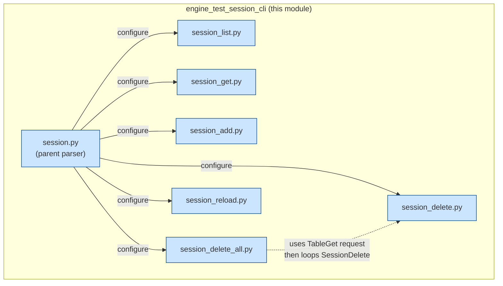
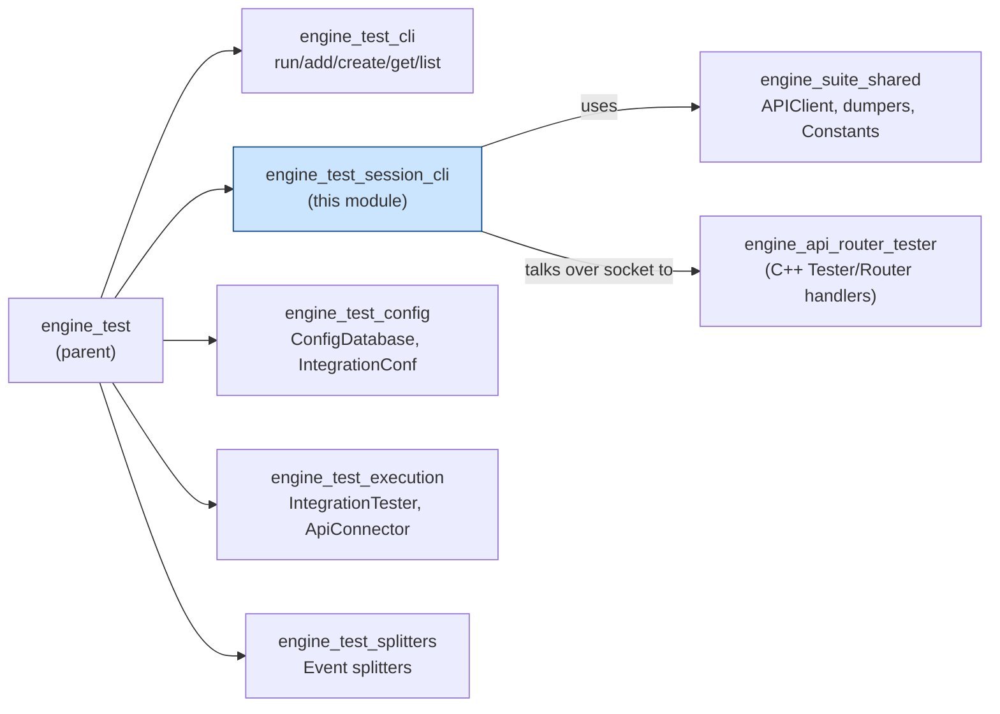
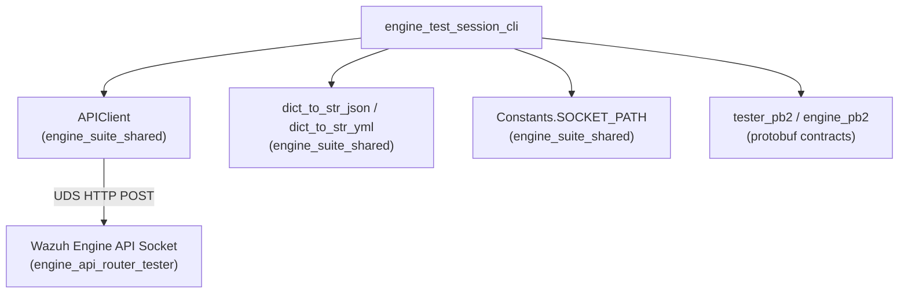
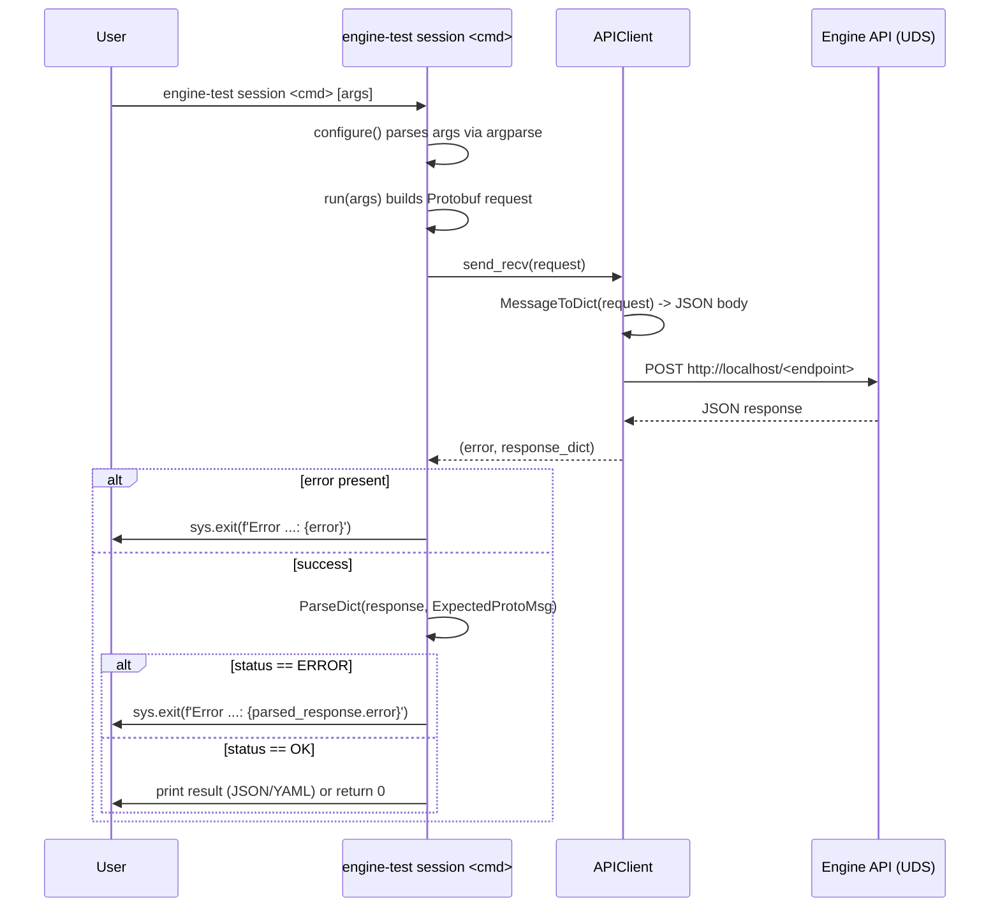
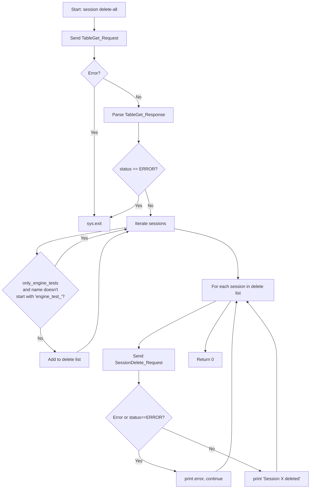
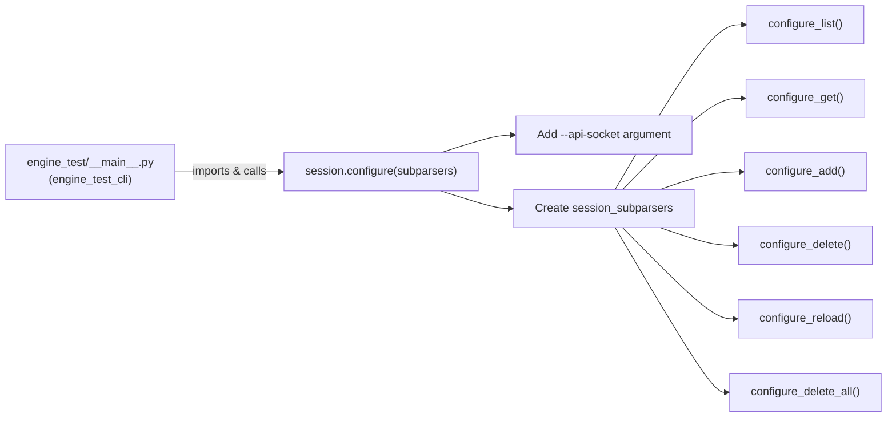

# Engine Test Session CLI

## Introduction

The **Engine Test Session CLI** module is a Python command-line sub-system that manages **testing sessions** for the Wazuh Engine's `engine-test` tool. A "session" is a named, isolated sandbox environment (backed by a compiled policy) against which analysts and developers can run events, inspect traces, and validate rule/decoder behavior without impacting production data.

This module implements the `engine-test session` command group, exposing sub-commands to **list, get, add, delete, delete-all, and reload** testing sessions. All commands are thin CLI wrappers that translate user input into Protocol Buffer requests, send them over a Unix domain socket to the Wazuh Engine's API, and render the JSON/YAML responses back to the user.

It is a child module of [engine_test](engine_test.md), sitting alongside [engine_test_cli](engine_test_cli.md) (which handles raw event testing commands) within the broader [Engine_Administration_CLI_Tools_(Python)](Engine_Administration_CLI_Tools_(Python).md) toolset.

---

## Purpose & Core Functionality

| Sub-command | File | Responsibility |
|---|---|---|
| `session` (parent) | `session.py` | Registers the `session` sub-parser and wires up all child sub-commands |
| `session list` | `session_list.py` | Retrieves and prints the table of all existing sessions |
| `session get <name>` | `session_get.py` | Retrieves detailed information about one named session |
| `session add <name> <policy> [description]` | `session_add.py` | Creates a new session bound to a given policy |
| `session delete <name>` | `session_delete.py` | Deletes a single named session |
| `session delete-all [--only-engine-tests]` | `session_delete_all.py` | Bulk-deletes all sessions, optionally scoped to ones prefixed `engine_test_` |
| `session reload <name>` | `session_reload.py` | Forces a session to rebuild its underlying policy (hot-reload) |

All commands share a common pattern:
1. Parse CLI arguments (`configure()`).
2. Build a Protobuf request message (from `api_communication.proto.tester_pb2` / `engine_pb2`).
3. Send it via `APIClient.send_recv()` over the Engine's Unix socket.
4. Parse/validate the response status.
5. Print results (JSON or YAML) or exit with an error message (`run()`).

---

## Architecture

### Component Relationships

### Module Placement in the Engine Test Suite

---

## Dependencies

This module relies on a small, well-defined set of external building blocks, all documented in sibling modules:

- **[engine_suite_shared](engine_suite_shared.md)**
  - `api_communication.client.APIClient` — wraps an `httpx` client over a Unix Domain Socket (UDS) transport to POST Protobuf-derived JSON payloads to the Wazuh Engine API and parse responses.
  - `shared.dumpers.EngineDumper` / `dict_to_str_json` / `dict_to_str_yml` — helpers used by `session_get.py` and `session_list.py` to pretty-print API responses as JSON or YAML.
  - `shared.default_settings.Constants` — supplies the default API socket path (`SOCKET_PATH`) used as the default value for `--api-socket` in `session.py`.

- **Protobuf contracts** (`api_communication.proto.tester_pb2`, `api_communication.proto.engine_pb2`) — define the wire format for all session-related requests/responses (`SessionPost_Request`, `SessionGet_Request/Response`, `SessionDelete_Request`, `SessionReload_Request`, `TableGet_Request/Response`, and the generic `GenericStatus_Response`).

- **[engine_api](engine_api.md)** (specifically `engine_api_router_tester`) — the C++ server-side counterpart that implements the actual tester/session handlers (`registerHandlers` in `api/router` and `api/tester`) which this CLI communicates with over the socket.

- **Sibling CLI module [engine_test_cli](engine_test_cli.md)** — provides the `engine-test` top-level `__main__.py` entry point that ultimately invokes `configure()` from `session.py` to register this sub-command tree.

---

## Data Flow

### General Request/Response Flow (applies to all sub-commands)

### `session delete-all` — Composite Flow

`delete-all` is unique in that it first performs a `TableGet` (the same request used by `list`) to discover all session names, optionally filters them by the `engine_test_` prefix, and then issues a `SessionDelete` request per remaining name, reporting success/failure independently for each.

---

## Command Reference

### `session` (parent parser) — `session.py`

Registers the `session` argparse sub-parser, adds the shared `--api-socket` option (defaulting to `Constants.SOCKET_PATH`), and delegates to each child sub-command's `configure()` function to build the full `session <subcommand>` tree. Its `run()` simply calls whichever `func` was set by the selected sub-command (`args.func(vars(args))`), consistent with the argparse dispatch pattern used across the [engine-suite CLI tools](Engine_Administration_CLI_Tools_(Python).md).

### `session list` — `session_list.py`

- Sends `TableGet_Request` (proto: `etester.TableGet_Request`).
- Parses response as `TableGet_Response`.
- Prints `response['sessions']` as JSON (`-j/--json`) or YAML (default).

### `session get <name>` — `session_get.py`

- Sends `SessionGet_Request` with the `name` field populated.
- Parses response as `SessionGet_Response`.
- Prints `response['session']` as JSON or YAML.

### `session add <name> <policy> [description]` — `session_add.py`

- Builds `SessionPost_Request`, setting `session.name`, `session.policy`, and optionally `session.description`.
- On success, exits with code 0 silently (no output on success by design — only errors are printed).

### `session delete <name>` — `session_delete.py`

- Sends `SessionDelete_Request` with `name`.
- Straightforward success/failure pattern, no output on success.

### `session delete-all [-o/--only-engine-tests]` — `session_delete_all.py`

- Composite command described in the [Data Flow](#session-delete-all--composite-flow) section above.
- Useful for CI/test cleanup, especially combined with `--only-engine-tests` to avoid deleting sessions unrelated to automated testing.

### `session reload <name>` — `session_reload.py`

- Sends `SessionReload_Request` with `name`, instructing the engine to rebuild the session's policy (e.g., after catalog/asset changes) without needing to delete and recreate the session.

---

## Process Flow: CLI Registration

The top-level `engine-test` CLI (in [engine_test_cli](engine_test_cli.md)) is responsible for invoking `session.configure()` alongside the other command groups (`add`, `create`, `delete`, `get`, `list`, `run`, `run_raw`) to build the complete `argparse` command tree at startup.

---

## Error Handling Conventions

All sub-commands follow a consistent, fail-fast convention:

1. **Transport-level errors** (socket unreachable, timeout, malformed message) are caught by `APIClient.send_recv()` and returned as a string in the `error` slot of the `(error, response)` tuple. Any non-`None` error immediately triggers `sys.exit(f'Error ...: {error}')`.
2. **Application-level errors** are signaled by the Engine API through the `status` field of the parsed Protobuf response (`engine.ReturnStatus.ERROR`). These are also fatal to the CLI invocation via `sys.exit`.
3. `session_delete_all.py` is the only command that **does not** abort the whole operation on a per-item error — it logs the failure for that specific session and proceeds to the next one, ensuring bulk cleanup is resilient to partial failures.

---

## Related Documentation

- [engine_test.md](engine_test.md) — Parent module; overall `engine_test` package structure (config, execution engine, splitters).
- [engine_test_cli.md](engine_test_cli.md) — Sibling module handling `add`, `create`, `delete`, `get`, `list`, `run`, and `run_raw` commands for event-level testing (as opposed to session management).
- [engine_test_config.md](engine_test_config.md) — `ConfigDatabase`, `IntegrationConf` used when preparing test integrations that get exercised through a session.
- [engine_test_execution.md](engine_test_execution.md) — `IntegrationTester`, `ApiConnector`, `BaseIntegrationTester` which use sessions created by this CLI to run/dispatch test events.
- [engine_suite_shared.md](engine_suite_shared.md) — Shared `APIClient`, `dumpers`, `Executor`, and `default_settings.Constants` utilities used across all `engine-suite` Python tools.
- [engine_api.md](engine_api.md) — C++ server-side API handlers (including the Router/Tester handlers) that implement the session lifecycle this CLI drives remotely.
- [Engine_Administration_CLI_Tools_(Python).md](Engine_Administration_CLI_Tools_(Python).md) — Top-level grouping of all `engine-suite` CLI tools (catalog, policy, router, schema, kvdb, geo, etc.), of which this module is one part.
