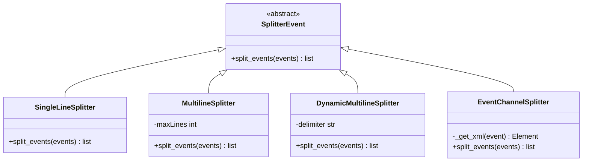
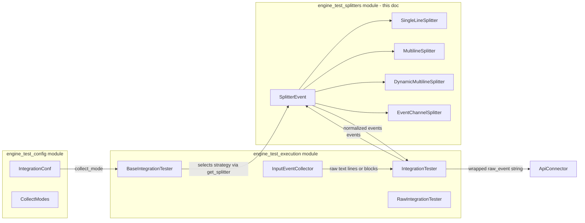
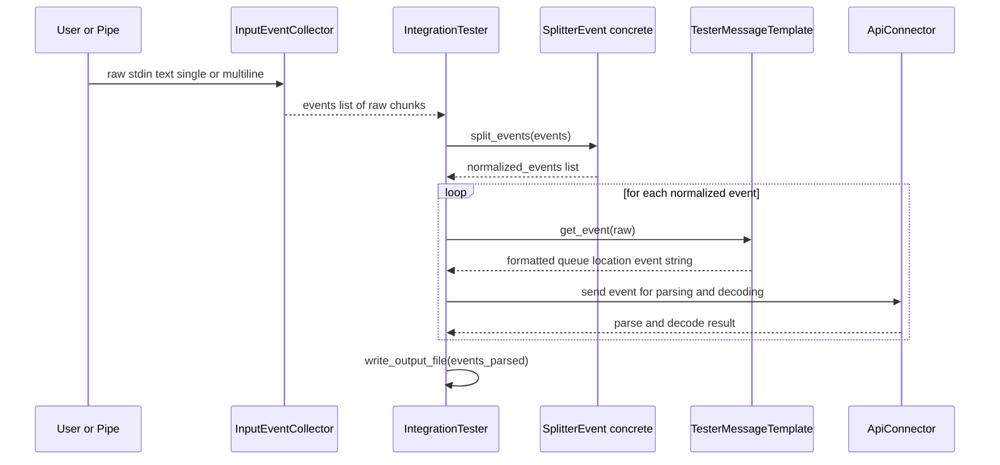

# Engine Test Splitters

## Introduction

The **`engine_test_splitters`** module is a small but critical part of the `engine_test` CLI tool suite (see [engine_test_execution.md](engine_test_execution.md) and [engine_test.md](engine_test.md)). It is responsible for **converting raw, user-supplied text input into discrete, well-formed event strings** that can subsequently be sent to the Wazuh Engine for parsing, decoding, and testing.

When a user (or an automated pipe) feeds log data into the `engine-test` tool, that data can arrive in many shapes: a single line per event, a fixed number of lines per event, a dynamically delimited block of lines, or an XML-based Windows Event Channel payload. The splitters module abstracts these differences behind a common interface (`SplitterEvent`), so that the rest of the testing pipeline (input collection, integration testing, event dispatch) does not need to know how a particular log source formats its events.

This document describes the module's purpose, its component architecture, how it integrates with the rest of the `engine_test` tool, and the data flow from raw input to a normalized list of events.

---

## 1. Purpose & Responsibilities

| Responsibility | Description |
|---|---|
| **Abstraction** | Provide a single, uniform interface (`SplitterEvent.split_events`) for turning raw text (or lists of raw text blocks) into a list of individual event strings. |
| **Format-specific parsing** | Implement concrete strategies for the different ways logs can be batched: single-line, fixed multi-line, dynamically delimited multi-line, and Windows EventChannel XML. |
| **Decoupling** | Isolate the "how to split logs" concern from the "how to collect logs" (`InputEventCollector`) and "how to test logs" (`IntegrationTester` / `RawIntegrationTester`) concerns. |
| **Extensibility** | Allow new splitting strategies to be added by subclassing `SplitterEvent` without touching the callers. |

---

## 2. Component Overview

### 2.1 `SplitterEvent` (Base Class)
File: `event_splitters/base_splitter.py`

The abstract base class that defines the contract all splitters must follow:

```python
class SplitterEvent():
    def split_events(self, events: list[str]) -> list[str]:
        raise NotImplementedError(...)
```

Every concrete splitter takes a list of raw input chunks (as collected by `InputEventCollector`) and returns a flat list of normalized event strings ready to be wrapped and sent to the engine.

### 2.2 `SingleLineSplitter`
File: `event_splitters/single_line.py`

The simplest strategy: each entry in the input list is already a complete event; the splitter simply strips trailing whitespace/newlines (`\n`) from each entry.

**Use case:** Standard single-line log formats (e.g., syslog lines) where one line == one event.

### 2.3 `MultilineSplitter`
File: `event_splitters/multi_line.py`

Groups a **fixed number of lines** (`event_lines`) into a single event. Given a block of text, it:
1. Splits the block into individual lines.
2. Chunks the lines into groups of exactly `maxLines` lines.
3. Joins each complete chunk into a single space-separated event string.
4. Discards any trailing incomplete chunk (fewer than `maxLines` lines).

**Use case:** Logs where each event spans a known, fixed number of lines (e.g., some structured multi-line application logs).

### 2.4 `DynamicMultilineSplitter`
File: `event_splitters/dynamic_multi_line.py`

Splits input using a **configurable delimiter** (default: `\n---EOE---\n`) rather than a fixed line count. Each raw input block is split on the delimiter, each resulting piece is stripped, and empty pieces are discarded.

**Use case:** Multi-line logs of variable length per event, where the log source (or the user preparing a test fixture) inserts an explicit end-of-event marker.

### 2.5 `EventChannelSplitter`
File: `event_splitters/eventchannel.py`

A specialized splitter for **Windows Event Log / EventChannel** XML payloads:
1. Locates the `<Event` tag within the raw text (ignoring any preceding noise).
2. Parses the XML using `lxml.etree`.
3. If the root element is an `<Events>` wrapper, iterates over each child `<Event>` and serializes it back to an XML string (stripping any XML declaration header).
4. If the root element is a single `<Event>`, serializes it directly.
5. Silently skips (with a printed message) events with malformed XML or unrecognized root tags.

**Use case:** Testing the engine's ability to decode/parse Windows Event Channel logs, which are natively collected as XML by `logcollector`'s `read_win_event_channel.c` (see [Agent_&_Manager_Native_Daemons_(C).md](Agent_&_Manager_Native_Daemons_(C).md)).

---

## 3. Architecture Diagram



---

## 4. Integration with the `engine_test` Tool

The splitters are not used standalone; they are selected and invoked by the higher-level testing components documented in [engine_test_execution.md](engine_test_execution.md), specifically by `IntegrationTester` (and `BaseIntegrationTester`), based on the `collect_mode` declared in an integration's configuration (`IntegrationConf`, from `engine_test/conf/integration.py`, documented in [engine_test_config.md](engine_test_config.md)).

### 4.1 Component Interaction



### 4.2 Selection Logic

`BaseIntegrationTester.get_splitter()` (in `engine_test/base_tester_integration.py`) inspects the `IntegrationConf.collect_mode` (an enum value from `CollectModes`, defined in `engine_test/conf/integration.py`) and instantiates the appropriate splitter:

| `CollectModes` value | Splitter Instantiated |
|---|---|
| Single line | `SingleLineSplitter()` |
| Multi-line (fixed) | `MultilineSplitter(event_lines=iconf.lines)` |
| Multi-line (dynamic delimiter) | `DynamicMultilineSplitter(delimiter=...)` |
| Windows EventChannel | `EventChannelSplitter()` |

This mapping keeps splitter selection declarative and configuration-driven — new integrations simply declare their `collect_mode` (and, if needed, `lines`) in their stored `IntegrationConf`, and the correct splitting strategy is applied automatically.

---

## 5. End-to-End Data Flow

The following sequence illustrates how a single test-run of `engine-test run <integration>` flows through the splitters module:



Key steps:
1. **Collection** — `InputEventCollector.collect(multiline)` reads from stdin (interactively or via pipe), returning one or more raw text blocks.
2. **Splitting** — The selected `SplitterEvent` implementation normalizes those raw blocks into a flat list of individual event strings.
3. **Templating** — Each event is wrapped with queue/location metadata via `TesterMessageTemplate` (from `engine_test/conf/event_tester_template.py`) to build the final raw protocol message.
4. **Dispatch** — The formatted message is sent to the Engine through `ApiConnector`/`APIClient` for parsing and rule/decoder evaluation.
5. **Output** — Parsed results are collected and written to an output file for inspection.

---

## 6. Design Notes & Extensibility

- **Single Responsibility:** Each splitter class handles exactly one input format, keeping the logic simple, testable, and easy to reason about in isolation.
- **Fail-soft parsing:** `EventChannelSplitter` intentionally does not raise on malformed XML; it prints a diagnostic message and skips the offending event, allowing a test run over many events to continue.
- **Statelessness:** All splitters are stateless with respect to the events they process (state, if any, is limited to configuration such as `maxLines` or `delimiter` set at construction time), making them safe to reuse across multiple `split_events` calls.
- **Adding a new splitter:** To support a new log batching convention, create a new subclass of `SplitterEvent`, implement `split_events`, and extend the `CollectModes` enum plus the selection logic in `BaseIntegrationTester.get_splitter()`.

---

## 7. Related Documentation

- [engine_test_execution.md](engine_test_execution.md) — Consumers of the splitters (`BaseIntegrationTester`, `IntegrationTester`, `RawIntegrationTester`, `InputEventCollector`, `ApiConnector`).
- [engine_test_config.md](engine_test_config.md) — `IntegrationConf`, `CollectModes`, and `TesterMessageTemplate`, which drive splitter selection and event formatting.
- [engine_test_cli.md](engine_test_cli.md) / [engine_test_session_cli.md](engine_test_session_cli.md) — CLI commands (`run`, `run_raw`, `add`, `session`) that ultimately trigger the collection → splitting → testing pipeline.
- [engine_suite_shared.md](engine_suite_shared.md) — Shared utilities (`ResourceHandler`, `Executor`, `EngineDumper`) used across the `engine-suite` tools, including `engine_test`.
- [engine_api.md](engine_api.md) — The Wazuh Engine API endpoints (tester/router handlers) that receive the events produced by this pipeline for parsing and decoding.
- [Agent_&_Manager_Native_Daemons_(C).md](Agent_&_Manager_Native_Daemons_(C).md) — Native `logcollector` sources (e.g., `read_win_event_channel.c`) whose output formats (like Windows EventChannel XML) are mirrored by `EventChannelSplitter` for test purposes.
