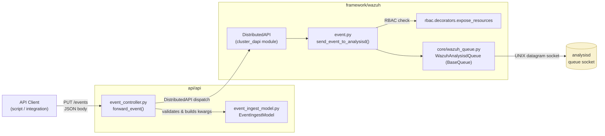
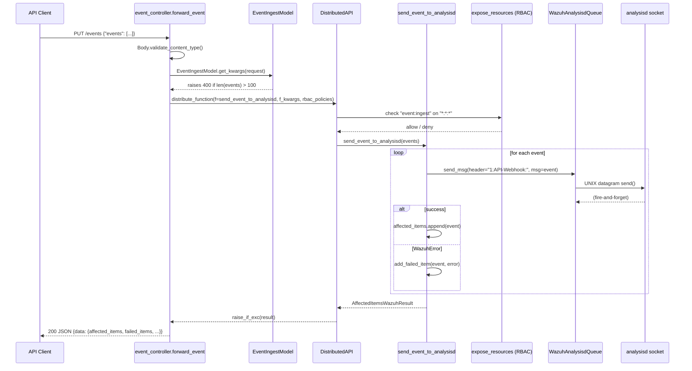
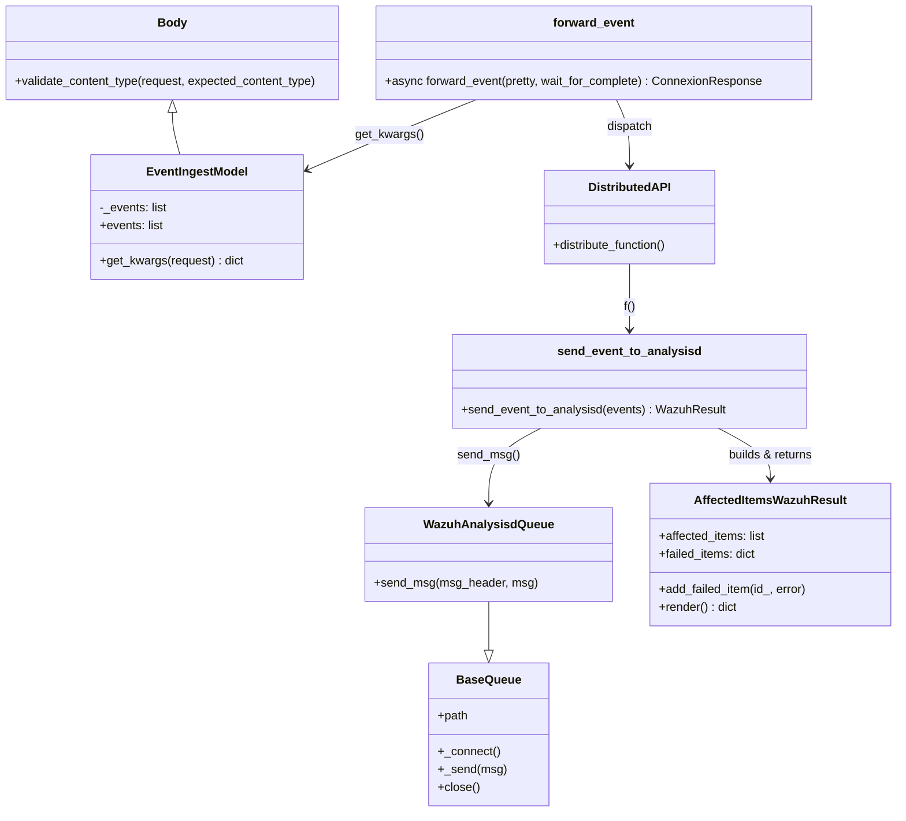

# Event Module

## 1. Introduction and Purpose

The **Event Module** provides the Wazuh API's **generic event-ingestion pipeline**: a simple, security-controlled HTTP endpoint (`PUT /events`) that allows external actors (e.g. Wazuh Agentless integrations, `alert_forwarder`, third-party log forwarders, custom scripts) to inject arbitrary JSON-formatted log/security events directly into the Wazuh analysis pipeline, bypassing the traditional agent → `remoted` → `analysisd` path.

Its responsibilities are intentionally narrow:

1. **Receive** a bulk of events over the REST API.
2. **Validate** the payload shape and size (bulk limit).
3. **Authorize** the caller via RBAC (`event:ingest` action).
4. **Forward** each event to the `analysisd` Unix datagram socket (the same queue used internally by all Wazuh data sources), tagging it with a distinguishing header so `analysisd` can route/decode it appropriately.
5. **Report** per-event success/failure back to the caller.

Because it writes straight into the analysis engine's ingestion queue, this module acts as the primary **bridge between the API layer and the core detection/analysis engine** for out-of-band or externally generated events, complementing the always-on channels handled by `remoted`/`analysisd` and by the [Wazuh Engine](Wazuh_Engine_Core_(C++).md) itself.

## 2. Architecture Overview

The module follows the standard layered design used throughout the Wazuh API/Framework stack: **Controller → Model → Framework function → Core I/O primitive**.

### Request / Data Flow

## 3. Core Components

| Layer | File | Component | Responsibility |
|---|---|---|---|
| API Controller | `api/api/controllers/event_controller.py` | `forward_event()` | Async connexion handler for `PUT /events`; validates content type, builds kwargs, dispatches via `DistributedAPI`, returns the JSON response. |
| API Model | `api/api/models/event_ingest_model.py` | `EventIngestModel` | Pydantic-like body model wrapping the `events` list; enforces `MAX_EVENTS_PER_REQUEST = 100`, raising a `ProblemException` (HTTP 400) when exceeded. |
| Framework Function | `framework/wazuh/event.py` | `send_event_to_analysisd()` | RBAC-guarded business logic. Opens a `WazuhAnalysisdQueue`, iterates over events, sends each one prefixed with the `1:API-Webhook:` header, and accumulates results into an `AffectedItemsWazuhResult`. |

### 3.1 `forward_event` (Controller)

- Entry point registered against the OpenAPI spec for the events endpoint.
- Validates that the incoming request has the expected JSON content type (`Body.validate_content_type`).
- Delegates payload extraction/validation to `EventIngestModel.get_kwargs(request)`.
- Wraps the actual work (`send_event_to_analysisd`) in a `DistributedAPI` call configured with:
  - `request_type='local_any'` — the call can be served by any node (no need to target the master specifically), consistent with the cluster distribution model described in [Cluster Module](cluster_module.md).
  - `is_async=False`, `wait_for_complete` — standard synchronous behavior control common to nearly all controllers in the API (see [API Core Infrastructure](api_core_infrastructure.md)).
  - `rbac_permissions` sourced from the authenticated token context.
- Returns the final result via the shared `json_response` helper.

### 3.2 `EventIngestModel` (Model)

- Extends the shared `Body` base model (`api/api/models/base_model_.py`, part of [API Core Infrastructure – Models](api_core_infrastructure_models.md)).
- Exposes a single field, `events: List[str]`.
- The `events` setter is the sole validation gate: any bulk larger than `MAX_EVENTS_PER_REQUEST` (100) triggers an immediate `ProblemException` before the request ever reaches RBAC or the framework layer — a cheap fail-fast guard against abuse/overload.

### 3.3 `send_event_to_analysisd` (Framework)

- Decorated with `@expose_resources(actions=["event:ingest"], resources=["*:*:*"], post_proc_func=None)` from the [Security & RBAC Module](security_rbac_module.md), meaning the caller's token must have been granted the `event:ingest` action against the wildcard resource. No per-item post-processing/filtering is applied (`post_proc_func=None`) — RBAC here is a simple allow/deny gate rather than an item-level filter.
- For each event in the list:
  - Sends it through a `WazuhAnalysisdQueue` (a thin wrapper documented under `framework/wazuh/core/wazuh_queue.py`) using a fixed `MSG_HEADER = '1:API-Webhook:'`. This header lets `analysisd` recognize the message origin/format, similar to headers used by other native forwarders (e.g. `1:` prefixes used throughout the C agent/manager codebase; see [Agent & Manager Native Daemons (C)](Agent_&_Manager_Native_Daemons_(C).md)).
  - On success, appends the event to `affected_items`.
  - On `WazuhError`, records it via `add_failed_item(event, error)` without aborting the whole batch — partial success is supported.
- Builds and returns an `AffectedItemsWazuhResult` (from `framework/wazuh/core/results.py`, part of [Framework Core Utilities](framework_core_utils.md)) pre-configured with human-readable `all_msg`/`some_msg`/`none_msg` strings, so the API layer's generic renderer can produce a consistent `{data, message, error}` envelope.

## 4. Component Interaction & Class Relationships

## 5. How This Module Fits into the Overall System

- **Upstream (API infrastructure):** Every request first passes through the cross-cutting HTTP concerns documented in [API Core Infrastructure](api_core_infrastructure.md) — authentication (`api_core_infrastructure_auth_config.md`), middlewares such as rate limiting and blocked-IP checks (`api_core_infrastructure_middleware.md`), and request/URI parsing utilities (`api_core_infrastructure_request_utils.md`) — before reaching `forward_event`.
- **Dispatch:** The controller uses the `DistributedAPI` class from the cluster subsystem to actually execute `send_event_to_analysisd`, whether locally or forwarded to another node in a clustered deployment. See [Cluster Module - DAPI](cluster_dapi.md) for details on this distribution mechanism.
- **Authorization:** Access is gated by the same RBAC engine used by every other resource-modifying endpoint in the product, described extensively in [Security & RBAC Module](security_rbac_module.md).
- **Downstream (core engine):** The forwarded events land in the same `analysisd` input queue used by `remoted`, log collectors, and other native daemons documented in [Agent & Manager Native Daemons (C)](Agent_&_Manager_Native_Daemons_(C).md). From there they follow the same decoding/rule-matching pipeline as any other Wazuh event, eventually reaching indexing/alerting — a pipeline whose modern C++ reimplementation is covered in [Wazuh Engine Core (C++)](Wazuh_Engine_Core_(C++).md).
- **Shared primitives:** The socket wrapper (`BaseQueue`) and the generic result container (`AffectedItemsWazuhResult`) are reused across almost all framework modules (agents, security, manager, etc.) and are catalogued in [Framework Core Utilities](framework_core_utils.md) and [Framework Core Communication](framework_core_communication.md).

## 6. Related Modules Reference

| Module | Relationship |
|---|---|
| [API Core Infrastructure](api_core_infrastructure.md) | Provides shared middleware, auth, logging, and base models used by the event controller. |
| [Cluster Module](cluster_module.md) / [Cluster DAPI](cluster_dapi.md) | Supplies `DistributedAPI`, the mechanism used to execute `send_event_to_analysisd` across the cluster. |
| [Security & RBAC Module](security_rbac_module.md) | Supplies the `expose_resources` decorator enforcing the `event:ingest` permission. |
| [Framework Core Utilities](framework_core_utils.md) | Supplies `AffectedItemsWazuhResult`/`WazuhResult` and other shared result/utility classes. |
| [Framework Core Communication](framework_core_communication.md) | Supplies `BaseQueue`/socket primitives (`wazuh_queue.py`, `wazuh_socket.py`) used to talk to `analysisd`. |
| [Agent & Manager Native Daemons (C)](Agent_&_Manager_Native_Daemons_(C).md) | Owns the `analysisd` process and queue socket that ultimately consumes forwarded events. |
| [Wazuh Engine Core (C++)](Wazuh_Engine_Core_(C++).md) | Modern analysis engine that can also ingest and process events forwarded through similar mechanisms. |

