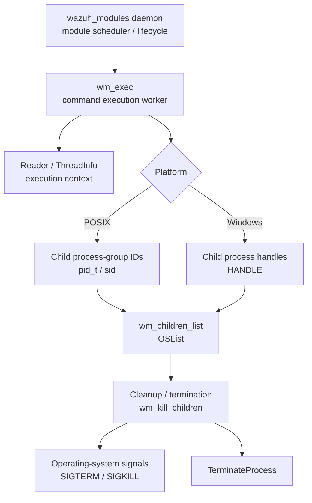
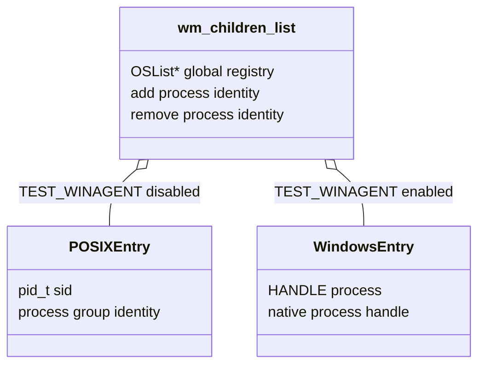
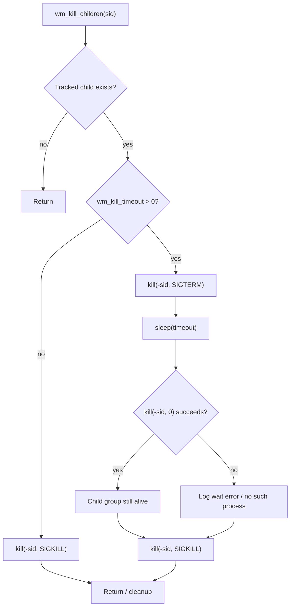
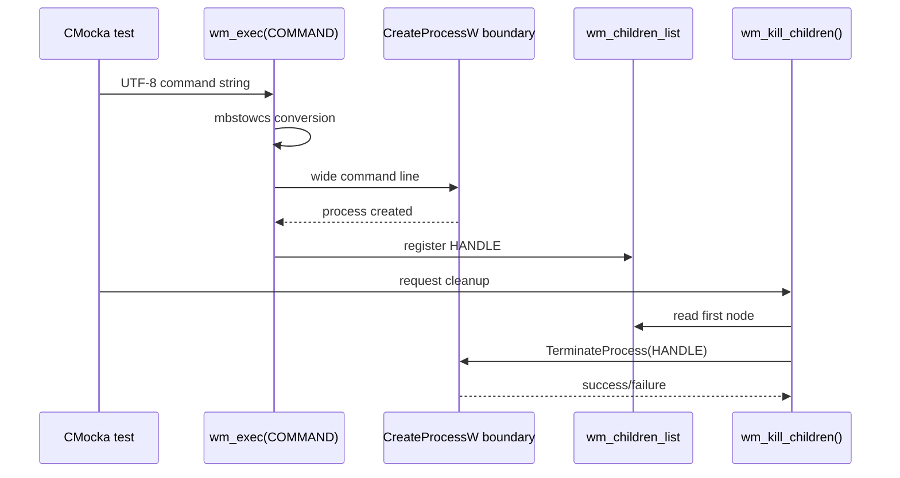
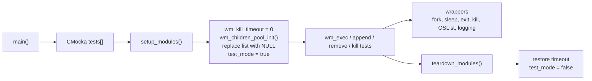
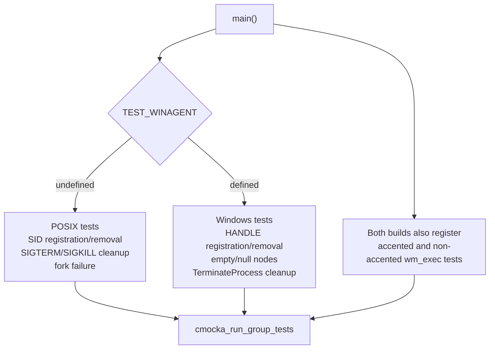

# `exec` module — command execution and child-process supervision

The `exec` module is the unit-test-facing view of Wazuh’s `wm_exec` module. It supervises commands launched by the Wazuh modules daemon, tracks their process identifiers or Windows process handles, and terminates them during cleanup. The supplied test suite validates command conversion on Windows, child registration/removal, process-group termination on POSIX, and process termination on Windows.

The production implementation is `src/wazuh_modules/wm_exec.c`; the supplied tests are in `src/unit_tests/wazuh_modules/exec/test_wm_exec.c`. This module is distinct from the Active Response daemon: Active Response execution is documented in [os_execd](os_execd.md), while the common daemon/module lifecycle is shared with the [Wazuh Modules Daemon](wazuh_modules_core.md) family.

## Scope and placement

| Item | Description |
|---|---|
| Production component | `src/wazuh_modules/wm_exec.c` |
| Test component | `src/unit_tests/wazuh_modules/exec/test_wm_exec.c` |
| Runtime owner | `wazuh_modules` daemon |
| Primary responsibilities | Execute configured commands, retain child process identity, terminate children safely |
| POSIX identity | Process-group/session identifier (`pid_t`, called `sid` in the tests) |
| Windows identity | Native process `HANDLE` |
| Test framework | CMocka with linker-level wrappers |

The module tree exposes the production symbols `Reader`, `ThreadInfo`, `wm_children_node_clean`, and `wm_exec.c`’s process-management implementation. The test source additionally exercises the public helper surface `wm_append_sid`, `wm_remove_sid`, `wm_kill_children`, and, for Windows builds, their handle-based equivalents.

## Architectural role

`wm_exec` is a worker inside `wazuh_modules`. It receives command execution work through the module’s broader execution machinery, starts a child process, and records enough identity information to clean up descendants when the worker stops, times out, or is restarted. The process registry is held in the shared `OSList` abstraction; list implementation details are covered by the shared list infrastructure and its tests.

The module’s boundaries are deliberately narrow:

- `wm_exec` owns process execution and cleanup policy.
- `OSList` owns storage and node deletion; see the shared list documentation rather than duplicating it here.
- The daemon owns module startup, configuration dispatch, and shutdown orchestration; see [wazuh_modules_core_lifecycle](wazuh_modules_core_lifecycle.md).
- Active Response command execution belongs to [os_execd](os_execd.md), not this worker.

## Child tracking model

`wm_children_list` is a global list of dynamically allocated process identities. On POSIX, each entry stores a `pid_t` session/process-group identifier. On Windows, each entry stores a `HANDLE`. The append and remove helpers are defensive no-ops when the global list is `NULL`; failures to add an item are logged, and removal of an unknown item produces a warning.

The test suite verifies the following states:

| Operation | Empty/null registry | Failure case | Success case |
|---|---|---|---|
| Append SID/handle | Return without dereferencing a null list | Log an error when `OSList_AddData` fails | Store the identity in the list |
| Remove SID/handle | Return without dereferencing a null list | Warn when the first node is absent or does not match | Delete the matching node with `OSList_DeleteThisNode` |
| Kill children | No work for an empty registry | Log fork/wait failures on POSIX | Terminate each tracked child and clean up |

## POSIX termination flow

The POSIX implementation treats the tracked identifier as a process-group/session identity and addresses it with a negative PID. The normal parent path sends `SIGKILL` to the group. The timeout path first sends `SIGTERM`, waits using the configured kill timeout, checks whether the group still exists, and escalates to `SIGKILL` when necessary.

The fork failure path is also covered. If `fork()` returns `-1`, the implementation reports the operating-system error and does not pretend that a cleanup child was created. The tests set `errno` explicitly so this behavior is deterministic.

## Windows termination flow

When `TEST_WINAGENT` is enabled, the tracked identity is a process handle rather than a POSIX session ID. The cleanup routine handles an empty list and nodes with null data, and calls `TerminateProcess` for valid handles. The platform-specific command test also verifies that a Unicode command line is converted to a wide-character command line before invoking the Windows process API.

`test_wm_exec_accented_command` uses a PowerShell command containing the accented path component `mémoire`; `test_wm_exec_not_accented_command` uses a processor-counter command. Both tests assert the exact wide command line passed to the process-creation wrapper and verify the expected wait and handle-close interactions. On non-Windows builds these tests report that the branch is not implemented and do not exercise Windows APIs.

## Test harness architecture

`setup_modules()` initializes the production child-list pool, destroys the default list, and replaces it with `NULL` so individual tests can install a sentinel list or a real `OSList`. It resets `wm_kill_timeout` to zero. `teardown_modules()` restores the timeout and `test_mode` state. Tests that own a real list perform explicit destruction because they need to control the list’s free-data callback.

The test doubles isolate all relevant external effects:

| Wrapper | Purpose |
|---|---|
| `__wrap_fork` | Supplies a successful child or `-1` with a controlled `errno`. |
| `__wrap_sleep` | Avoids real delays while exercising timeout escalation. |
| `__wrap_exit` | Converts exit paths into CMocka expectations. |
| `__wrap_kill` | Verifies process-group IDs, signals, and return values. |
| `OSList` wrappers | Control lookup, insertion, and deletion without relying on list internals. |
| Logging wrappers | Assert error, warning, and debug diagnostics. |
| Windows process wrappers | Verify `CreateProcessW`, wait, close, and termination behavior. |

## Test registration and build variants

`main()` builds one CMocka test array. The preprocessor selects the platform-specific tests:

The POSIX branch registers `test_wm_append_sid_*`, `test_wm_remove_sid_*`, and the process-group cleanup tests. The Windows branch registers the corresponding handle tests. This means the source-level test names are not identical across builds, but the contract is: register identity, remove identity, and terminate registered children safely.

## Functional coverage

### Command execution and encoding

`wm_exec` is called with a command string and optional execution context. On Windows, the implementation must preserve non-ASCII characters while converting the command to the wide-character form expected by `CreateProcessW`. The tests verify command-line fidelity rather than the command’s business result.

### Registry insertion and removal

The append tests cover null-list safety, insertion failure, and successful insertion. The remove tests cover null-list safety, not-found diagnostics, and deletion of a matching identity. The successful remove test constructs a node whose payload matches the requested SID or handle and expects exactly one list-node deletion.

### Cleanup and escalation

The POSIX tests cover:

- direct process-group termination with `SIGKILL`;
- fork failure and the associated error message;
- timeout cleanup using `SIGTERM`, sleep, existence checking, and `SIGKILL` escalation; and
- exit/error paths when the process group disappears before the wait check.

The Windows tests cover:

- null child-list handling;
- an empty node whose data is `NULL`; and
- successful termination through `TerminateProcess`.

## Relationship to neighboring modules

- [Wazuh Modules Daemon](wazuh_modules_core.md) — parent daemon and lifecycle owner for `wm_exec`.
- [wazuh_modules_core_lifecycle](wazuh_modules_core_lifecycle.md) — shared daemon startup, signal, and module cleanup context.
- [shared_lib_data_structures](shared_lib_data_structures.md) — `OSList` storage and node-management primitives used by `wm_children_list`.
- [os_execd](os_execd.md) — Active Response execution daemon; related process execution concept, but a separate runtime module and command pipeline.
- [Shared data-structure infrastructure](shared_lib_data_structures.md) — related shared C boundaries used by the list-backed test doubles.

## Maintenance guidance

Changes to `wm_exec.c` should preserve three observable contracts: process identities must not be used after removal, cleanup must tolerate partially initialized lists and nodes, and platform-specific termination must use the correct identity type. Changes to timeout behavior should update the POSIX escalation tests and keep the wrapper expectations synchronized with the signal sequence. Changes to Windows command construction should add a test containing non-ASCII characters, because ordinary ASCII command lines do not detect encoding regressions.
