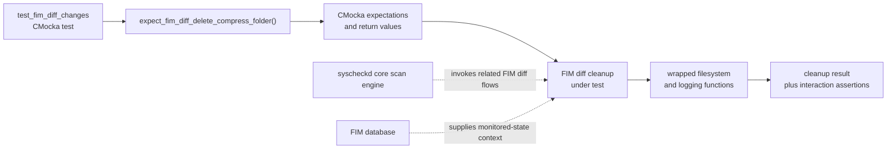
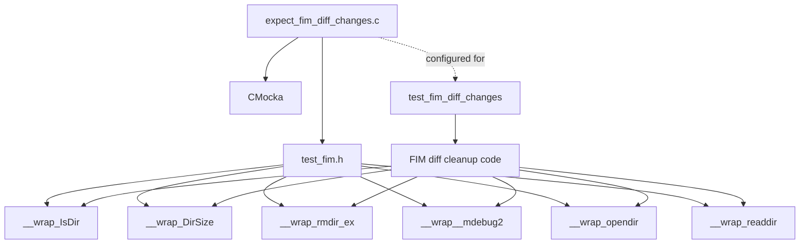
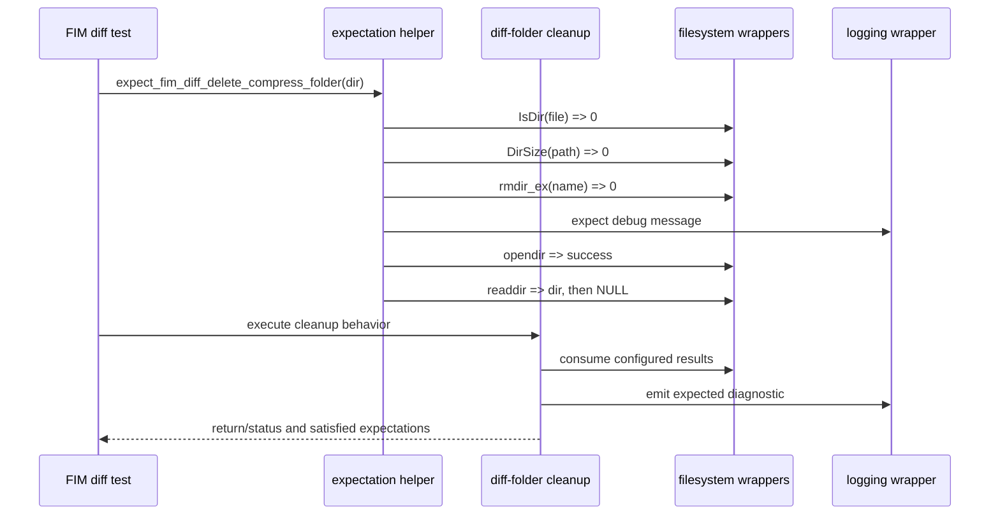
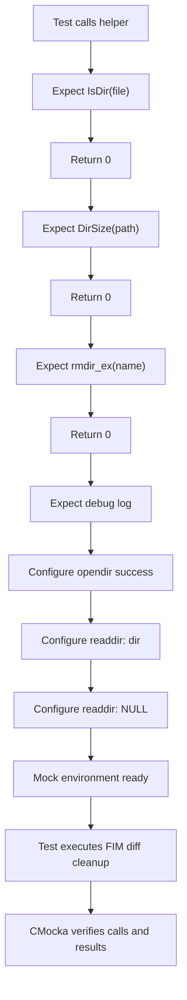
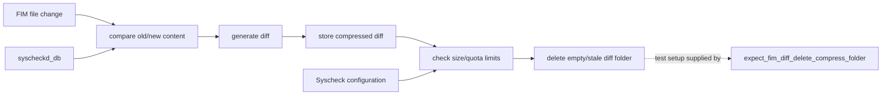

# `expect_fim_diff_changes`

## Introduction

`expect_fim_diff_changes` is a focused CMocka test-helper module in the Syscheck/FIM unit-test suite. It does not implement File Integrity Monitoring or compressed-diff deletion itself. Instead, it prepares the mock expectations and return values needed by a test that exercises cleanup of an empty compressed-diff directory.

The helper is implemented in `src/unit_tests/syscheckd/expect_fim_diff_changes.c` and exposes one function:

```c
void expect_fim_diff_delete_compress_folder(struct dirent *dir);
```

The production FIM behavior under test belongs to the FIM diff implementation and its filesystem helpers. See [syscheckd_file.md](syscheckd_file.md), [syscheckd_core_scan_engine.md](syscheckd_core_scan_engine.md), and [compression_archive.md](compression_archive.md) for the surrounding runtime responsibilities.

## Purpose and system position

The helper centralizes a repeatable mock setup for the “compressed diff folder can be removed” path:

1. The target directory entry is treated as not being a directory.
2. The diff path is reported as having zero size.
3. Directory removal succeeds.
4. A debug log call is expected.
5. Directory enumeration returns one supplied entry and then reaches end-of-directory.

This keeps the test case itself concerned with the behavior being verified rather than with the details of every wrapper invocation.



## Architecture

### Components

| Component | Role |
|---|---|
| `expect_fim_diff_changes.c` | Defines the reusable expectation helper. |
| `test_fim.h` | Provides the FIM test declarations, wrapper interfaces, and shared test fixtures included by the helper. |
| `test_fim_diff_changes.c` | Consumes the helper while testing FIM diff generation, comparison, compression, quota handling, and cleanup. |
| `__wrap_IsDir` | Mocks whether the enumerated filesystem item is a directory. |
| `__wrap_DirSize` | Mocks the size calculation for the compressed-diff path. |
| `__wrap_rmdir_ex` | Mocks removal of the compressed-diff directory. |
| `__wrap__mdebug2` | Verifies the expected debug-level diagnostic. |
| `__wrap_opendir` / `__wrap_readdir` | Mock directory traversal and its end condition. |

The helper depends on CMocka’s `expect_*` and `will_return` APIs. It also depends on the wrapper declarations brought in through `test_fim.h`; therefore it is part of the unit-test build and has no standalone runtime entry point.



## Helper contract

### `expect_fim_diff_delete_compress_folder`

The function accepts a caller-owned `struct dirent *dir`. That pointer is returned as the first result from the mocked `readdir` call. The helper does not allocate, free, inspect, or modify the directory entry.

Its configured expectations are:

| Order | Mock | Expected argument | Return value | Meaning |
|---:|---|---|---:|---|
| 1 | `__wrap_IsDir` | `file` | `0` | The current entry is not a directory. |
| 2 | `__wrap_DirSize` | `path` | `0` | The compressed-diff directory has no stored content. |
| 3 | `__wrap_rmdir_ex` | `name` | `0` | Removing the directory succeeds. |
| 4 | `__wrap__mdebug2` | `formatted_msg` | unspecified | A debug message is emitted. |
| 5 | `__wrap_opendir` | none asserted | `1` | Directory opening succeeds in the wrapper model. |
| 6 | `__wrap_readdir` | none asserted | `dir` | One directory entry is returned. |
| 7 | `__wrap_readdir` | none asserted | `NULL` | Enumeration terminates. |

The argument names in the table (`file`, `path`, `name`, and `formatted_msg`) are CMocka parameter labels. They identify the argument slots being checked by the wrappers; they are not variables passed to the helper.

## Interaction and data flow

The helper establishes the environment before the code under test runs. The production cleanup routine then consumes those results as if it had inspected a real directory.



The effective state supplied to the cleanup path is:

```text
directory entry      = caller-provided `dir`
entry is directory   = false
diff directory size  = 0
remove operation     = successful
directory contents   = one entry, then end-of-directory
```

## Process flow



The helper’s ordering is intentional: CMocka expectations are installed before the system under test invokes any wrapper. The final `NULL` from `readdir` is important because it models a complete directory traversal and prevents the test from depending on an unconfigured subsequent read.

## Relationship to FIM diff behavior

The helper represents only one branch of a much larger FIM diff lifecycle. The surrounding test module covers creation, comparison, compression, quota checks, registry-value diff handling, and deletion. Runtime scan orchestration is described in [syscheckd_core_scan_engine.md](syscheckd_core_scan_engine.md), while file-level FIM processing is described in [syscheckd_file.md](syscheckd_file.md).



This module therefore belongs to the test-support layer of the FIM subsystem, not to the daemon’s production dependency graph. Its value is interaction-level determinism: filesystem state, directory traversal, deletion status, and logging are all controlled by the test.

## Maintenance notes

- Update this helper if the cleanup implementation changes the wrapper names, call arguments, or expected call sequence.
- Preserve the terminal `NULL` `readdir` result when modeling a complete directory scan.
- Keep ownership of `dir` with the caller unless the test fixture contract changes; this helper currently only passes the pointer through CMocka.
- If the cleanup path begins requiring non-empty directory-size behavior, create a separate expectation helper rather than weakening this empty-directory scenario.

## Related documentation

- [syscheckd_core.md](syscheckd_core.md) — overall FIM daemon architecture.
- [syscheckd_core_scan_engine.md](syscheckd_core_scan_engine.md) — scheduled scan and diff-folder orchestration.
- [syscheckd_file.md](syscheckd_file.md) — file-level FIM processing.
- [syscheckd_db.md](syscheckd_db.md) — persistence of monitored FIM state.
- [compression_archive.md](compression_archive.md) — shared compression/archive infrastructure.
- [test_file_op.md](test_file_op.md) — related wrapper-based filesystem testing patterns.
