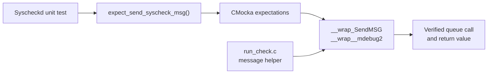
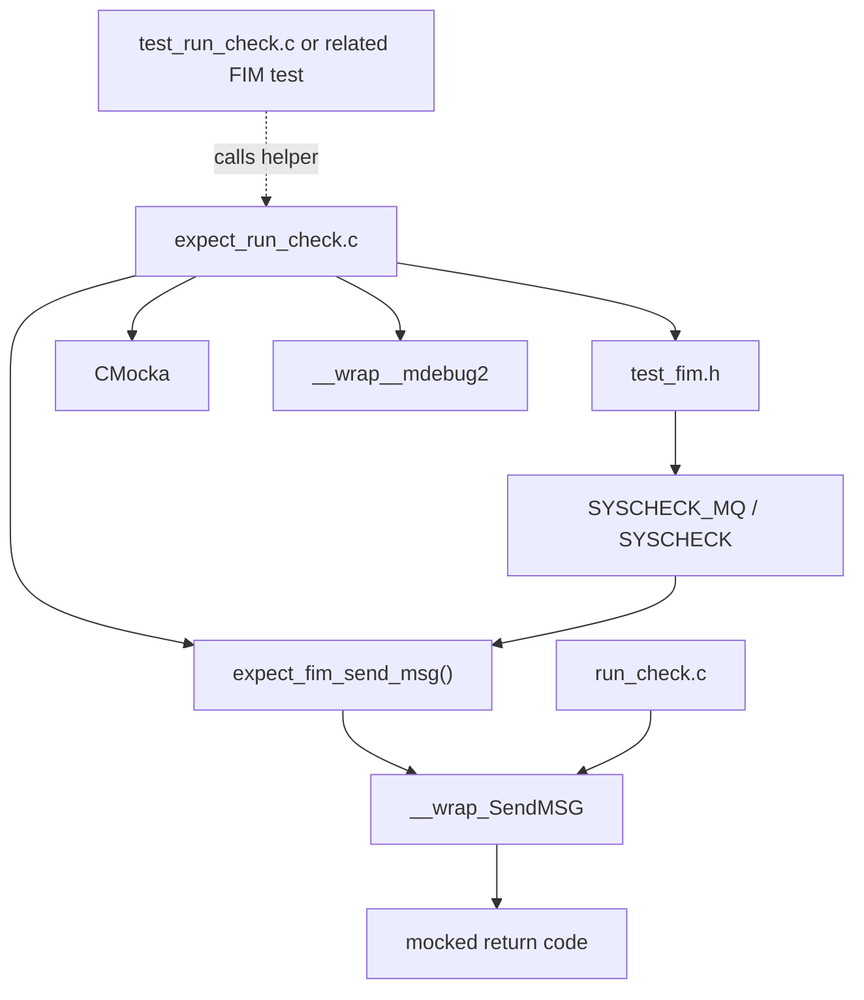
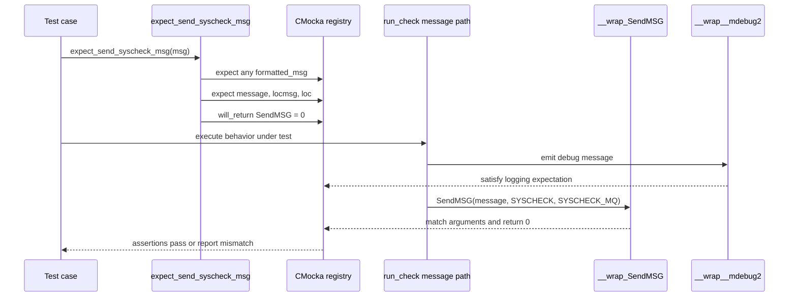
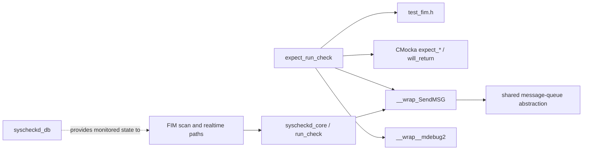

# `expect_run_check`

## Introduction

`expect_run_check` is a small CMocka test-support module for the Syscheck/FIM unit-test suite. It centralizes the mock expectations needed when a test exercises the `run_check.c` message-publication path. The helper verifies that a Syscheck event is sent through the expected message queue, to the expected location, with the expected payload, and with a successful return value.

The implementation is `src/unit_tests/syscheckd/expect_run_check.c`. Its public helper is:

```c
void expect_send_syscheck_msg(const char *msg);
```

The file also contains the lower-level reusable helper `expect_fim_send_msg`, which describes the generic `SendMSG` contract. The module has no production runtime entry point and is compiled only as part of the unit-test harness.

The production lifecycle and scan orchestration are documented in [syscheckd_core.md](syscheckd_core.md) and [syscheckd_core_scan_engine.md](syscheckd_core_scan_engine.md); this document covers only the test expectation layer.

## Purpose and system position

`run_check.c` emits FIM/Syscheck messages through the shared message-queue API. Unit tests replace that API with `__wrap_SendMSG` and use expectation helpers to assert the interaction. `expect_run_check.c` provides the standard setup for the successful Syscheck-message case.



The helper is therefore an interaction fixture, not a FIM implementation. It does not create JSON, inspect files, update the FIM database, or transmit data to a real queue.

## Architecture

### Components

| Component | Role |
|---|---|
| `expect_run_check.c` | Defines reusable CMocka expectations for FIM message sending. |
| `test_fim.h` | Supplies shared Syscheck test declarations, constants, and wrapper interfaces. |
| `expect_fim_send_msg` | Configures the generic `SendMSG` argument expectations and return value. |
| `expect_send_syscheck_msg` | Specializes the generic helper for the Syscheck queue and expects a debug log call. |
| `__wrap_SendMSG` | Mocked shared-library message sender whose arguments and return value are asserted. |
| `__wrap__mdebug2` | Mocked debug logger; the helper requires a formatted debug message call. |
| `SYSCHECK_MQ` | Queue identifier expected for Syscheck messages. |
| `SYSCHECK` | Message-location identifier expected for Syscheck messages. |



## Helper contracts

### `expect_fim_send_msg`

```c
void expect_fim_send_msg(char mq, const char *location,
                         const char *msg, int retval);
```

This internal helper configures one expected call to `__wrap_SendMSG`:

| Argument or behavior | Configuration |
|---|---|
| `message` | If `msg` is non-`NULL`, must equal `msg`; otherwise any value is accepted. |
| `locmsg` | Must equal `location`. |
| `loc` | Must equal `mq`. |
| Return value | `__wrap_SendMSG` returns `retval` through CMocka’s `will_return`. |

The distinction between `expect_string` and `expect_any` is intentional. Tests that only care that a message was produced can pass `NULL` and avoid coupling themselves to payload formatting, while tests that care about exact serialization can pass the expected string.

### `expect_send_syscheck_msg`

```c
void expect_send_syscheck_msg(const char *msg);
```

This specialization performs two independent configurations:

1. It expects one debug-level logging call through `__wrap__mdebug2`, accepting any formatted message.
2. It calls `expect_fim_send_msg(SYSCHECK_MQ, SYSCHECK, msg, 0)`, requiring a successful Syscheck message send.

The effective contract is:

| Mock | Expected value |
|---|---|
| `__wrap__mdebug2` | A call with any `formatted_msg` value. |
| `__wrap_SendMSG.message` | Exact `msg`, or any value when `msg == NULL`. |
| `__wrap_SendMSG.locmsg` | `SYSCHECK`. |
| `__wrap_SendMSG.loc` | `SYSCHECK_MQ`. |
| `__wrap_SendMSG` return | `0`. |

## Data flow

The helper establishes the expected interaction before the code under test executes. The production code then invokes the wrappers, and CMocka matches the configured arguments and consumes the configured return value.



Conceptually, the payload path is:

```text
test input `msg`
    -> CMocka expectation
    -> run_check.c message construction/publication
    -> __wrap_SendMSG
    -> expected queue/location/payload assertion
```

No message is sent to a real socket or queue. The return value is simulated by CMocka.

## Process flow

```mermaid
flowchart TD
    START["Test calls expect_send_syscheck_msg(msg)"]
    START --> LOG["Expect __wrap__mdebug2\nwith any formatted_msg"]
    LOG --> DISPATCH["Delegate to expect_fim_send_msg"]
    DISPATCH --> PAYLOAD{ "msg is NULL?" }
    PAYLOAD -- No --> EXACT["Expect exact message string"]
    PAYLOAD -- Yes --> ANY["Accept any message value"]
    EXACT --> COMMON["Expect locmsg = SYSCHECK\nExpect loc = SYSCHECK_MQ"]
    ANY --> COMMON
    COMMON --> RETURN["Configure SendMSG return = 0"]
    RETURN --> READY["Expectations ready"]
    READY --> EXEC["Run code under test"]
    EXEC --> CHECK["CMocka validates calls and values"]
```

The helper itself has no branching beyond payload matching. The `msg == NULL` branch changes only how the message argument is checked; it does not change the required queue, location, or successful return code.

## Dependencies and relationships

The direct dependency graph is intentionally narrow:



The broader runtime relationships are inherited from the Syscheck daemon rather than implemented here. See [syscheckd_core.md](syscheckd_core.md) for lifecycle, scan, realtime, database, and who-data relationships. The shared queue and logging primitives are described in [shared_lib.md](shared_lib.md).

## Testing implications

This helper is useful when a test needs to verify the successful publication side effect without asserting the complete internals of FIM scanning. Typical assertions covered by the helper include:

- a debug diagnostic was emitted;
- the event was routed as a Syscheck message;
- the expected payload was passed when exact content matters;
- the message sender reported success.

Because CMocka expectations are consumed by wrapper calls, a missing call, an unexpected extra call, a wrong location, a wrong queue identifier, or a nonzero configured result causes the test to fail. The helper does not itself assert that the call occurs immediately; call ordering is governed by the CMocka configuration used by the surrounding test.

## Maintenance notes

- Keep `SYSCHECK_MQ` and `SYSCHECK` aligned with the constants used by the production `run_check.c` path.
- Change the helper if the `SendMSG` wrapper parameter names or signature change.
- Preserve the `NULL` payload behavior unless all callers should become coupled to exact message serialization.
- If failure-path tests are added, prefer a separate helper that passes a nonzero `retval`; do not weaken this success-path contract.
- Keep this file test-only. Production behavior belongs in the Syscheck modules documented by [syscheckd_core.md](syscheckd_core.md).

## Related documentation

- [syscheckd_core.md](syscheckd_core.md) — overall Syscheck/FIM daemon architecture.
- [syscheckd_core_lifecycle.md](syscheckd_core_lifecycle.md) — daemon startup, threads, and message helpers.
- [syscheckd_core_scan_engine.md](syscheckd_core_scan_engine.md) — scheduled scan orchestration and event production.
- [syscheckd_core_realtime.md](syscheckd_core_realtime.md) — realtime event processing that can lead to Syscheck messages.
- [shared_lib.md](shared_lib.md) — shared queues, logging, and OS abstractions.
