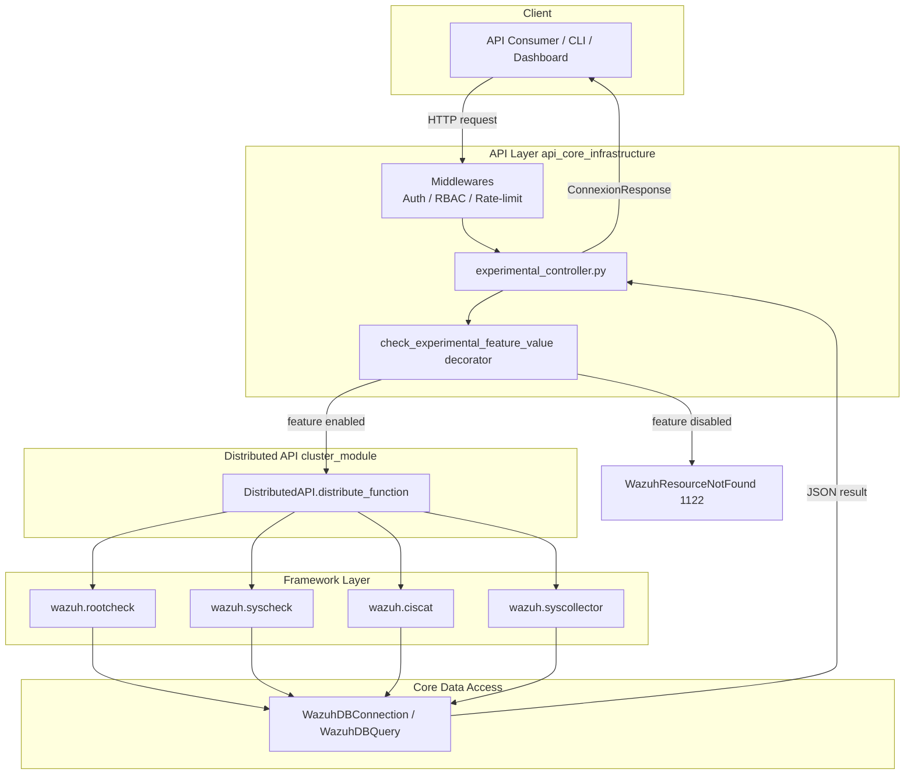
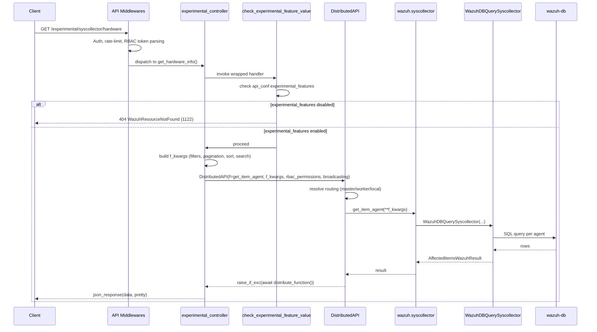
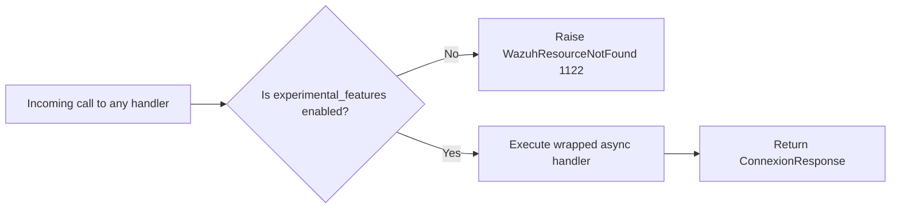
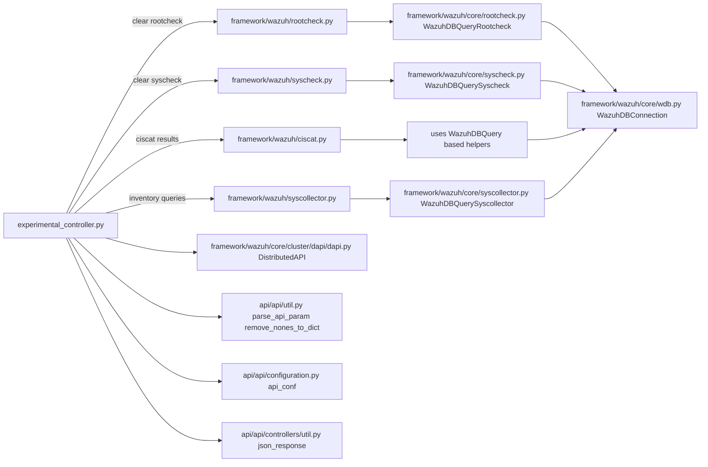
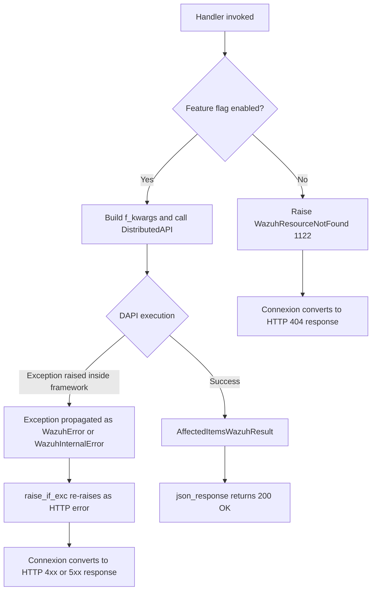

# Experimental Controller Module

## Introduction

The **Experimental Controller** module (`api/api/controllers/experimental_controller.py`) is a thin HTTP orchestration layer inside the Wazuh RESTful API that exposes a set of **"experimental" endpoints** — features that are still evolving, are computationally heavier than the standard API surface, or aggregate data across multiple back-end subsystems. It provides a single point of access to functionality such as:

- Bulk clearing of Rootcheck and Syscheck (FIM) databases across the whole agent fleet.
- Retrieval of CIS-CAT compliance scan results.
- Retrieval of Syscollector inventory data (hardware, OS, packages, ports, processes, network addresses/interfaces/protocols, hotfixes) directly through experimental, more flexible filtering endpoints.

Unlike most other API controllers, every endpoint in this module is protected by a dedicated **feature flag decorator** (`check_experimental_feature_value`), which ensures that these endpoints only respond when `experimental_features: true` is set in the API configuration. This makes the module a controlled "staging area" for functionality before it graduates to the stable API surface (e.g., `syscollector_module`, `rootcheck_module`, `syscheck_module`, `ciscat_module`).

Architecturally, this module does not implement business logic itself. Instead, it validates/normalizes HTTP query parameters and dispatches the actual work to the **Distributed API (DAPI)**, which routes the request to the proper node (master/worker/agent) in the cluster and invokes the corresponding framework function (in `wazuh.rootcheck`, `wazuh.syscheck`, `wazuh.ciscat`, or `wazuh.syscollector`).

This document describes the module's purpose, internal architecture, request/response flow, and how it relates to the rest of the Wazuh system.

---

## 1. Purpose and Scope

| Aspect | Description |
|---|---|
| **Layer** | API Controller (HTTP request handler) |
| **Framework** | Connexion / OpenAPI-driven async handlers |
| **Protection** | Requires `experimental_features` flag enabled in API config, plus standard RBAC checks |
| **Execution model** | Fully asynchronous; delegates actual work to `DistributedAPI` |
| **Primary consumers** | API clients calling `/experimental/*` endpoints |
| **Downstream dependencies** | `wazuh.rootcheck`, `wazuh.syscheck`, `wazuh.ciscat`, `wazuh.syscollector` (framework layer), `wazuh.core.cluster.dapi.dapi.DistributedAPI` |

The module groups its 13 functions into three functional families:

1. **Feature-flag gate** — `check_experimental_feature_value` (decorator applied to all other functions).
2. **Database maintenance** — `clear_rootcheck_database`, `clear_syscheck_database`.
3. **Inventory & compliance queries** — `get_cis_cat_results`, `get_hardware_info`, `get_hotfixes_info`, `get_network_address_info`, `get_network_interface_info`, `get_network_protocol_info`, `get_os_info`, `get_packages_info`, `get_ports_info`, `get_processes_info`.

---

## 2. High-Level Architecture



**Key points:**
- The controller never talks to `wazuh-db` or agents directly; it always goes through `DistributedAPI`, which handles cluster routing (master vs. worker vs. broadcasting to all agents when `agents_list == '*'`).
- The `broadcasting` flag is set whenever the `agents_list` request parameter equals `'*'`, allowing DAPI to fan the request out to all cluster nodes.
- RBAC policies are extracted from `request.context['token_info']['rbac_policies']` and forwarded to `DistributedAPI`, which enforces per-resource permissions before executing the framework function.

---

## 3. Component Breakdown

| Component | Type | Responsibility |
|---|---|---|
| `check_experimental_feature_value` | Decorator | Gate-keeps every endpoint; raises `WazuhResourceNotFound(1122)` if `experimental_features` is disabled in API config (`api.configuration.api_conf`) |
| `clear_rootcheck_database` | Async handler | Clears Rootcheck DB entries for given/all agents via `wazuh.rootcheck.clear` |
| `clear_syscheck_database` | Async handler | Clears Syscheck (FIM) DB entries for given/all agents via `wazuh.syscheck.clear` |
| `get_cis_cat_results` | Async handler | Fetches CIS-CAT benchmark scan results via `wazuh.ciscat.get_ciscat_results` |
| `get_hardware_info` | Async handler | Fetches hardware inventory (`element_type='hardware'`) via `wazuh.syscollector.get_item_agent` |
| `get_hotfixes_info` | Async handler | Fetches installed hotfixes (`element_type='hotfixes'`) via `wazuh.syscollector.get_item_agent` |
| `get_network_address_info` | Async handler | Fetches network address inventory (`element_type='netaddr'`) |
| `get_network_interface_info` | Async handler | Fetches network interface inventory (`element_type='netiface'`) |
| `get_network_protocol_info` | Async handler | Fetches network protocol inventory (`element_type='netproto'`) |
| `get_os_info` | Async handler | Fetches OS inventory (`element_type='os'`) |
| `get_packages_info` | Async handler | Fetches installed packages inventory (`element_type='packages'`) |
| `get_ports_info` | Async handler | Fetches open ports inventory (`element_type='ports'`) |
| `get_processes_info` | Async handler | Fetches running processes inventory (`element_type='processes'`) |

All ten "get" handlers for syscollector data share an identical structural pattern: they only differ in the filters accepted and the `element_type` value passed to `wazuh.syscollector.get_item_agent`.

---

## 4. Request Processing Flow

The following sequence diagram illustrates the canonical request lifecycle, using `get_hardware_info` as a representative example (the same pattern applies to all syscollector-related endpoints):



For the database-clearing endpoints (`clear_rootcheck_database`, `clear_syscheck_database`), the flow is identical except the framework target is `wazuh.rootcheck.clear` / `wazuh.syscheck.clear`, and `agents_list` containing `'all'` is normalized to `'*'` before dispatch to trigger a cluster-wide broadcast.

---

## 5. Decorator Pattern: Feature Flag Enforcement



All 12 public functions (excluding the decorator itself) are wrapped with `@check_experimental_feature_value`. This is a cross-cutting concern implemented once and reused via Python's `functools.wraps`, guaranteeing:
- Consistent error code (`1122`) and behavior across all experimental endpoints.
- Centralized single point of control to enable/disable the entire experimental feature set via API configuration (see `api_core_infrastructure` → `api/api/configuration.py`).

---

## 6. Endpoint Reference

| Function | HTTP Purpose | Framework Target | `element_type` |
|---|---|---|---|
| `clear_rootcheck_database` | Clear rootcheck DB | `wazuh.rootcheck.clear` | — |
| `clear_syscheck_database` | Clear syscheck DB | `wazuh.syscheck.clear` | — |
| `get_cis_cat_results` | CIS-CAT scan results | `wazuh.ciscat.get_ciscat_results` | — |
| `get_hardware_info` | Hardware inventory | `wazuh.syscollector.get_item_agent` | `hardware` |
| `get_hotfixes_info` | Windows hotfixes | `wazuh.syscollector.get_item_agent` | `hotfixes` |
| `get_network_address_info` | Network addresses | `wazuh.syscollector.get_item_agent` | `netaddr` |
| `get_network_interface_info` | Network interfaces | `wazuh.syscollector.get_item_agent` | `netiface` |
| `get_network_protocol_info` | Network protocols/gateways | `wazuh.syscollector.get_item_agent` | `netproto` |
| `get_os_info` | OS inventory | `wazuh.syscollector.get_item_agent` | `os` |
| `get_packages_info` | Installed packages | `wazuh.syscollector.get_item_agent` | `packages` |
| `get_ports_info` | Open ports | `wazuh.syscollector.get_item_agent` | `ports` |
| `get_processes_info` | Running processes | `wazuh.syscollector.get_item_agent` | `processes` |

All "get" endpoints share a common set of query parameters: `pretty`, `wait_for_complete`, `agents_list`, `offset`, `limit`, `select`, `sort`, `search`, plus endpoint-specific filters (e.g., `board_serial`, `os_name`, `pid`, `iface_name`, etc.). Several endpoints also read **nested-field filters** directly from `request.query_params` (e.g., `ram.free`, `tx.packets`, `local.ip`) because Connexion's generated function signature cannot represent dotted field names as Python parameters.

---

## 7. Component Interaction / Dependency Diagram



This module is a **pure consumer** — it does not export functionality that other modules depend on. It reuses:
- **`framework_core_utils`** (`AffectedItemsWazuhResult`, `WazuhResult`) indirectly through the framework functions it calls.
- **`framework_core_communication`** (`WazuhDBConnection`) indirectly through the `core/*` query classes.
- **`cluster_module`**'s `DistributedAPI` for all cluster-aware dispatching.
- **`api_core_infrastructure`** for configuration (`api_conf`), request utilities, and shared response helpers.

---

## 8. Relationship to Non-Experimental Modules

The experimental controller acts as an incubation layer parallel to (and often overlapping with) these stable modules:

| Experimental Endpoint Family | Corresponding Stable Module |
|---|---|
| Rootcheck DB clearing | [rootcheck_module.md](rootcheck_module.md) |
| Syscheck DB clearing | [syscheck_module.md](syscheck_module.md) |
| CIS-CAT results | [ciscat_module.md](ciscat_module.md) |
| Hardware/OS/Packages/Ports/Processes/Network/Hotfixes inventory | [syscollector_module.md](syscollector_module.md) |

Compared to the stable `syscollector_module` controller (`api/api/controllers/syscollector_controller.py`), the experimental variants generally provide **richer, flatter filter parameters** (including nested-field filters passed via raw query params) suited for advanced consumers, while the stable endpoints follow a more conservative, versioned contract. Over time, functionality proven in this module is expected to migrate into the corresponding stable controller.

---

## 9. Cross-Module Dependencies

| Dependency | Module Documentation |
|---|---|
| `DistributedAPI`, RBAC enforcement, cluster routing | [cluster_module.md](cluster_module.md) |
| API middlewares, authentication, configuration (`api_conf`) | [api_core_infrastructure.md](api_core_infrastructure.md) |
| `wazuh.rootcheck.clear`, `WazuhDBQueryRootcheck` | [rootcheck_module.md](rootcheck_module.md) |
| `wazuh.syscheck.clear`, `WazuhDBQuerySyscheck` | [syscheck_module.md](syscheck_module.md) |
| `wazuh.ciscat.get_ciscat_results` | [ciscat_module.md](ciscat_module.md) |
| `wazuh.syscollector.get_item_agent`, `WazuhDBQuerySyscollector`, native Syscollector daemon | [syscollector_module.md](syscollector_module.md) |
| `WazuhDBConnection`, socket communication with `wazuh-db` | [framework_core_communication.md](framework_core_communication.md) |
| `AffectedItemsWazuhResult`, `WazuhResult`, common utilities | [framework_core_utils.md](framework_core_utils.md) |
| Agent management (agent existence validation for filters) | [agent_module.md](agent_module.md) |

---

## 10. Error Handling



- All framework/database errors bubble up through `DistributedAPI.distribute_function()` and are normalized by `raise_if_exc` (from `api.util`), which converts any exception object contained in the DAPI result into a real raised exception, ultimately handled by Connexion's error-handling middleware.
- Because these endpoints are agent-facing and can broadcast to `'*'`, partial failures (e.g., some agents unreachable) are represented within the returned `AffectedItemsWazuhResult` as `failed_items`, not as HTTP errors — the HTTP call still returns `200 OK` with per-agent failure details embedded in the JSON body.

---

## 11. Configuration

The only configuration knob relevant to this module is:

```yaml
experimental_features: true|false   # api.yaml (server section)
```

This value is loaded into `api.configuration.api_conf` at API startup (see [api_core_infrastructure.md](api_core_infrastructure.md)) and checked on every single call to any function in this module via the `check_experimental_feature_value` decorator. There is no per-endpoint toggle — the flag is all-or-nothing for the entire module.

---

## 12. Summary

The Experimental Controller module is a **lightweight, decorator-gated dispatch layer** that:

1. Confirms experimental features are enabled.
2. Normalizes and validates query parameters (pagination, sorting, searching, filters, including nested-field filters).
3. Delegates all actual business logic to the Distributed API, which in turn calls into the `rootcheck`, `syscheck`, `ciscat`, and `syscollector` framework modules.
4. Returns normalized JSON responses via shared API utilities.

It has no persistent state of its own and introduces no new data models — its value lies entirely in providing a controlled, flaggable entry point for functionality that is still maturing before being promoted into the stable Wazuh API surface.
