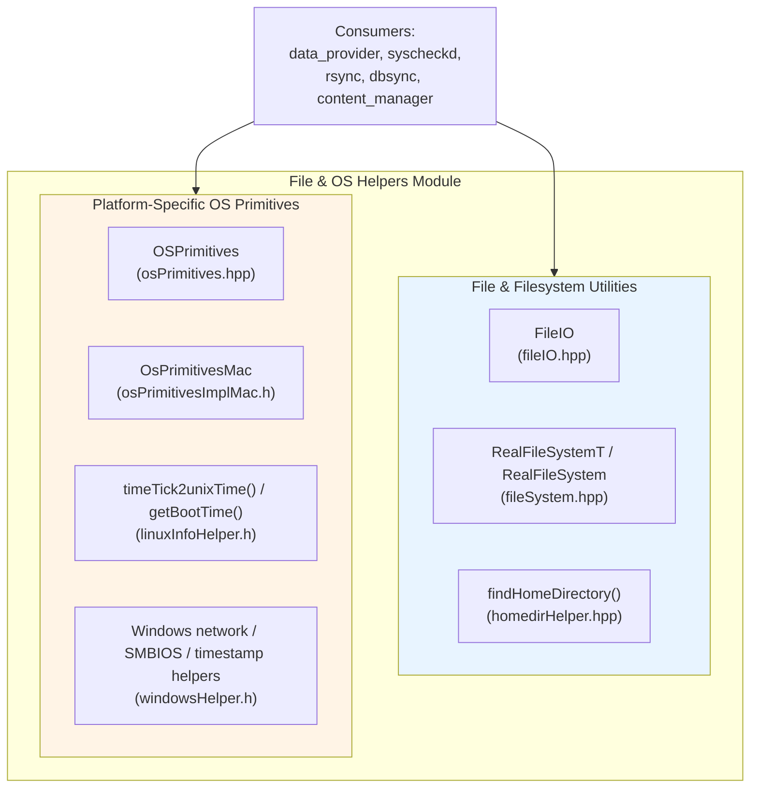
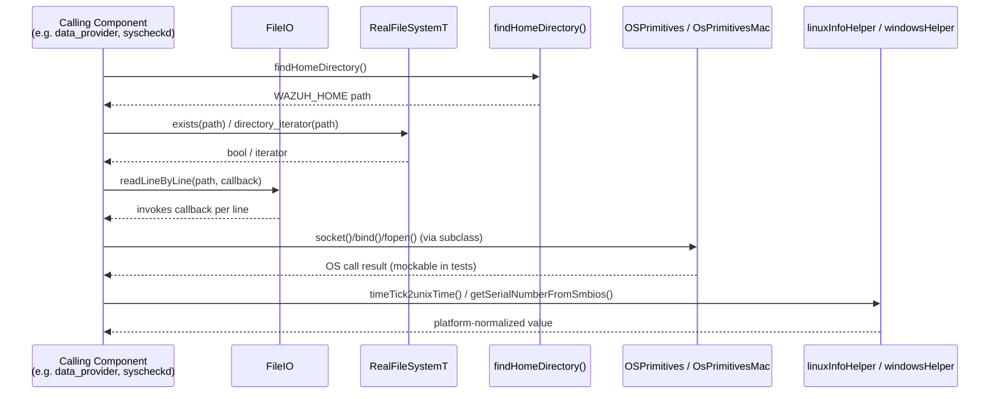

# File & OS Helpers Module

## 1. Purpose and Overview

The **File & OS Helpers** module is a lightweight collection of cross-platform C++ header-only utilities that live under `src/shared_modules/utils/`. It provides two categories of low-level building blocks that are reused throughout the Wazuh C++ codebase (data provider, syscheckd, shared modules, content manager, etc.):

1. **File & filesystem convenience wrappers** — simple, dependency-free helpers to read files line-by-line, query the filesystem (existence, type, directory iteration, path resolution) and locate the Wazuh installation home directory.
2. **OS-primitive abstraction layers** — thin, mockable wrappers around raw operating-system system calls (sockets, files, IOKit, sysctl) and platform-specific hardware/time helper functions (Linux boot-time/clock-tick conversion, Windows network/SMBIOS/timestamp utilities, macOS IOKit/sysctl wrappers).

Because these are simple header (`.hpp`/`.h`) utilities with no internal orchestration logic, the module's main value is **testability and portability**: business logic elsewhere (e.g., `data_provider`, `rsync`, `dbsync`) depends on these thin abstractions instead of calling OS APIs directly, which allows the OS calls to be mocked in unit tests via dependency injection (see `OSPrimitives`, `OsPrimitivesMac`, `RealFileSystemT`).

This module is a leaf utility inside the broader [Shared Modules Infrastructure (C++)](shared_utils.md) codebase, alongside sibling utility groups such as [socket_networking](socket_networking.md), [json_utilities](json_utilities.md), [rocksdb_wrapper](rocksdb_wrapper.md), and [common_helpers](common_helpers.md).

## 2. Architecture Overview

The module has no runtime state, no singletons that cross file boundaries, and no inter-component orchestration — each header is independently includable. The natural grouping is by concern:

### Design characteristics

- **Header-only, dependency-light**: Every component is defined directly in a header, favoring inlining and ease of inclusion without extra build targets.
- **Static/template-based polymorphism**: `RealFileSystemT` is a class template parameterized by the directory-iterator type, enabling test doubles to be injected at compile time rather than through virtual dispatch.
- **Protected-constructor base classes for mocking**: `OSPrimitives` exposes `protected` wrappers around POSIX calls (`socket`, `bind`, `accept`, `fopen`, etc.) so that subclasses used in production code inherit real behavior, while unit tests can subclass and override individual calls.
- **Platform gating via preprocessor guards**: `windowsHelper.h` is wrapped in `#ifdef WIN32`, `linuxInfoHelper.h` targets Linux `/proc` semantics, and `osPrimitivesImplMac.h` wraps Apple's IOKit/CoreFoundation APIs — each file is only compiled on its target OS.

## 3. Sub-Modules

This module is documented in two focused sub-module pages:

| Sub-Module | Description | Documentation |
|---|---|---|
| **File & Filesystem Utilities** | Cross-platform helpers for reading files, querying/iterating the filesystem, and resolving the Wazuh home directory. | [file_os_helpers_file_utilities.md](file_os_helpers_file_utilities.md) |
| **Platform OS Primitives** | Mockable OS system-call wrappers (`OSPrimitives`, `OsPrimitivesMac`) and platform-specific low-level helpers for Linux time conversion and Windows networking/SMBIOS/timestamp handling. | [file_os_helpers_platform_primitives.md](file_os_helpers_platform_primitives.md) |

## 4. High-Level Data / Usage Flow

## 5. Relationship to the Rest of the System

- **Upstream consumers**: Components such as the [System Information Data Provider (C++)](SysInfo_Provider.md) family (`data_provider_sysinfo_core_unix`, `data_provider_sysinfo_core_windows`) and the [Syscheck / FIM Daemon](syscheckd_core.md) use `RealFileSystem`, `findHomeDirectory`, and the platform primitives to read configuration/state and query OS metadata portably.
- **Sibling utilities**: For socket-specific abstractions built on top of similar OS-primitive patterns, see [socket_networking](socket_networking.md). For generic helpers not tied to files/OS calls (hashing, time formatting, LRU caches), see [common_helpers](common_helpers.md).
- **No external dependencies on other Wazuh modules**: This module only depends on the C++ standard library and platform SDKs (`<filesystem>`, WinAPI, IOKit/CoreFoundation), making it one of the lowest-level building blocks in the [Shared Modules Infrastructure (C++)](shared_utils.md) tree.

## 6. Summary

| Aspect | Detail |
|---|---|
| Language | C++ (header-only) |
| Files | 7 headers across 2 logical groups |
| Platform scope | Cross-platform core (fileIO, fileSystem, homedirHelper) + platform-specific primitives (Linux, Windows, macOS) |
| Primary consumers | `data_provider`, `syscheckd`, other `shared_modules/utils` components |
| Testability pattern | Template/inheritance-based seams for mocking filesystem and OS-call behavior in unit tests |
