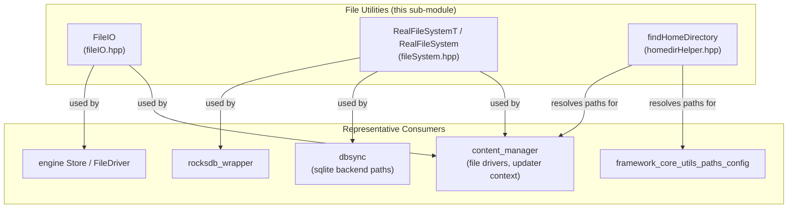
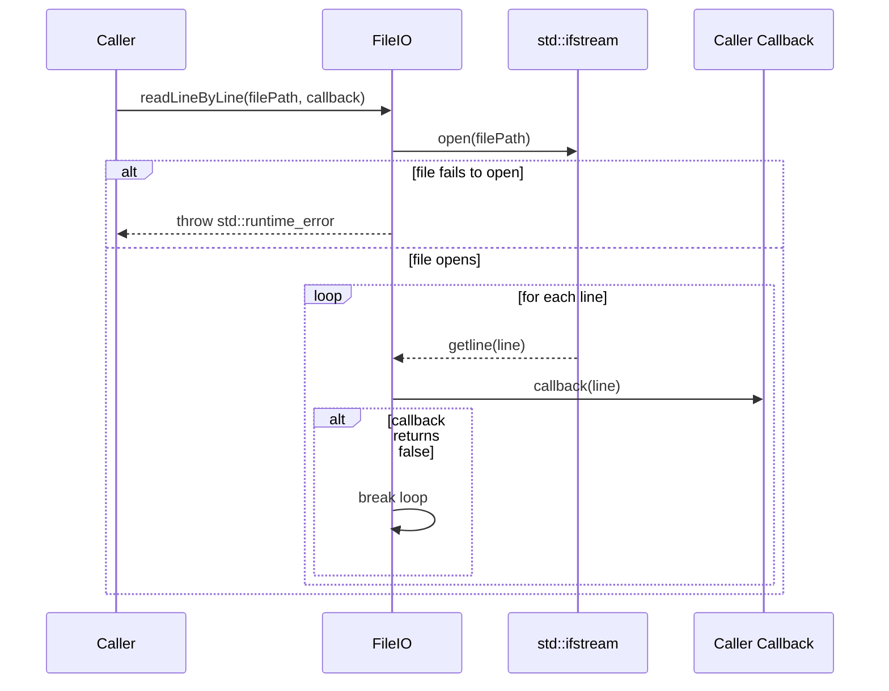
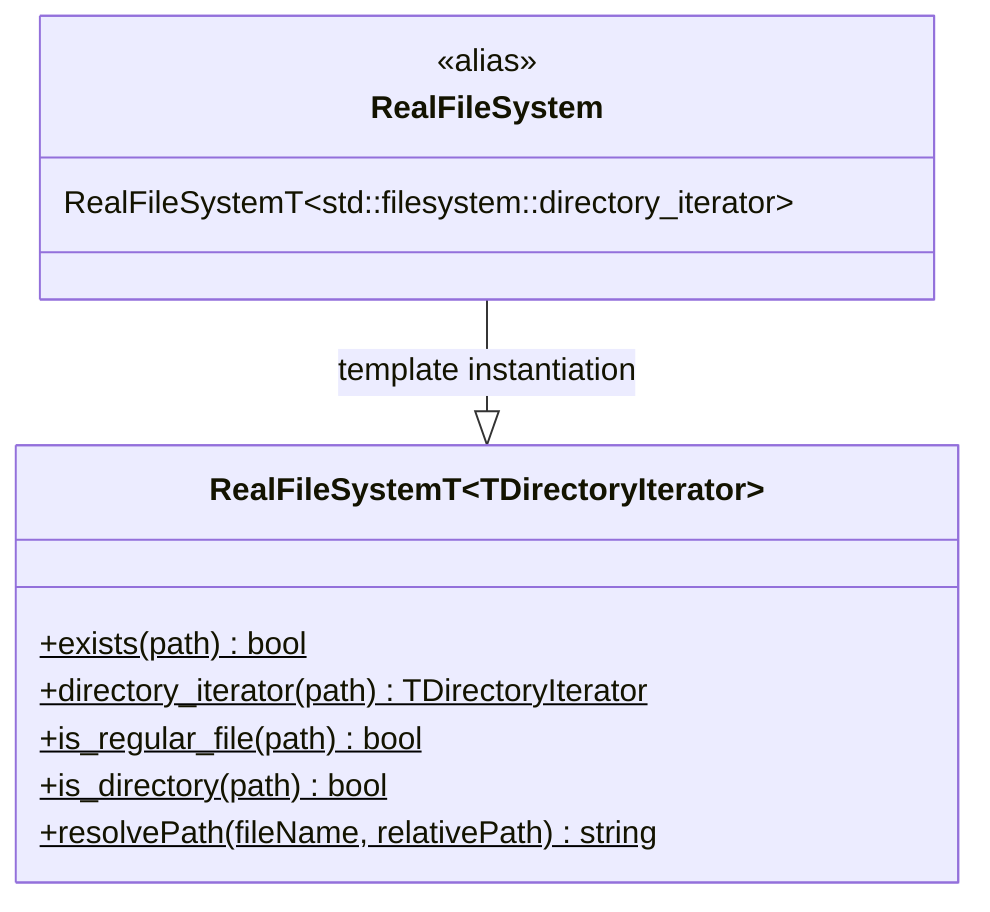
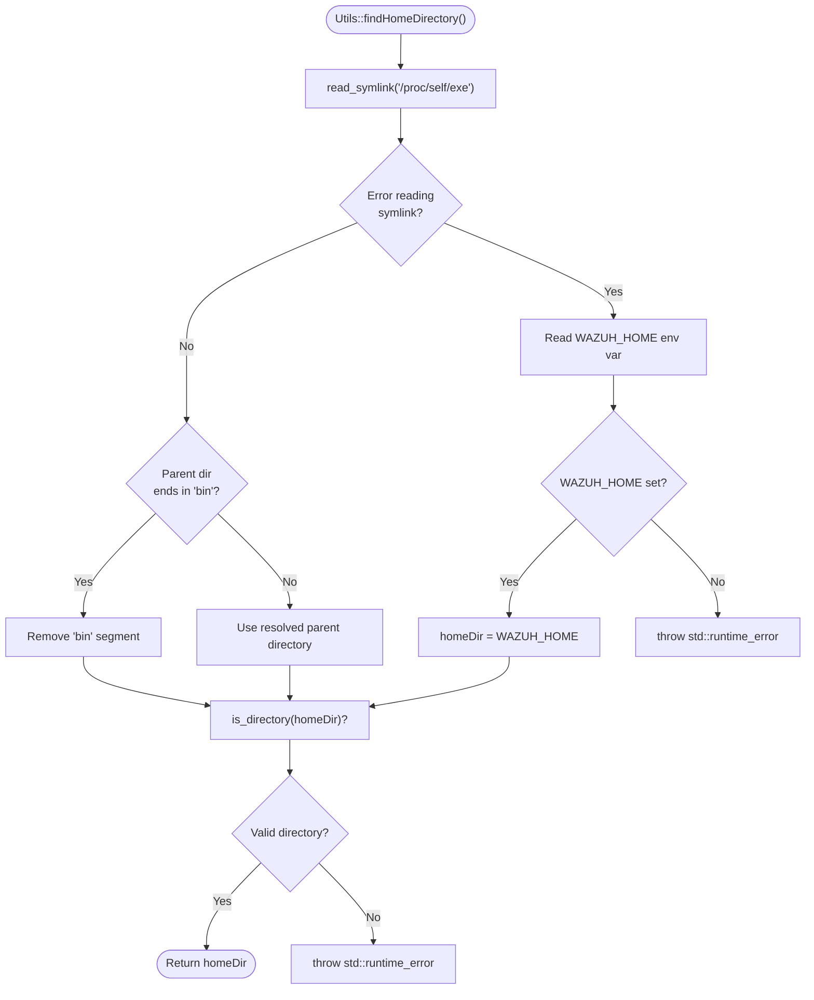
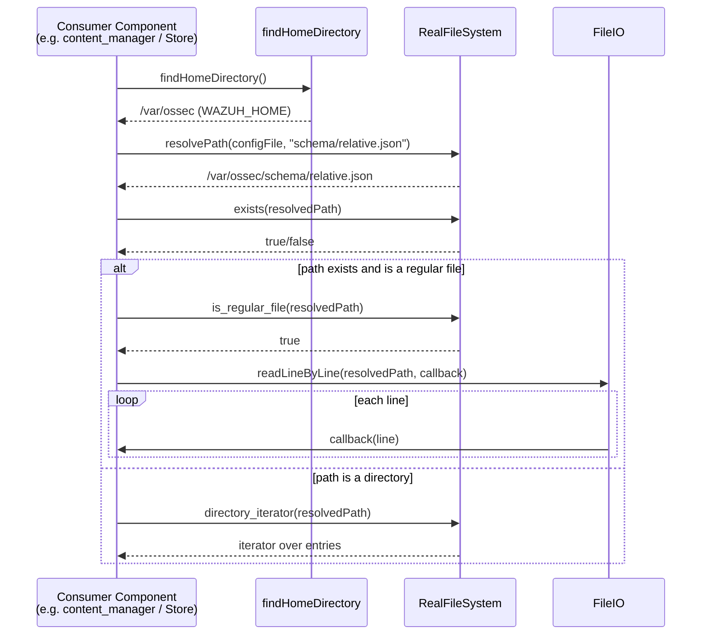

# File & OS Helpers — File Utilities

## Introduction

The **File Utilities** sub-module is a small, header-only collection of C++ utility classes that provide the foundational building blocks for filesystem interaction across the Wazuh codebase's shared C++ modules. It offers three focused capabilities:

1. **Line-oriented file reading** (`FileIO`) — safe, callback-driven reading of text files line by line.
2. **Filesystem abstraction** (`RealFileSystemT` / `RealFileSystem`) — a thin, testable wrapper around `std::filesystem` operations (existence checks, directory iteration, file/directory type checks, and path resolution).
3. **Home directory discovery** (`findHomeDirectory`) — locating the Wazuh installation directory (`WAZUH_HOME`) at runtime, using the running executable's path or an environment variable fallback.

These utilities are deliberately minimal and dependency-free (aside from the C++ standard library), making them safe to include from any higher-level component — such as content management, database synchronization, RocksDB wrappers, or router logic — that needs to touch the filesystem without duplicating boilerplate error handling or platform quirks.

This page documents one of the two sub-module groups of the parent [File & OS Helpers](file_os_helpers.md) module. The sibling group, **Platform OS Primitives** (mockable OS system-call wrappers and platform-specific low-level helpers for Linux/Windows/macOS), is documented separately as part of the same parent module and is not duplicated here — see `file_os_helpers.md` for the full module overview and the link to that sibling documentation.

---

## Purpose & Core Functionality

| Component | File | Responsibility |
|---|---|---|
| `FileIO` | `src/shared_modules/utils/fileIO.hpp` | Reads a text file line-by-line, invoking a caller-supplied callback for each line; stops early if the callback returns `false`. |
| `RealFileSystemT<TDirectoryIterator>` (alias `RealFileSystem`) | `src/shared_modules/utils/fileSystem.hpp` | Static wrapper methods around `std::filesystem` (`exists`, `directory_iterator`, `is_regular_file`, `is_directory`, `resolvePath`). Templated on the directory iterator type to enable dependency injection for unit testing. |
| `findHomeDirectory` | `src/shared_modules/utils/homedirHelper.hpp` | Resolves the Wazuh home directory by following the `/proc/self/exe` symlink (Linux) and stripping a trailing `bin` segment, falling back to the `WAZUH_HOME` environment variable if the symlink cannot be resolved. |

All three components are implemented as **header-only, static-method classes/functions** — they carry no instance state and are used directly via their static interfaces (e.g., `FileIO::readLineByLine(...)`, `RealFileSystem::exists(...)`, `Utils::findHomeDirectory()`). This design keeps them trivially includable and mockable in unit tests without requiring object construction or lifecycle management.

---

## Architecture Overview

---

## Component Details

### 1. `FileIO::readLineByLine`

**Key characteristics:**
- Accepts a `std::filesystem::path` and a `std::function<bool(const std::string&)>` callback.
- Throws `std::runtime_error("Could not open file")` if the file cannot be opened — callers must handle this exception.
- The callback's boolean return value acts as a **continuation signal**: returning `false` allows early termination (e.g., when a caller only needs the first N matching lines or wants to stop on a sentinel value), avoiding the need to read an entire file when unnecessary.
- Uses `std::getline`, so it is line-ending agnostic within the semantics of the standard library on the host platform.

**Typical usage pattern:** parsing configuration files, ingesting log fragments, or streaming content line-by-line (e.g., in [content_manager](content_manager.md) or [Store](Store.md) file drivers).

---

### 2. `RealFileSystemT` / `RealFileSystem`

**Design rationale — template-based dependency injection:**
The class is templated on `TDirectoryIterator` (defaulting to `std::filesystem::directory_iterator` via the `RealFileSystem` alias). This allows consumers and unit tests to substitute a **mock directory iterator** type when testing code paths that enumerate directories, without needing to touch the real filesystem. This mirrors the same protected-constructor/template mocking pattern used by the sibling Platform OS Primitives sub-module of [File & OS Helpers](file_os_helpers.md) (e.g., `OSPrimitives`), keeping OS-dependent code testable throughout the [Shared Modules Infrastructure (C++)](Wazuh_Engine_Core_(C++).md) tree.

**Method summary:**
- `exists(path)` — thin wrapper over `std::filesystem::exists`.
- `directory_iterator(path)` — returns an iterator over directory entries; the return type is the template parameter, enabling injection.
- `is_regular_file(path)` / `is_directory(path)` — type-checking wrappers over the corresponding `std::filesystem` functions.
- `resolvePath(fileName, relativePath)` — resolves a path relative to the **parent directory of `fileName`**, commonly used to locate sibling or nested resources relative to a known file (e.g., resolving a schema file relative to a currently loaded configuration file).

All methods are `static`, so `RealFileSystem` (or a custom template instantiation) can be used directly as a **stateless utility namespace** — no instance needs to be constructed. This makes it easy to pass the class itself as a template parameter to higher-level components that need filesystem access but want to remain unit-testable (a pattern visible across `dbsync`, `rsync`, and `rocksdb_wrapper`).

---

### 3. `findHomeDirectory`

**Behavior:**
1. Attempts to resolve the real path of the running executable via the `/proc/self/exe` symlink (Linux-specific mechanism).
2. If the resolved parent directory's final path component is `bin`, that segment is stripped — reflecting Wazuh's typical installation layout where binaries live under `<WAZUH_HOME>/bin/`.
3. If the symlink cannot be read (e.g., non-Linux platforms, sandboxing, or permission issues), it falls back to the `WAZUH_HOME` environment variable.
4. If neither resolution succeeds, or the resulting path is not a valid directory, a `std::runtime_error` is thrown with the underlying `std::error_code` message.

**Important notes for maintainers:**
- This implementation is **Linux-centric** (relies on `/proc/self/exe`). On other platforms this function depends entirely on the `WAZUH_HOME` environment variable being set, since the symlink read will fail and populate an error code. Related but distinct platform-specific path/OS helpers live in the sibling Platform OS Primitives sub-module of [File & OS Helpers](file_os_helpers.md) (e.g., Windows SMBIOS/registry helpers, Linux boot-time conversion), which this sub-module intentionally does not merge with, keeping cross-platform primitives separate from generic filesystem helpers.
- Used to bootstrap path resolution in components that need to locate configuration, schema, or resource files relative to the Wazuh installation root — analogous in purpose to `framework/wazuh/core/common.py::find_wazuh_path` in the Python [framework_core_utils_paths_config](framework_core_utils_paths_config.md) module, though implemented independently in C++ for native shared modules.

---

## Data Flow Example: Typical Consumer Interaction

This composition pattern — locate home directory → resolve a relative path → check its type → read or iterate — recurs throughout consumers in [content_manager](content_manager.md), [dbsync](dbsync.md), and [Store](Store.md), which rely on these primitives instead of calling `std::filesystem` directly, centralizing error semantics and enabling test substitution.

---

## Relationship to Other Modules

- **Parent module:** [File & OS Helpers](file_os_helpers.md) — groups this File Utilities sub-module together with the sibling Platform OS Primitives sub-module (mockable OS system-call wrappers such as `OSPrimitives`/`OsPrimitivesMac`, and platform-specific helpers for Linux time conversion and Windows networking/SMBIOS/timestamp handling).
- **Consumers across the codebase:**
  - [content_manager](content_manager.md) — uses file I/O and filesystem checks when managing downloaded/decompressed content and version files.
  - [dbsync](dbsync.md) and RocksDB wrapper components — rely on filesystem existence/type checks for database file management.
  - [Store](Store.md) (`FileDriver`) in the Wazuh Engine — uses similar line-based or path-resolution patterns for its file-backed document store.
  - [framework_core_utils_paths_config](framework_core_utils_paths_config.md) — the Python equivalent (`find_wazuh_path`) serves an analogous purpose for the Python-based API/framework layer, though it is a separate implementation.

---

## Design Considerations & Best Practices

- **Stateless, static-method design:** None of these classes require instantiation; they act as namespaces of related static functions. This simplifies usage and avoids unnecessary object lifecycle management.
- **Testability via templates:** `RealFileSystemT`'s template parameter for the directory iterator type is the primary hook for unit testing — consumers can define a mock iterator type and instantiate `RealFileSystemT<MockIterator>` to simulate directory contents without touching disk.
- **Explicit error signaling via exceptions:** Both `FileIO::readLineByLine` and `findHomeDirectory` throw `std::runtime_error` on failure rather than returning error codes or optional values, which is consistent with the exception-based error handling style used throughout the shared C++ modules.
- **Platform assumptions:** `findHomeDirectory` assumes a Linux-like `/proc` filesystem for its primary resolution path. Any usage on Windows or macOS must ensure `WAZUH_HOME` is set as an environment variable, or this function will throw.
- **Minimal coupling:** These headers only depend on `<filesystem>`, `<fstream>`, and `<functional>` (standard library), making them safe to include broadly without pulling in heavier dependencies.
