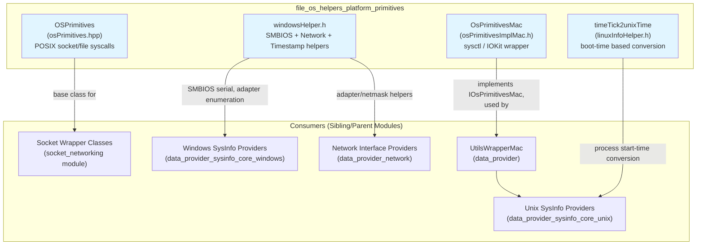
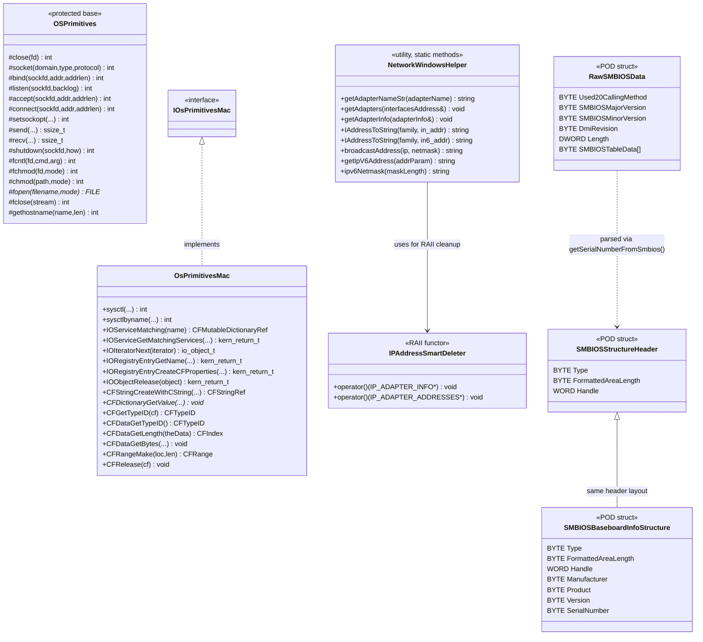
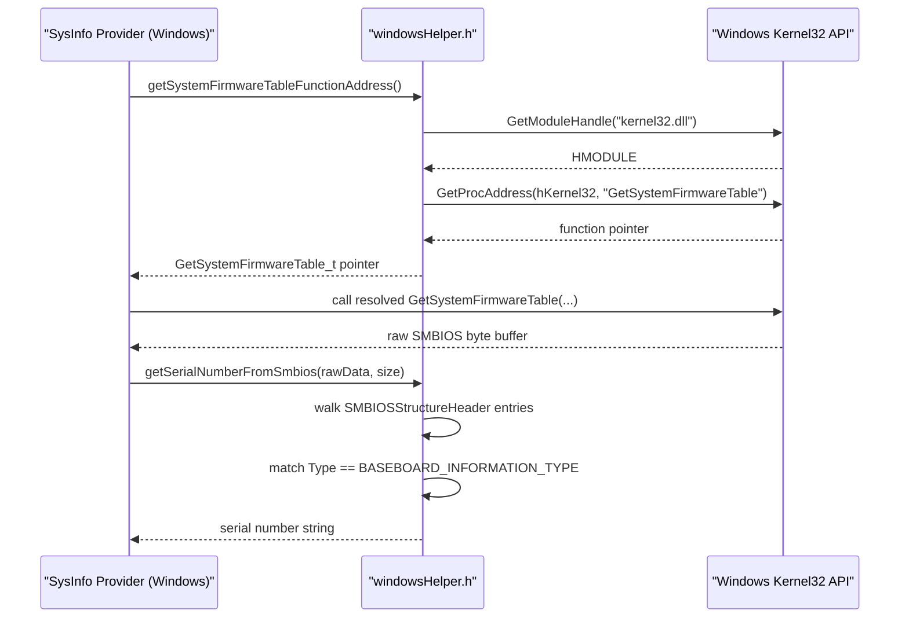
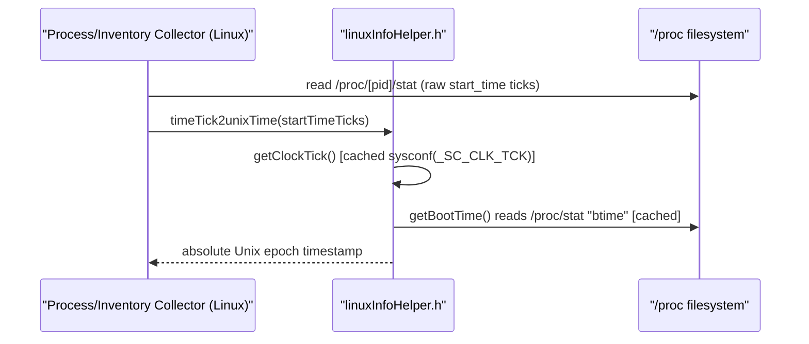
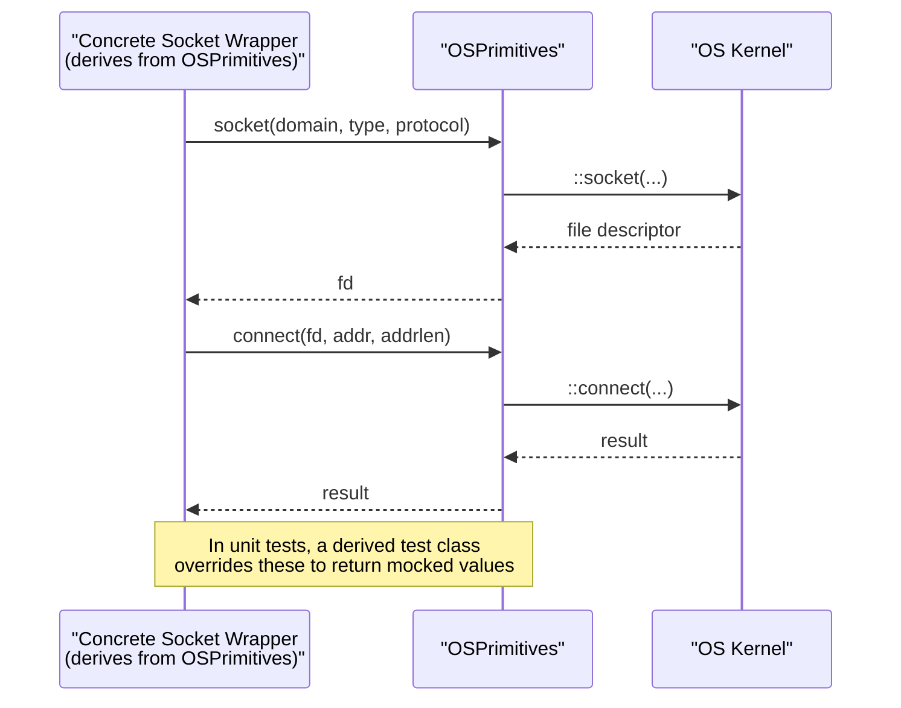
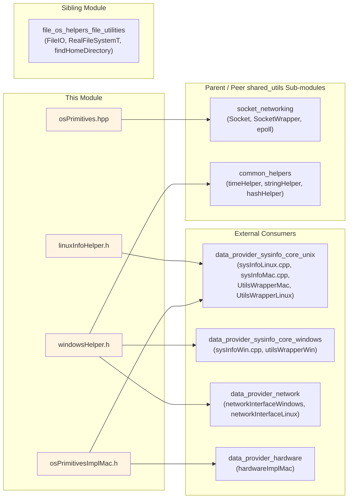

# File OS Helpers – Platform Primitives

## Introduction

The **`file_os_helpers_platform_primitives`** module is a thin, low-level abstraction layer that isolates Wazuh's cross-platform C/C++ code from the raw, operating-system-specific APIs it must call in order to perform socket I/O, file I/O, process/security queries, and hardware/network introspection. It lives inside the broader **Shared Modules Infrastructure (C++)** codebase, under `shared_utils → file_os_helpers`, alongside its sibling module `file_os_helpers_file_utilities` (generic file/filesystem helpers such as `FileIO`, `RealFileSystemT`, `findHomeDirectory` — see [file_os_helpers_file_utilities.md](file_os_helpers_file_utilities.md)).

Where the file-utilities module answers *"how do I read/write files and locate directories in a portable way?"*, this module answers *"how do I safely call raw POSIX/BSD/macOS/Windows system calls and OS-specific structures without spreading `#ifdef`s across the whole codebase?"*. It provides:

- A **POSIX primitive wrapper class** (`OSPrimitives`) that centralizes calls such as `socket()`, `bind()`, `connect()`, `send()`, `recv()`, `fopen()`, `chmod()`, etc., behind protected inline methods — enabling clean inheritance and unit-test mocking of raw syscalls.
- A **macOS-specific primitive wrapper** (`OsPrimitivesMac`) that wraps Darwin/IOKit and `sysctl` APIs (`sysctl`, `sysctlbyname`, `IOServiceMatching`, `IORegistryEntryCreateCFProperties`, etc.) behind a common interface (`IOsPrimitivesMac`).
- A **Linux-specific helper** (`linuxInfoHelper.h`) that converts kernel clock-tick-relative timestamps (`/proc` values) into absolute Unix time, using `/proc/stat` boot time and `sysconf(_SC_CLK_TCK)`.
- A **Windows-specific helper** (`windowsHelper.h`) bundling SMBIOS parsing structures, dynamic function-pointer resolution for optional Windows APIs (`GetSystemFirmwareTable`, `ConvertLengthToIpv4Mask`, `GetIfEntry2`), RAII deleters for Windows network structures, and a large `NetworkWindowsHelper` utility class for adapter enumeration, IPv6 netmask computation, and timestamp formatting.

This module is a **foundational dependency** for higher-level platform data providers (see [data_provider_sysinfo_core_unix.md](data_provider_sysinfo_core_unix.md), [data_provider_sysinfo_core_windows.md](data_provider_sysinfo_core_windows.md), [data_provider_network.md](data_provider_network.md)) and for the generic socket/networking utilities in the parent `shared_utils` module (see [socket_networking.md](socket_networking.md)).

---

## Purpose and Core Functionality

| Concern | Component | Responsibility |
|---|---|---|
| Portable syscall wrapping | `OSPrimitives` (`osPrimitives.hpp`) | Wraps POSIX socket/file syscalls (`socket`, `bind`, `listen`, `accept`, `connect`, `send`, `recv`, `shutdown`, `fcntl`, `chmod`, `fchmod`, `fopen`, `fclose`, `gethostname`) as protected inline members so that derived classes (e.g. socket wrapper classes) can be tested by mocking these calls. |
| macOS hardware/kernel queries | `OsPrimitivesMac` (`osPrimitivesImplMac.h`) | Implements the `IOsPrimitivesMac` interface, wrapping `sysctl`/`sysctlbyname` and IOKit/CoreFoundation APIs (`IOServiceMatching`, `IOServiceGetMatchingServices`, `IORegistryEntryCreateCFProperties`, `CFDictionaryGetValue`, etc.) used to query hardware information (CPU, memory, device registry entries) on macOS. |
| Linux boot-relative time conversion | `timeTick2unixTime` (`linuxInfoHelper.h`) | Converts a process/kernel start time expressed in clock ticks since boot (as reported by `/proc/[pid]/stat`) into an absolute Unix epoch timestamp, using cached boot time (`/proc/stat`) and `sysconf(_SC_CLK_TCK)`. |
| Windows SMBIOS/network primitives | `windowsHelper.h` | Provides: (1) raw SMBIOS table structures (`RawSMBIOSData`, `SMBIOSStructureHeader`, `SMBIOSBaseboardInfoStructure`) and `getSerialNumberFromSmbios()` to extract the motherboard serial number; (2) dynamic-loading helpers for optional/version-gated Win32 APIs (`getSystemFirmwareTableFunctionAddress`, `getConvertLengthToIpv4MaskFunctionAddress`, `getIfEntry2FunctionAddress`); (3) `IPAddressSmartDeleter`, a RAII functor freeing `IP_ADAPTER_INFO`/`IP_ADAPTER_ADDRESSES` structures; (4) `buildTimestamp()` converting Windows FILETIME/LDAP 18-digit timestamps to human-readable strings; (5) `NetworkWindowsHelper`, a larger utility class for enumerating adapters, converting addresses, computing broadcast addresses and IPv6 netmasks. |

### Design Rationale

All four components share the same architectural goal: **keep OS-specific, unsafe, or hard-to-test system calls behind small, focused interfaces** so that:

1. **Unit tests** can substitute mock implementations (e.g. classes deriving from `OSPrimitives` or implementing `IOsPrimitivesMac` are overridden in test builds).
2. **Portability** is achieved by isolating `#ifdef WIN32` / Darwin / Linux code into dedicated headers rather than scattering conditional compilation throughout business logic.
3. **Reuse** is maximized — the same primitives back multiple higher-level features (sysinfo collection, socket communication, network interface enumeration).

---

## Architecture Overview

### Class Relationships

---

## Component Details

### 1. `OSPrimitives` (`osPrimitives.hpp`)

A protected-constructor base class exposing thin `inline` wrappers around the most commonly used POSIX socket and file system calls: `close`, `socket`, `bind`, `listen`, `accept`, `connect`, `setsockopt`, `send`, `recv`, `shutdown`, `fcntl`, `fchmod`, `chmod`, `fopen`, `fclose`, and `gethostname`.

Because the constructor/destructor are `protected` and `= default`, `OSPrimitives` is meant to be **inherited from**, not instantiated directly. Concrete socket/communication classes (e.g. in the `socket_networking` shared-utils sub-module) derive from it, gaining access to these primitives while allowing test doubles to override them (via subclass override or linker-level mocking in unit tests).

**Key characteristics:**
- All member functions are `inline` and simply forward to the global `::` scoped C library functions.
- No error handling or logging — this is a "pure passthrough" layer; error handling belongs to the calling business-logic class.
- Referenced `sockaddr` type is standard POSIX (`<sys/socket.h>`), not a custom type — it is included here as a signature dependency.

### 2. `OsPrimitivesMac` (`osPrimitivesImplMac.h`)

Implements the `IOsPrimitivesMac` interface (defined in a companion header `osPrimitivesInterfaceMac.h`, not shown but implied by inheritance) to encapsulate macOS-specific system/kernel queries:

- **`sysctl` / `sysctlbyname`**: Used for reading hardware and kernel parameters (CPU model, memory, etc.) — heavily used by macOS hardware/OS-info data providers.
- **IOKit APIs** (`IOServiceMatching`, `IOServiceGetMatchingServices`, `IOIteratorNext`, `IORegistryEntryGetName`, `IORegistryEntryCreateCFProperties`, `IOObjectRelease`): Used to traverse the macOS I/O Registry for hardware device enumeration (e.g., disks, network adapters).
- **CoreFoundation helpers** (`CFStringCreateWithCString`, `CFDictionaryGetValue`, `CFGetTypeID`, `CFDataGetTypeID`, `CFDataGetLength`, `CFDataGetBytes`, `CFRangeMake`, `CFRelease`): Used to extract typed values from IOKit registry dictionaries.

All methods are `const`, override implementations of the interface, marking this as the "real" production implementation — test code substitutes a mock implementing the same `IOsPrimitivesMac` interface.

### 3. `timeTick2unixTime` (`linuxInfoHelper.h`)

A small, self-contained Linux-only namespace (`Utils`) offering:

- **`getBootTime()`**: Lazily parses `/proc/stat` for the `btime` field (system boot time in seconds since epoch), caching the result in a static variable.
- **`getClockTick()`**: Caches `sysconf(_SC_CLK_TCK)` — the number of clock ticks per second used by the kernel to report process times.
- **`timeTick2unixTime(startTime)`**: Converts a raw clock-tick count (e.g., a process's `starttime` field from `/proc/[pid]/stat`) into an absolute Unix timestamp: `(startTime / clockTicks) + bootTime`.

This helper is essential for **process/inventory data providers** on Linux that need to report absolute process-start timestamps rather than kernel-relative tick counts (used by `data_provider_sysinfo_core_unix` and eBPF-based FIM/syscollector components that report process start times).

### 4. `windowsHelper.h`

The largest and most feature-rich file in this module, guarded entirely by `#ifdef WIN32`. It provides several independent facilities:

#### a. SMBIOS Parsing
- **`RawSMBIOSData`**, **`SMBIOSStructureHeader`**, **`SMBIOSBaseboardInfoStructure`**: Byte-layout-accurate structs mirroring the SMBIOS/DMI specification, used to walk raw firmware table data.
- **`getSerialNumberFromSmbios(rawData, rawDataSize)`**: Walks the raw SMBIOS byte buffer structure-by-structure, locates the baseboard information structure (`Type == 2`), and extracts the motherboard serial number string. Used by hardware inventory collection to obtain a unique host identifier on Windows.

#### b. Dynamic API Resolution
Because some Win32 APIs are only available on certain Windows versions, the module resolves function pointers at runtime via `GetModuleHandle` + `GetProcAddress`:
- **`getSystemFirmwareTableFunctionAddress()`** → `GetSystemFirmwareTable` (kernel32.dll), used to retrieve raw SMBIOS data.
- **`getConvertLengthToIpv4MaskFunctionAddress()`** → `ConvertLengthToIpv4Mask` (Iphlpapi.dll), used to convert a CIDR prefix length into a dotted netmask.
- **`getIfEntry2FunctionAddress()`** → `GetIfEntry2` (Iphlpapi.dll, Vista+), used to retrieve extended network interface statistics.
- (Related, non-exported-as-core but present in the file: `getInetPtonFunctionAddress`/`getInetNtopFunctionAddress` for IP string conversion on pre-Vista systems.)

#### c. RAII and Timestamp Utilities
- **`IPAddressSmartDeleter`**: A functor usable with `std::unique_ptr` to correctly free `IP_ADAPTER_INFO*` or `IP_ADAPTER_ADDRESSES*` structures allocated via the module's custom `win_alloc`/`win_free` wrappers.
- **`buildTimestamp(ULONGLONG time)`**: Converts an 18-digit LDAP/FILETIME timestamp into a formatted `"%Y/%m/%d %H:%M:%S"` string by subtracting the Windows-to-Unix epoch offset (`WINDOWS_UNIX_EPOCH_DIFF_SECONDS = 11644473600ULL`).
- **`normalizeTimestamp(...)`** (supporting function present in the file): Normalizes registry install-date fields into a consistent ISO-8601-like format.

#### d. `NetworkWindowsHelper`
A static-method utility class providing:
- **`getAdapters()` / `getAdapterInfo()`**: Wraps `GetAdaptersAddresses`/`GetAdaptersInfo` with automatic buffer-size retry logic (up to `MAX_ADAPTERS_INFO_TRIES` attempts), returning RAII-managed pointers.
- **`IAddressToString(family, in_addr/in6_addr)`**: Converts raw IPv4/IPv6 address structures to printable strings, using `inet_ntop` on Vista+ and falling back to `inet_ntoa` on XP.
- **`broadcastAddress(ip, netmask)`**: Computes the IPv4 broadcast address from an address/netmask pair.
- **`getIpV6Address(addrParam)`**: Converts a raw 16-byte IPv6 address buffer to a string via `WSAAddressToStringA`.
- **`ipv6Netmask(maskLength)`**: Computes a textual IPv6 netmask from a CIDR prefix length (0–128 bits).

---

## Data Flow

### Example: Windows Hardware Serial Number Retrieval

### Example: Linux Process Start-Time Normalization

### Example: POSIX Socket Operation via `OSPrimitives`

---

## Dependency Diagram

---

## Platform Coverage Matrix

| Component | Linux | macOS | Windows | Notes |
|---|:---:|:---:|:---:|---|
| `OSPrimitives` | Yes | Yes | Partial (POSIX-only calls; not compiled on Windows builds) | Generic POSIX wrapper |
| `OsPrimitivesMac` | No | Yes | No | Darwin/IOKit specific |
| `linuxInfoHelper.h` | Yes | No | No | Relies on `/proc` filesystem |
| `windowsHelper.h` | No | No | Yes | Entire file guarded by `#ifdef WIN32` |

This matrix illustrates the module's core design pattern: **one header per platform**, each independently compiled only on its target OS, allowing the rest of the codebase (data providers, network interface builders, sysinfo collectors) to include the appropriate header conditionally without polluting shared business logic with `#ifdef` blocks.

---

## Related Documentation

- [file_os_helpers_file_utilities.md](file_os_helpers_file_utilities.md) — sibling module for generic file I/O and filesystem path helpers.
- [socket_networking.md](socket_networking.md) — higher-level socket/connection abstractions that build on `OSPrimitives`.
- [common_helpers.md](common_helpers.md) — generic time, string, and hashing helpers used alongside the Windows timestamp utilities.
- [data_provider_sysinfo_core_unix.md](data_provider_sysinfo_core_unix.md) — Linux/macOS system information collection that consumes `OsPrimitivesMac` and `timeTick2unixTime`.
- [data_provider_sysinfo_core_windows.md](data_provider_sysinfo_core_windows.md) — Windows system information collection that consumes `windowsHelper.h` SMBIOS and timestamp utilities.
- [data_provider_network.md](data_provider_network.md) — network interface enumeration on all platforms, consuming `NetworkWindowsHelper` on Windows.
- [data_provider_hardware.md](data_provider_hardware.md) — hardware inventory collection on macOS via `OsPrimitivesMac`.

---

## Summary

The `file_os_helpers_platform_primitives` module is a small but critical **platform abstraction seam** in the Wazuh C++ codebase. It does not implement business logic itself; instead, it provides the minimal, testable, per-OS building blocks — raw syscall wrappers, IOKit/sysctl bindings, `/proc`-based time conversion, and SMBIOS/network Win32 helpers — that higher-level modules (socket communication, system inventory collection, network interface discovery) depend on to remain portable across Linux, macOS, and Windows without duplicating OS-specific code throughout the codebase.
