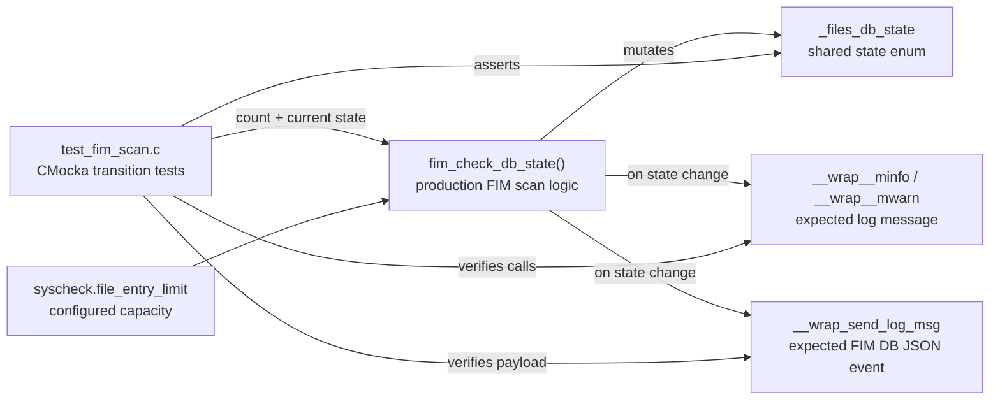
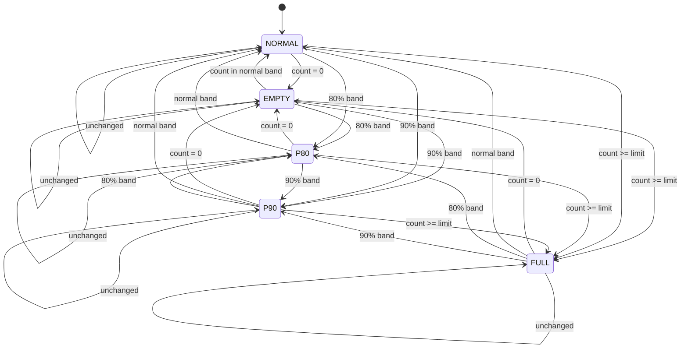
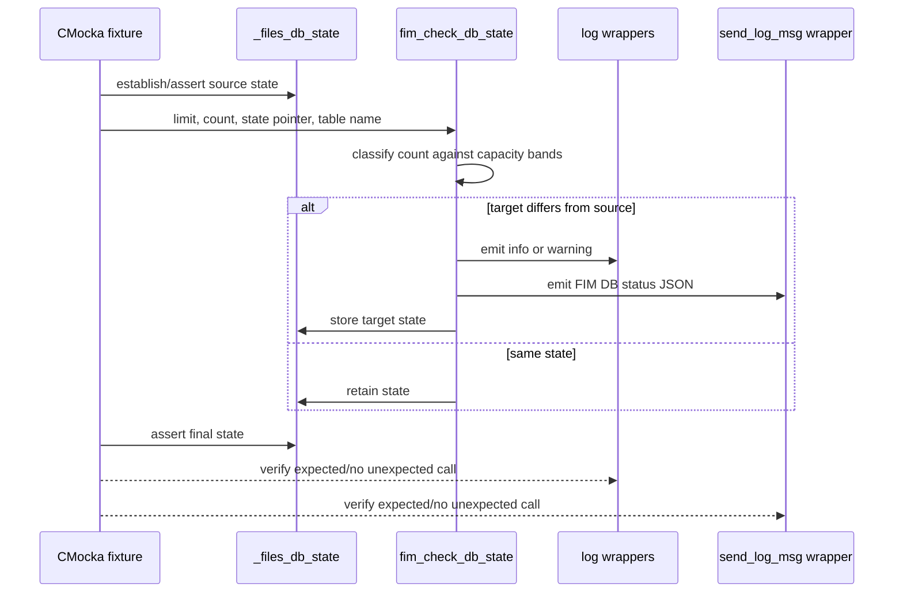
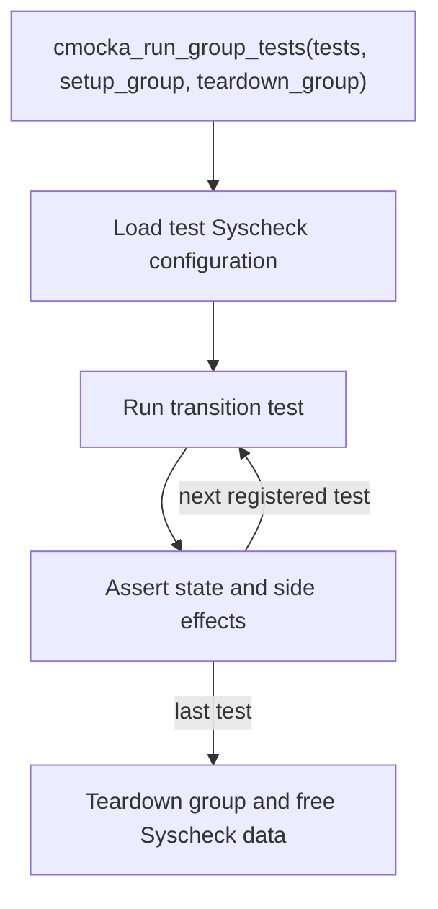

# `fim_check_db_state_tests`

## Introduction

`fim_check_db_state_tests` is the focused CMocka test module for the File Integrity Monitoring (FIM) database-capacity state machine. It verifies that `fim_check_db_state()` classifies the current `file_entry` count, updates the shared `_files_db_state`, and emits a status message only when the database crosses a capacity boundary.

The tests exercise the state transitions used during scheduled FIM scans. The broader daemon architecture, scan orchestration, and DBSync persistence layer are documented in [Syscheck / FIM Daemon](Syscheck___FIM_Daemon_(C_C++).md). This document deliberately describes only the test module and its direct contract.

## Scope and location

The module is represented by the `fim_check_db_state_*` functions in `src/unit_tests/syscheckd/test_fim_scan.c`. In the supplied module tree it is a child of the `test_fim_scan` test suite under `Unit_Tests_-_Syscheck_FIM`.

The production function under test is implemented by the FIM scan engine in `src/syscheckd/src/fim_scan.c`:

```c
fim_check_db_state(syscheck.file_entry_limit,
                   file_count,
                   &_files_db_state,
                   FIMDB_FILE_TABLE_NAME);
```

The test fixture loads Syscheck configuration before the group runs, making `syscheck.file_entry_limit` available. Individual tests then supply representative counts and assert the resulting enum value and, for changed states, the logging/event side effects.

## Architecture



### Direct dependencies

| Dependency | Role in this module |
|---|---|
| `src/unit_tests/syscheckd/test_fim_scan.c` | Defines the test cases, fixtures, global-state setup, and CMocka registration. |
| `src/syscheckd/src/fim_scan.c` | Provides `fim_check_db_state()` and the FIM database-state enum/global used by the tests. |
| `syscheck.file_entry_limit` | Supplies the configured maximum number of file entries. The principal fixture value is 50,000. |
| `FIMDB_FILE_TABLE_NAME` | Identifies the database table in emitted status events. |
| CMocka | Runs tests and provides assertions, setup/teardown, and mock expectations. |
| Logging and event wrappers | Capture informational/warning messages and `send_log_msg()` calls without requiring live daemon outputs. |

The production FIM database and scan dependencies are not reimplemented here; follow [Syscheck / FIM Daemon](Syscheck___FIM_Daemon_(C_C++).md) and its linked `syscheckd_db` documentation for those components.

## State model

The tests cover five logical states:

| State | Representative count with a 50,000-entry limit | Meaning |
|---|---:|---|
| `FIM_STATE_DB_EMPTY` | `0` | No file entries are present. |
| `FIM_STATE_DB_NORMAL` | `10,000` or `20,000` | Database is below the alert thresholds. |
| `FIM_STATE_DB_80_PERCENTAGE` | `41,000` | Database has reached the 80% warning band used by the suite. |
| `FIM_STATE_DB_90_PERCENTAGE` | `46,000` | Database has reached the 90% warning band used by the suite. |
| `FIM_STATE_DB_FULL` | `50,000` (also tested with `60,000`) | Database is at or beyond its configured limit. |

The exact threshold calculation remains an implementation detail of `fim_check_db_state()`; the values above are the observable boundary fixtures used by this test module.



## Test inventory

The 25 functions in the module tree form a transition matrix. Every source state is tested against every target state, including the five same-state cases.

| Source state | Tested target states |
|---|---|
| Empty | Empty, Normal, 80%, 90%, Full |
| Normal | Empty, Normal, 80%, 90%, Full |
| 80% | Empty, Normal, 80%, 90%, Full |
| 90% | Empty, Normal, 80%, 90%, Full |
| Full | Empty, Normal, 80%, 90%, Full |

Each test follows the same pattern:

1. Assert the expected current value of `_files_db_state`.
2. Configure logger/event expectations when the target differs from the source.
3. Call `fim_check_db_state()` with the configured limit and representative count.
4. Assert the new `_files_db_state`.

Same-state tests intentionally install no log or event expectation. Their purpose is to prove that repeated observations do not generate duplicate status notifications.

## Notification contract

When the state changes, the function emits a human-readable message and a JSON status event. The tests validate both channels:

| Target condition | Log wrapper | Event fields asserted |
|---|---|---|
| 80% | `__wrap__minfo`, code `6038` | `fim_db_table=file_entry`, `file_limit=50000`, `file_count=41000`, `alert_type=80_percentage` |
| 90% | `__wrap__minfo`, code `6040` | Same table/limit, `file_count=46000`, `alert_type=90_percentage` |
| Full | `__wrap__mwarn`, code `6926` | Same table/limit, `file_count=50000`, `alert_type=full` |
| Recovery to normal/empty | `__wrap__minfo`, code `6036` | Same table/limit, current count, `alert_type=normal` |

The JSON is sent through `send_log_msg()` and the tests configure it to return success. This isolates the state machine from the live logging pipeline.

## Data flow for one test



## Execution and ordering



The source registers these tests in the parent `tests[]` array, so they execute as part of the broader `test_fim_scan` group rather than as a separate CMocka group. The tests assert a specific starting state and then leave the global state at their target state; therefore, fixture initialization and registration order are important when maintaining this suite. If isolation is changed, preserve the explicit source-state assertions or reset `_files_db_state` in setup.

The parent file also contains an adjacent database-count error-path test (`test_fim_check_db_state_nodes_count_database_error`) that is not listed in the supplied component list for this focused module. It verifies that a `-1` count does not change the current state or emit a normal capacity transition.

## Maintenance guidance

- Update the representative counts if the production threshold policy changes, and keep the state-transition matrix complete.
- For a new externally visible state, add all source-to-target combinations, including the same-state case.
- Keep log text, message codes, table name, count, limit, and `alert_type` assertions synchronized with the production notification contract.
- Prefer wrapper expectations over live daemon/database dependencies; this module tests classification and notification decisions, not DBSync persistence.
- Use the broader [Syscheck / FIM Daemon](Syscheck___FIM_Daemon_(C_C++).md) documentation for changes to scan orchestration, database transactions, real-time monitoring, or event consumers.

## Related documentation

- [Syscheck / FIM Daemon](Syscheck___FIM_Daemon_(C_C++).md) — production FIM architecture and component relationships.
- [Syscheck configuration](Syscheck_Config.md) — configuration structures that provide `file_entry_limit` and related FIM settings.
- [FIM scan test infrastructure](test_fim_scan_test_infrastructure.md) — shared fixtures, wrappers, and setup patterns for the parent test suite.
