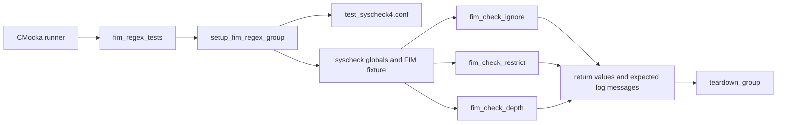
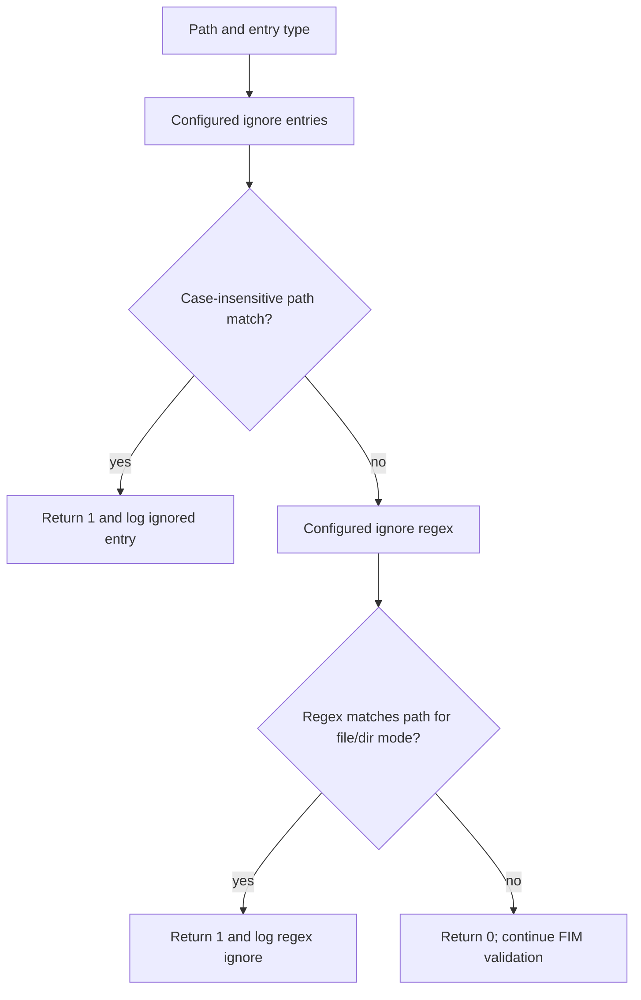
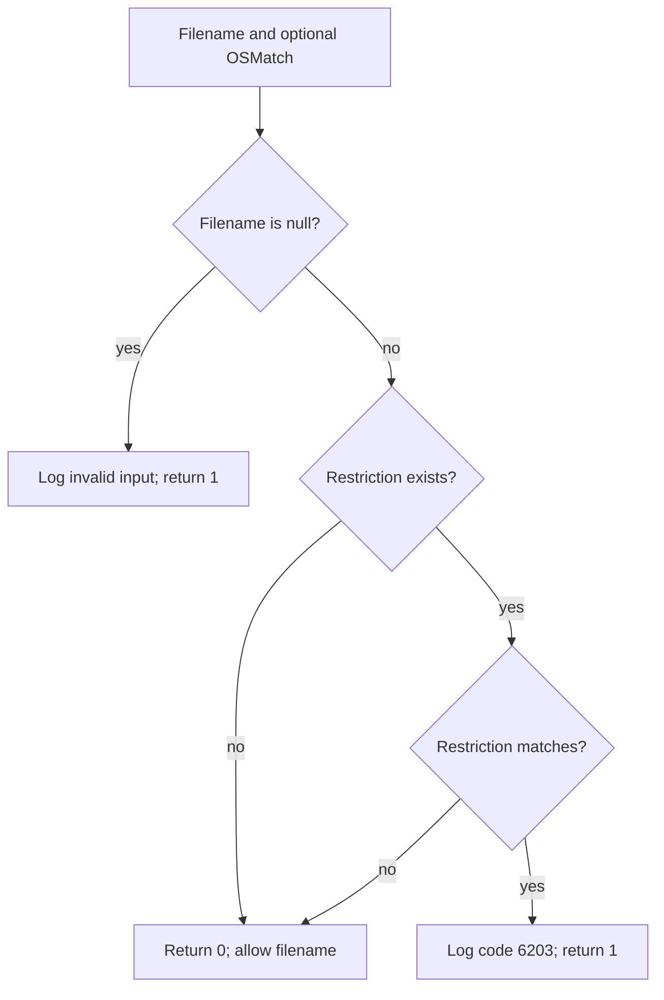
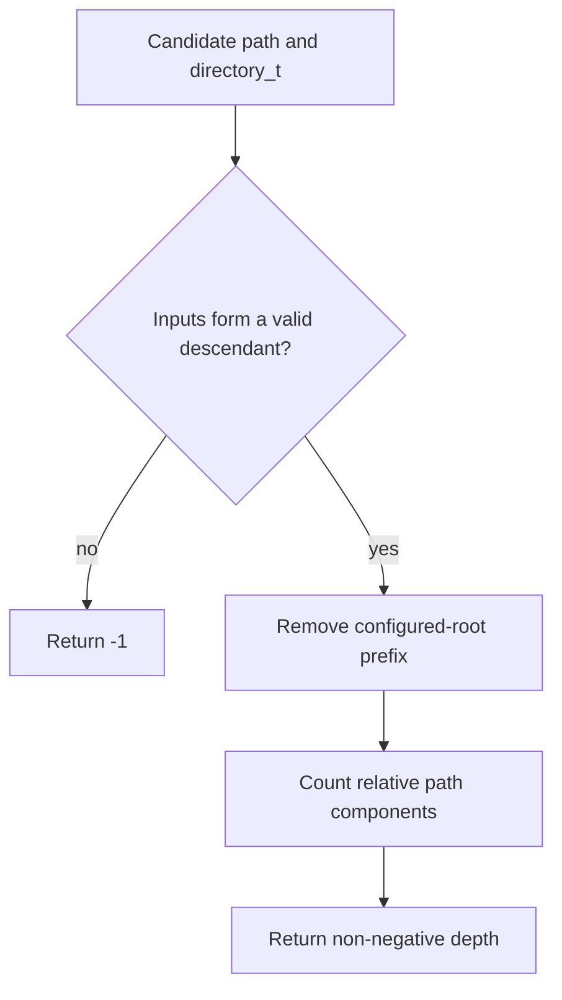
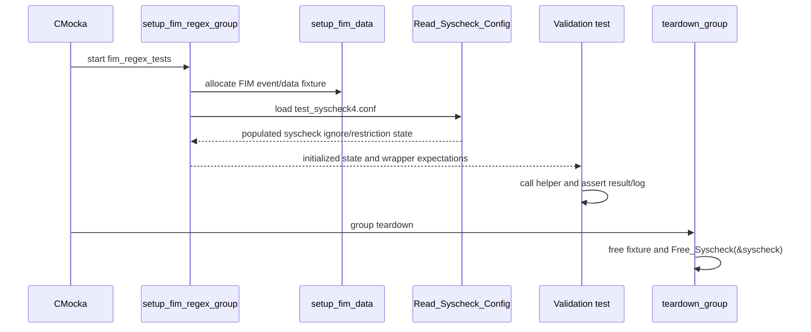
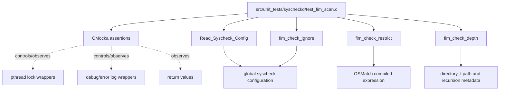

# `fim_check_validation_tests`

## Introduction

`fim_check_validation_tests` is the focused CMocka test group for the validation helpers used by Wazuh File Integrity Monitoring (FIM). The tests live in `src/unit_tests/syscheckd/test_fim_scan.c` and exercise `fim_check_ignore()`, `fim_check_restrict()`, and `fim_check_depth()` against fixture-backed syscheck configuration.

The group verifies the boundary decisions that occur before FIM scans inspect or persist a path: whether a path is ignored, rejected by a restriction, or outside the configured recursion depth. It does not duplicate the broader scan, database, event, or test-harness documentation; see [the shared FIM scan test infrastructure](test_fim_scan_test_infrastructure.md), [the `fim_checker` tests](fim_checker_tests.md), and [the FIM daemon](Syscheck___FIM_Daemon_(C_C++).md).

## Scope and module position

The target group is `fim_regex_tests`, registered in `main()` as:

```c
cmocka_run_group_tests(fim_regex_tests, setup_fim_regex_group, teardown_group);
```

Although the source file contains many other test groups, this module contains only the following eleven test symbols:

| Area | Tests | Contract exercised |
| --- | --- | --- |
| Ignore matching | `test_fim_check_ignore_strncasecmp` | Case-insensitive configured ignore matching. |
| Ignore matching | `test_fim_check_ignore_regex_file` | Regex ignore matching for regular files. |
| Ignore matching | `test_fim_check_ignore_regex_directory` | Regex ignore matching for directories. |
| Ignore matching | `test_fim_check_ignore_failure` | Non-matching paths remain scannable. |
| Restriction matching | `test_fim_check_restrict_success` | A path not matching a restriction is accepted. |
| Restriction matching | `test_fim_check_restrict_failure` | A matching restriction rejects the path and logs the reason. |
| Restriction validation | `test_fim_check_restrict_null_filename` | A null filename is rejected safely. |
| Restriction validation | `test_fim_check_restrict_null_restriction` | No restriction means the path is accepted. |
| Depth validation | `test_fim_check_depth_success` | A descendant path returns its relative depth. |
| Depth validation | `test_fim_check_depth_failure_strlen` | An unrelated path returns `-1`. |
| Depth validation | `test_fim_check_depth_failure_null_directory` | The configured root itself has no descendant depth and returns `-1`. |



## Responsibilities of the production helpers

### `fim_check_ignore`

The helper decides whether a path should be skipped by FIM ignore configuration. The tests cover two matching families:

- a configured path comparison that accepts case differences (`/EtC/dumPDateS` matches the configured `/etc/dumpdates` on Unix; the Windows branch similarly exercises normalized system paths); and
- regular-expression ignores for both regular files and directories.

Its observable return contract in this group is:

| Return value | Meaning in the tests |
| --- | --- |
| `1` | The path is ignored and should not proceed through normal FIM processing. |
| `0` | No ignore rule matched; the path remains eligible for scanning. |

Successful matches are verified with the corresponding debug message. The file test expects the configured `FIM_IGNORE_SREGEX` message for a `.swp` path; the directory test uses the directory mode and a `test_dir` expression. The failure case uses `/test/files/test.sp` and confirms that a non-matching suffix returns `0`.



### `fim_check_restrict`

Restrictions are exclusion expressions applied to a candidate filename. The tests compile an `OSMatch` expression for `test$` and use `fim_check_restrict()` to verify the inverted decision:

| Input | Expected result | Interpretation |
| --- | --- | --- |
| `my_test`, restriction `test$` | `0` | The filename is allowed by the restriction check. |
| `my_test_`, restriction `test$` | `1` | The filename is rejected because it matches the restriction. |
| `NULL`, valid restriction | `1` | Invalid filename input is rejected safely and logs error `1105`. |
| `my_test`, `NULL` restriction | `0` | An absent restriction imposes no exclusion. |

The failure test also verifies the `(6203)` diagnostic, including both the rejected path and the restriction expression. This is important because callers need an explainable skip decision when a restriction removes an otherwise discoverable path.



### `fim_check_depth`

The depth helper compares a candidate path with a configured monitored directory and calculates the candidate’s relative depth. The success case uses a four-level configured path and expects `3` for a file nested three path components below the configured root.

The two negative cases are deliberately distinct:

- `test_fim_check_depth_failure_strlen` supplies a path unrelated to `/usr/bin`; the common-prefix/relative-path calculation cannot produce a valid depth and returns `-1`.
- `test_fim_check_depth_failure_null_directory` has a candidate equal to the configured root. Despite its name, it does not pass a null directory pointer. It verifies that the root itself is not reported as a descendant and returns `-1`.



## Test lifecycle and fixtures

`setup_fim_regex_group()` is the group-specific setup. It delegates to `setup_fim_data()`, enables the test mode needed by wrapped runtime code, permits debug logging expectations, establishes lock expectations, and loads `test_syscheck4.conf` through `Read_Syscheck_Config()`. It then sets deterministic runtime values:

- `syscheck.rt_delay = 1`;
- `syscheck.max_depth = 256`;
- `syscheck.file_max_size = 1024`.

The fixture configuration supplies the ignore and regex rules used by the test inputs. The tests intentionally assert the behavior and messages derived from that fixture rather than reproducing configuration parsing in every test.



The tests rely on the common harness for the lifetime of global lists, locks, and FIM data. Details of those allocations and wrapper conventions are documented in [test_fim_scan_test_infrastructure](test_fim_scan_test_infrastructure.md).

## Dependency and interaction architecture

The validation tests call production helpers directly. CMocka wrappers are used mainly for configuration loading, synchronization, and logging; filesystem traversal and database operations belong to other groups in the same translation unit and are not part of this module’s assertions.



The helpers are part of the FIM scan decision layer. They are consumed by higher-level scan orchestration such as `fim_checker()`, which then chooses file processing, directory traversal, missing-entry processing, or an early return. See [fim_checker_tests](fim_checker_tests.md) for those orchestration decisions and [syscheckd core scan engine](syscheckd_core_scan_engine.md) for the production scan pipeline.

## Cross-platform behavior

The source uses `#ifdef TEST_WINAGENT` branches, so this module validates both Unix-like and Windows-specific path behavior:

- Unix tests use POSIX-style paths and case-insensitive matching inputs such as `/EtC/dumPDateS`.
- Windows tests expand environment variables such as `%WINDIR%`, normalize paths to lowercase, and use Windows-style separators.
- The helper contracts remain the same across platforms: ignore matches return `1`, non-matches return `0`; restrictions reject with `1`; valid relative depths are non-negative and invalid relationships return `-1`.

The platform branches are test adaptations, not separate policies. They ensure that normalization and platform-specific path construction do not change the validation decisions.

## Coverage and maintenance guidance

When changing ignore, restriction, or depth behavior, update the relevant focused test before relying on the broader `fim_checker` suite. In particular:

1. Preserve both positive and negative ignore cases. A new ignore rule must not accidentally make the `.sp` negative case match.
2. Keep the restriction tests aligned with the return-value inversion: a matching restriction is a rejection (`1`), while no restriction or a non-match is allowed (`0`).
3. Add depth cases for path-boundary behavior if prefix handling changes; `/usr/bin2` must not be treated as a descendant of `/usr/bin`.
4. Keep expected diagnostic messages synchronized with production constants such as `FIM_IGNORE_ENTRY`, `FIM_IGNORE_SREGEX`, and the restriction diagnostic.
5. Preserve both Unix and Windows branches when modifying path normalization or matching code.

The test group is deterministic only when fixture configuration, wrapper expectations, and global-state teardown remain paired. Changes to `setup_fim_regex_group()` should therefore be reviewed alongside [the shared test infrastructure](test_fim_scan_test_infrastructure.md), not only the individual assertions.

## References

- [FIM scan test infrastructure](test_fim_scan_test_infrastructure.md)
- [`fim_checker` tests](fim_checker_tests.md)
- [FIM daemon architecture](Syscheck___FIM_Daemon_(C_C++).md)
- [FIM scan engine](syscheckd_core_scan_engine.md)
- [Syscheck configuration](Syscheck_Config.md)
- [FIM file processing](syscheckd_file.md)
