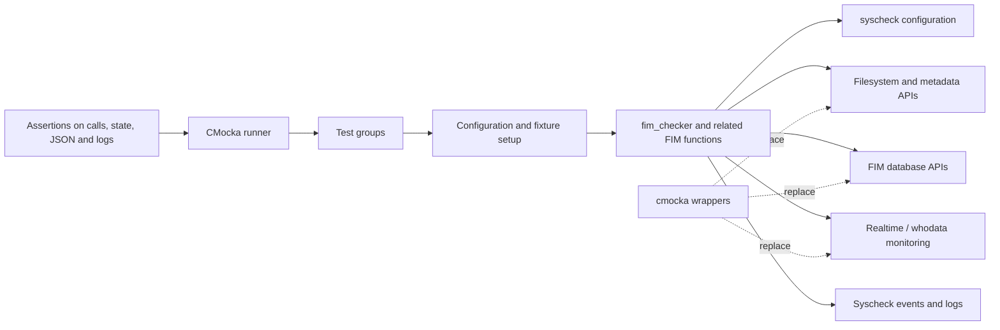
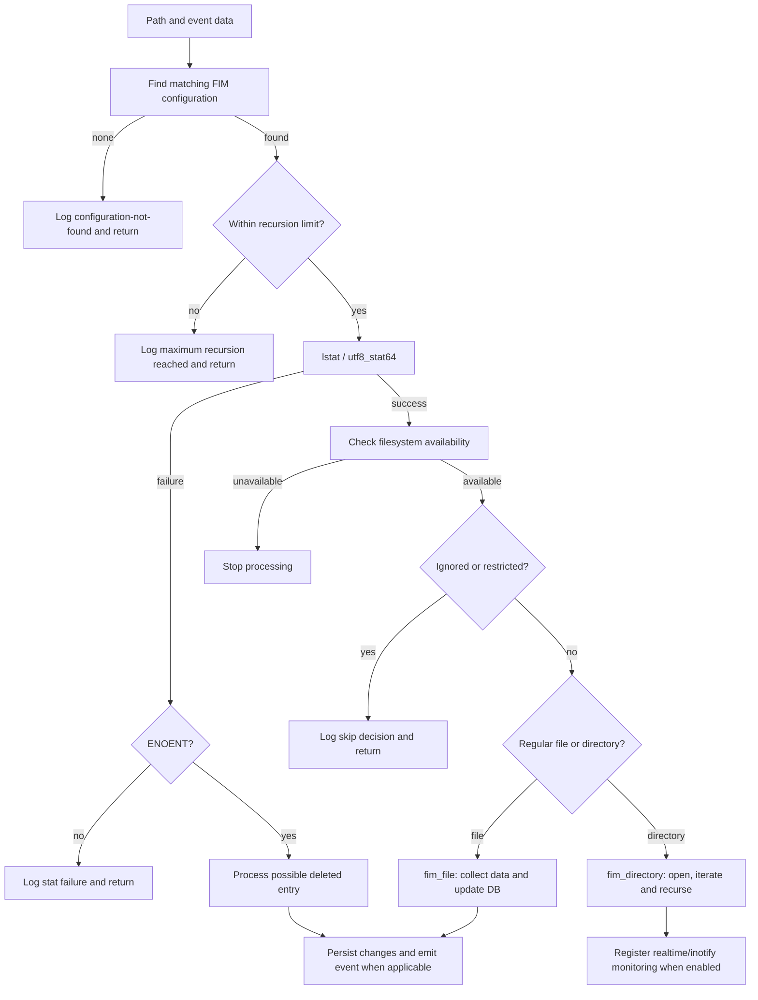
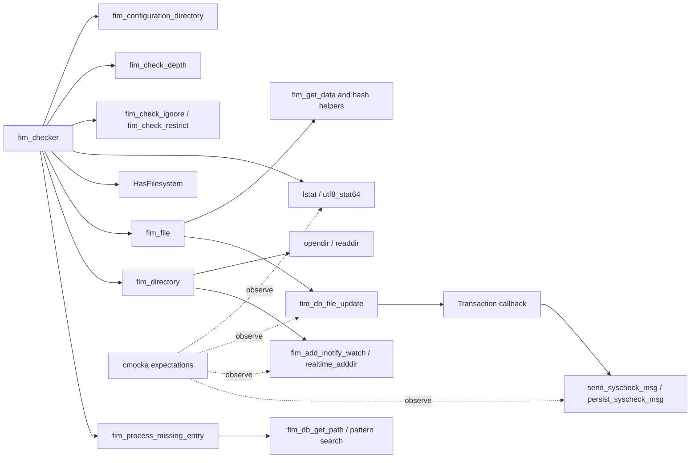
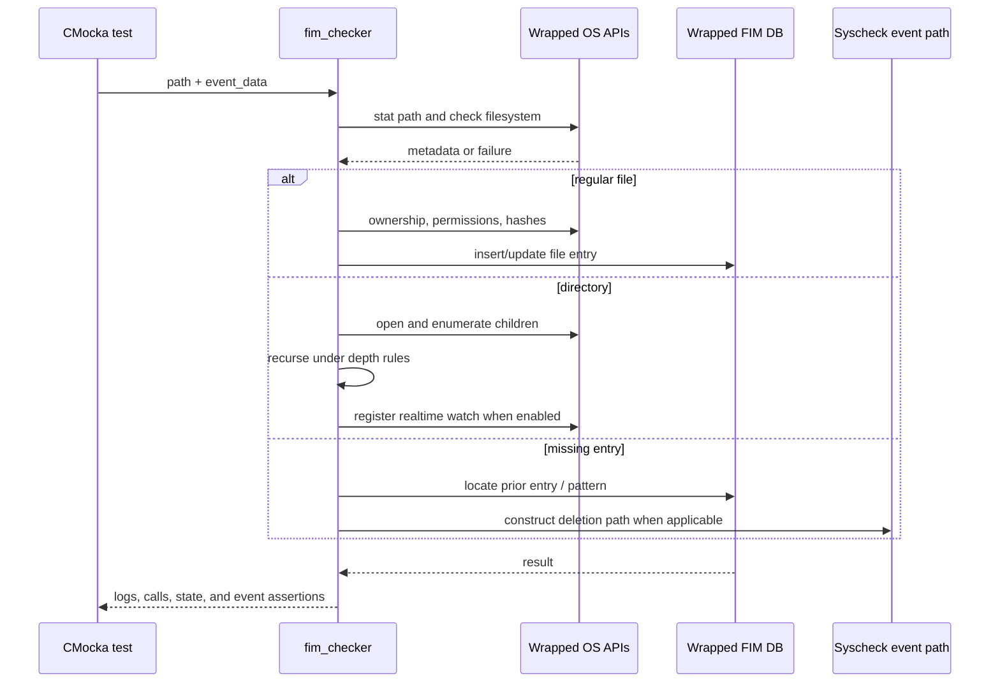

# `fim_checker_tests`

## Introduction

`fim_checker_tests` is the CMocka unit-test module for Wazuh File Integrity Monitoring (FIM) scan orchestration. Its primary subject is `fim_checker()` in `src/unit_tests/syscheckd/test_fim_scan.c`, but the same test translation unit also covers directory traversal, metadata collection, scheduled scans, realtime and whodata events, FIM database state transitions, transaction callbacks, wildcard configuration, and FIM event serialization.

The tests validate observable behavior through isolated fixtures and wrapped dependencies. They assert filesystem calls, synchronization, database operations, generated log messages, event types, and serialized JSON rather than relying on a live filesystem or database.

For production behavior, see [syscheckd core documentation](syscheckd_core.md), [FIM database documentation](syscheckd_db.md), and [FIM file handling documentation](syscheckd_file.md).

## Module position

The test module sits at the boundary between the syscheckd orchestration layer and the platform/database services used to inspect and persist file state.



The production modules are intentionally referenced rather than re-described here:

- [syscheckd core](syscheckd_core.md) — configuration matching, scan orchestration, and FIM coordination.
- [syscheckd realtime support](syscheckd_core_realtime.md) — watches, queue overflow, and realtime directory registration.
- [syscheckd database](syscheckd_db.md) — file-entry lookup, update, deletion, and transactions.
- [syscheckd file processing](syscheckd_file.md) — metadata and hash extraction.
- [syscheckd whodata](syscheckd_whodata.md) — audit/whodata event processing.

## Test execution architecture

`main()` runs four CMocka groups. The first is the broad integration-style unit group; the remaining groups use specialized configuration fixtures for regex ignores, root-level recursion, and wildcard expansion.

```mermaid
flowchart TD
    Main[main()] --> Broad[tests]
    Main --> Regex[fim_regex_tests]
    Main --> Root[root_monitor_tests]
    Main --> Wildcards[wildcards_tests]

    Broad --> G1[setup_group / teardown_group]
    Regex --> G2[setup_fim_regex_group]
    Root --> G3[setup_root_group]
    Wildcards --> G4[setup_wildcards / teardown_wildcards]

    G1 --> FIM[Configuration, locks, DB and runtime fixtures]
    G2 --> RCFG[test_syscheck4.conf]
    G3 --> TOP[test_syscheck_top_level.conf]
    G4 --> WCFG[Wildcard and directory lists]
```

### Fixtures and isolation

| Fixture | Responsibility | Main consumers |
| --- | --- | --- |
| `setup_group` | Loads the normal syscheck configuration and initializes shared FIM state, limits, and removed-entry tracking. | Broad test group |
| `setup_fim_data` | Creates event, whodata, FIM entry, old/new metadata, and directory-entry objects. | Missing-entry, whodata, and callback tests |
| `setup_fim_entry` | Creates a file entry and baseline local metadata. | File, deletion, and DB-entry tests |
| `setup_struct_dirent` | Provides a controllable directory entry for `readdir()`. | Directory traversal tests |
| `setup_fim_scan_*` | Configures database limits, scan state, or realtime queue state. | `fim_scan()` tests |
| `setup_transaction_callback` | Creates callback context and JSON database events. | Insert, modify, delete, and full-DB callbacks |
| `setup_json_event_attributes` | Supplies DB JSON and output objects for attribute serialization. | `fim_attributes_json()` tests |
| `setup_fim_regex_group` | Loads ignore-regex configuration. | `fim_check_ignore()` tests |
| `setup_root_group` | Loads top-level monitoring configuration. | Root recursion tests |
| `setup_wildcards` | Builds wildcard and resolved-directory lists. | Wildcard update/removal tests |

Most external calls are wrapped. The test controls return values for `lstat()`/`utf8_stat64()`, `HasFilesystem()`, directory iteration, hashing, user/group lookup, inotify/realtime registration, FIM DB calls, locks, and logging. This makes failure paths deterministic and keeps tests independent from the host operating system.

## `fim_checker()` behavior under test

`fim_checker()` receives a path and an event context, resolves the applicable directory configuration, enforces depth and ignore/restriction rules, inspects the path, and dispatches to file or directory processing.



### Core `fim_checker` test matrix

| Test | Scenario | Evidence asserted |
| --- | --- | --- |
| `test_fim_checker_scheduled_configuration_directory_error` | Scheduled event has no matching configured path. | Configuration-not-found debug message and synchronization activity. |
| `test_fim_checker_not_scheduled_configuration_directory_error` | Realtime event has no matching configured path. | Same safe early return for a non-scheduled event. |
| `test_fim_checker_over_max_recursion_level` | A path exceeds configured recursion depth. | Maximum-depth message; no file inspection is attempted. |
| `test_fim_checker_deleted_file` | `lstat` fails with a non-`ENOENT` error. | Stat-error message and no false deletion processing. |
| `test_fim_checker_deleted_file_enoent` | `lstat` reports a missing path while change reporting is enabled. | DB lookup and deleted-entry path are exercised. |
| `test_fim_checker_no_file_system` | Linux-only filesystem check fails. | `HasFilesystem` failure terminates processing. |
| `test_fim_checker_fim_regular` | Configured regular file is present. | Stat, filesystem check, ownership lookup, and DB update. |
| `test_fim_checker_fim_regular_warning` | Regular file completes with warning-oriented fixture behavior. | Normal inspection path and DB update calls. |
| `test_fim_checker_fim_regular_ignore` | Path matches an ignore rule. | Ignore message; file data is not persisted. |
| `test_fim_checker_fim_regular_restrict` | Path is excluded by a restriction pattern. | Restriction message identifying the matching pattern. |
| `test_fim_checker_fim_directory` | Configured directory contains a child. | Directory reads, child inspection, and monitor registration. |
| `test_fim_checker_fim_directory_on_max_recursion_level` | Child directory reaches the configured limit. | Child is skipped with the max-recursion message. |
| `test_fim_checker_root_ignore_file_under_recursion_level` | Root configuration rejects a path below its allowed depth. | Root-level recursion guard. |
| `test_fim_checker_root_file_within_recursion_level` | Root-level file remains within the configured depth. | Normal stat, metadata, and DB update path. |

The tests generally verify side effects and wrapper calls rather than a return value from `fim_checker()`. That reflects the function’s role as an orchestrator: the meaningful contract is whether the correct downstream operation was selected and whether invalid paths were safely rejected.

## Dependency and interaction model



The wrapper layer also models platform variation. POSIX builds use `lstat`, POSIX ownership lookup, and filesystem/inotify helpers. Windows builds compile with `TEST_WINAGENT`, expand environment variables, normalize paths, use `utf8_stat64`, and validate Windows ACL/attribute extraction.

## Data flow and event flow



## Additional coverage in the same module

Although the module is named for `fim_checker`, `test_fim_scan.c` is a broad FIM behavior suite:

| Area | Covered behavior |
| --- | --- |
| Scan lifecycle | `fim_scan()` start/end logging, directory scans, double-scan behavior, no-limit operation, full database handling, and realtime queue-overflow sanitization. |
| Database state | Transitions among normal, empty, 80%, 90%, and full states; recovery transitions; and database count errors. Threshold transitions emit informational/warning logs and structured FIM status messages. |
| File data | Metadata, permissions, ownership, timestamps, inode/device, optional MD5/SHA1/SHA256 hashes, and hash/Windows ACL failures. |
| Directory handling | Null paths, `opendir` failures, `.`/`..` filtering, child traversal, and recursion limits. |
| Events | Realtime and whodata events for existing and missing files, missing-entry processing, and deleted-entry lookup. |
| Transactions | Insert, modify, delete, unchanged modification, report-changes, and maximum-row behavior; callbacks send and persist syscheck messages. |
| Serialization | FIM attributes, audit data, DB sync differences, and platform-specific permission representation. |
| Configuration | Case-insensitive and regex ignores, restrictions, root monitoring, wildcard expansion, wildcard removal, and null wildcard configuration. |

## Platform-specific behavior

The source has compile-time branches for Unix-like systems and Windows:

- Unix tests use POSIX paths, `lstat`, `get_user`/`get_group`, inotify, and filesystem checks.
- Windows tests use environment-variable paths such as `%WINDIR%`, expand and lowercase paths, use `utf8_stat64`, and validate ACL JSON and file attributes.
- Some tests are excluded from Windows or Unix builds where the underlying behavior is platform-specific, such as the Linux filesystem-availability test.
- Expectations deliberately allow different lock ordering where the implementation differs between platforms.

## Running and extending the tests

Build and run the project’s syscheckd unit-test target that compiles `src/unit_tests/syscheckd/test_fim_scan.c`. The test binary itself runs the four CMocka groups described above. For Windows coverage, compile the corresponding `TEST_WINAGENT` variant.

When adding a case:

1. Choose the narrowest existing fixture group that represents the behavior.
2. Wrap every filesystem, database, monitor, and logging dependency whose result affects the branch.
3. Assert the externally visible decision: downstream call, event type, state transition, or diagnostic message.
4. Restore modified global configuration, directory options, recursion levels, errno, and allocated objects in teardown.
5. Add both Unix and Windows expectations when the branch is shared but path or metadata representation differs.

Common maintenance risks are leaking fixture-owned JSON or FIM records, leaving `CHECK_SEECHANGES` or recursion settings enabled for later tests, and asserting a platform-specific lock order in a cross-platform test.

## References

- [Syscheckd core](syscheckd_core.md)
- [Syscheckd realtime support](syscheckd_core_realtime.md)
- [Syscheckd database](syscheckd_db.md)
- [Syscheckd file processing](syscheckd_file.md)
- [Syscheckd whodata](syscheckd_whodata.md)
- [Test infrastructure](test_infrastructure.md)

