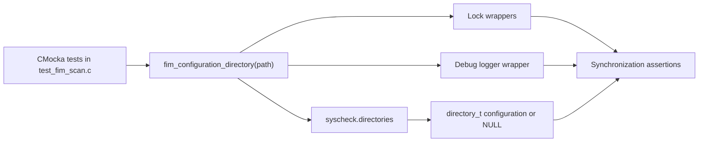
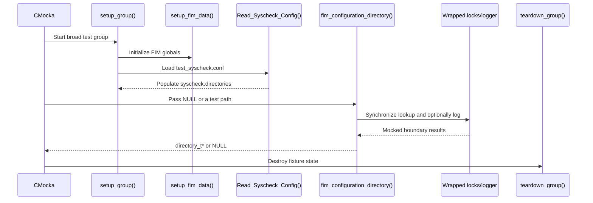
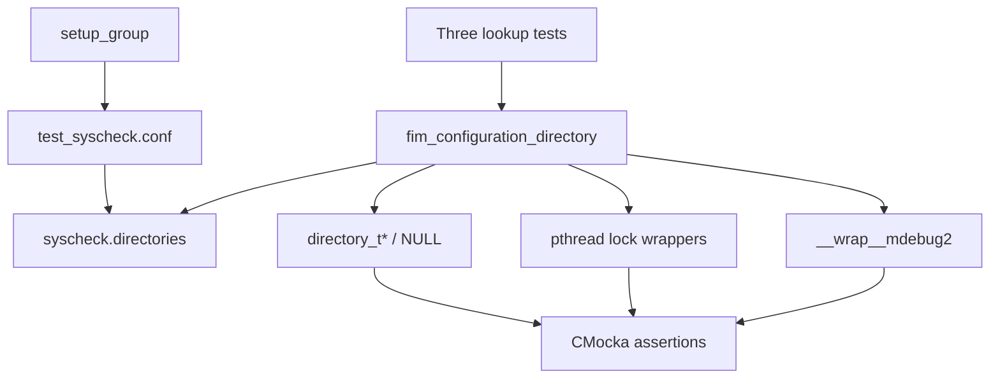
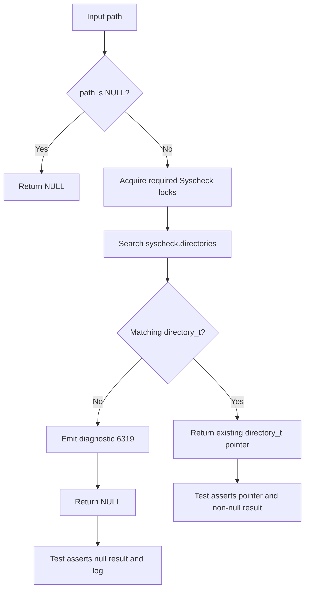
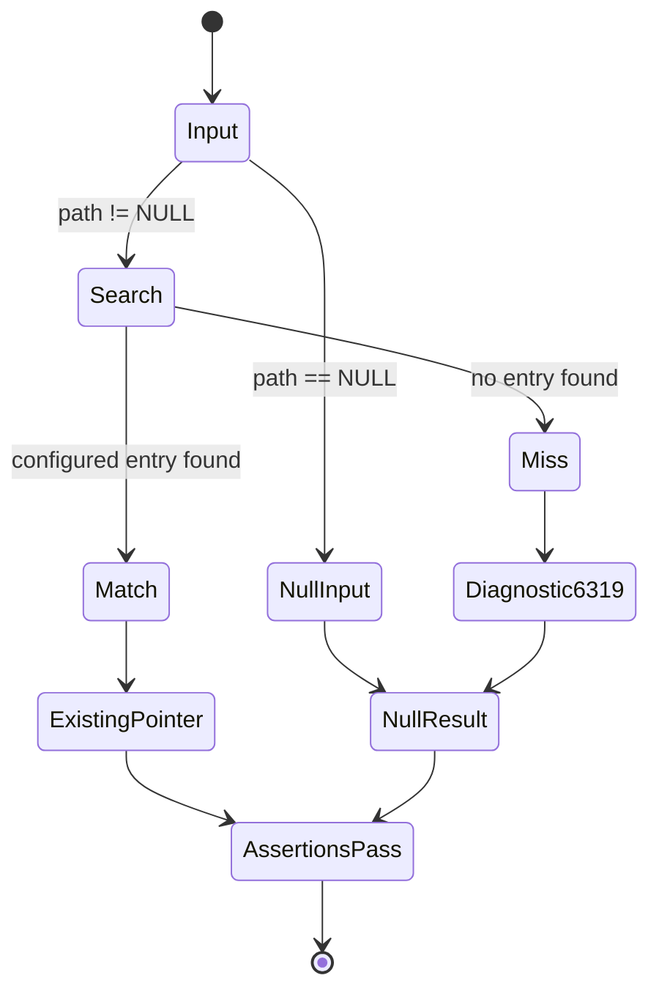

# `fim_configuration_directory_tests`

`fim_configuration_directory_tests` is the focused CMocka coverage for the FIM configuration lookup helper `fim_configuration_directory()`. It verifies safe handling of a null path, resolution of a configured directory, and the diagnostic and null result produced when no configuration matches. The tests are part of `src/unit_tests/syscheckd/test_fim_scan.c`; they validate lookup behavior without accessing a real filesystem or database.

## Scope and role

The module tests the boundary between a FIM event path and the global Syscheck directory configuration. The helper searches `syscheck.directories`, which is populated by the shared Syscheck fixture. This page documents only the lookup cases; traversal, scan orchestration, and wildcard refresh are documented in [FIM directory tests](fim_directory_tests.md), [FIM checker tests](fim_checker_tests.md), and [wildcard configuration tests](wildcards_config_tests.md).



## Test fixture and lifecycle

The three tests belong to the broad `tests[]` CMocka group. `setup_group` initializes shared FIM state through `setup_fim_data`, loads `test_syscheck.conf` with `Read_Syscheck_Config`, sets scan defaults, and creates the removed-entry list. The configuration provides the directory entries searched by the helper. Group teardown releases the shared state after the tests complete.



## Components and dependencies

| Component | Role in these tests |
| --- | --- |
| `test_fim_scan.c` | Defines the three test functions, shared setup, and registration in `tests[]`. |
| `fim_configuration_directory()` | Subject under test; maps a path to a configured `directory_t`. |
| `syscheck.directories` | Runtime configuration list searched by the helper. |
| `directory_t` | Configuration object returned for a match. |
| Lock wrappers | Verify access to shared Syscheck state is synchronized. |
| `__wrap__mdebug2` | Captures the missing-configuration diagnostic. |
| CMocka assertions | Check nullability, pointer identity, and expected diagnostics. |

The lookup depends on the Syscheck configuration structures and FIM runtime state; those implementation details should be read from the linked Syscheck documentation rather than duplicated here.



## Test cases

### Null path: `test_fim_configuration_directory_no_path`

The test calls `fim_configuration_directory(NULL)` and asserts that the result is `NULL`. This is the input-validation guard: a missing path must not be dereferenced, searched, or converted into a valid configuration.

### Configured path: `test_fim_configuration_directory_file`

The test supplies a path that is present in the fixture configuration:

- POSIX: `/media`.
- Windows: `%WINDIR%\\System32\\drivers\\etc`, expanded with `ExpandEnvironmentStrings()` and normalized to lowercase.

It expects the synchronization wrappers and asserts both a non-null result and pointer identity with `OSList_GetDataFromIndex(syscheck.directories, 3)`. Pointer identity is significant: the helper returns the existing configuration object from the list, rather than constructing a copy.

### Missing path: `test_fim_configuration_directory_not_found`

The test supplies `/invalid`, which is not configured. It expects the lock wrappers, the exact debug message

```text
(6319): No configuration found for (file):'/invalid'
```

and a `NULL` result. The case defines the observable failure contract for paths that cannot be associated with a FIM directory.

## Lookup data flow



The diagram represents behavior observed and asserted by the tests. It intentionally does not specify the helper’s internal matching algorithm; path normalization and matching policy belong to the production Syscheck implementation.

## Platform behavior

| Platform | Input preparation | Expected variation |
| --- | --- | --- |
| POSIX | Uses slash-separated `/media` and `/invalid` paths. | Uses the POSIX fixture configuration and lock expectations. |
| Windows | Expands the configured `%WINDIR%` path and lowercases it before lookup. | Uses Windows path normalization and the same match/miss contract. |

The platform branches test the same semantic API: configured paths resolve to an existing `directory_t`; invalid or absent paths return `NULL`. When changing path normalization, update both branches and their fixture configuration.

## Process and assertion contract



The tests are intentionally narrow. They do not assert file metadata, hashing, recursive traversal, realtime watches, or database updates. Those behaviors are covered by the related FIM test modules linked above.

## Maintenance guidance

When changing `fim_configuration_directory()`:

- Preserve the null-input test unless the public contract explicitly changes.
- Keep the found-path assertion on pointer identity if callers depend on shared configuration state.
- Update the exact diagnostic assertion if the user-visible message changes.
- Keep POSIX and Windows path preparation aligned with the configuration parser.
- Add matching tests for any new path normalization or configuration-list semantics instead of broadening these cases into traversal tests.

For broader context, see [Syscheck/FIM database integration](wazuh_db_fim_syscollector.md), [FIM file handling](syscheckd_file.md), and [FIM checker tests](fim_checker_tests.md).
