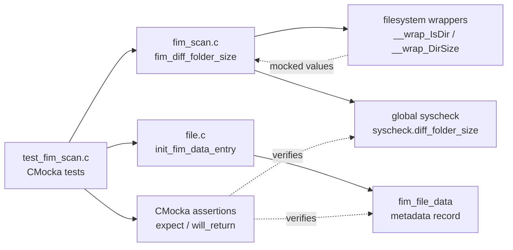
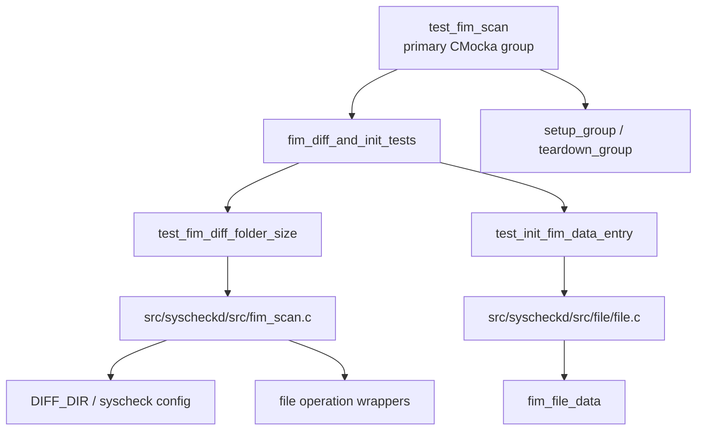
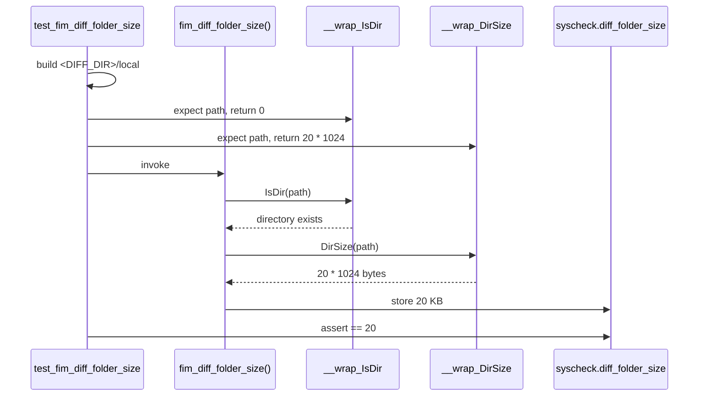
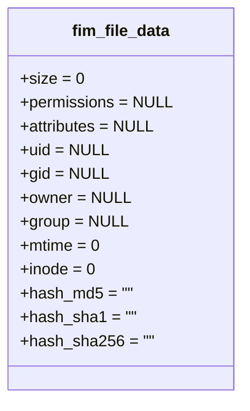
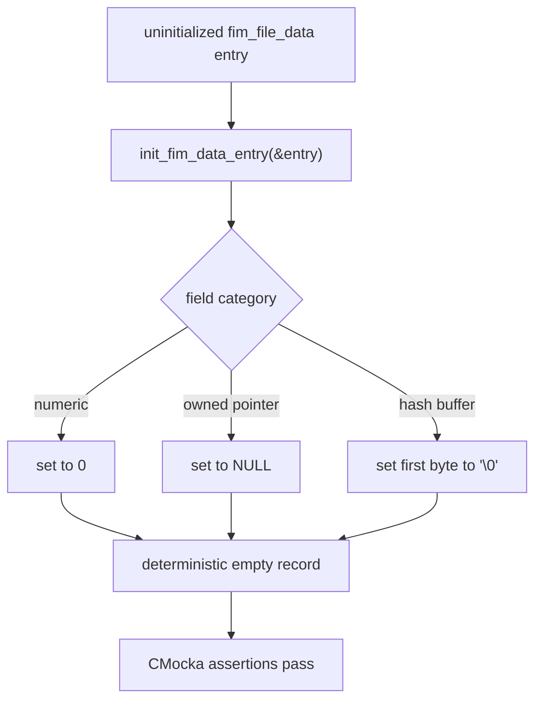
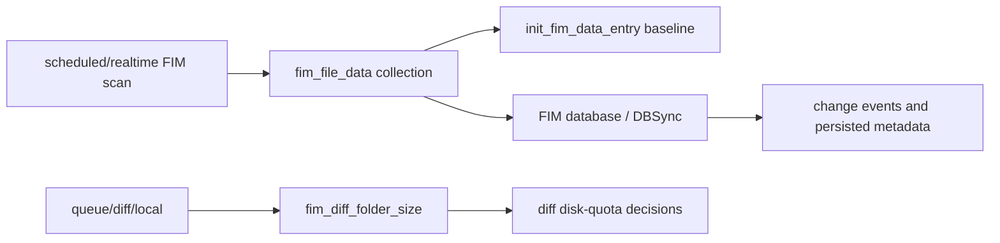

# `fim_diff_and_init_tests`

`fim_diff_and_init_tests` is the focused test group for two small but important FIM primitives: measuring the local diff directory and initializing a file-metadata record. Both tests are defined in `src/unit_tests/syscheckd/test_fim_scan.c`; the production helpers live in `src/syscheckd/src/fim_scan.c` and `src/syscheckd/src/file/file.c`.

The group validates boundary behavior used by the larger Syscheck/FIM scan engine without touching a real filesystem or requiring a populated FIM database.

## Scope and position

The module is a child of the broader `test_fim_scan` suite under `Unit_Tests_-_Syscheck_FIM`. It contains exactly two registered CMocka tests:

| Test | Production function | Contract verified |
|---|---|---|
| `test_fim_diff_folder_size` | `fim_diff_folder_size()` | Builds `<DIFF_DIR>/local`, reads its size, converts bytes to kilobytes, and stores the result in `syscheck.diff_folder_size`. |
| `test_init_fim_data_entry` | `init_fim_data_entry()` | Resets a `fim_file_data` record to a safe empty state. |

The surrounding fixture and test-runner behavior is documented in [`test_fim_scan_test_infrastructure.md`](test_fim_scan_test_infrastructure.md). The daemon-level scan flow is described in [`syscheckd_core_scan_engine.md`](syscheckd_core_scan_engine.md), while regular-file metadata and persistence are covered by [`syscheckd_file.md`](syscheckd_file.md) and [`syscheckd_db.md`](syscheckd_db.md).

## Architecture and dependencies



The tests deliberately call the production functions directly. Only their external filesystem boundary is mocked. `test_init_fim_data_entry` has no external dependency: it verifies the contents of a local structure after initialization.

### Component relationships



The two tests are registered in the suite's main `tests[]` array with `cmocka_unit_test(...)`. They run as part of the primary group, although neither test needs the per-test `fim_data_t` fixture used by more stateful tests.

## `test_fim_diff_folder_size`

### Purpose

This test protects the accounting used for the FIM diff quota. The production helper constructs the local diff path from the compile-time/runtime `DIFF_DIR` root and the `local` suffix, then records the directory size in the process-wide `syscheck` configuration.

The production implementation is equivalent to:

```c
diff_local = "<DIFF_DIR>/local";
if (IsDir(diff_local) == 0) {
    syscheck.diff_folder_size = DirSize(diff_local) / 1024;
}
```

The value is stored as kilobytes. The test supplies `20 * 1024` to the mocked `DirSize()` call and therefore expects `syscheck.diff_folder_size == 20`.

### Test setup and assertions

1. Allocate enough space for `DIFF_DIR + "/local" + NUL`.
2. Construct the expected path with `snprintf()`.
3. Expect `__wrap_IsDir()` to receive that exact path and return `0` (directory exists).
4. Expect `__wrap_DirSize()` to receive the same path and return `20 * 1024`.
5. Call `fim_diff_folder_size()`.
6. Assert that the global `syscheck.diff_folder_size` is `20`.
7. Free the locally allocated path.



### What this test does not cover

It does not exercise a missing directory, allocation failure, or a nonzero `IsDir()` result. Those are separate concerns and should be added as independent cases if the helper's behavior changes or becomes safety-critical. The current test is specifically a successful-path unit test for path construction, wrapper interaction, byte-to-kilobyte conversion, and global assignment.

## `test_init_fim_data_entry`

### Purpose

`init_fim_data_entry()` establishes the empty baseline for `fim_file_data`, the structure used to hold file attributes before a scan populates them. The test uses a stack object and verifies every field that the initializer promises to reset.

### Expected postcondition



The test asserts:

- numeric metadata (`size`, `mtime`, and `inode`) is zero;
- nullable string fields (`permissions`, `attributes`, `uid`, `gid`, `owner`, and `group`) are `NULL`;
- fixed-size hash buffers have a NUL byte at index zero, making them empty strings.

On Windows, the production structure also contains `perm_json`; the initializer sets it to `NULL`. The supplied test does not explicitly assert that platform-specific field, so a future platform-specific assertion could improve coverage without changing the portable test contract.



This initialization matters because later scan paths may conditionally free, compare, serialize, or populate these fields. A known empty state avoids stale pointers, accidental string reads, and false metadata differences.

## Data and control flow in the larger FIM system

These tests are small, but their outputs feed different parts of the native FIM pipeline:



`init_fim_data_entry` is a data-model invariant at the beginning of metadata handling. `fim_diff_folder_size` is a resource-accounting input used by scan and diff-generation logic. Neither test validates event generation, database transactions, recursion, or realtime watches; see the sibling focused documents for those behaviors, including [`fim_file_tests.md`](fim_file_tests.md), [`fim_check_db_state_tests.md`](fim_check_db_state_tests.md), and [`fim_realtime_whodata_tests.md`](fim_realtime_whodata_tests.md).

## Execution and maintenance notes

- Run the parent `test_fim_scan` binary or the CMocka-filtered test names to execute these cases.
- Keep the `IsDir` and `DirSize` expectations synchronized with the exact path formatting used by `DIFF_DIR` and the platform path separator.
- Preserve the `20 * 1024` fixture unless the production unit changes; it intentionally makes the `/ 1024` conversion observable.
- If `fim_file_data` gains a new field, update `init_fim_data_entry()` and extend this test to assert its empty value, especially for pointer or platform-specific fields.
- These tests depend on process-wide `syscheck` state. The parent suite's setup/teardown remains responsible for resetting that state between groups.

## References

- [`test_fim_scan_test_infrastructure.md`](test_fim_scan_test_infrastructure.md) — CMocka fixtures, wrappers, setup/teardown, and test registration.
- [`syscheckd_core_scan_engine.md`](syscheckd_core_scan_engine.md) — scheduled and realtime scan orchestration.
- [`syscheckd_file.md`](syscheckd_file.md) — file traversal, metadata collection, and event persistence.
- [`syscheckd_db.md`](syscheckd_db.md) — FIM database and DBSync integration.
- [`fim_file_tests.md`](fim_file_tests.md) — file add/modify behavior built on `fim_file_data`.
- [`fim_check_db_state_tests.md`](fim_check_db_state_tests.md) — database-capacity state transitions used during scans.
- [`fim_realtime_whodata_tests.md`](fim_realtime_whodata_tests.md) — realtime and Whodata event paths.
