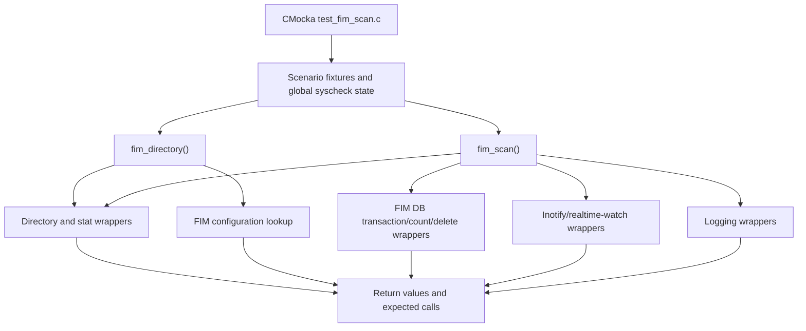
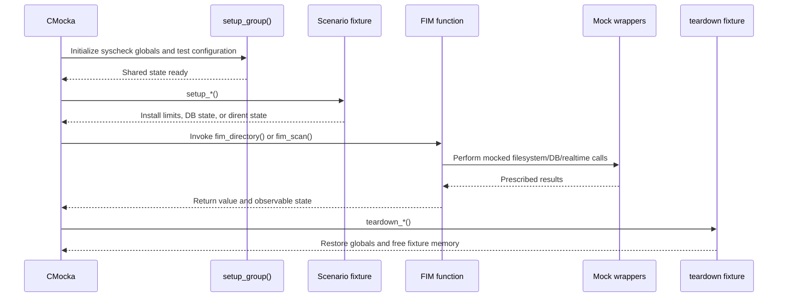
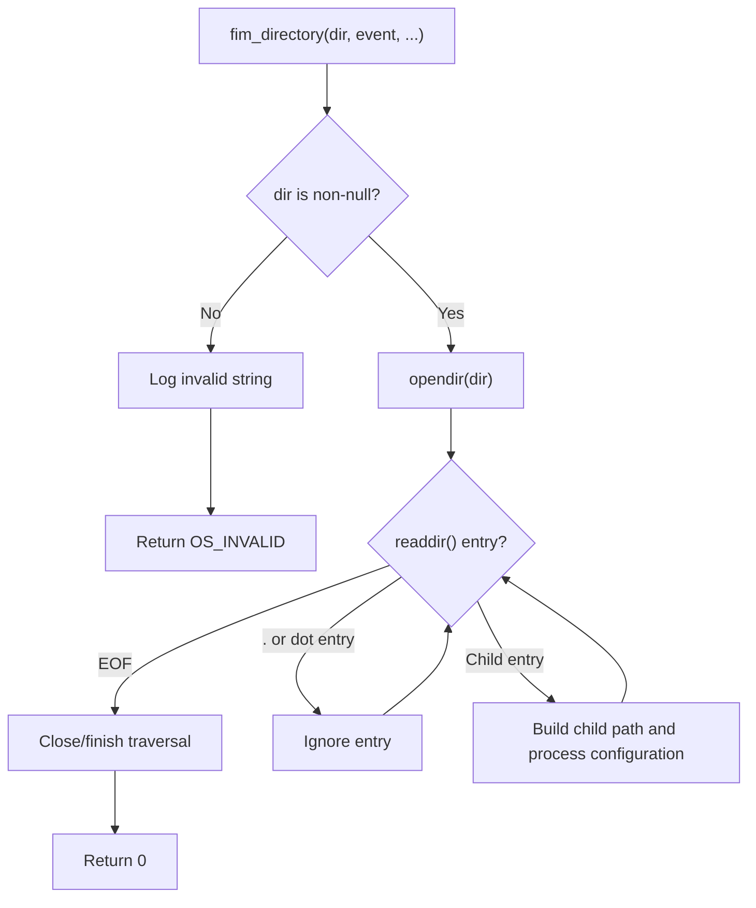
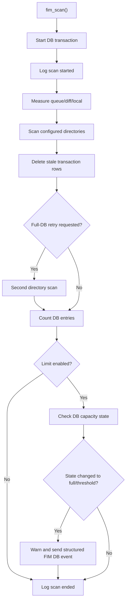

# `fim_directory_tests`

`fim_directory_tests` is the focused CMocka coverage for the Syscheck File Integrity Monitoring (FIM) directory walker and scan orchestration. It verifies directory enumeration, ignored entries, invalid inputs, database-limit handling, repeated scans, and scans with database limits disabled. The tests exercise the production `fim_directory()` and `fim_scan()` paths through mocked filesystem, realtime-monitoring, database, locking, and logging interfaces.

## Scope and role

This is a test module, not a runtime FIM component. Its value is in specifying observable behavior at two levels:

- `fim_directory()` walks a configured directory and handles child entries safely.
- `fim_scan()` coordinates a scheduled scan, database transaction cleanup, database-capacity checks, and optional realtime-watch maintenance.

The module contains six registered tests and four dedicated fixtures from `src/unit_tests/syscheckd/test_fim_scan.c`:

| Area | Tests | Fixtures |
| --- | --- | --- |
| Directory traversal | `test_fim_directory`, `test_fim_directory_ignore`, `test_fim_directory_nodir` | `setup_struct_dirent`, `teardown_struct_dirent` |
| Scan/database capacity | `test_fim_scan_db_full_double_scan`, `test_fim_scan_db_full_not_double_scan` | `setup_fim_double_scan`, `teardown_fim_double_scan`, `setup_fim_not_double_scan`, `teardown_fim_not_double_scan` |
| Unlimited scan | `test_fim_scan_no_limit` | `setup_file_limit`, `teardown_file_limit` |

The same source file also contains adjacent FIM tests for hashing, event processing, wildcard configuration, transaction callbacks, and database-state transitions. Those tests are broader suite coverage and are not duplicated here.

## Position in the system

The tests sit below the Syscheck/FIM daemon and above its operating-system and persistence boundaries. CMocka wrappers replace those boundaries so each scenario can prescribe return values and verify calls without scanning a real filesystem or changing a real FIM database.

In the generated module hierarchy, the implementation context is documented in [Syscheck / FIM daemon](Syscheck___FIM_Daemon_(C_C++).md), while configuration structures are covered by [Syscheck Config](Syscheck_Config.md).

## Test registration and lifecycle

The tests are registered in the main `tests` CMocka group. The shared group setup initializes FIM test state, loads `test_syscheck.conf`, configures a large maximum depth and file size, and creates the list used for removed entries. Each test then applies its scenario-specific fixture.

The `setup_struct_dirent` fixture is shared with the directory tests. It allocates a `struct dirent` through the existing FIM test state; teardown releases that allocation. `test_fim_scan_no_limit` uses the intentionally named `setup_file_limit` fixture to disable file limits, then restores the normal defaults in `teardown_file_limit`.

## Directory traversal coverage

### `test_fim_directory`

This is the successful enumeration case. The fixture supplies a directory entry named `test`, mocks `opendir()` as successful, and makes `readdir()` return the entry followed by `NULL`. The test calls `fim_directory("test", ...)` with a realtime event and expects:

- a child path to be formed using the platform separator;
- the child to reach configuration lookup;
- the missing-configuration diagnostic `(6319)` for the child;
- a return value of `0`.

The test therefore checks that traversal can complete even when the discovered child has no matching FIM configuration.

### `test_fim_directory_ignore`

The directory entry is `.`. The test expects the walker to ignore it rather than recurse into itself or treat it as a file. `opendir()` and `readdir()` still succeed, and the function returns `0`.

### `test_fim_directory_nodir`

The function is called with a null directory path and null event/context values. It expects the standard invalid-input diagnostic `(1105): Attempted to use null string.` and returns `OS_INVALID`. This protects the boundary before any directory API is called.

## Scan and database-capacity coverage

### `test_fim_scan_db_full_double_scan`

`setup_fim_double_scan` sets the global `activate_full_db` flag, allocates the test database object, and supplies a regular-file directory entry. The test then drives two complete scan passes. For each configured directory it prescribes successful stat/filesystem checks, realtime watch registration where applicable, directory enumeration, and realtime-directory registration.

The expected behavior is:

1. Start a FIM database transaction and emit the scan-start message.
2. Measure the local diff directory.
3. Scan all configured directories.
4. Delete stale transaction rows.
5. Perform the second scan because the full-database condition requests it.
6. Observe a file-entry count equal to the configured limit.
7. Transition the file database to full and emit the warning and structured event:
   `alert_type: "full"`.
8. Emit the scan-end message.

The Windows branch additionally supplies expanded Windows directories and mocks file-entry and registry-entry counters; the intent is the same, with platform-specific database dimensions.

### `test_fim_scan_db_full_not_double_scan`

`setup_fim_not_double_scan` allocates the database object and marks it as already full. The test performs one scan, observes a count below the file limit before and after cleanup, and verifies that the scan ends without issuing the full-database warning. This protects the “already handled” path from triggering an unnecessary second scan or duplicate capacity notification.

### `test_fim_scan_no_limit`

`setup_file_limit` disables file-entry limits and sets the limit to zero. On Windows it also disables the registry-entry limit. The scan still starts a transaction, measures the diff directory, scans configured directories, deletes transaction rows, and emits start/end messages, but it does not perform limit-based full-state assertions. Teardown restores the normal file limit of 50,000 entries and, on Windows, the registry limit of 100,000 entries.

## Dependencies and mocked boundaries

| Boundary | Representative wrappers | Why it is mocked |
| --- | --- | --- |
| Filesystem traversal | `opendir`, `readdir`, `lstat` / `utf8_stat64`, `HasFilesystem` | Makes file, directory, missing-path, and platform behavior deterministic. |
| Directory/realtime monitoring | `fim_add_inotify_watch`, `realtime_adddir`, `realtime_sanitize_watch_map` | Avoids installing watches and verifies registration calls. |
| FIM database | `fim_db_transaction_start`, `fim_db_transaction_deleted_rows`, `fim_db_get_count_file_entry` and Windows registry-count wrappers | Simulates capacity, cleanup, and retry conditions. |
| Filesystem statistics | `IsDir`, `DirSize` | Controls diff-folder-size reporting. |
| Synchronization | pthread lock wrappers | Verifies code can exercise global syscheck state under the expected lock boundaries. |
| Diagnostics | `__wrap__minfo`, `__wrap__mdebug2`, `__wrap__mwarn`, `__wrap_send_log_msg` | Assertions use exact diagnostics and structured DB-capacity events. |
| Configuration | `Read_Syscheck_Config` in shared setup | Provides configured directories and FIM options without relying on the host. |

The test suite also relies on shared FIM structures such as `syscheck`, `fim_data_t`, `directory_t`, `event_data_t`, and `struct dirent`. These are initialized by the broader Syscheck test fixtures rather than recreated by each target test.

## Cross-platform behavior

The source is compiled for both POSIX and Windows agent builds:

- POSIX tests use `lstat`, `DT_REG`, slash-separated paths, and inotify-related wrappers.
- Windows tests use `utf8_stat64`, environment-variable expansion, Windows separators, and registry database counters.
- Expected diagnostic strings differ only in path separator and expanded path representation.
- Fixture teardown restores platform-specific global limits and frees the corresponding database state.

When changing traversal or scan behavior, update both preprocessor branches where the same contract is expected. A test that passes on Linux alone may still leave Windows path normalization, permission extraction, or registry-capacity behavior unverified.

## Maintenance guidance

Keep these tests focused on externally observable contracts: calls to boundary wrappers, return codes, global state transitions, and emitted diagnostics. If production code adds a new scan phase, add its mocked dependency and assertion to both scan tests where relevant. If a new entry type is supported by `fim_directory()`, add a dedicated entry fixture rather than weakening the existing dot-entry and null-path assertions.

The tests are unit-level and intentionally do not validate real directory permissions, kernel watch delivery, database persistence, or end-to-end alert delivery. Those concerns belong to higher-level Syscheck/FIM integration coverage documented with the daemon module.

## Related documentation

- [Syscheck / FIM daemon](Syscheck___FIM_Daemon_(C_C++).md) — production FIM daemon responsibilities and implementation context.
- [Syscheck Config](Syscheck_Config.md) — configuration structures consumed by the shared test setup.
- [Shared Modules Infrastructure](Shared_Modules_Infrastructure_(C++).md) — common wrappers and infrastructure used by the daemon and tests.
- [Wazuh DB Config](Wazuh_DB_Config.md) — adjacent database configuration definitions.
