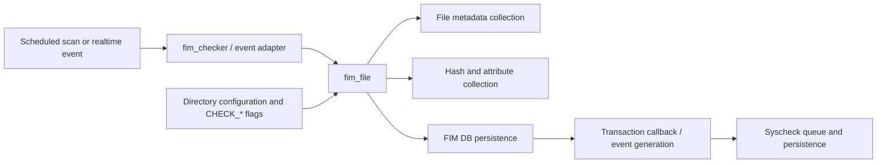
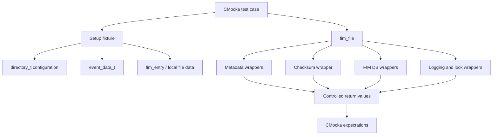
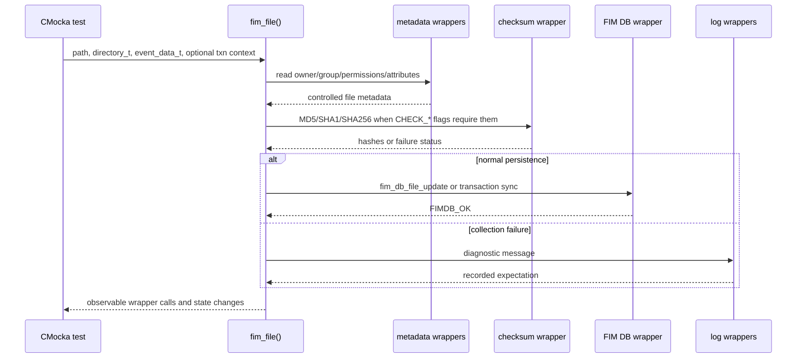
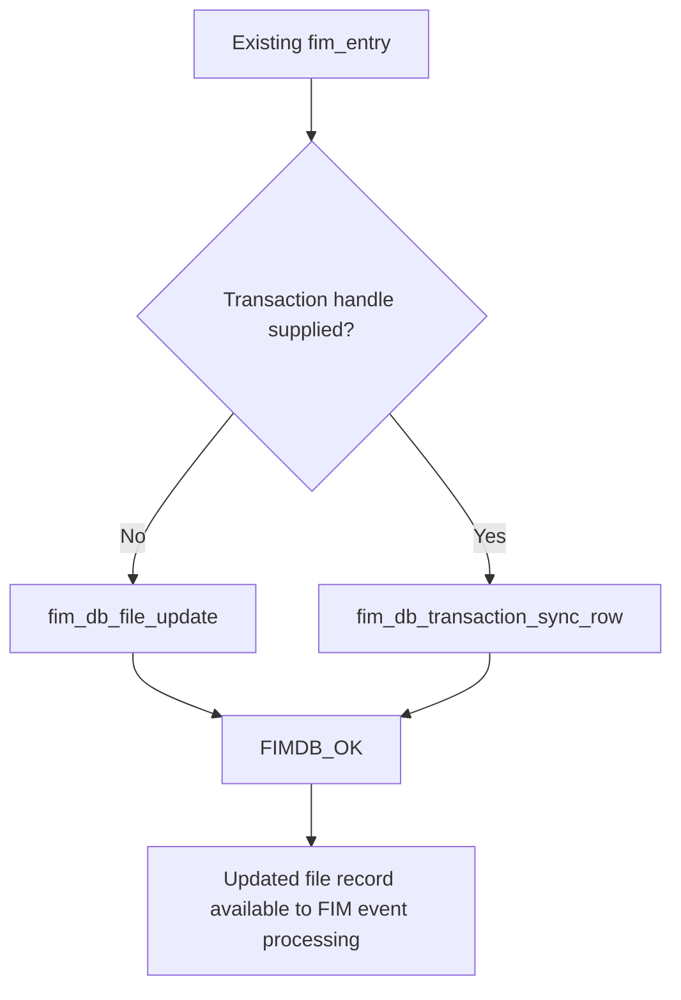
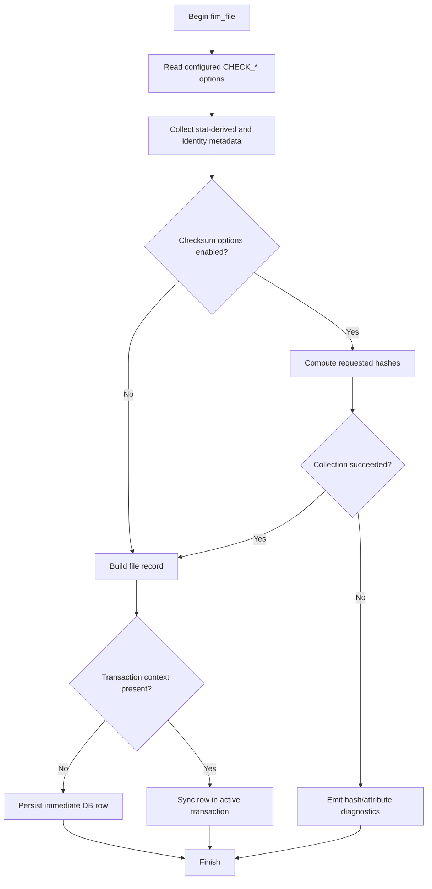
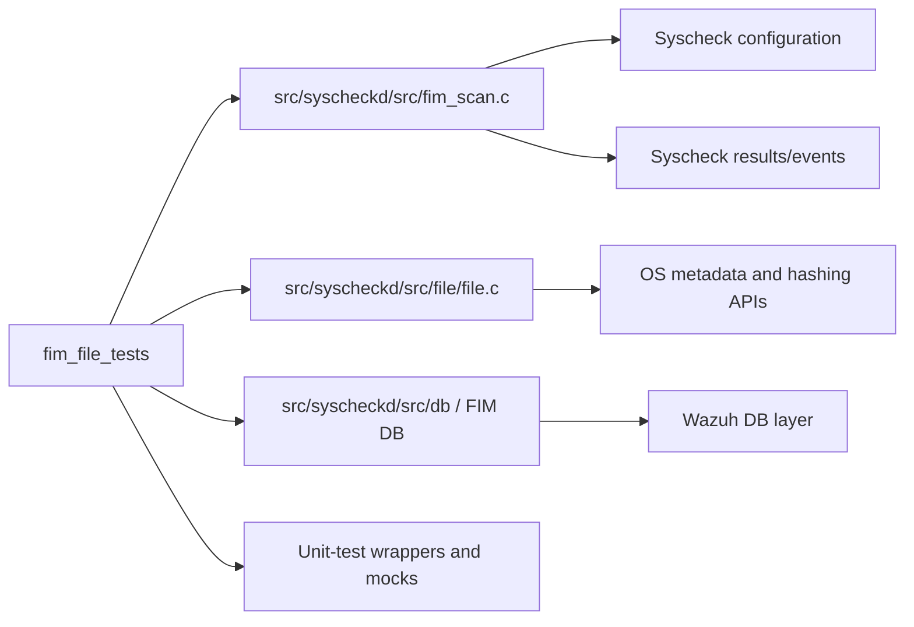

# `fim_file_tests`

`fim_file_tests` is the focused CMocka test group for the `fim_file()` operation in Wazuh's File Integrity Monitoring (FIM) scan engine. It verifies how a file is collected and persisted when it is inserted, modified, modified inside a database transaction, or when attribute/hash collection fails. The suite isolates filesystem, identity, hashing, and FIM-database effects behind wrappers so that the test exercises FIM decision logic deterministically on Unix and Windows.

The tests are implemented in `src/unit_tests/syscheckd/test_fim_scan.c` and are registered in the file's main `tests` group. Broader scan behavior is documented in [FIM scan tests](test_fim_scan_test_infrastructure.md), [FIM checker tests](fim_checker_tests.md), and the [Syscheck FIM daemon](Syscheck___FIM_Daemon_(C_C++).md).

## Scope and responsibilities

The module covers the `fim_file()` boundary rather than directory traversal or event dispatch:

| Test | Scenario | Primary behavior verified |
| --- | --- | --- |
| `test_fim_file_add` | New file, realtime mode | Collect configured metadata and hashes, then insert/update the FIM database successfully. |
| `test_fim_file_modify` | Existing file, realtime mode | Recollect metadata and persist a normal modification without an explicit transaction. |
| `test_fim_file_modify_transaction` | Existing file, scheduled mode | Recollect metadata and synchronize the row through a supplied transaction and callback context. |
| `test_fim_file_no_attributes` | Scheduled file with hash failure | Exercise the diagnostic path when hashes and attributes cannot be collected; verify failure logging through mock expectations. |

The tests use `CHECK_SIZE`, `CHECK_PERM`, `CHECK_OWNER`, `CHECK_GROUP`, `CHECK_MTIME`, `CHECK_MD5SUM`, `CHECK_SHA1SUM`, `CHECK_SHA256SUM`, and, where relevant, `CHECK_SEECHANGES` to shape `fim_file()` behavior. They do not test recursive traversal, wildcard expansion, database-capacity state transitions, or transaction callbacks directly; those concerns have dedicated documentation and test modules.

## Position in the system

`fim_file()` is the file-level part of the Syscheck FIM scan engine. A scheduled scan or realtime/whodata event supplies a path, event context, and directory configuration. The function obtains the file's current metadata, computes requested checksums, and persists the resulting record. The persistence callback later turns database changes into FIM events.

For the surrounding scan and realtime lifecycle, see [syscheckd core scan engine](syscheckd_core_scan_engine.md) and [syscheckd core realtime](syscheckd_core_realtime.md). For database structures and operations, see [syscheckd database](syscheckd_db.md).

## Test architecture

The suite follows a fixture-plus-wrapper design:

* CMocka fixtures construct `fim_data_t`, `fim_entry`, `event_data_t`, directory configuration, and (for the transaction case) `callback_ctx`.
* `expect_get_data()` represents platform-specific metadata collection. On Unix it supplies owner/group data; on Windows it supplies file-user and ACL data.
* Hashing is represented by `OS_MD5_SHA1_SHA256_File`; the tests control its output and return status.
* FIM database calls are replaced by wrappers such as `fim_db_file_update()` and `fim_db_transaction_sync_row()`.
* Lock, stat, permission, and logging calls are mocked so the test does not depend on the host filesystem or database contents.

### Fixture lifecycle

The four tests run in the broader `tests` group. Group setup initializes the Syscheck configuration and shared FIM state. The two modification tests additionally use `setup_fim_entry` and `teardown_fim_entry` to provide an existing database entry and baseline local data. Transaction-specific state is created locally in `test_fim_file_modify_transaction`.

The common inputs are:

* `event_data_t`: mode (`FIM_REALTIME` or `FIM_SCHEDULED`), report flag, optional whodata event, and a stat buffer.
* `directory_t`: enabled metadata/checksum flags and optional change-reporting flag.
* `file_path`: `/bin/ls` on Unix or `c:\windows\system32\cmd.exe` on Windows.
* `fim_entry` and `local_data`: an existing record for modification scenarios.
* A 1 KiB maximum hash size (`0x400`) and the configured `syscheck.prefilter_cmd`.

## Data flow: normal file processing

The suite intentionally validates behavior mostly through expected calls and arguments rather than return-value assertions. This is important because `fim_file()` coordinates several side effects: collecting data, choosing a persistence API, and reporting errors. A test passes only when the complete interaction contract is respected.

## Component interactions

### Add path — `test_fim_file_add`

The test creates a realtime event with no existing entry and enables metadata plus all three supported cryptographic hashes. `expect_get_data()` supplies the file data, then `fim_db_file_update()` returns `FIMDB_OK`. This establishes the happy path for inserting a newly observed file and confirms that the normal, non-transactional database API is selected.

### Non-transactional modification — `test_fim_file_modify`

The fixture pre-populates `fim_entry.file_entry.path` and `local_data` with baseline values. The test then invokes `fim_file()` in realtime mode with null transaction arguments. Metadata and hashes are recollected, and a successful `fim_db_file_update()` models persistence of the modified record. The test also covers the platform-specific permission collection path under `TEST_WINAGENT`.

### Transactional modification — `test_fim_file_modify_transaction`

This case uses scheduled mode and passes a non-null `TXN_HANDLE` plus `callback_ctx`. The metadata and hash expectations remain equivalent to the normal modification case, but persistence is redirected to `fim_db_transaction_sync_row()`. This distinguishes the scan transaction path from the immediate update path while keeping the file-data contract identical.

### Collection failure — `test_fim_file_no_attributes`

Despite its historical name, this test primarily models failed hash/attribute collection. The checksum wrapper returns `-1`; the expected diagnostics include `FIM_HASHES_FAIL` and `FIM_GET_ATTRIBUTES`. The test ensures that a scheduled scan does not silently treat incomplete collection as a successful full-data read. On Windows, ACL extraction is part of the mocked metadata path; on Unix, owner/group lookup is mocked instead.

## Process flows and platform variants

The source is compiled for both Unix and Windows:

| Concern | Unix path | Windows path |
| --- | --- | --- |
| File stat | `lstat`-based wrappers | `utf8_stat64`-based wrappers |
| Identity | `get_user` and `get_group` | `get_file_user` and Windows ACL/permission wrappers |
| Permissions | Mode string such as `r--r--r--` | JSON-like ACL representation and file attributes |
| Paths | `/bin/ls` | `c:\windows\system32\cmd.exe` |
| Synchronization | POSIX lock wrappers | Same logical locks with platform-specific call ordering |

The tests encode the platform difference in expectations rather than duplicating the business scenario. This keeps coverage equivalent while allowing the native FIM implementation to use the correct operating-system APIs.

## Dependency map

Direct source dependencies are centered on the Syscheck FIM implementation and its test doubles. The module does not directly depend on API controllers or unrelated Wazuh modules. The most relevant neighboring documentation is [syscheckd file handling](syscheckd_file.md), [syscheckd FIM database core](syscheckd_db_core.md), [FIM diff changes tests](test_fim_diff_changes.md), and [FIM database-state tests](fim_check_db_state_tests.md).

## Verification contract

Maintainers changing `fim_file()` should preserve these observable contracts:

1. Metadata collection honors the requested `CHECK_*` options.
2. Enabled checksum computation uses the configured prefilter and 1 KiB test limit.
3. A new or ordinary modified file uses `fim_db_file_update()`.
4. A supplied transaction handle uses transaction-row synchronization instead.
5. Hash/attribute failures produce the expected diagnostic path rather than being hidden.
6. Unix and Windows collect equivalent logical data through their native wrappers.

Changes to directory selection, realtime event handling, missing-entry processing, or database state thresholds should be covered by the related modules linked above, not by expanding this focused file-level suite.

## Running and interpreting the tests

The test executable is built as part of the Syscheck unit-test target and uses CMocka. The complete `test_fim_scan.c` executable runs several groups; `fim_file_tests` is the subset registered under the `/* fim_file */` section of the main `tests` array. A failure usually indicates one of three contract changes:

* a new or removed metadata/hash call;
* a changed persistence API or transaction selection rule; or
* a platform-specific wrapper expectation that no longer matches native behavior.

When diagnosing a failure, first compare the expected wrapper arguments and call order, then inspect the corresponding FIM implementation and the shared fixture setup. Use [FIM scan test infrastructure](test_fim_scan_test_infrastructure.md) for common setup, wrapper conventions, and platform build details.
