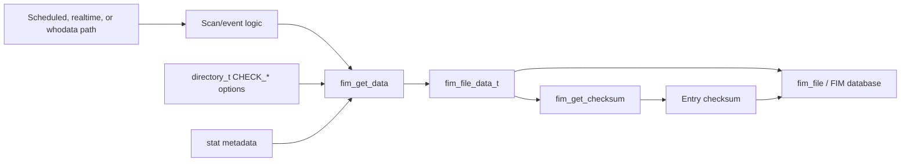
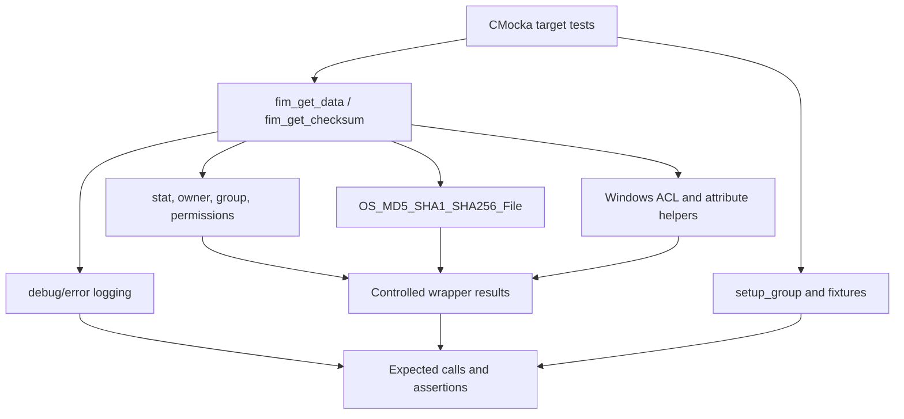
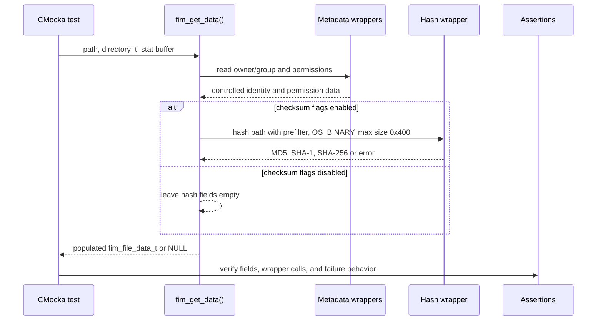
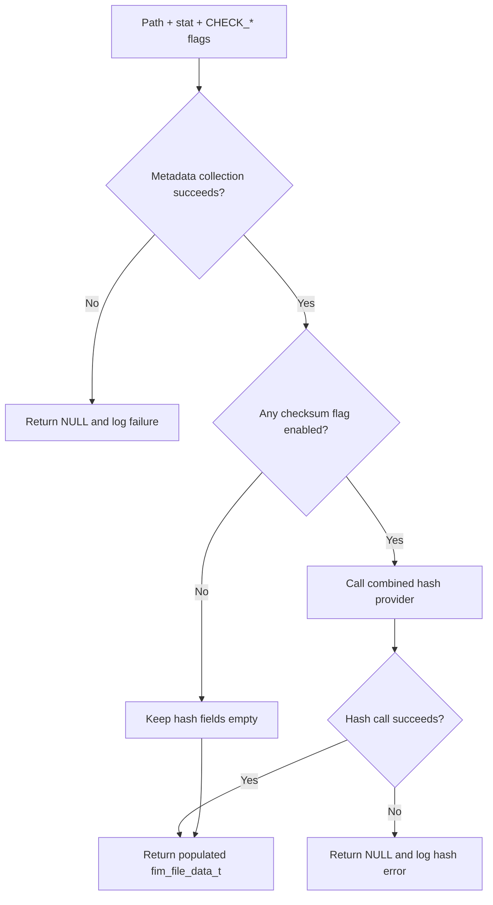
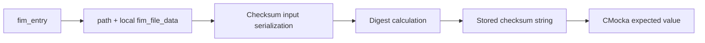
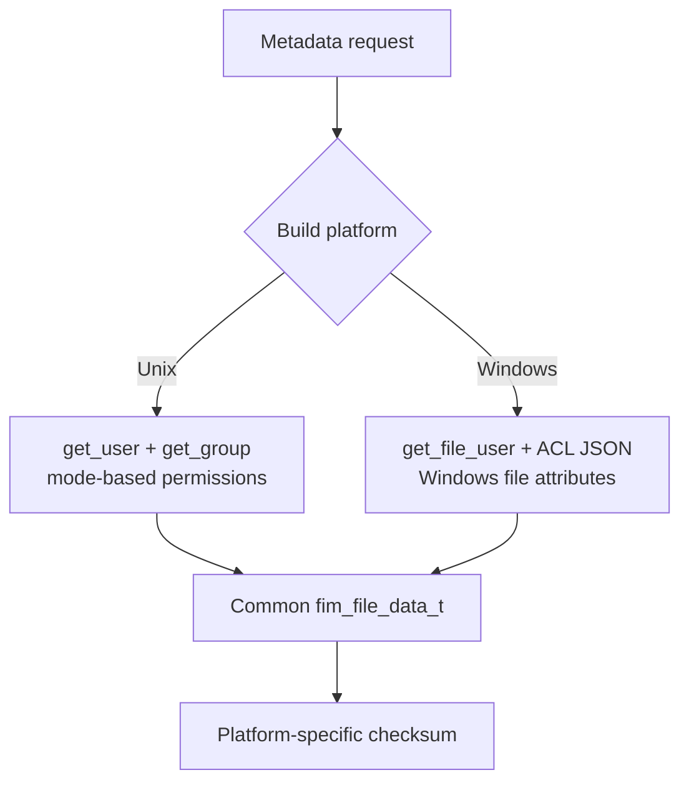
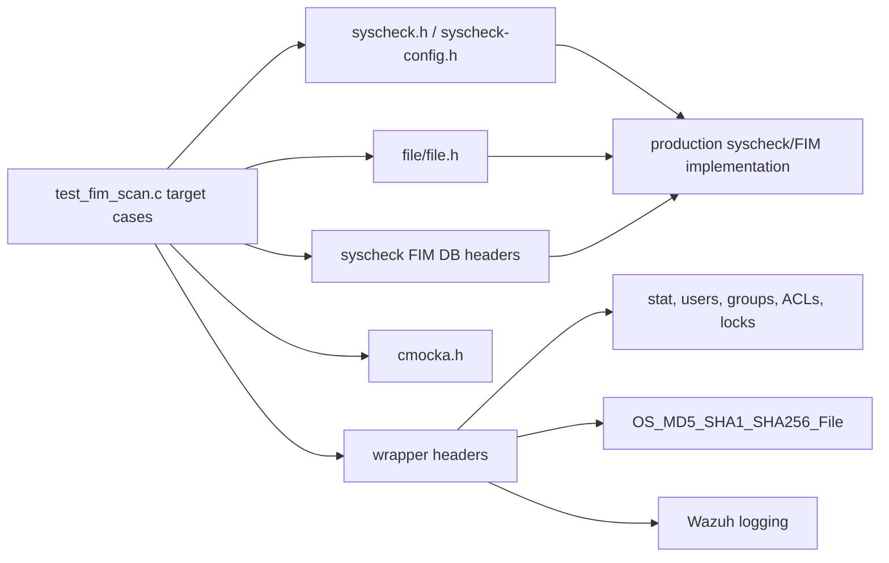

# `fim_get_data_checksum_tests`

`fim_get_data_checksum_tests` is the focused CMocka test slice for FIM metadata collection and checksum construction in `src/unit_tests/syscheckd/test_fim_scan.c`. It verifies that `fim_get_data()` gathers the configured file attributes and optional MD5/SHA-1/SHA-256 hashes, and that `fim_get_checksum()` produces stable checksums from a FIM entry. The tests run inside the broader `test_fim_scan` executable; this module is not a standalone production component.

The surrounding FIM architecture is documented in the [Syscheck FIM daemon](Syscheck___FIM_Daemon_(C_C++).md). Shared fixtures, wrappers, and group lifecycle are documented in [FIM scan test infrastructure](test_fim_scan_test_infrastructure.md).

## Scope

The module covers the data-collection boundary between filesystem metadata and the FIM record:

| Test | Scenario | Main assertion |
| --- | --- | --- |
| `test_fim_get_checksum` | Normal `fim_entry` with representative metadata | A deterministic checksum is generated for the entry. |
| `test_fim_get_checksum_wrong_size` | Local data has `size = -1` | Checksum generation remains deterministic for an invalid-size value. |
| `test_fim_get_data` | All supported file metadata and hash flags enabled | Metadata, permissions, and the three requested hashes are populated. |
| `test_fim_get_data_no_hashes` | Metadata flags enabled, checksum flags disabled | Metadata is populated while hash fields remain empty. |
| `test_fim_get_data_hash_error` | Hash provider returns an error | `fim_get_data()` returns `NULL` and emits the expected diagnostic. This adjacent test is registered in the same source but is outside the generated subtree’s named test list. |
| `test_fim_get_data_fail_to_get_file_premissions` | Windows ACL lookup fails | Windows-only collection failure returns `NULL` and logs error 5. |

The module does not test directory traversal, scan scheduling, FIM database persistence, transaction callbacks, or realtime event dispatch. Those behaviors belong to [FIM file tests](fim_file_tests.md), [FIM checker tests](fim_checker_tests.md), [FIM database tests](fim_check_db_state_tests.md), and the broader [FIM scan test infrastructure](test_fim_scan_test_infrastructure.md).

## Position in the system

FIM receives a path and `struct stat`-like information from a scan or event path. `fim_get_data()` converts that input into `fim_file_data_t`; `fim_get_checksum()` derives the record checksum used to identify the complete metadata state. The resulting data is later consumed by file processing and database/event code, which is intentionally outside this module.



## Test architecture

The tests isolate production logic with CMocka wrappers. No real file needs to be read, and no host-user database, ACL, or filesystem permission state is assumed.



### Shared inputs and fixtures

The enclosing `test_fim_scan.c` harness loads `test_syscheck.conf`, initializes global `syscheck` state, and establishes lock expectations. Target tests then use small local configurations and synthetic metadata:

- `directory_t.options` selects `CHECK_SIZE`, `CHECK_PERM`, `CHECK_MTIME`, `CHECK_OWNER`, `CHECK_GROUP`, and the checksum flags.
- `struct stat` supplies size, UID/GID, inode, device, modification time, and regular-file mode.
- `expect_get_data()` mocks platform-specific identity and permission collection.
- `OS_MD5_SHA1_SHA256_File` is mocked with fixed empty-file digests and a controlled return value.
- `teardown_local_data` releases the `fim_file_data_t` allocated by successful `fim_get_data()` calls.
- `DEFAULT_FILE_DATA` supplies stable metadata for checksum tests.

The common harness is intentionally not repeated here; see [test_fim_scan_test_infrastructure.md](test_fim_scan_test_infrastructure.md).

## `fim_get_data()` data flow



### Successful collection

`test_fim_get_data` enables all metadata and checksum flags. The test verifies Unix permissions as `r--r--r--`; on Windows it verifies the serialized permission field is `{}` and that the ACL JSON object exists. The hash wrapper is expected to receive:

- the requested path;
- `syscheck.prefilter_cmd`;
- `OS_BINARY` mode;
- a `0x400` maximum size;
- output buffers initialized to the known empty-file digests.

The returned object also carries the stat-derived size, timestamps, ownership identifiers, inode, and device values.

### Metadata-only collection

`test_fim_get_data_no_hashes` uses the same stat and identity inputs but omits `CHECK_MD5SUM`, `CHECK_SHA1SUM`, and `CHECK_SHA256SUM`. The expected behavior is not to call the hash provider and to return empty strings in all three hash fields. This protects the configuration contract: disabling hash collection must not accidentally calculate or retain stale hashes.

### Failure paths

When the hash wrapper returns `-1`, the adjacent `test_fim_get_data_hash_error` expects a `NULL` result and message `(6324): Couldn't generate hashes for 'test'`. Under `TEST_WINAGENT`, a failed ACL lookup returns `NULL` and logs `(6325): It was not possible to extract the permissions of 'test'. Error: 5`.



## `fim_get_checksum()` behavior

`fim_get_checksum()` consumes an initialized FIM entry and serializes the relevant file metadata into a stable digest. `test_fim_get_checksum` checks the normal `DEFAULT_FILE_DATA` path; `test_fim_get_checksum_wrong_size` specifically ensures that a negative size does not make the function nondeterministic or crash.



The expected checksum differs by platform because permission and attribute representations differ:

| Build | `test_fim_get_checksum` expected value |
| --- | --- |
| Unix | `98e039efc1b8490965e7e1247a9dc31cf7379051` |
| Windows | `6ec831114b5d930f19a90d7c34996e0fce4e7b84` |

For the negative-size case, the expected value is `0a0070d140761418be81531ad48f5909f410e161`.

The test documents checksum determinism, not the serialization format as a public API. Changes to field order, platform normalization, or included metadata should therefore be accompanied by an intentional update to these golden values and the FIM documentation.

## Platform-specific behavior



- Unix builds resolve owner and group through `get_user()` and `get_group()`, and derive the permission string from the mode bits.
- Windows builds use the Windows file-user and file-permission helpers plus ACL JSON conversion. `__wrap_decode_win_attributes` is compiled only for `TEST_WINAGENT` and verifies the attribute-decoding boundary.
- The test source uses conditional compilation so the same logical cases cover both representations without requiring a Windows host for Unix tests.

## Registration and execution

The target cases are registered in the primary `tests[]` array in `main()`:

```mermaid
flowchart LR
    M[main] --> G[cmocka_run_group_tests(tests, setup_group, teardown_group)]
    G --> C1[test_fim_get_checksum]
    G --> C2[test_fim_get_checksum_wrong_size]
    G --> C3[test_fim_get_data]
    G --> C4[test_fim_get_data_no_hashes]
    G --> C5[Windows-only permission failure]
    G --> D[teardown_local_data where registered]
```

Because the module is a logical test subtree, it is executed through the repository’s Syscheck unit-test target rather than a separate binary. Use the project’s normal CMocka/CTest workflow and select the `test_fim_scan` target when available. Build with `TEST_WINAGENT` to exercise the Windows-only branches.

## Dependencies



The combined hash primitive is tested independently in [MD5/SHA-1/SHA-256 crypto tests](os_crypto_md5_sha1_sha256_tests.md), so this module only verifies how FIM configures and consumes that primitive. FIM persistence and database capacity behavior are owned by [syscheckd database](syscheckd_db.md) and [FIM database state tests](fim_check_db_state_tests.md).

## Maintenance notes

- Keep wrapper expectations aligned with the `CHECK_*` flags; adding a flag to a local configuration can introduce a new required mock call.
- Preserve the platform guards when changing permission or attribute assertions.
- Update golden checksum values only when the production checksum input is intentionally changed.
- Prefer adding a focused test here for metadata/hash collection changes; leave scan traversal and persistence scenarios in their existing test modules.
