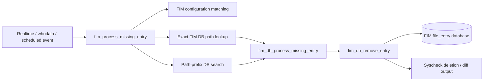
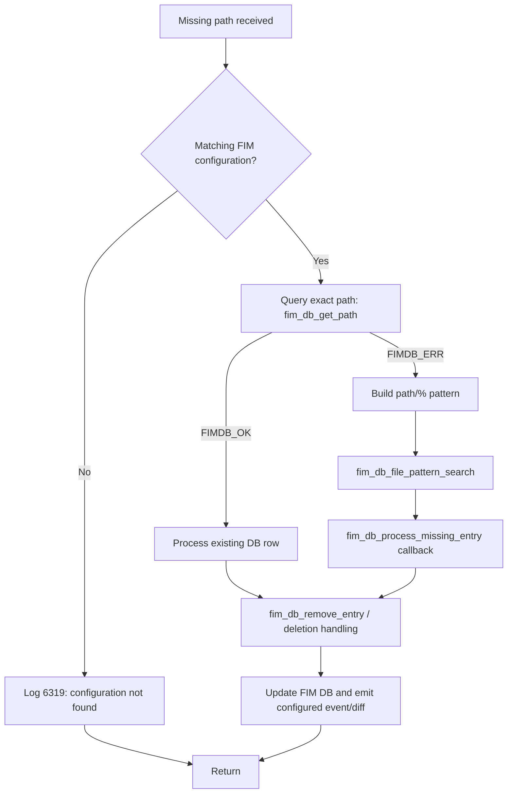
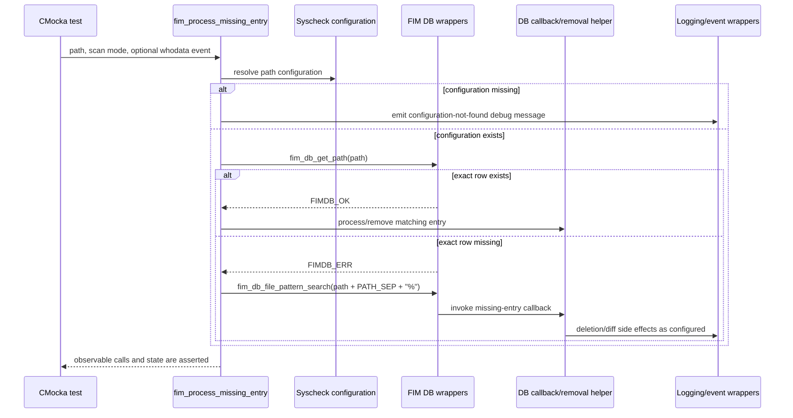

# `fim_missing_entry_tests`

## Introduction

`fim_missing_entry_tests` is the focused CMocka documentation group for missing-file handling in Wazuh File Integrity Monitoring (FIM). The tests are implemented in `src/unit_tests/syscheckd/test_fim_scan.c`; they are not a standalone runtime component. They specify how Syscheck reacts when a monitored path disappears, when a database entry must be removed, and when a missing entry is found through a directory-pattern search.

The group covers both the high-level event path (`fim_process_missing_entry`) and the FIM-database callback helpers (`fim_db_remove_entry` and `fim_db_process_missing_entry`). The wider daemon design is documented in [Syscheck / FIM Daemon](Syscheck___FIM_Daemon_(C_C++).md), while the persistence contract belongs to [syscheckd database](syscheckd_db.md).

## Scope and module position

The six relevant tests are registered in the `tests` array in `test_fim_scan.c`:

| Test | Subject | Main scenario |
|---|---|---|
| `test_fim_process_missing_entry` | `fim_process_missing_entry` | Exact path is absent from the DB; search descendants with `path/%`. |
| `test_fim_process_missing_entry_data_exists` | `fim_process_missing_entry` | The exact path is already represented in the FIM DB. |
| `test_fim_process_missing_entry_null_configuration` | `fim_process_missing_entry` | No matching FIM configuration exists. |
| `test_fim_process_missing_entry_whodata_disabled` | `fim_process_missing_entry` | Missing-entry processing is invoked with `FIM_WHODATA`. |
| `test_fim_db_process_missing_entry` | `fim_db_process_missing_entry` | A DB result is passed to the missing-entry callback without a matching configuration. |
| `test_fim_db_remove_entry` | `fim_db_remove_entry` | An existing path is looked up for removal using a `CHECK_SEECHANGES` configuration. |

These tests sit between the Syscheck event sources and the FIM persistence layer:



The tests replace filesystem, locking, logging, and database boundaries with wrappers. Consequently, they validate call ordering and observable outcomes without deleting files or modifying a live FIM database.

## Production responsibilities represented by the tests

`fim_process_missing_entry` is the orchestration entry point. The assertions imply the following decision structure:

1. Resolve the active FIM configuration for the path.
2. If no configuration matches, emit the standard configuration-not-found debug message and stop.
3. Query the FIM database for the exact path.
4. If the exact path is not found, search the path subtree using a platform-specific `path + PATH_SEP + "%"` pattern.
5. Process matching database rows through the missing-entry callback, which can remove stale entries and generate the applicable FIM event/diff behavior.

The tests deliberately assert only the public behavior of those stages. Detailed configuration matching is covered by [Syscheck core](syscheckd_core.md), file metadata and change handling by [syscheckd file handling](syscheckd_file.md), and whodata event correlation by [syscheckd whodata](syscheckd_whodata.md).

## Missing-entry process flow



The `data_exists` test supplies `FIMDB_OK` from the exact lookup. The base test supplies `FIMDB_ERR` and then expects the wildcard/prefix search to return `FIMDB_OK`. The null-configuration test terminates before either database lookup is required.

## Component interaction



`fim_db_remove_entry` is tested independently with a callback context whose configuration enables `CHECK_SEECHANGES`. `fim_db_process_missing_entry` is tested as a callback boundary: the fixture supplies a `fim_entry`, and the test verifies the no-configuration diagnostic for the mock path.

## Test harness and fixtures

The tests run as part of the main CMocka group:

```mermaid
flowchart TD
    Runner[cmocka_run_group_tests(tests, setup_group, teardown_group)] --> Group[Global Syscheck/FIM fixture]
    Group --> Case1[setup_fim_data]
    Group --> Case2[setup_fim_entry]
    Case1 --> S1[data_exists / whodata_disabled]
    Case2 --> S2[base process test / DB helper tests]
    S1 --> Assert[Wrapper expectations and assertions]
    S2 --> Assert
    Assert --> Cleanup[Per-test teardown]
```

### Shared group setup

`setup_group` loads Syscheck configuration and initializes the shared FIM state. It creates a monitored directory and configures global values such as realtime delay, recursion depth, file-size limits, and the removed-entry list. This matters because missing-entry processing depends on configuration lookup and synchronized global lists.

### `setup_fim_data`

This fixture allocates an event, a whodata event, file metadata, and an initial test path (`./test/test.file`). It is used by the tests that need a realistic optional `whodata_evt`. The fixture is released by `teardown_fim_data`.

### `setup_fim_entry`

This fixture creates a `fim_entry` of type `FIM_TYPE_FILE`, attaches file metadata, and supplies a callback-compatible entry. The tests mutate its path to `/etc/test.txt`, `/media/test.txt`, or `mock_path`, then release it with `teardown_fim_entry`.

### Mocked boundaries

The missing-entry group expects wrappers for:

- pthread mutex and read/write-lock operations used while accessing Syscheck configuration and FIM state;
- `fim_db_get_path` for exact path lookup;
- `fim_db_file_pattern_search` for descendant lookup;
- debug logging, especially message `(6319)`;
- platform filesystem/stat operations indirectly exercised by the surrounding event tests.

The lock expectations are intentionally broad (`expect_function_call_any`) because Unix and Windows take the locks in different orders. The contract is that shared FIM state is protected, not that a platform-independent lock sequence exists.

## Test behavior matrix

| Scenario | Path/fixture | Mode passed | Database expectation | Expected result |
|---|---|---|---|---|
| No configuration | Random path, no event fixture | `FIM_REALTIME` | No lookup required | Configuration-not-found log and return. |
| Exact row exists | `/media/test.txt` or expanded Windows path | Unix: `FIM_REALTIME`; Windows: `FIM_SCHEDULED` | `fim_db_get_path` returns `FIMDB_OK` | Existing data path is processed. |
| Whodata disabled path | Same `fim_data_t` fixture | `FIM_WHODATA` | Lock/configuration path is exercised | No crash; mode-specific handling is reached. |
| Exact row missing | `/etc/test.txt` or expanded Windows path | Unix: `FIM_WHODATA`; Windows: `FIM_SCHEDULED` | Exact lookup `FIMDB_ERR`, pattern search `FIMDB_OK` | Descendant entries are handed to missing-entry processing. |
| DB callback without config | `mock_path` in `fim_entry` | Callback context | Configuration lookup path | `(6319)` diagnostic is emitted. |
| Remove existing entry | Fixture whodata path | Callback context with `CHECK_SEECHANGES` | `fim_db_get_path` returns `FIMDB_OK` | Removal path is entered. |

## Platform-specific behavior

The source compiles the same logical tests for Unix and Windows, but the inputs and mode values differ:

- Unix uses slash-separated paths such as `/etc/test.txt` and `/media/test.txt`.
- Windows expands `%WINDIR%\\SysNative\\drivers\\etc`, lowercases the result, and uses the Windows path separator.
- The Windows cases use `FIM_SCHEDULED` in places where Unix uses `FIM_REALTIME` or `FIM_WHODATA`; this reflects the platform-specific event plumbing in the test fixture, not a different missing-entry objective.
- Lock expectations are not order-sensitive across platforms.

Path construction is part of the contract: the pattern must be formed as `path + PATH_SEP + "%"`, so maintenance changes should preserve separator handling and Windows environment expansion.

## Maintenance guidance

When changing missing-entry behavior, update the scenario that corresponds to the changed branch:

- configuration matching changes: `test_fim_process_missing_entry_null_configuration`;
- exact DB lookup changes: `test_fim_process_missing_entry_data_exists`;
- descendant/prefix lookup changes: `test_fim_process_missing_entry`;
- whodata mode handling: `test_fim_process_missing_entry_whodata_disabled`;
- row callback semantics: `test_fim_db_process_missing_entry`;
- exact-entry removal and change reporting: `test_fim_db_remove_entry`.

Keep database return codes scripted in the wrappers. A real database would make these unit tests nondeterministic and would blur the boundary with the persistence tests described in [syscheckd database](syscheckd_db.md).

For adjacent coverage, see [FIM checker tests](fim_checker_tests.md), [FIM directory tests](fim_directory_tests.md), [FIM database-state tests](fim_check_db_state_tests.md), and [FIM validation tests](fim_check_validation_tests.md). The full implementation source is [`test_fim_scan.c`](src/unit_tests/syscheckd/test_fim_scan.c).
