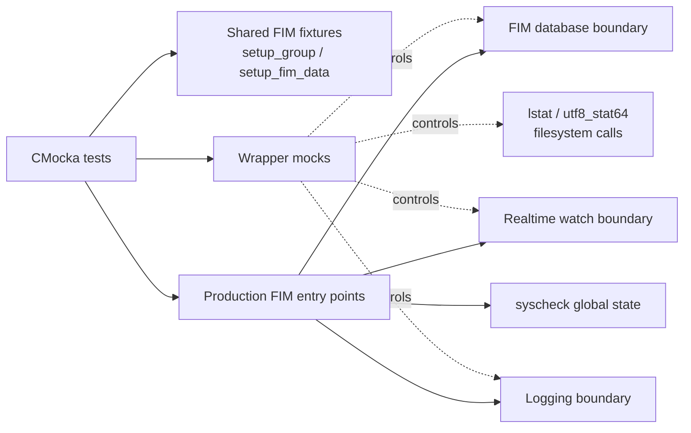
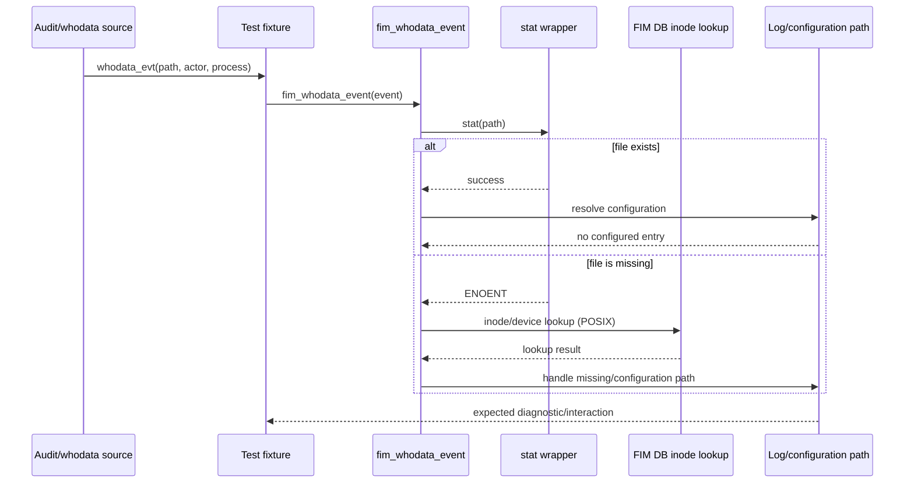

# `fim_realtime_whodata_tests`

## Introduction

`fim_realtime_whodata_tests` is a focused group of CMocka unit tests for the File Integrity Monitoring (FIM) event paths that react to realtime filesystem notifications and whodata/audit events. The tests live in `src/unit_tests/syscheckd/test_fim_scan.c`; they do not implement FIM behavior. Instead, they isolate the production functions `fim_realtime_event()`, `fim_whodata_event()`, `fim_scan()`, and `create_unix_who_data_events()` behind mocked filesystem, database, logging, locking, and realtime-watch boundaries.

The module verifies that event processing remains safe when a path exists, is missing, has no matching FIM configuration, or must be reconciled during a scan. On POSIX systems it also verifies recovery from a realtime queue overflow by sanitizing the watch map and clearing the overflow flag.

For the daemon-wide design, see [Syscheck / FIM Daemon](<Syscheck___FIM_Daemon_(C_C++).md>). Related test responsibilities are documented in [fim_checker_tests](fim_checker_tests.md), [fim_directory_tests](fim_directory_tests.md), and [fim_check_db_state_tests](fim_check_db_state_tests.md).

## Scope and location

| Item | Description |
| --- | --- |
| Source | `src/unit_tests/syscheckd/test_fim_scan.c` |
| Test group | Main CMocka `tests` group; `test_fim_scan_realtime_enabled` has a specialized fixture |
| Production boundary | `src/syscheckd/src/fim_scan.c` and realtime/whodata helpers |
| Platforms | POSIX and Windows branches where available; realtime queue-recovery coverage is POSIX-only |
| Test style | Interaction-based unit tests with linker wrappers and shared FIM fixtures |

The module is a slice of the larger `test_fim_scan.c` translation unit. Neighboring tests cover directory traversal, generic path checking, database state transitions, dbsync callbacks, and FIM metadata serialization. Those concerns are intentionally referenced rather than duplicated here.

## Architecture



The tests construct only the state needed for each scenario. CMocka expectations define the observable contract: which system calls occur, what database lookup result is returned, what diagnostic is logged, and how shared state changes. This keeps the tests independent of the host filesystem and a live syscheckd process.

### Main components

- **Realtime event tests** call `fim_realtime_event()` with an existing or missing path. The stat wrapper determines the branch while the expected configuration-not-found message verifies graceful handling when the path is not covered by configured directories.
- **Whodata event tests** call `fim_whodata_event()` with a `whodata_evt` fixture containing the path and process attribution. The missing-file POSIX case additionally exercises inode/device lookup through `fim_db_file_inode_search()`.
- **Realtime scan recovery test** calls `fim_scan()` with `syscheck.realtime->queue_overflow` set. It verifies watch-map sanitization and recovery after the scan.
- **Unix whodata event creation test** calls `create_unix_who_data_events()` and verifies that an audit-derived path is routed through normal FIM configuration handling.
- **Fixtures and wrappers** provide deterministic `syscheck` configuration, fake directory metadata, fake audit events, database handles, directory iterators, locks, and platform-specific stat functions.

## Dependency relationships

```mermaid
graph TD
    M[fim_realtime_whodata_tests\n(test_fim_scan.c)]
    M --> C[CMocka]
    M --> H[test_fim.h / syscheck.h]
    M --> E[fim_realtime_event]
    M --> W[fim_whodata_event]
    M --> G[fim_scan]
    M --> U[create_unix_who_data_events]
    E --> CF[fim configuration lookup]
    W --> CF
    W --> DB[fim_db_file_inode_search\n(POSIX missing path)]
    G --> RT[realtime_adddir /\nfim_add_inotify_watch]
    G --> DB2[FIM DB transaction and counts]
    G --> SAN[realtime_sanitize_watch_map]
    E --> STAT[lstat or utf8_stat64]
    W --> STAT
    M --> LOG[logging wrappers]
    M --> LOCK[pthread lock wrappers]
```

The production dependency graph is described in [Syscheck / FIM Daemon](<Syscheck___FIM_Daemon_(C_C++).md>). This test module replaces external dependencies with wrappers, so a passing test demonstrates control-flow and interaction correctness, not successful access to a real directory or database.

## Test fixtures and isolation

The common group setup loads `test_syscheck.conf`, initializes syscheck configuration, sets bounded scan values such as delay, maximum depth, and file size, and creates removed-entry bookkeeping. Individual fixtures then add the event-specific state:

- `setup_fim_scan_realtime()` allocates a minimal `fdb_t` database object and marks it full for the scan-recovery scenario.
- `setup_fim_data()` creates a `whodata_evt`, a FIM entry, and representative old/new metadata. The default whodata path is `./test/test.file` and includes actor/process information.
- `setup_struct_dirent()` supplies directory-entry data for scan traversal tests.
- `teardown_fim_scan_realtime()` frees the synthetic database and clears `syscheck.realtime`; other group teardown frees the complete syscheck configuration.

The tests use wrapper functions for `lstat()`/`utf8_stat64()`, lock operations, database queries and transactions, directory enumeration, realtime watch registration, logging, and selected platform APIs. Expectations are intentionally explicit around `ENOENT`, database status, and queue state.

## Data flow: realtime file event

```mermaid
flowchart LR
    A[Realtime watcher emits path] --> B[fim_realtime_event(path)]
    B --> C{stat succeeds?}
    C -- yes --> D[Resolve configured FIM directory]
    C -- no / ENOENT --> E[Handle missing path]
    D --> F{Configuration exists?}
    F -- no --> G[Log configuration-not-found]
    F -- yes --> H[Continue FIM file processing]
    E --> I[Reconcile missing entry / database state]
    G --> J[Return to watcher loop]
    H --> J
    I --> J
```

`test_fim_realtime_event_file_exists` and `test_fim_realtime_event_file_missing` cover the two stat outcomes. Both deliberately use paths without a matching test configuration, so the assertion is that the event is rejected diagnostically and does not crash or perform uncontrolled processing.

## Data flow: whodata event



`test_fim_whodata_event_file_exists` validates the existing-path branch. `test_fim_whodata_event_file_missing` validates deletion or disappearance handling; on POSIX, the fixture’s inode (`606060`) and device (`12345678`) are used to prove that the database reconciliation lookup is attempted.

## Realtime scan and queue-overflow recovery

```mermaid
flowchart TD
    S[Initialize fake realtime state\nqueue_overflow = true] --> X[fim_scan()]
    X --> T[Start FIM DB transaction]
    T --> C[Scan configured directories]
    C --> W[Register realtime watches\nand directory entries]
    W --> Q{Queue overflow pending?}
    Q -- yes --> Z[Sanitize realtime watch map]
    Z --> R[Clear queue_overflow]
    R --> N[Check DB capacity and emit status]
    Q -- no --> N
    N --> E[End scan]
```

`test_fim_scan_realtime_enabled` supplies a synthetic `rtfim` object with a non-empty watch hash and an overflow flag. It expects:

1. configured directories to be statted and enumerated;
2. realtime directories to call `fim_add_inotify_watch()` and `realtime_adddir()`;
3. FIM database counts and transaction cleanup to occur;
4. `realtime_sanitize_watch_map()` to run;
5. the database-full warning and structured log to be emitted when the mocked count reaches the limit; and
6. `syscheck.realtime->queue_overflow` to be `false` after `fim_scan()`.

This test is compiled only when `TEST_WINAGENT` is not defined because it models the POSIX realtime watch implementation.

## Test inventory

| Test | Scenario | Primary assertion |
| --- | --- | --- |
| `test_fim_realtime_event_file_exists` | Realtime path can be statted | Missing configuration is logged safely |
| `test_fim_realtime_event_file_missing` | Realtime path returns `ENOENT` | Missing path is handled without an uncontrolled failure |
| `test_fim_whodata_event_file_exists` | Existing audit/whodata path | Event enters normal configuration handling |
| `test_fim_whodata_event_file_missing` | Whodata path returns `ENOENT` | POSIX inode/device reconciliation is attempted |
| `test_fim_scan_realtime_enabled` | Realtime queue overflow during scan | Watch map is sanitized and overflow is cleared |
| `test_create_unix_who_data_events` | Unix audit event creation | Audit-derived event uses FIM path handling and locking |

The tests are registered in the `tests` array in `main()`. Most use the common `setup_group`/`teardown_group`; the scan recovery test uses `setup_fim_scan_realtime` and `teardown_fim_scan_realtime` in addition to its group lifecycle.

## Platform behavior

POSIX builds use `lstat`, inotify-style realtime watch helpers, and inode/device lookup for missing whodata files. Windows builds use `utf8_stat64` and Windows path conventions. The existing-path and missing-path event tests retain platform branches, while the queue-overflow recovery test is explicitly excluded from Windows builds because its mocked watch model is POSIX-specific.

## Maintenance guidance

When changing realtime or whodata production behavior, update this module when any of the following contracts changes:

- the stat function or its missing-file classification;
- the database lookup used to reconcile disappeared files;
- realtime watch registration or watch-map sanitization;
- queue-overflow state transitions;
- required lock ordering; or
- diagnostic messages asserted by the wrappers.

Keep filesystem and database behavior mocked. If a scenario needs directory traversal semantics, extend [fim_directory_tests](fim_directory_tests.md); if it concerns path configuration and recursion, extend [fim_checker_tests](fim_checker_tests.md); if it concerns capacity thresholds, extend [fim_check_db_state_tests](fim_check_db_state_tests.md).

## Execution model

The file is built as part of the syscheckd unit-test target. CMocka runs the main group and the neighboring regex, root-monitor, and wildcard groups from `main()`. A failure generally indicates one of three things: a changed production interaction, an incomplete fixture reset, or a platform-specific wrapper expectation that no longer matches the implementation.

The tests do not prove end-to-end delivery from an operating-system watcher or audit subsystem. Those integrations belong to the daemon-level behavior documented in [Syscheck / FIM Daemon](<Syscheck___FIM_Daemon_(C_C++).md>); this module proves the deterministic event-dispatch and recovery contracts at the FIM boundary.
