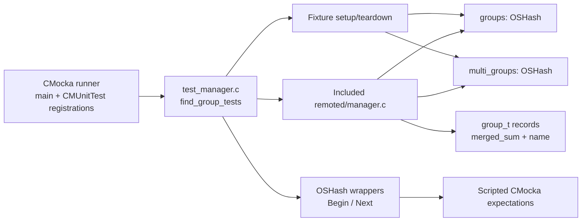
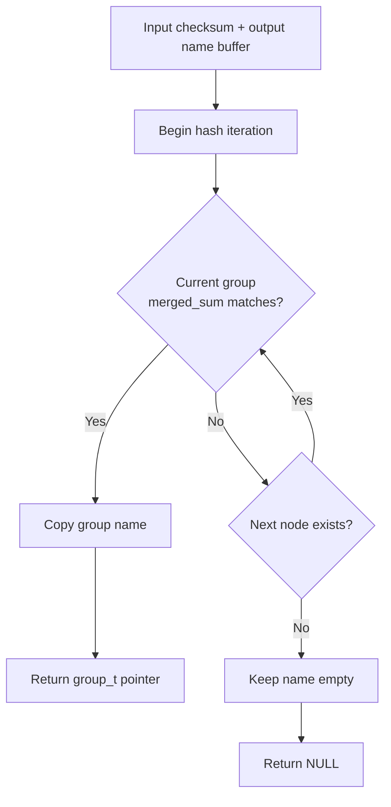
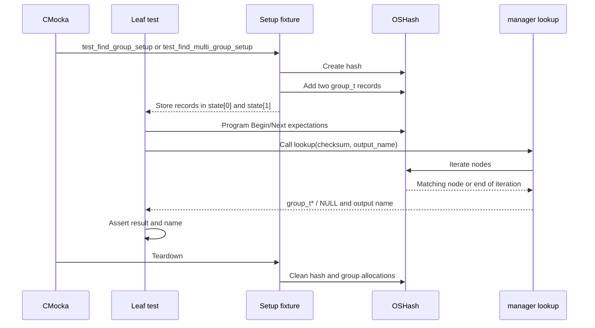
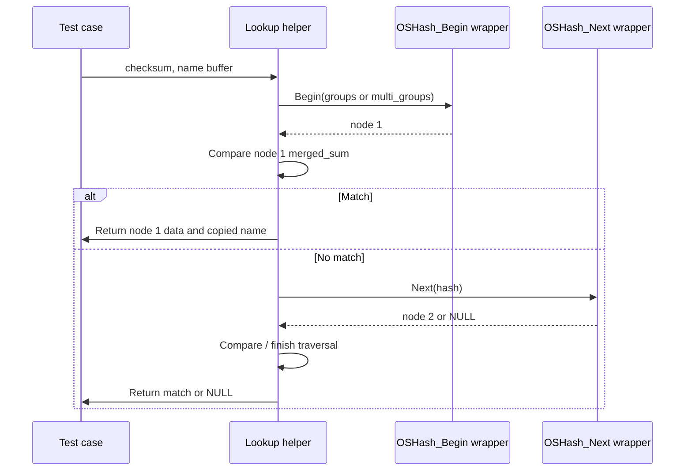
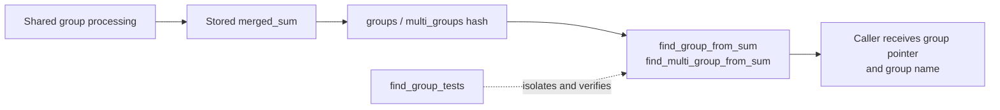

# `find_group_tests`

`find_group_tests` is the focused CMocka test group for the checksum-to-group lookup helpers in Wazuh Remoted’s manager implementation. It verifies that `find_group_from_sum` and `find_multi_group_from_sum` locate a matching `group_t` in their respective global hash tables, copy the matching group name into the caller-provided buffer, and report a miss with a null return and an unchanged empty name buffer.

This page documents only the `find_group_tests` leaf. The surrounding test harness, shared-file generation, agent group assignment, and control-message behavior are described in [test manager remoted test infrastructure](test_manager_remoted_test_infrastructure.md) and [remoted group management](remoted_group_management.md). The daemon-wide context is available in [remoted](remoted.md).

## Scope and module position

The tests are defined in `src/unit_tests/remoted/test_manager.c` and are registered under the `test_manager_remoted` suite. The module tree exposes six components:

| Component | Role |
|---|---|
| `test_find_group_from_file_found` | Positive lookup against `groups`. |
| `test_find_group_from_file_not_found` | Negative lookup against `groups`. |
| `test_find_group_setup` | Creates two ordinary groups and installs them in the global hash. |
| `test_find_multi_group_from_file_found` | Positive lookup against `multi_groups`. |
| `test_find_multi_group_from_file_not_found` | Negative lookup against `multi_groups`. |
| `test_find_multi_group_setup` | Creates two multi-group records and installs them in the global hash. |

The production implementation is included directly from `../../remoted/manager.c`. This makes the tests white-box tests: they can call the manager helpers and observe global state without starting a remoted process.

## Architecture

The lookup tests have no filesystem, Wazuh DB, socket, or network dependency. They model the manager’s already-built in-memory indexes and control hash traversal through wrapped `OSHash` iteration calls.

## Data model and lookup contract

Each fixture creates two records with distinct checksum-like `merged_sum` values:

| Hash table | Record names | Values used by the tests |
|---|---|---|
| `groups` | `test_default`, `test_test_default` | `ABCDEF1234567890`, `ABCDEF1234567809` |
| `multi_groups` | `test_default2`, `test_test_default2` | `1234567890ABCDEF`, `1234567890ABCDFE` |

The tests establish the following observable contract:

1. The helper iterates the supplied hash table rather than assuming a direct key lookup by checksum.
2. A matching `merged_sum` returns the original `group_t *` and writes its `name` to the output buffer.
3. A checksum that matches no record returns `NULL` and leaves the output name empty.
4. Ordinary groups and multi-groups use separate indexes and separate lookup helpers.

The two helpers follow the same behavioral pattern; the distinction is the global table they scan (`groups` versus `multi_groups`) and the record type/name values supplied by the fixture.

## Fixture lifecycle

Each positive and negative case is registered with `cmocka_unit_test_setup_teardown`. The suite-level setup also enables the manager test mode, while the leaf fixtures create and populate only the hash relevant to the test.

`test_find_group_setup` cleans ordinary groups with `free_group_c_group`. `test_find_multi_group_setup` uses `free_group`, which also supports cleanup of a nested file-time hash when present. The fixture teardown is important because the production manager stores these records in globals.

## Test matrix

| Test | Input | Expected traversal | Expected result |
|---|---|---|---|
| `test_find_group_from_file_found` | `ABCDEF1234567890` | First `groups` node | Returns `test_default`; output name is populated. |
| `test_find_group_from_file_not_found` | `2121212121` | Both `groups` nodes, then `NULL` | Returns `NULL`; output name remains empty. |
| `test_find_multi_group_from_file_found` | `1234567890ABCDFE` | First then second `multi_groups` node | Returns `test_test_default2`; output name is populated. |
| `test_find_multi_group_from_file_not_found` | `4545454545` | Both `multi_groups` nodes, then `NULL` | Returns `NULL`; output name remains empty. |

The “found” multi-group case intentionally matches the second node. This proves that the helper advances with `OSHash_Next` and does not only inspect the first bucket entry. The negative cases similarly prove complete traversal and clean miss behavior.

## Component interaction and mocking

CMocka expectations validate both the return value and the interaction protocol. The tests do not construct a real hash iteration order; they script `OSHash_Begin` and `OSHash_Next` to make each branch deterministic. The `OSHashNode.data` field points at the fixture-owned `group_t`, allowing the returned pointer and copied name to be checked against the original object.

## Relationship to production behavior

In the wider manager, merged group configuration is represented by a checksum and is associated with agent group state. The lookup helpers provide a small in-memory reverse lookup used by group-management logic; this leaf does not test checksum generation, file merging, agent assignment, or persistence. Those responsibilities and their dependencies are covered by [remoted group management](remoted_group_management.md).

## Maintenance notes

- Add or update a positive case when the checksum/name representation or hash-table ownership changes.
- Preserve a miss case for each lookup table; it verifies both full traversal and output-buffer initialization semantics.
- If lookup changes from iteration to another indexing strategy, update the `OSHash_Begin`/`OSHash_Next` expectations and document the new dependency boundary.
- Keep fixture cleanup paired with the allocation path. Global `groups` and `multi_groups` must not leak into neighboring manager tests.

