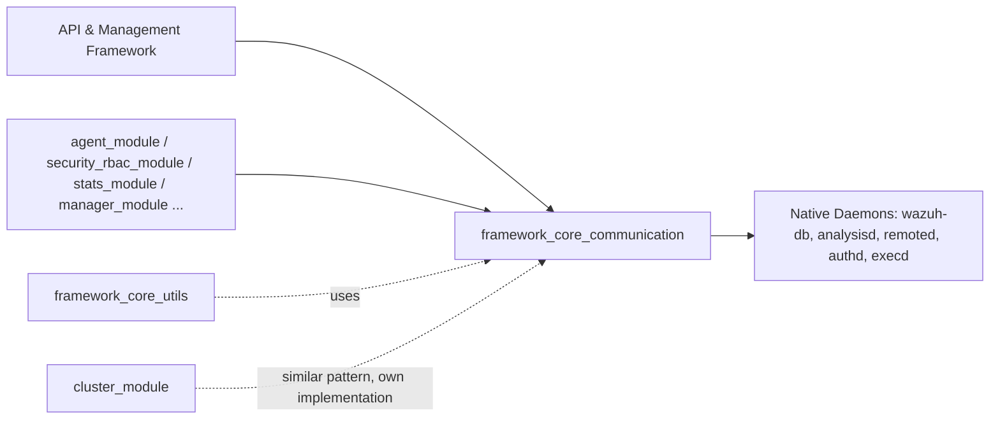
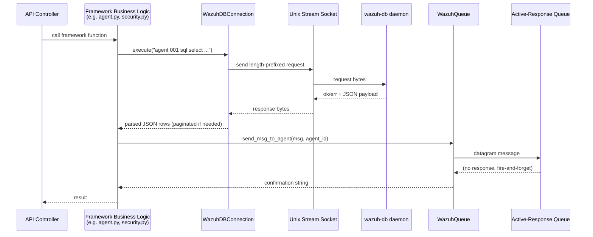

# Framework Core Communication

## 1. Introduction and Purpose

The **`framework_core_communication`** module is the low-level communication backbone of the Wazuh Python framework (`framework/wazuh/core`). It provides the primitive building blocks that every higher-level Wazuh framework module (`agent`, `security`, `manager`, `stats`, `cluster`, etc.) uses to talk to the native Wazuh daemons (`wazuh-db`, `analysisd`, `remoted`, `authd`, `execd`, etc.) and to produce consistent, rotated log files.

Concretely, this module offers four kinds of primitives:

1. **Unix datagram queue clients** – fire-and-forget messages sent to daemons that listen on `SOCK_DGRAM` Unix sockets (e.g. the active-response/analysisd queue).
2. **Unix stream socket clients** (sync & async) – request/response communication with daemons that use a 4-byte length-prefixed framing protocol over `SOCK_STREAM` Unix sockets (e.g. `authd`, `remoted`, `task-manager`, `wazuh-db`).
3. **`wazuh-db` specialized clients** – higher-level wrappers around the stream-socket protocol (SQL-like query pagination, JSON decoding, date parsing) plus an alternative **HTTP-over-Unix-socket** client used by newer `wazuh-db` endpoints.
4. **Logging infrastructure** – a rotating, permission-aware logger (`WazuhLogger`) used by every Wazuh Python daemon/API process to produce consistent `.log`/`.json` log files.

Because almost every functional module of the framework (agents, security/RBAC, statistics, manager, syscollector, etc.) depends on these primitives to reach the C daemons, `framework_core_communication` sits at the foundation of the [API & Management Framework (Python)](API_&_Management_Framework_(Python).md) layer, directly below [framework_core_utils](framework_core_utils.md) and consumed by virtually all business-logic modules such as [agent_module_core](agent_module_core.md), [security_rbac_module](security_rbac_module.md), [stats_module](stats_module.md), and [manager_module](manager_module.md).

## 2. Architecture Overview

The module is organized into four cohesive sub-modules, each mapped to one source file:

| Sub-module | Source File | Responsibility |
|---|---|---|
| [framework_core_communication_queue](framework_core_communication_queue.md) | `wazuh_queue.py` | Datagram-based, one-way messaging to daemons (active-response, analysisd events) |
| [framework_core_communication_sockets](framework_core_communication_sockets.md) | `wazuh_socket.py` | Generic length-prefixed stream socket clients (sync & asyncio-based), daemon registry, `wazuh_sendasync`/`wazuh_sendsync` helpers |
| [framework_core_communication_wdb](framework_core_communication_wdb.md) | `wdb.py`, `wdb_http.py` | Specialized `wazuh-db` protocol clients: SQL-oriented paginated queries (`WazuhDBConnection`/`AsyncWazuhDBConnection`) and the newer HTTP-based JSON API client (`WazuhDBHTTPClient`) |
| [framework_core_communication_logging](framework_core_communication_logging.md) | `wlogging.py` | Rotating log handlers and the `WazuhLogger` façade used across the framework and API |

### 2.1 High-Level Component Diagram

```mermaid
graph TB
    subgraph "framework_core_communication"
        Q[wazuh_queue.py<br/>BaseQueue / WazuhQueue / WazuhAnalysisdQueue]
        S[wazuh_socket.py<br/>WazuhSocket(JSON) / WazuhAsyncSocket(JSON)<br/>wazuh_sendasync / wazuh_sendsync]
        W[wdb.py<br/>WazuhDBConnection / AsyncWazuhDBConnection]
        WH[wdb_http.py<br/>WazuhDBHTTPClient]
        L[wlogging.py<br/>WazuhLogger / CustomFilter]
    end

    subgraph "Native Daemons (C)"
        AR[Active-Response Queue<br/>Unix DGRAM Socket]
        AD[analysisd Queue<br/>Unix DGRAM Socket]
        AUTHD[authd / remoted / task-manager<br/>Unix STREAM Sockets]
        WDB[(wazuh-db daemon<br/>Unix STREAM Socket)]
        WDBHTTP[(wazuh-db HTTP API<br/>Unix STREAM Socket)]
    end

    Q -->|UDP-like datagrams| AR
    Q -->|UDP-like datagrams| AD
    S -->|length-prefixed frames| AUTHD
    W -->|length-prefixed frames<br/>SQL-like commands| WDB
    WH -->|HTTP/1.1 over Unix socket| WDBHTTP

    Business[Higher-level Framework Modules<br/>agent / security / stats / manager / cluster] --> Q
    Business --> S
    Business --> W
    Business --> WH
    Business --> L

    L -.->|used for logging by| Q
    L -.->|used for logging by| S
    L -.->|used for logging by| W
```

### 2.2 Where This Module Fits in the System



`framework_core_communication` does not depend on other framework sub-modules; instead it is a *foundation* dependency. Notably:

- [framework_core_utils](framework_core_utils.md) builds `WazuhDBBackend` (a query-execution abstraction) on top of `WazuhDBConnection` from this module.
- [cluster_module](cluster_module.md) implements its own, more elaborate asyncio protocol handlers (`Handler`, `AbstractServer`) for master/worker communication; it is conceptually related but is a separate, independent implementation used specifically for cluster orchestration rather than daemon communication.
- The [wazuh_db](wazuh_db.md) C daemon and the [Agent & Manager Native Daemons (C)](Agent_&_Manager_Native_Daemons_(C).md) are the *server-side* counterparts these Python clients connect to.

## 3. Sub-module Summaries

### 3.1 [Queue Communication](framework_core_communication_queue.md)
Implements `BaseQueue`, `WazuhQueue`, and `WazuhAnalysisdQueue` — thin wrappers around Unix `SOCK_DGRAM` sockets used to fire one-way messages (active-response commands, restart/reconnect signals, and analysis events) to native daemons without waiting for a structured response.

### 3.2 [Socket Communication](framework_core_communication_sockets.md)
Implements the generic, reusable stream-socket clients: `WazuhSocket`/`WazuhSocketJSON` (blocking) and `WazuhAsyncSocket`/`WazuhAsyncSocketJSON`/`WazuhAsyncProtocol` (asyncio-based), along with the `daemons` registry and the `wazuh_sendasync`/`wazuh_sendsync` convenience coroutines/functions used throughout the API and framework to talk to `authd`, `remoted`, `task-manager`, and `wazuh-db`.

### 3.3 [Wazuh-DB Communication](framework_core_communication_wdb.md)
Implements the two flavors of `wazuh-db` clients:
- The classic binary-socket, SQL-oriented protocol (`WazuhDBConnection`, `AsyncWazuhDBConnection`) with automatic pagination/back-off for large result sets, input validation, and date-aware JSON decoding.
- The newer HTTP-over-Unix-socket JSON API client (`WazuhDBHTTPClient`) with typed response models (`AgentIDGroups`, `AgentStatus`, `AgentsSummary`) for agent-centric queries.

### 3.4 [Logging Infrastructure](framework_core_communication_logging.md)
Implements `WazuhLogger`, a configurable logger façade that adds time/size-based rotation (`TimeBasedFileRotatingHandler`, `SizeBasedFileRotatingHandler`), gzip archiving with correct file permissions, a custom `DEBUG2` level, and `CustomFilter` to route `.log` vs `.json` records to the correct handler. Used by every Wazuh Python daemon and by the API server.

## 4. Typical Communication Flow

The diagram below illustrates a representative end-to-end flow: an API request triggers a framework function that queries `wazuh-db`, and separately sends an active-response command through the queue.



## 5. Key Design Characteristics

- **Protocol layering**: `wazuh_socket.py` defines the low-level framing (4-byte little-endian length header + payload) reused by `wdb.py`'s SQL protocol, while `wdb_http.py` uses standard HTTP framing over the same kind of Unix socket transport.
- **Sync + Async duality**: nearly every primitive has both a blocking (`socket` module) and a non-blocking (`asyncio`) implementation, allowing the module to serve both the synchronous CLI/legacy code paths and the async FastAPI-based API server.
- **Resilience & pagination**: `WazuhDBConnection.execute()` automatically halves/doubles its request "slice" to work around the 64KB `wazuh-db` socket buffer limit, retrying with smaller pages on `WazuhInternalError(2009)`.
- **Consistent error mapping**: All modules raise `WazuhError`/`WazuhInternalError` with well-known numeric codes (1010-1014, 2003-2016) so that upper layers (API controllers) can convert them into consistent HTTP error responses.
- **Uniform logging**: `WazuhLogger` centralizes rotation/permission logic so every Wazuh Python daemon (`wazuh-apid`, `wazuh-clusterd`, etc., see [api_core_infrastructure_server_lifecycle](api_core_infrastructure_server_lifecycle.md) and [cluster_module](cluster_module.md)) produces logs with the same rotation semantics and file permissions.

## 6. Cross-References

- [framework_core_utils](framework_core_utils.md) – Uses `WazuhDBConnection` inside `WazuhDBBackend` to power the generic `WazuhDBQuery*` classes used across almost every business-logic module (agents, groups, MITRE, rootcheck, SCA, syscollector, etc.).
- [api_core_infrastructure_logging](api_core_infrastructure_logging.md) – API-specific logging (`alogging.py`) builds on similar formatting concepts but is a distinct component tailored to HTTP access logs; it is conceptually complementary to [framework_core_communication_logging](framework_core_communication_logging.md).
- [cluster_module](cluster_module.md) – Implements its own richer asyncio `Handler`/`AbstractServer` communication stack for master/worker synchronization; it does not directly depend on this module but shares similar low-level socket-framing philosophy.
- [wazuh_db](wazuh_db.md) – The native C daemon implementing the server side of the protocols consumed by [framework_core_communication_wdb](framework_core_communication_wdb.md).
- [agent_module_core](agent_module_core.md), [security_rbac_module](security_rbac_module.md), [stats_module](stats_module.md), [manager_module](manager_module.md), [syscollector_module_api_framework](syscollector_module_api_framework.md) – Representative consumers of this module's socket/queue/wdb clients for their daemon communication needs.
