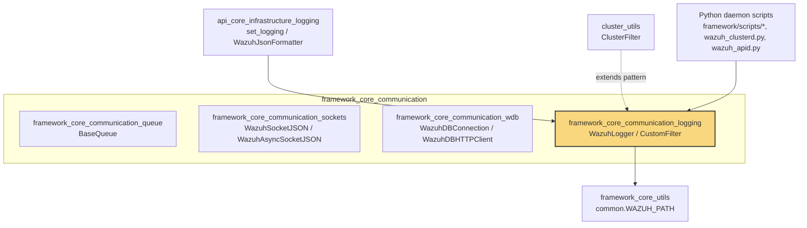
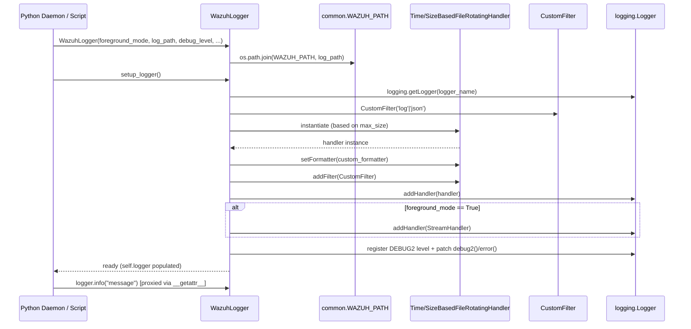
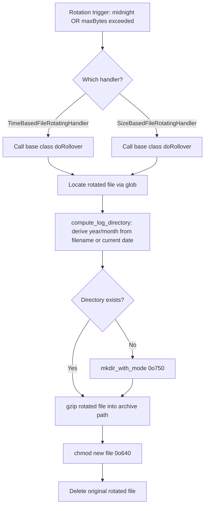
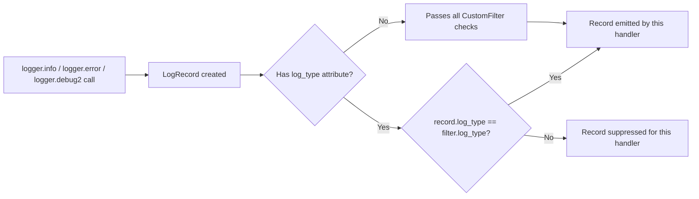
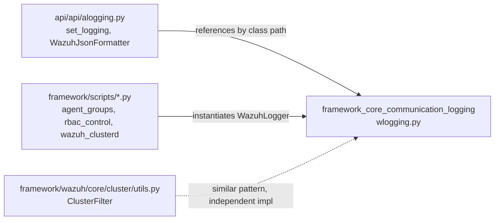

# Framework Core Communication — Logging

## Introduction

The **Framework Core Communication — Logging** module provides the foundational, reusable logging infrastructure used by all Python-based Wazuh daemons and the Wazuh API. It defines a rotating file-handler strategy (time-based and size-based), a lightweight filtering mechanism to route log records to the correct output file (plain text vs JSON), and a high-level `WazuhLogger` wrapper class that daemons instantiate to obtain a fully configured `logging.Logger` with minimal boilerplate.

This module is intentionally small and dependency-light so that it can be safely imported by virtually every other Python component in the framework — from the REST API (`api/api/alogging.py`) to CLI scripts (`framework/scripts/*`) and manager/agent daemons written in Python — without introducing circular dependencies or heavy runtime costs.

Source file: `framework/wazuh/core/wlogging.py`

Core components documented here:
- `CustomFilter`
- `WazuhLogger`
- (Supporting, non-exported classes in the same file: `TimeBasedFileRotatingHandler`, `SizeBasedFileRotatingHandler`)

## Purpose and Core Functionality

This module solves three closely related problems that every Wazuh Python daemon faces:

1. **Log rotation with correct file permissions and archival layout.** Wazuh requires rotated logs to be compressed and organized into a `year/month` directory structure with restrictive permissions (`0o640` for files, `0o750` for directories). Standard library rotating handlers do not do this, so `TimeBasedFileRotatingHandler` and `SizeBasedFileRotatingHandler` subclass `logging.handlers.TimedRotatingFileHandler` and `logging.handlers.RotatingFileHandler` respectively, overriding `doRollover()` to gzip the rotated file into the correct archive path and fix permissions.

2. **Dual-format log routing (plain text vs JSON).** Wazuh daemons (particularly the API) can emit both a human-readable `.log` file and a machine-readable `.json` file simultaneously. `CustomFilter` inspects each `LogRecord` for a `log_type` attribute and decides whether the record belongs in a given handler's output stream, allowing the same logger to safely feed two different handlers with different formatters.

3. **Uniform logger construction.** `WazuhLogger` encapsulates the common setup pattern: computing the absolute log path (via `common.WAZUH_PATH`), choosing between time-based and size-based rotation depending on configuration, wiring up console (`foreground_mode`) output, and injecting a custom `DEBUG2` logging level used extensively across Wazuh for verbose diagnostics. It exposes a `__getattr__` proxy so callers can use a `WazuhLogger` instance exactly like a standard `logging.Logger` (calling `.info()`, `.debug2()`, `.error()`, etc.) while still keeping additional metadata (`log_path`, `debug_level`, formatters) on the wrapper object itself.

## Architecture Overview

```mermaid
classDiagram
    class WazuhLogger {
        -log_path: str
        -logger: logging.Logger
        -foreground_mode: bool
        -debug_level: int|str
        -logger_name: str
        -default_formatter: logging.Formatter
        -custom_formatter: logging.Formatter
        -max_size: int
        +__init__(foreground_mode, log_path, debug_level, logger_name, custom_formatter, tag, max_size)
        +setup_logger(handler)
        +__getattr__(item) object
    }

    class CustomFilter {
        -log_type: str
        +__init__(log_type)
        +filter(record) bool
    }

    class TimeBasedFileRotatingHandler {
        +doRollover()
        +compute_log_directory(rotated_filepath) str
    }

    class SizeBasedFileRotatingHandler {
        +doRollover()
        +compute_log_directory() str
    }

    TimeBasedFileRotatingHandler --|> "logging.handlers.TimedRotatingFileHandler" : extends
    SizeBasedFileRotatingHandler --|> "logging.handlers.RotatingFileHandler" : extends

    WazuhLogger ..> CustomFilter : attaches to handlers
    WazuhLogger ..> TimeBasedFileRotatingHandler : creates (default, max_size=0)
    WazuhLogger ..> SizeBasedFileRotatingHandler : creates (max_size>0)
    WazuhLogger ..> "logging.Logger" : wraps / proxies via __getattr__
```

### Key Design Points

- **Composition over inheritance for the logger wrapper**: `WazuhLogger` does not subclass `logging.Logger`; instead it holds a reference to a standard logger instance and forwards attribute access. This keeps the wrapper free to carry Wazuh-specific configuration (paths, rotation policy) without polluting the standard logging API surface.
- **Handler selection is driven by `max_size`**: if `max_size == 0`, rotation is time-based (midnight rollover); otherwise it is size-based. This mirrors the API's `logs.max_size.enabled` configuration option (see `set_logging` in the API's logging module).
- **`CustomFilter` is format-driven, not level-driven**: the filter decision is based on the file extension convention (`.log` → `'log'` filter, `.json` → `'json'` filter) combined with an optional `log_type` attribute set on individual `LogRecord` instances, letting a single logger safely fan out records to multiple destination files.
- **Path resolution dependency**: `WazuhLogger.__init__` joins `log_path` with `common.WAZUH_PATH`, tying this module to [`framework_core_utils`](framework_core_utils.md) for installation-path discovery (`find_wazuh_path`).

## Module Position in the System

`framework_core_communication_logging` is a **leaf child** of `framework_core_communication`, which itself groups the lower-level networking/IPC primitives of the Python framework core.



### Relationship to Sibling Modules

| Module | Relationship |
|---|---|
| [`framework_core_communication_queue`](framework_core_communication_queue.md) | Sibling; provides `BaseQueue` for socket/queue IPC. No direct dependency on logging, but daemons typically use both together. |
| [`framework_core_communication_sockets`](framework_core_communication_sockets.md) | Sibling; `WazuhSocketJSON`/`WazuhAsyncSocketJSON` handle raw socket communication with `wazuh-db` and other daemons. Errors from these components are typically logged via a `WazuhLogger` instance. |
| [`framework_core_communication_wdb`](framework_core_communication_wdb.md) | Sibling; database connection classes (`WazuhDBConnection`, `AsyncWazuhDBConnection`) that report failures through the logging infrastructure. |
| [`framework_core_utils`](framework_core_utils.md) | Parent-level dependency; supplies `common.WAZUH_PATH`/`find_wazuh_path()` used to resolve the absolute log file path. |
| [`api_core_infrastructure`](api_core_infrastructure.md) | Downstream consumer; `api/api/alogging.py::set_logging()` references `wazuh.core.wlogging.CustomFilter`, `TimeBasedFileRotatingHandler`, and `SizeBasedFileRotatingHandler` by fully-qualified class path in a `dictConfig`-style logging configuration, and `WazuhJsonFormatter` complements `CustomFilter` for JSON-format logs. |
| `cluster_utils` (`framework/wazuh/core/cluster/utils.py::ClusterFilter`) | Downstream consumer; the cluster daemon defines its own filter class following the same pattern as `CustomFilter` for routing cluster-specific log messages. |

## Component Details

### `CustomFilter`

A minimal `logging.Filter`-compatible class (duck-typed; does not subclass `logging.Filter` but implements the required `filter(record)` method) used to decide whether a given `LogRecord` should be emitted by a specific handler.

**Behavior:**
- Constructed with a `log_type` string (typically `'log'` or `'json'`).
- `filter(record)` returns `True` if the record has no `log_type` attribute (meaning it applies to all handlers) **or** if the record's `log_type` matches this filter's configured type.
- Returns `False` otherwise, suppressing the record from that particular handler.

This allows code to selectively route certain messages to only the JSON log or only the plain-text log by setting `extra={'log_type': 'json'}` (or `'log'`) when calling a logging method, while all other calls remain visible on every handler.

### `WazuhLogger`

The primary public interface of this module. Wraps logger construction into a two-step API: `__init__()` captures configuration, `setup_logger()` performs the actual `logging.Logger` construction and handler attachment.

**Constructor parameters:**

| Parameter | Type | Purpose |
|---|---|---|
| `foreground_mode` | `bool` | When `True`, adds a `StreamHandler` to `stderr`/`stdout` in addition to file handlers — used when a daemon runs attached to a terminal (`-f` / `--foreground` flags). |
| `log_path` | `str` | Path to the log file, relative to `common.WAZUH_PATH`. |
| `debug_level` | `int` \| `str` | Standard logging level; also gates the custom `DEBUG2` level. |
| `logger_name` | `str` | Name registered with `logging.getLogger()`; default `'wazuh'`. |
| `custom_formatter` | `callable` | Optional `logging.Formatter` subclass (e.g., `WazuhJsonFormatter`) for structured output. |
| `tag` | `str` | Format string for the default formatter. |
| `max_size` | `int` | If `> 0`, selects size-based rotation; if `0`, selects midnight time-based rotation. |

**`setup_logger(handler=None)` behavior:**
1. Retrieves (or creates) a named logger via `logging.getLogger(self.logger_name)` and disables propagation to avoid duplicate log lines in parent loggers.
2. Determines the `CustomFilter` type from the file extension of `log_path` (`.log` → `'log'`, otherwise `'json'`).
3. If no explicit `handler` is supplied, instantiates either `TimeBasedFileRotatingHandler` or `SizeBasedFileRotatingHandler` based on `self.max_size`.
4. Attaches the chosen (or supplied) handler with the configured formatter and `CustomFilter`.
5. If `foreground_mode` is enabled, adds a second `StreamHandler` using the default formatter and a `'log'`-type `CustomFilter` (foreground output is always plain text).
6. Registers a custom `DEBUG2` level (numeric value `5`, below standard `DEBUG`) and monkey-patches `logging.Logger` with `debug2()` and an enhanced `error()` method that automatically includes exception tracebacks when `DEBUG2` is enabled.
7. Stores the fully configured `logging.Logger` object in `self.logger`.

**`__getattr__(item)` proxy:**
Allows a `WazuhLogger` instance to transparently expose the underlying `logging.Logger`'s methods (`info`, `warning`, `debug2`, etc.) as well as its own instance attributes, raising `AttributeError` only if neither has the requested attribute. This makes `WazuhLogger` a drop-in replacement for `logging.Logger` in most call sites.

## Data / Control Flow

### Logger Initialization Flow



### Log Rotation and Archival Flow



### Dual-Format Filtering Flow



## Usage Pattern Across the System

Although this module itself contains no daemon-specific logic, its classes are referenced by name across several other parts of the codebase, most notably:

- **`api/api/alogging.py::set_logging()`** (see [`api_core_infrastructure`](api_core_infrastructure.md)) builds a `dictConfig`-compatible dictionary that references `wazuh.core.wlogging.CustomFilter`, `wazuh.core.wlogging.TimeBasedFileRotatingHandler`, and `wazuh.core.wlogging.SizeBasedFileRotatingHandler` by fully qualified path strings, letting `logging.config.dictConfig` instantiate them dynamically for the REST API's `wazuh-api` logger. It complements them with `WazuhJsonFormatter` for structured JSON logs.
- **Manager/agent CLI daemons** (e.g., `framework/scripts/agent_groups.py`, `framework/scripts/rbac_control.py`, `framework/scripts/wazuh_clusterd.py`) instantiate `WazuhLogger` directly to obtain a ready-to-use logger without duplicating rotation/formatting logic.
- **Cluster daemon** (`framework/wazuh/core/cluster/utils.py::ClusterFilter`, documented in `cluster_utils`) follows the same filter pattern established by `CustomFilter`, though it is implemented as a separate class tailored to cluster message routing.



## Summary

This module underpins consistent, safe, and permission-correct logging across the entire Python side of the Wazuh framework. By centralizing rotation strategy (`TimeBasedFileRotatingHandler`, `SizeBasedFileRotatingHandler`), format-based routing (`CustomFilter`), and ergonomic logger construction (`WazuhLogger`), it eliminates duplicated logging boilerplate in the API, CLI scripts, and daemons, while enforcing Wazuh's operational requirements around log archival directory structure and file permissions.

For related communication primitives (queues, sockets, wazuh-db clients) that typically rely on this logging module for error/diagnostic reporting, see:
- [`framework_core_communication_queue`](framework_core_communication_queue.md)
- [`framework_core_communication_sockets`](framework_core_communication_sockets.md)
- [`framework_core_communication_wdb`](framework_core_communication_wdb.md)

For the broader utility layer this module depends on (path resolution, configuration), see [`framework_core_utils`](framework_core_utils.md).

For how this logging infrastructure is consumed at the API layer, see [`api_core_infrastructure`](api_core_infrastructure.md).
