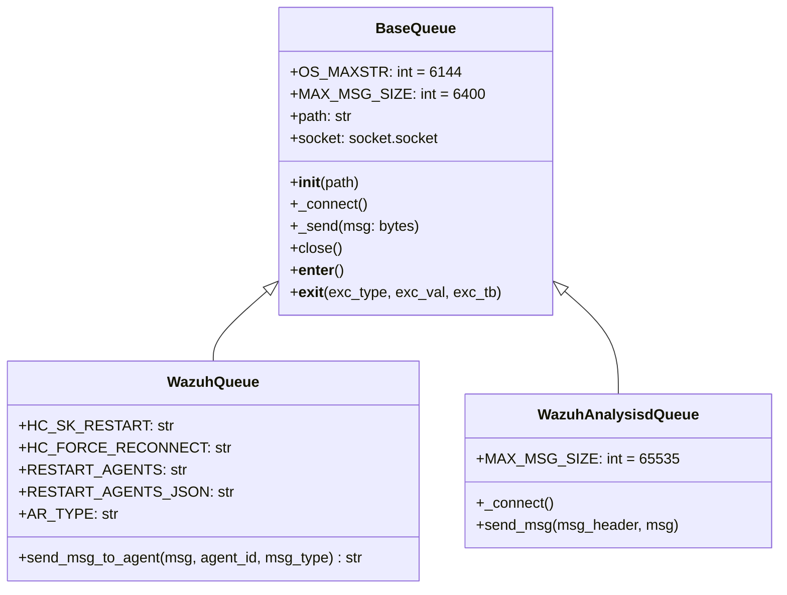
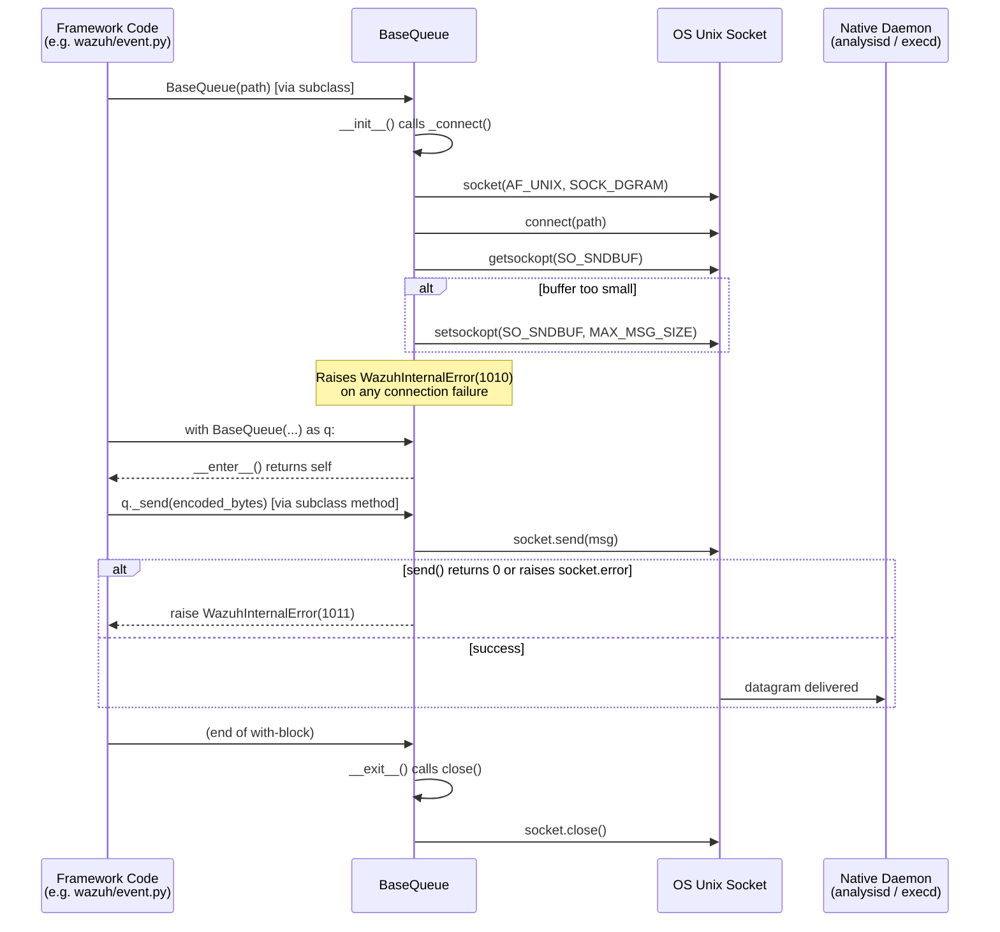
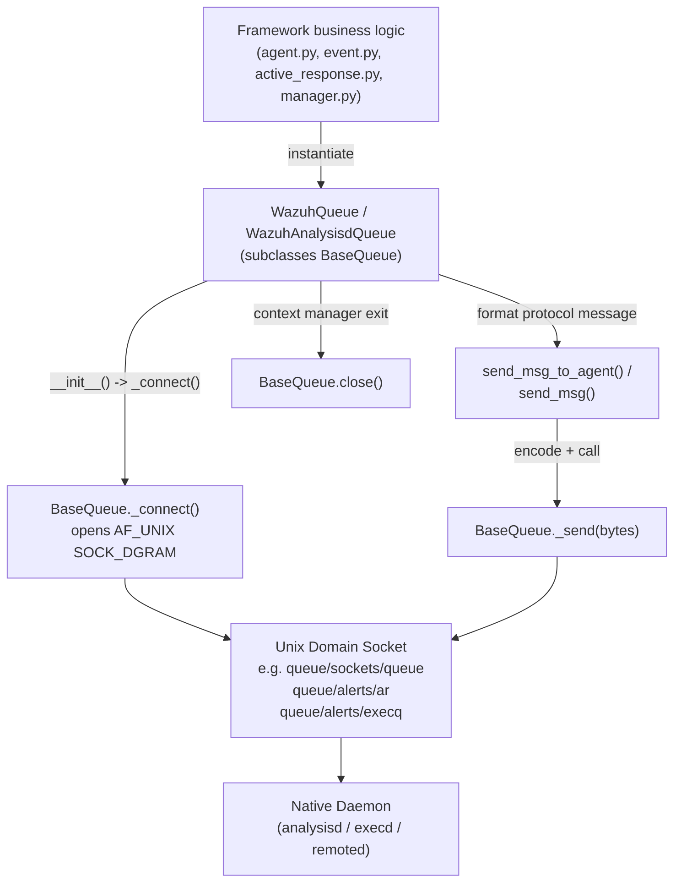

# Framework Core Communication - Queue

## Introduction

The `framework_core_communication_queue` module provides the foundational Unix Domain Socket (UDS) datagram queue abstraction used throughout the Wazuh Python framework to communicate with native C daemons (`analysisd`, `execd`, `remoted`, etc.) via message queues. It defines the low-level `BaseQueue` class — a lightweight wrapper around a `SOCK_DGRAM` Unix socket — that other, more specialized queue classes (`WazuhQueue` and `WazuhAnalysisdQueue`, both defined in the same source file but outside the scope of this leaf module) build upon to implement protocol-specific message framing and sending logic.

This module sits at the bottom of the `framework_core_communication` hierarchy, alongside sibling modules that handle other communication primitives (sockets, `wdb` connections, and logging). It has no outward-facing REST API surface of its own; instead, it is a **supporting infrastructure** module consumed internally by higher-level framework code (e.g., `framework/wazuh/active_response.py`, `framework/wazuh/event.py`, `framework/wazuh/manager.py`) whenever a Python component needs to push a message into one of Wazuh's internal message queues.

## Purpose and Core Functionality

The core responsibility of this module is to:

1. **Establish and manage a Unix Domain Socket (`AF_UNIX`, `SOCK_DGRAM`) connection** to a queue file located on the Wazuh filesystem (e.g., `queue/sockets/queue`, `queue/alerts/ar`).
2. **Tune socket buffer sizes** to accommodate the maximum message size supported by Wazuh's internal queue protocol.
3. **Provide a safe, low-level `_send()` primitive** that raises a standardized `WazuhInternalError` if the socket write fails or sends zero bytes.
4. **Support context-manager semantics** (`with BaseQueue(path) as q: ...`) so that sockets are reliably closed even in the presence of exceptions.

`BaseQueue` intentionally does **not** implement any message-formatting or protocol logic — that responsibility is delegated to subclasses such as `WazuhQueue` (which implements the `msg_to_agent`/active-response protocol used by `execd`) and `WazuhAnalysisdQueue` (which implements the raw event-forwarding protocol used by `analysisd`). This separation keeps the socket-handling code reusable and testable independently from the message-encoding logic.

## Architecture

### Class Hierarchy



`BaseQueue` is the module's sole component in this documentation scope; `WazuhQueue` and `WazuhAnalysisdQueue` are shown for context since they directly extend it and reside in the same file (`framework/wazuh/core/wazuh_queue.py`), but their protocol logic belongs conceptually to consumer modules such as [active_response_module](active_response_module.md) and [event_module](event_module.md).

### Connection Lifecycle



## Data Flow: How Higher-Level Code Uses `BaseQueue`



## Key Design Characteristics

| Aspect | Detail |
|---|---|
| **Socket type** | `AF_UNIX` / `SOCK_DGRAM` (connectionless, message-oriented) |
| **Buffer tuning** | Ensures `SO_SNDBUF` is at least `MAX_MSG_SIZE` (6400 bytes for `BaseQueue`/`WazuhQueue`; overridden to 65535 in `WazuhAnalysisdQueue`) |
| **Error handling** | Connection failures raise `WazuhInternalError(1010)`; send failures raise `WazuhInternalError(1011)` |
| **Resource management** | Implements `__enter__`/`__exit__` for deterministic socket cleanup via `with` statements |
| **Extensibility** | Subclasses override `_connect()` (e.g., `WazuhAnalysisdQueue`) or add new send methods (e.g., `WazuhQueue.send_msg_to_agent`) without touching the base socket logic |

## Component Reference

### `BaseQueue`

| Member | Type | Description |
|---|---|---|
| `OS_MAXSTR` | class attr | Maximum string size constant (6144), mirrors the native `OS_SIZE_6144` macro used in Wazuh's C codebase. |
| `MAX_MSG_SIZE` | class attr | `OS_MAXSTR + 256` = 6400, the max datagram size the socket buffer is sized for. |
| `path` | instance attr | Filesystem path to the Unix Domain Socket. |
| `socket` | instance attr | The underlying `socket.socket` object. |
| `__init__(self, path)` | method | Stores `path` and immediately calls `_connect()`. |
| `_connect(self)` | method | Creates the `AF_UNIX`/`SOCK_DGRAM` socket, connects it, and ensures the send buffer is large enough. Raises `WazuhInternalError(1010)` on any failure. |
| `_send(self, msg: bytes)` | method | Sends raw bytes over the socket. Raises `WazuhInternalError(1011)` if zero bytes are sent or a `socket.error` occurs. |
| `close(self)` | method | Closes the underlying socket. |
| `__enter__` / `__exit__` | dunder methods | Enable `with BaseQueue(path) as q:` usage, guaranteeing `close()` is invoked. |

## Relationship to Other Modules

- **[framework_core_communication_sockets](framework_core_communication_sockets.md)** — Provides `WazuhSocket` / `WazuhSocketJSON` / async socket variants used for **request/response (`SOCK_STREAM`)** communication, complementary to this module's **fire-and-forget datagram** model. Both live under the parent `framework_core_communication` grouping.
- **[framework_core_communication_wdb](framework_core_communication_wdb.md)** — Handles the specialized `wdb` (Wazuh DB) socket protocol; conceptually a sibling communication channel but built on `WazuhSocket`, not `BaseQueue`.
- **[framework_core_communication_logging](framework_core_communication_logging.md)** — Provides the `WazuhLogger`/`CustomFilter` classes; used across the framework for structured logging, independent of the queue mechanism.
- **[active_response_module](active_response_module.md)** — `framework/wazuh/active_response.py` uses `WazuhQueue` (built on `BaseQueue`) to send active-response commands to agents via `execd`.
- **[event_module](event_module.md)** — `framework/wazuh/event.py`'s `send_event_to_analysisd` uses `WazuhAnalysisdQueue` (built on `BaseQueue`) to forward custom events into the analysis engine.
- **[manager_module](manager_module.md)** — `framework/wazuh/manager.py`'s `restart` functionality uses `WazuhQueue.send_msg_to_agent` with `RESTART_AGENTS`/`RESTART_AGENTS_JSON` messages to trigger daemon restarts.
- **[framework_core_utils](framework_core_utils.md)** — Supplies `WazuhResult`/`AffectedItemsWazuhResult` types that wrap the outcomes of queue operations for API responses, and `find_wazuh_path()` used to resolve queue socket file locations relative to the Wazuh installation.

## Usage Pattern

Typical consumption follows this pattern (illustrated conceptually, not literal code from this module):

```python
from wazuh.core.wazuh_queue import WazuhQueue  # subclass of BaseQueue

with WazuhQueue(queue_socket_path) as wq:
    result_message = wq.send_msg_to_agent(msg=command, agent_id=agent_id, msg_type=WazuhQueue.AR_TYPE)
```

The `with` block guarantees the socket opened by `BaseQueue.__init__` → `_connect()` is closed via `BaseQueue.__exit__` → `close()`, regardless of whether `send_msg_to_agent` succeeds or raises.

## Error Codes Reference

| Exception | Code | Raised When |
|---|---|---|
| `WazuhInternalError` | 1010 | Socket creation or `connect()` to the queue path fails (e.g., daemon not running, socket file missing/misconfigured). |
| `WazuhInternalError` | 1011 | `socket.send()` returns 0 bytes sent, or raises a `socket.error` (e.g., queue full, broken pipe). |

These errors propagate up to callers (e.g., API controllers) where they are typically translated into HTTP 5xx responses by the [api_core_infrastructure](api_core_infrastructure.md) error-handling middleware.
