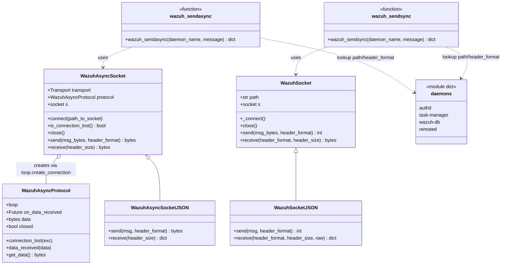
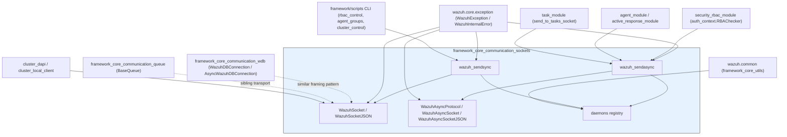
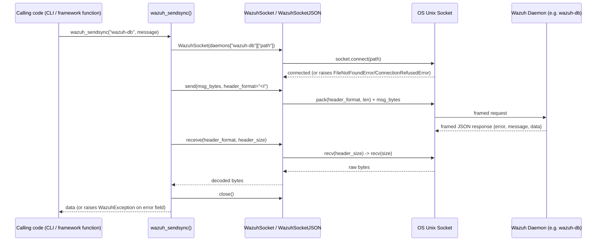
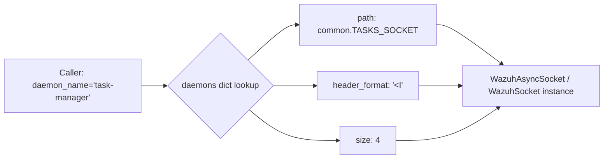
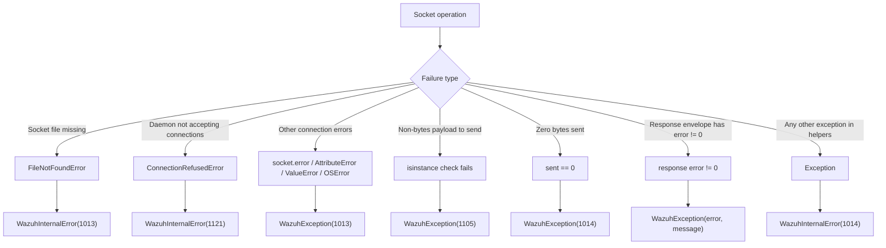

# Framework Core Communication — Sockets

## Introduction

The **`framework_core_communication_sockets`** module is the low-level transport layer that the Wazuh Python framework (`framework/wazuh`) uses to talk to the native C/C++ daemons (`wazuh-db`, `wazuh-authd`, `wazuh-remoted`, `task-manager`, etc.) over **Unix domain sockets**. It provides both a **synchronous** socket client (`WazuhSocket` / `WazuhSocketJSON`) built on the standard `socket` module, and an **asynchronous** client (`WazuhAsyncSocket` / `WazuhAsyncSocketJSON`) built on `asyncio.Protocol`, together with the `wazuh_sendasync` / `wazuh_sendsync` convenience helpers that resolve a daemon name to its socket path and wire protocol parameters.

This module is the single source of truth for the **wire framing protocol** used across almost every daemon socket in Wazuh: a fixed-size binary length header (packed with `struct.pack`) followed by a JSON-encoded (or raw-bytes) payload. Every higher-level component that needs to reach a daemon — the REST API, RBAC engine, the CLI scripts, the cluster subsystem, or the `WazuhDBConnection` — ultimately relies on the primitives defined here (directly, or through the sibling `framework_core_communication_wdb` module, which layers a query-oriented API on top of similar socket semantics).

It belongs to the **`framework_core_communication`** parent group, alongside:

- [`framework_core_communication_queue`](framework_core_communication_queue.md) — `BaseQueue`, used for fire-and-forget messages to the Wazuh analysis/alerting queue (`ossec` queue), a different transport built on `socket.SOCK_DGRAM`/similar rather than the length-prefixed TCP-like framing used here.
- [`framework_core_communication_wdb`](framework_core_communication_wdb.md) — `WazuhDBConnection` / `AsyncWazuhDBConnection` and the HTTP-based `WazuhDBHTTPClient`, which implement a request/response query protocol for `wazuh-db` that is conceptually similar to (and in the async case, directly built for use alongside) the socket classes documented here.
- [`framework_core_communication_logging`](framework_core_communication_logging.md) — `WazuhLogger`/`CustomFilter`, used to log socket/communication errors surfaced by this module.

For broader context on how these communication primitives fit into daemon management, configuration, and query building, see [`framework_core_utils`](framework_core_utils.md) (which defines `WazuhDBBackend`, shared constants such as socket paths in `wazuh.common`, and the exception hierarchy `WazuhException`/`WazuhInternalError` raised by this module).

## Purpose and Core Functionality

| Component | Type | Responsibility |
|---|---|---|
| `WazuhSocket` *(base, referenced)* | Class | Low-level synchronous Unix socket wrapper: connect, send (length-prefixed), receive (length-prefixed). |
| `WazuhSocketJSON` | Class | Synchronous socket that serializes/deserializes payloads as JSON and unwraps the standard `{error, message, data}` response envelope. |
| `WazuhAsyncProtocol` | Class | `asyncio.Protocol` implementation that buffers incoming bytes and exposes them via an awaitable `Future` (`on_data_received`). |
| `WazuhAsyncSocket` *(base, used by `WazuhAsyncSocketJSON`)* | Class | Async equivalent of `WazuhSocket`, built on `asyncio`'s `create_connection`/`Transport`/`Protocol` machinery. |
| `WazuhAsyncSocketJSON` | Class | Async socket that (de)serializes JSON payloads and raises `WazuhException` on error responses, mirroring `WazuhSocketJSON` but non-blocking. |
| `wazuh_sendasync` | Function | High-level helper: given a daemon name (`authd`, `task-manager`, `wazuh-db`, `remoted`), opens an async socket, sends a message, awaits the response, and closes the connection — used pervasively by API controllers and framework business-logic modules. |
| `wazuh_sendsync` *(function, in same file)* | Function | Synchronous counterpart to `wazuh_sendasync`, used by CLI scripts and non-async code paths. |
| `create_wazuh_socket_message` *(helper, in same file)* | Function | Builds the standardized envelope (`version`, `origin`, `command`, `parameters`) used by the newer socket protocol version. |
| `daemons` *(module-level dict)* | Data | Registry mapping daemon names to `{protocol, path, header_format, size}`, decoupling callers from daemon socket paths/framing details. |

### Why this module exists

Many parts of Wazuh (agent management, RBAC, active response, task management, cluster local server, etc.) need to issue a request to a daemon and get a structured reply. Rather than each module reimplementing socket framing and JSON envelope handling, this module centralizes:

1. **Connection management** — opening/closing Unix domain sockets, translating low-level OS errors (`FileNotFoundError`, `ConnectionRefusedError`) into the framework's `WazuhException`/`WazuhInternalError` hierarchy.
2. **Wire framing** — a 4-byte little-endian length header (`"<I"`) followed by the payload, matching what the C daemons expect (`recv(header_size, MSG_WAITALL)` then `recv(size, MSG_WAITALL)`).
3. **JSON envelope semantics** — daemons respond with `{"error": <int>, "message": <str>, "data": <any>}`; a non-zero `error` is converted into a raised `WazuhException` so callers can use standard exception handling instead of manually inspecting each response.
4. **Sync vs. async duality** — the REST API (built on an async web framework) uses the `asyncio`-based classes and `wazuh_sendasync`, while CLI scripts and legacy/blocking code paths use the synchronous classes and `wazuh_sendsync`.

## Architecture

### Class Diagram



### Module Dependency Diagram



## Data Flow

### Synchronous Request/Response (`WazuhSocketJSON` / `wazuh_sendsync`)



### Asynchronous Request/Response (`WazuhAsyncSocketJSON` / `wazuh_sendasync`)

```mermaid
sequenceDiagram
    participant Caller as API Controller / async framework function
    participant Async as wazuh_sendasync()
    participant ASock as WazuhAsyncSocket
    participant Proto as WazuhAsyncProtocol
    participant Loop as asyncio event loop
    participant Daemon as Wazuh Daemon (e.g. authd)

    Caller->>Async: await wazuh_sendasync("authd", message)
    Async->>ASock: connect(daemons["authd"]["path"])
    ASock->>Loop: loop.create_connection(WazuhAsyncProtocol, sock)
    Loop-->>ASock: (transport, protocol)
    Async->>ASock: await send(msg_bytes, header_format)
    ASock->>Daemon: transport.write(header+payload)
    Daemon-->>Proto: data_received(bytes)
    Proto->>Proto: on_data_received.set_result(True)
    Async->>ASock: await receive(header_size)
    ASock->>Proto: await on_data_received
    Proto-->>ASock: get_data()[header_size:]
    ASock-->>Async: raw bytes
    Async->>Async: json.loads(response); raise WazuhException if error != 0
    Async->>ASock: await close()
    Async-->>Caller: data
```

## Component Interaction

### Daemon Registry Resolution

The `daemons` dictionary decouples all callers from daemon-specific socket paths and framing parameters. Any component wanting to talk to a daemon only needs the daemon's logical name:



This registry currently covers `authd`, `task-manager`, `wazuh-db`, and `remoted`. Other daemons (e.g. `wazuh-db` queries with a different query-language framing, or the queue-based `ossec` socket) are handled by the sibling modules `framework_core_communication_wdb` and `framework_core_communication_queue` respectively, which implement their own specialized protocols rather than reusing `daemons`.

### Typical Consumers

- **`security_rbac_module`** (`framework/wazuh/rbac/auth_context.py::RBAChecker`) uses socket communication to query `authd`/`wazuh-db` for RBAC context resolution.
- **`agent_module`** and **`active_response_module`** send commands to `remoted`/`authd` sockets to add agents, request keys, or push active-response commands.
- **`task_module`** (`framework/wazuh/core/task.py::send_to_tasks_socket`) is a direct, typed consumer of the `task-manager` entry in the `daemons` registry via `wazuh_sendasync`.
- **`cluster_dapi`** and **`cluster_local_client`** (see [`cluster_dapi`](cluster_dapi.md), [`cluster_local_client`](cluster_local_client.md)) use analogous framing patterns (though implemented in `framework/wazuh/core/cluster/common.py` rather than importing this module directly) for inter-node RPC — conceptually related but architecturally separate from this module's Unix-socket daemon clients.
- **CLI scripts** (`framework/scripts/rbac_control.py`, `agent_groups.py`, `cluster_control.py`) typically use the synchronous path (`WazuhSocketJSON` / `wazuh_sendsync`) since they run outside of an event loop.

## Error Handling

All socket failures are normalized into the framework's exception hierarchy (defined in `wazuh.core.exception`, part of [`framework_core_utils`](framework_core_utils.md)):



Key behaviors:
- **`WazuhSocketJSON.receive`** unwraps the `{error, message, data}` envelope automatically unless `raw=True` is passed, in which case the full envelope is returned to the caller.
- **`WazuhAsyncSocketJSON.receive`** always unwraps the envelope and raises `WazuhException(error, message, cmd_error=True)` on non-zero error codes — callers do not need to manually check for errors.
- **`wazuh_sendasync`/`wazuh_sendsync`** re-raise any `WazuhException` raised internally unmodified, but wrap *any other* unexpected exception (e.g., DNS/OS issues) into `WazuhInternalError(1014)`, ensuring API/CLI layers always receive a well-known Wazuh exception type.

## Protocol Details

### Wire Format

```
+--------------------+---------------------------+
| Header (N bytes)    | Payload (variable length) |
| little-endian uint  | JSON-encoded UTF-8 bytes  |
+--------------------+---------------------------+
```

- Header format defaults to `"<I"` (4-byte unsigned int, little-endian), matching the `header_format`/`size` fields in the `daemons` registry.
- Payload is typically `json.dumps(...).encode()`, decoded on receipt with `json.loads(...)`.

### Message Envelope (request, newer protocol version)

`create_wazuh_socket_message` builds a standardized envelope for daemons that support the versioned protocol:

```json
{
  "version": 1,
  "origin": "<optional origin identifier>",
  "command": "<optional command name>",
  "parameters": { "...optional params..." }
}
```

### Response Envelope (from daemon)

```json
{
  "error": 0,
  "message": "ok",
  "data": { "...daemon-specific payload..." }
}
```

A non-zero `error` triggers a `WazuhException` in both the sync and async JSON socket classes.

## Related Documentation

- [`framework_core_communication_queue`](framework_core_communication_queue.md) — `BaseQueue`, the alternate transport used for pushing messages/events (e.g., active response, syscheck events) to the analysis queue rather than a request/response daemon socket.
- [`framework_core_communication_wdb`](framework_core_communication_wdb.md) — `WazuhDBConnection` / `AsyncWazuhDBConnection` / `WazuhDBHTTPClient`, the specialized query client for `wazuh-db`, which shares framing concepts with this module but implements its own query-language protocol.
- [`framework_core_communication_logging`](framework_core_communication_logging.md) — logging utilities (`WazuhLogger`) commonly used to log socket connection/communication failures.
- [`framework_core_utils`](framework_core_utils.md) — shared constants (`wazuh.common`, including daemon socket paths), the `WazuhException`/`WazuhInternalError` hierarchy, and other cross-cutting utilities depended upon by this module.
- [`task_module`](task_module.md) — concrete example of a business-logic module (`send_to_tasks_socket`) built directly on `wazuh_sendasync` and the `daemons` registry.
- [`security_rbac_module`](security_rbac_module.md) — RBAC engine (`RBAChecker`) that relies on socket communication for authorization context resolution.
- [`agent_module`](agent_module.md) and [`active_response_module`](active_response_module.md) — agent and active-response management functions that dispatch commands to daemons via this module's primitives.
- [`cluster_dapi`](cluster_dapi.md) / [`cluster_local_client`](cluster_local_client.md) — related but architecturally distinct RPC mechanisms used for inter-cluster-node communication.
