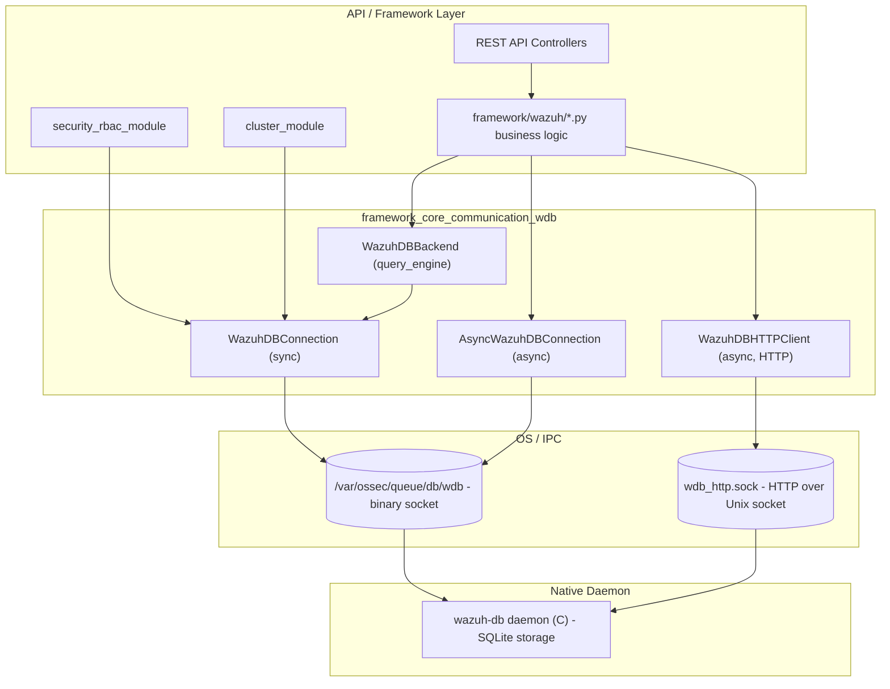
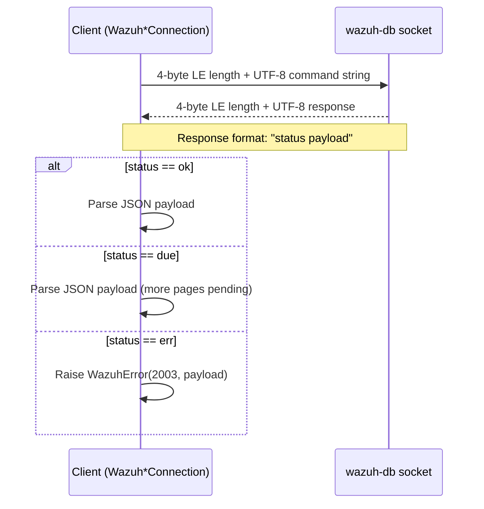
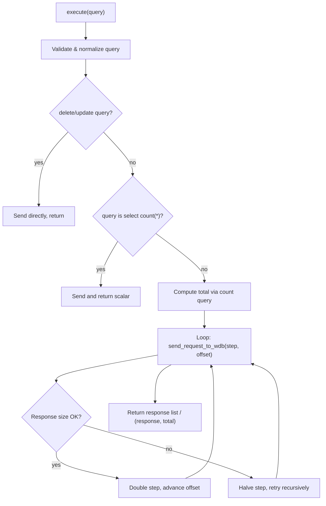
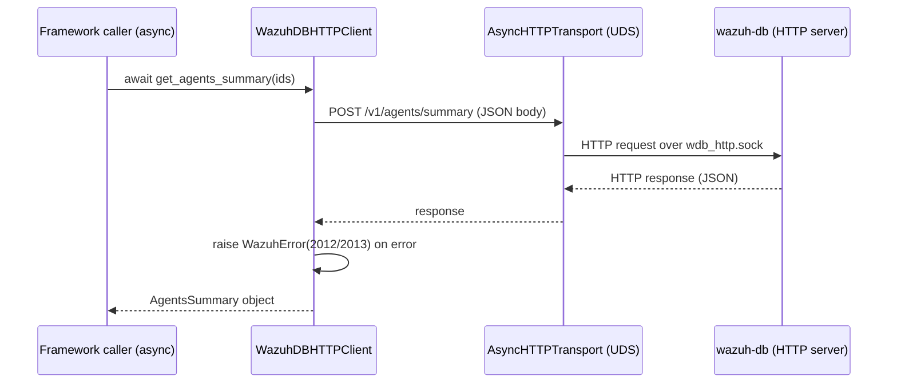
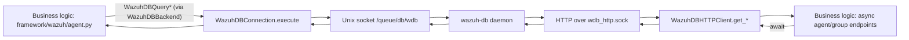

# Framework Core Communication – WazuhDB Client (`framework_core_communication_wdb`)

## 1. Purpose

This module provides the **client-side communication layer** used by the Wazuh Python framework (and, transitively, the REST API and CLI tools) to talk to the `wazuh-db` daemon — the component responsible for storing and serving agent, group, task, FIM, SCA, and syscollector information in SQLite databases.

It implements **two parallel protocols**:

| Protocol | File | Client classes | Transport | Use case |
|---|---|---|---|---|
| Legacy binary protocol | `framework/wazuh/core/wdb.py` | `WazuhDBConnection` (sync), `AsyncWazuhDBConnection` (async) | Unix domain socket, length-prefixed text frames | Bulk SQL-like queries (`agent`, `global`, `task`, `mitre` DBs), pagination, inserts/updates/deletes |
| Modern HTTP protocol | `framework/wazuh/core/wdb_http.py` | `WazuhDBHTTPClient` | HTTP/1.1 over Unix domain socket (`httpx` + `AsyncHTTPTransport`) | Structured REST-like endpoints for agent IDs, groups, summaries, sync state, restart info |

Both protocols connect to sockets exposed by the native `wazuh-db` daemon (documented in the [`wazuh_db`](wazuh_db.md) module) and are consumed throughout the framework wherever agent/group/task persistent data is required — most notably by [`framework_core_utils_query_engine`](framework_core_utils_query_engine.md) (`WazuhDBBackend`), the `agent`, `task`, `stats`, `mitre`, `security` (RBAC) and `syscollector` business-logic modules, and the cluster synchronization layer.

## 2. Architecture Overview



This module sits at the boundary between Python business logic and the native `wazuh-db` daemon. It has no dependency on other framework modules besides:

- `framework/wazuh/core/common.py` (`WDB_SOCKET`, `WDB_HTTP_SOCKET`, `MAX_SOCKET_BUFFER_SIZE`) — see [`framework_core_utils_paths_config`](framework_core_utils_paths_config.md)
- `framework/wazuh/core/exception.py` (`WazuhError`, `WazuhInternalError`)

It is a **sibling** of two other low-level communication primitives documented separately:

- [`framework_core_communication_sockets`](framework_core_communication_sockets.md) — generic synchronous/asynchronous JSON socket helpers (`WazuhSocketJSON`, `WazuhAsyncSocketJSON`, `wazuh_sendasync`) used for talking to daemons other than `wazuh-db` (e.g. `analysisd`, `execd`).
- [`framework_core_communication_queue`](framework_core_communication_queue.md) — `BaseQueue`, the low-level abstraction for writing to Wazuh's internal message queue socket.
- [`framework_core_communication_logging`](framework_core_communication_logging.md) — `WazuhLogger`/`CustomFilter`, the logging infrastructure shared across the framework, including by this module's callers.

## 3. Sub-Sections

### 3.1 Legacy Binary Protocol (`wdb.py`)

#### Components

- **`WazuhDBConnection`** — Synchronous, blocking client. Opens a persistent `AF_UNIX`/`SOCK_STREAM` connection to `common.WDB_SOCKET` at construction time and keeps it open for the lifetime of the object.
- **`AsyncWazuhDBConnection`** — Asynchronous counterpart built on `asyncio.open_unix_connection`. Connection is lazily established on the first call to `_send`/`run_wdb_command`.

#### Wire Protocol

Both classes speak the same framing protocol used by all Wazuh Unix-socket daemons:



Commands follow a small DSL, e.g.:

```
agent 001 sql select * from sys_osinfo
global sql select name from agent
task delete <id>
mitre sql select * from technique
```

`WazuhDBConnection.__query_input_validation` enforces this DSL strictly (rejects `;`, validates verbs `select/delete/update`, validates agent ID is numeric, etc.) before anything is sent to the socket, protecting against malformed or unsafe queries — see `WazuhError(2004)`.

#### Pagination / Chunking (`WazuhDBConnection.execute`)

Because `wazuh-db` responses are capped by `MAX_SOCKET_BUFFER_SIZE` (64 KB), `execute()` implements **adaptive chunking**:

1. Detects existing `limit`/`offset` clauses in the query and replaces them with placeholders (`:limit`, `:offset`).
2. Computes the `count(*)` of matching rows via a rewritten `countq` (stripping `GROUP BY` if present).
3. Iteratively requests pages, starting from `self.request_slice` (default `500`) rows, **doubling the slice size** on success and **halving it (recursively)** whenever the response would exceed the socket buffer (`WazuhInternalError(2009)`).
4. Accumulates all pages into a single `response` list, optionally returning `(response, total)` when `count=True`.



#### Key Methods

| Method | Class | Description |
|---|---|---|
| `open_connection()` | `AsyncWazuhDBConnection` | Establishes the async Unix socket connection. |
| `close()` | Both | Closes the underlying socket/writer. |
| `_send(msg, raw)` | Both | Low-level framed send/receive with JSON decoding (`json_decoder` translates Wazuh's `"(null)"` sentinel and date-formatted strings into proper Python types). |
| `run_wdb_command(command)` | `AsyncWazuhDBConnection` | Sends a raw command and validates the `ok/err` status without further JSON parsing logic duplication. |
| `send(query, raw)` | `WazuhDBConnection` | Public wrapper around `_send`. |
| `execute(query, count, delete, update)` | `WazuhDBConnection` | Main entry point for SQL-like queries; handles validation, pagination and aggregation described above. |
| `delete_agents_db(agents_id)` | `WazuhDBConnection` | Sends a `wazuhdb remove <ids>` command to delete one or more agent databases. |
| `loads(string)` / `json_decoder(dct)` | `WazuhDBConnection` (static) | Custom JSON decoding: strips Wazuh's `"(null)"` placeholders and converts `YYYY/MM/DD HH:MM:SS` strings into timezone-aware `datetime` objects. |

### 3.2 Modern HTTP Protocol (`wdb_http.py`)

#### Components

- **`WazuhDBHTTPClient`** — Async HTTP client (based on `httpx.AsyncClient` with an `AsyncHTTPTransport` bound to a Unix socket path, `f'{common.WDB_HTTP_SOCKET}.sock'`). Exposes typed helper methods that map to specific `wazuh-db` HTTP endpoints under `http://localhost/v1`.
- **`AgentIDGroups`** — Simple data holder pairing an agent ID with its list of groups.
- **`AgentStatus`** — Data holder for the four canonical agent connection states (`active`, `disconnected`, `never_connected`, `pending`), with a `to_dict()` serializer.
- **`AgentsSummary`** — Aggregates `AgentStatus` plus OS and per-group breakdowns; also provides `to_dict()`.
- **`get_wdb_http_client()`** — Async context manager factory that yields a `WazuhDBHTTPClient`, translating low-level `httpx` exceptions (`TimeoutException`, `UnsupportedProtocol`, `ConnectError`) into `WazuhInternalError` codes (2014/2015/2016) and guaranteeing the client is closed afterward.

#### Endpoint Map

| Client Method | HTTP Endpoint | Purpose |
|---|---|---|
| `get_agents_ids()` | `GET /agents/ids` | List all agent IDs known to `wazuh-db`. |
| `get_agent_groups(agent_id)` | `GET /agents/{id}/groups` | Groups for a single agent. |
| `get_agents_groups()` | `GET /agents/ids/groups` | Groups for all agents (bulk), returned as `list[AgentIDGroups]`. |
| `get_group_agents(group_name)` | `GET /agents/ids/groups/{group}` | Agent IDs belonging to a group. |
| `get_agents_summary(agent_ids)` | `POST /agents/summary` | Aggregated `AgentsSummary` (status/OS/group counts). |
| `get_agents_sync()` / `set_agents_sync(data)` | `GET`/`POST /agents/sync` | Read/write agents synchronization bookkeeping. |
| `get_agents_restart_info(ids, negate)` | `POST /agents/restartinfo` | Restart-related metadata for a filtered/negated agent-ID set. |



#### Error Handling

- Any HTTP error status (`response.is_error`) is converted to `WazuhError(2012, extra_message=response.text)`.
- Low-level transport failures (`httpx.RequestError`) are converted to `WazuhError(2013, extra_message=str(exc))`.
- Connection-establishment failures (`OSError`, `TimeoutException`) at construction time raise `WazuhInternalError(2011)`.
- The `get_wdb_http_client()` context manager additionally normalizes `TimeoutException` → `WazuhInternalError(2014)`, `UnsupportedProtocol` → `WazuhInternalError(2015)`, and `ConnectError` → `WazuhInternalError(2016)`.

## 4. Data Flow: Typical Consumer Interaction



- Synchronous query-object classes (e.g. `WazuhDBQueryGroup`, `WazuhDBQueryMultigroups` in [`agent_module_core`](agent_module_core.md), or `WazuhDBQueryTask` in the `task_module`) all funnel through `WazuhDBBackend`, which itself wraps a `WazuhDBConnection` instance to execute paginated SQL — see [`framework_core_utils_query_engine`](framework_core_utils_query_engine.md).
- Newer async code paths (agent summary/sync endpoints exposed by the REST API, cluster sync logic) prefer `WazuhDBHTTPClient` for structured, versioned access without hand-rolling SQL strings.
- `AsyncWazuhDBConnection` is used where raw async access to the legacy socket protocol is still required (e.g., cluster integrity checks) without going through the synchronous `WazuhDBBackend`.

## 5. Related Modules

- [`wazuh_db`](wazuh_db.md) — The native C daemon (`wazuh-db`) that terminates both sockets described here, including its SQL parser, global/agent DB schema management, and backup/upgrade logic.
- [`framework_core_utils_query_engine`](framework_core_utils_query_engine.md) — `WazuhDBBackend` and the generic `WazuhDBQuery*` family that build SQL and delegate transport to `WazuhDBConnection`.
- [`framework_core_communication_sockets`](framework_core_communication_sockets.md) — Sibling module for non-`wazuh-db` socket communication (`WazuhSocketJSON`, async variants).
- [`framework_core_communication_queue`](framework_core_communication_queue.md) — Sibling module for the message queue socket abstraction (`BaseQueue`).
- [`framework_core_communication_logging`](framework_core_communication_logging.md) — Sibling module for framework-wide logging used by consumers of this module.
- [`agent_module_core`](agent_module_core.md), [`task_module`](task_module.md), [`stats_module_details`](stats_module_details.md), [`mitre_module`](mitre_module.md), [`security_rbac_module_orm`](security_rbac_module_orm.md) — Representative business-logic consumers relying on this module's clients for persistence.
- [`cluster_module`](cluster_module.md) — Uses `WazuhDBConnection`/`AsyncWazuhDBConnection` (via `SyncWazuhdb` in `framework/wazuh/core/cluster/common.py`) to synchronize agent-groups and integrity data across cluster nodes.
