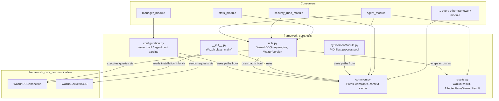
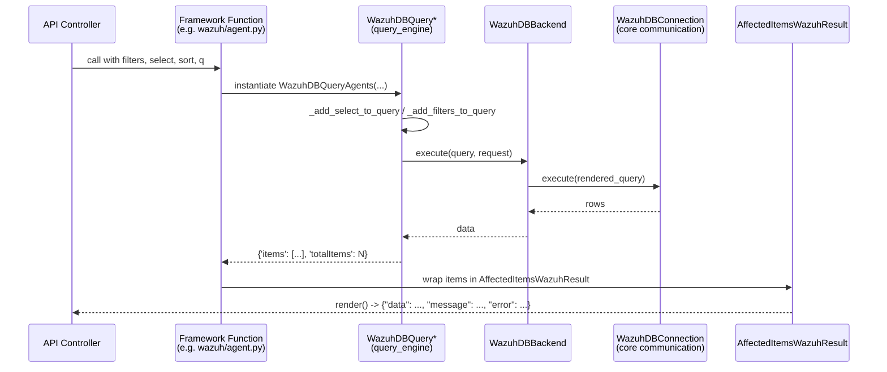

# Framework Core Utilities

## Introduction

The **Framework Core Utilities** module is the foundational layer of the Wazuh Python framework (`framework/wazuh/core/`). It provides the cross-cutting building blocks that every other framework module (agents, security/RBAC, manager, cluster, syscheck, etc.) relies on:

- **Path & environment resolution** — locating the Wazuh installation and defining every well-known path/socket/constant used across the framework.
- **Configuration management** — reading and writing `ossec.conf`, `agent.conf`, and `internal_options.conf`, including group configuration uploads and active configuration retrieval.
- **Database query engine** — a generic, extensible SQL query builder/executor (`WazuhDBQuery` family) that translates REST API-style filters (search, sort, select, `q` queries, RBAC filters) into SQL statements executed against `wazuh-db`.
- **Result wrapping** — standardized response objects (`WazuhResult`, `AffectedItemsWazuhResult`) that every framework function returns, enabling consistent merging, sorting, and pagination of API responses.
- **Process/daemon helpers** — utilities for creating PID files and spawning process-pool workers used by the API and other daemons.
- **The `Wazuh` top-level object** — exposes basic installation metadata (version, path, installation UID) used by the `GET /` and `GET /manager/info` API endpoints.

Because of its foundational nature, this module has almost no dependencies on other Wazuh framework modules; instead, nearly every other module (see [agent_module](agent_module.md), [security_rbac_module](security_rbac_module.md), [manager_module](manager_module.md), [stats_module](stats_module.md), etc.) depends on it directly for path constants, query building, and result formatting. It works hand-in-hand with [framework_core_communication](framework_core_communication.md), which provides the actual socket/DB connection primitives (`WazuhDBConnection`, `WazuhSocketJSON`) used by the query engine and configuration retrieval functions in this module.

## Architecture Overview

## Sub-modules

This module is split into four focused sub-modules, each documented in detail in its own file:

| Sub-module | Description | Documentation |
|---|---|---|
| **Paths & Configuration** | Wazuh path/constant resolution (`common.py`) and configuration file parsing/writing (`configuration.py`), including `ossec.conf`, `agent.conf`, group configuration uploads, and active configuration retrieval. | [framework_core_utils_paths_config.md](framework_core_utils_paths_config.md) |
| **Database Query Engine** | The `WazuhDBQuery` class hierarchy, `WazuhDBBackend`, `WazuhVersion`, array processing helpers (search/sort/select/filter) and other miscellaneous utilities in `utils.py`. | [framework_core_utils_query_engine.md](framework_core_utils_query_engine.md) |
| **Result Wrapping** | The `AbstractWazuhResult`, `WazuhResult`, and `AffectedItemsWazuhResult` classes used to standardize framework function responses. | [framework_core_utils_results.md](framework_core_utils_results.md) |
| **Daemon & Installation Info** | Process/PID management helpers (`pyDaemonModule.py`) and the top-level `Wazuh` class exposing installation metadata (`__init__.py`). | [framework_core_utils_daemon_info.md](framework_core_utils_daemon_info.md) |

## Data Flow: A Typical Framework Query

## How This Module Fits the Overall System

- **Configuration retrieval/upload** (`configuration.py`) is used by [manager_module](manager_module.md) and [agent_module](agent_module.md) (e.g., group `agent.conf` uploads, `GET /manager/configuration`).
- **The query engine** (`utils.py`) underlies nearly every list/get endpoint across the system: [agent_module](agent_module.md), [rule_module](rule_module.md), [decoder_module](decoder_module.md), [mitre_module](mitre_module.md), [sca_module](sca_module.md), [rootcheck_module](rootcheck_module.md), [syscheck_module](syscheck_module.md), [syscollector_module](syscollector_module.md), [task_module](task_module.md), and [security_rbac_module](security_rbac_module.md).
- **Result classes** (`results.py`) are returned by virtually all `framework/wazuh/*.py` business logic functions before being serialized by the API layer (see [api_core_infrastructure](api_core_infrastructure.md)).
- **Daemon helpers** (`pyDaemonModule.py`) support multi-process API workers (see [api_core_infrastructure_server_lifecycle](api_core_infrastructure_server_lifecycle.md)).
- **Communication primitives** used throughout this module (`WazuhDBConnection`, `WazuhSocketJSON`) are documented in [framework_core_communication](framework_core_communication.md).
- The **cluster** framework (`framework/wazuh/core/cluster`) reuses many of these utilities (paths, `WazuhDBQuery`, results) — see the cluster module documentation for details.
