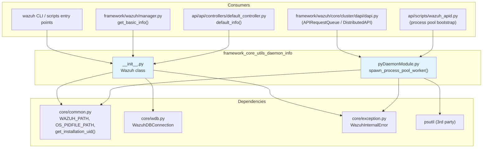
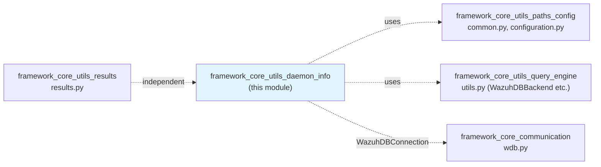
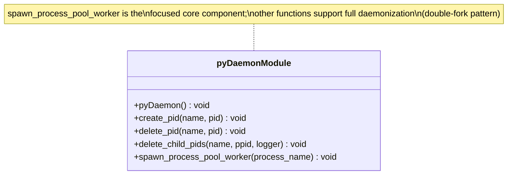
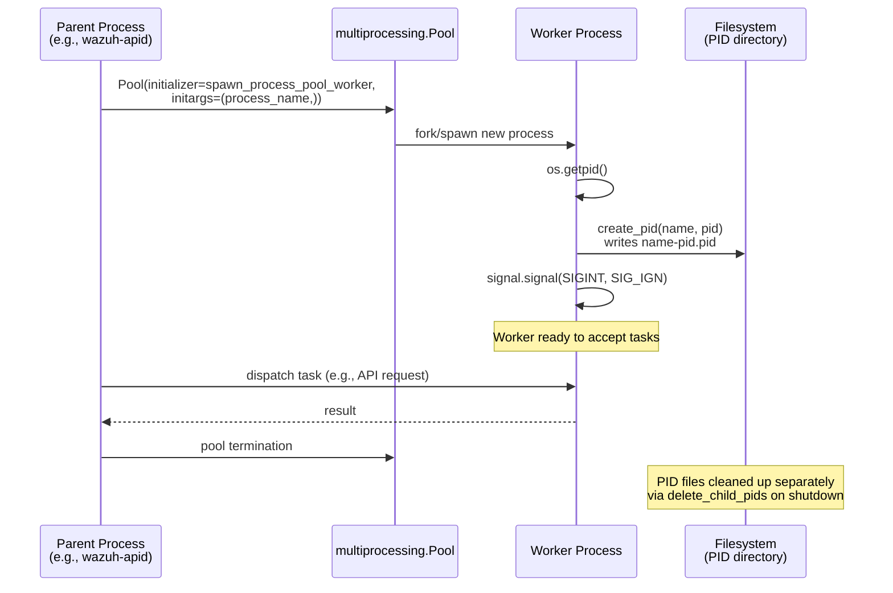
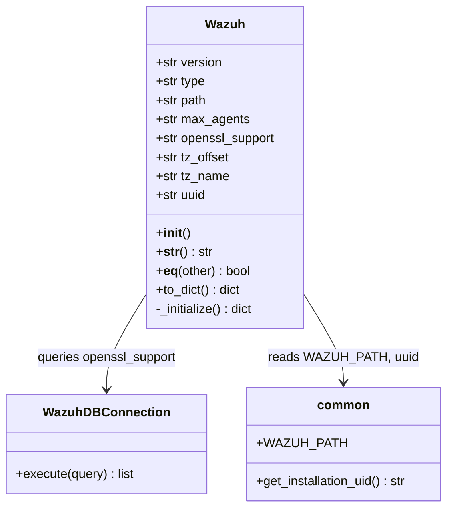
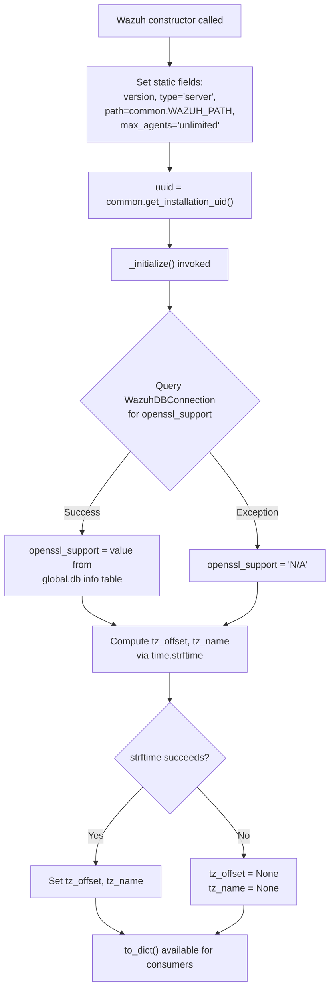
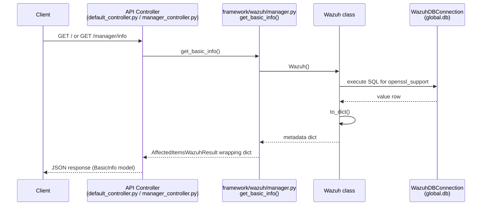
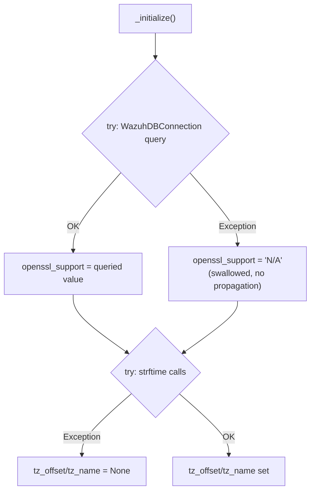
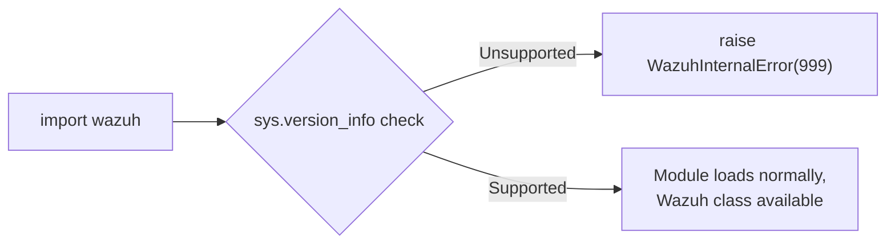
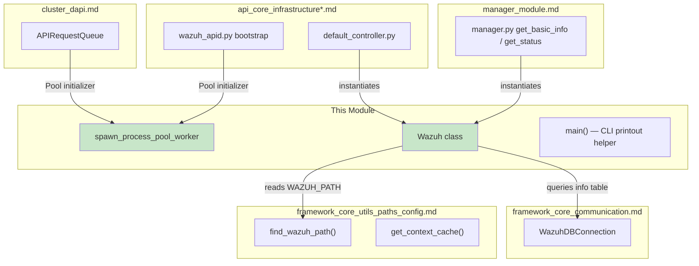

# Framework Core Utils: Daemon Info

## Introduction

The **Framework Core Utils: Daemon Info** module is a small but foundational part of the Wazuh Python framework. It provides two essential capabilities used throughout the entire `framework` and `api` codebases:

1. **Process/daemon lifecycle helpers** — via `spawn_process_pool_worker`, used to properly initialize worker processes spawned in multiprocessing pools (e.g., API worker processes), ensuring they have correct PID files and signal handling.
2. **Installation-wide metadata aggregation** — via the `Wazuh` class, which collects version, path, timezone, and OpenSSL support information about the current Wazuh installation, and exposes this data (e.g., for the `GET /` API endpoint and CLI banners).

Despite its small size, this module sits at a structural crossroads: it is imported by API daemon bootstrap code, by the distributed API layer, and by the top-level `wazuh` CLI entry point. Understanding it is key to understanding how Wazuh daemons report their own identity and how process pools are correctly set up across the framework.

This document describes the module's purpose, its internal architecture, how it interacts with sibling modules, and the typical execution flows in which its components participate.

---

## Module Purpose & Scope

| Aspect | Description |
|---|---|
| **Location** | `framework/wazuh/core/pyDaemonModule.py`, `framework/wazuh/__init__.py` |
| **Parent module** | [framework_core_utils.md](framework_core_utils.md) |
| **Sibling modules** | [framework_core_utils_paths_config.md](framework_core_utils_paths_config.md), [framework_core_utils_query_engine.md](framework_core_utils_query_engine.md), [framework_core_utils_results.md](framework_core_utils_results.md) |
| **Primary consumers** | API server bootstrap (`api_core_infrastructure_server_lifecycle`), CLI scripts, `framework/scripts/*`, `default_controller.py` |

The module is intentionally minimal — it does **not** implement full daemon control (start/stop/restart of `wazuh-*` binaries; that logic lives in [manager_module.md](manager_module.md) and the native C daemons documented in [Agent_&_Manager_Native_Daemons_(C).md](Agent_%26_Manager_Native_Daemons_%28C%29.md)). Instead, it focuses on two narrow, reusable pieces of functionality:

- **Worker process registration** for Python-level multiprocessing pools used by the API and DAPI (Distributed API).
- **Static/dynamic installation metadata** exposed through the `Wazuh` object, consumed by API endpoints like `default_info` (see [api_core_infrastructure_models.md](api_core_infrastructure_models.md)) and `get_info` in the [manager_module.md](manager_module.md).

---

## Architecture Overview



### Relationship to sibling `framework_core_utils` modules



Note: `WazuhDBConnection` is documented in detail in [framework_core_communication.md](framework_core_communication.md); this module only *uses* it to query installation metadata (e.g., OpenSSL support flag from the `info` table in the global database).

---

## Component 1: `spawn_process_pool_worker`

### Purpose

When the Wazuh API (or other framework components) create a `multiprocessing.Pool` to parallelize work (e.g., handling concurrent local/distributed API requests), each worker process needs to:

1. Register its own PID file so that process management/monitoring tools can track it.
2. Ignore `SIGINT` so that `Ctrl+C` / termination signals are handled exclusively by the parent process, preventing worker processes from prematurely dying or corrupting shared state.

`spawn_process_pool_worker` is the **initializer function** passed to `multiprocessing.Pool(initializer=...)` to accomplish this.

### Code Structure



Although the file `pyDaemonModule.py` contains several daemon-related helpers (`pyDaemon`, `create_pid`, `delete_pid`, `delete_child_pids`), the **core component of this module** is `spawn_process_pool_worker`, which composes `create_pid` and signal masking into a single reusable initializer:

```python
def spawn_process_pool_worker(process_name: str) -> None:
    process_pid = os.getpid()
    create_pid(process_name, process_pid)
    signal.signal(signal.SIGINT, signal.SIG_IGN)
```

### Process Flow



### Usage Context

This initializer is primarily used by:
- **API daemon bootstrap** (`api/scripts/wazuh_apid.py`, part of [api_core_infrastructure_server_lifecycle.md](api_core_infrastructure_server_lifecycle.md)) when spinning up local request worker pools (`API_LOCAL_REQUEST_PROCESS`, `API_SECURITY_EVENTS_PROCESS`, `API_AUTHENTICATION_PROCESS` constants defined alongside it).
- **Distributed API (DAPI)** request queues in [cluster_dapi.md](cluster_dapi.md) that use process pools to execute local requests off the main event loop.

### Constants Exposed

The module also defines process name constants used across the API for consistent PID file naming and process identification:

| Constant | Value | Purpose |
|---|---|---|
| `API_MAIN_PROCESS` | `wazuh-apid` | Main API daemon process |
| `API_LOCAL_REQUEST_PROCESS` | `wazuh-apid_exec` | Pool worker for local DAPI requests |
| `API_SECURITY_EVENTS_PROCESS` | `wazuh-apid_events` | Pool worker for security event ingestion |
| `API_AUTHENTICATION_PROCESS` | `wazuh-apid_auth` | Pool worker for authentication handling |

---

## Component 2: `Wazuh` Class

### Purpose

The `Wazuh` class is a lightweight **data aggregator** that gathers static and semi-dynamic metadata about the current Wazuh installation:

- Installation path
- Software version
- Installation type (`server`)
- Maximum agents supported
- OpenSSL support status (queried live from the Global database via `WazuhDBConnection`)
- Timezone offset/name of the host
- Installation UUID (via `common.get_installation_uid()`)

It is the Python-level equivalent of a "system info" descriptor, and its `to_dict()` output is what backs the API's basic info endpoint.

### Class Diagram



### Initialization Flow



### Data Flow: How `Wazuh.to_dict()` Reaches the API



This flow ties directly into:
- [manager_module.md](manager_module.md) — `framework/wazuh/manager.py::get_basic_info` is the primary consumer that wraps `Wazuh().to_dict()` into a `WazuhResult`.
- [api_core_infrastructure_models.md](api_core_infrastructure_models.md) — the `BasicInfo` model and `default_info` controller shape the HTTP response.
- [framework_core_utils_results.md](framework_core_utils_results.md) — `AffectedItemsWazuhResult`/`WazuhResult` are the standard wrappers used to return this data through the framework's result-handling conventions.

### Error Handling Behavior

The `Wazuh` class is deliberately defensive: any failure in either sub-step (DB query or timezone calculation) is caught locally and defaulted, rather than raising an exception. This ensures that basic installation info (path, version) is *always* obtainable even if:
- The `wazuh-db` daemon socket is not yet available (start-up race condition), or
- The host's `time` module misbehaves in unusual environments.



---

## Module-Level Import-Time Validation

`framework/wazuh/__init__.py` also performs a **Python version guard** at import time:

```python
if python_version.major < 2 or (python_version.major == 2 and python_version.minor < 7):
    raise WazuhInternalError(999, msg)
```

This is a legacy compatibility check ensuring the framework isn't loaded under an unsupported Python interpreter. While largely historical (the framework now requires Python 3), it remains part of the module's import-time side effects and is worth noting when diagnosing environment/setup issues.



---

## Component Interaction Summary



---

## Related Documentation

- Parent module: [framework_core_utils.md](framework_core_utils.md)
- Sibling: [framework_core_utils_paths_config.md](framework_core_utils_paths_config.md) — path resolution (`find_wazuh_path`) and configuration helpers used alongside `Wazuh.path`.
- Sibling: [framework_core_utils_query_engine.md](framework_core_utils_query_engine.md) — generic query/database backend utilities (`WazuhDBBackend`, `WazuhVersion`) that complement the metadata gathered here.
- Sibling: [framework_core_utils_results.md](framework_core_utils_results.md) — standard result wrapper classes used when exposing `Wazuh.to_dict()` output through the API.
- [framework_core_communication.md](framework_core_communication.md) — details on `WazuhDBConnection` and the socket protocol used to query the Global database.
- [manager_module.md](manager_module.md) — primary business-logic consumer (`get_basic_info`, `get_status`) that surfaces `Wazuh` metadata via the Manager API.
- [api_core_infrastructure_server_lifecycle.md](api_core_infrastructure_server_lifecycle.md) — API daemon bootstrap where `spawn_process_pool_worker` is used to initialize worker pools.
- [api_core_infrastructure_models.md](api_core_infrastructure_models.md) — `BasicInfo` model and `default_info` controller that shape the HTTP-facing representation of `Wazuh.to_dict()`.
- [cluster_dapi.md](cluster_dapi.md) — Distributed API request queue that also leverages process pools initialized via `spawn_process_pool_worker`.
- [Agent_&_Manager_Native_Daemons_(C).md](Agent_%26_Manager_Native_Daemons_%28C%29.md) — native C daemon processes whose lifecycle is conceptually related but implemented independently of this Python module.

---

## Summary

| Component | Type | Responsibility |
|---|---|---|
| `spawn_process_pool_worker` | Function | Initializes multiprocessing pool workers: writes PID file, masks SIGINT |
| `Wazuh` | Class | Aggregates installation metadata (version, path, OpenSSL support, timezone, UUID) for use by API/CLI |
| `main` | Function | Minimal CLI entry point printing library banner |

This module, while small, is a critical **glue layer** connecting low-level OS process management with high-level installation metadata reporting — both essential for the correct operation and observability of Wazuh's Python-based API and framework layer.
