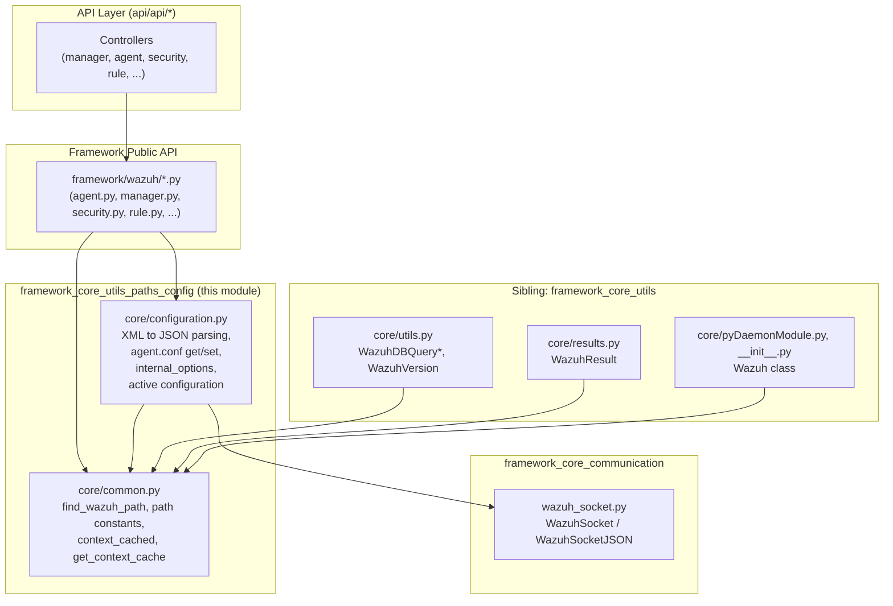
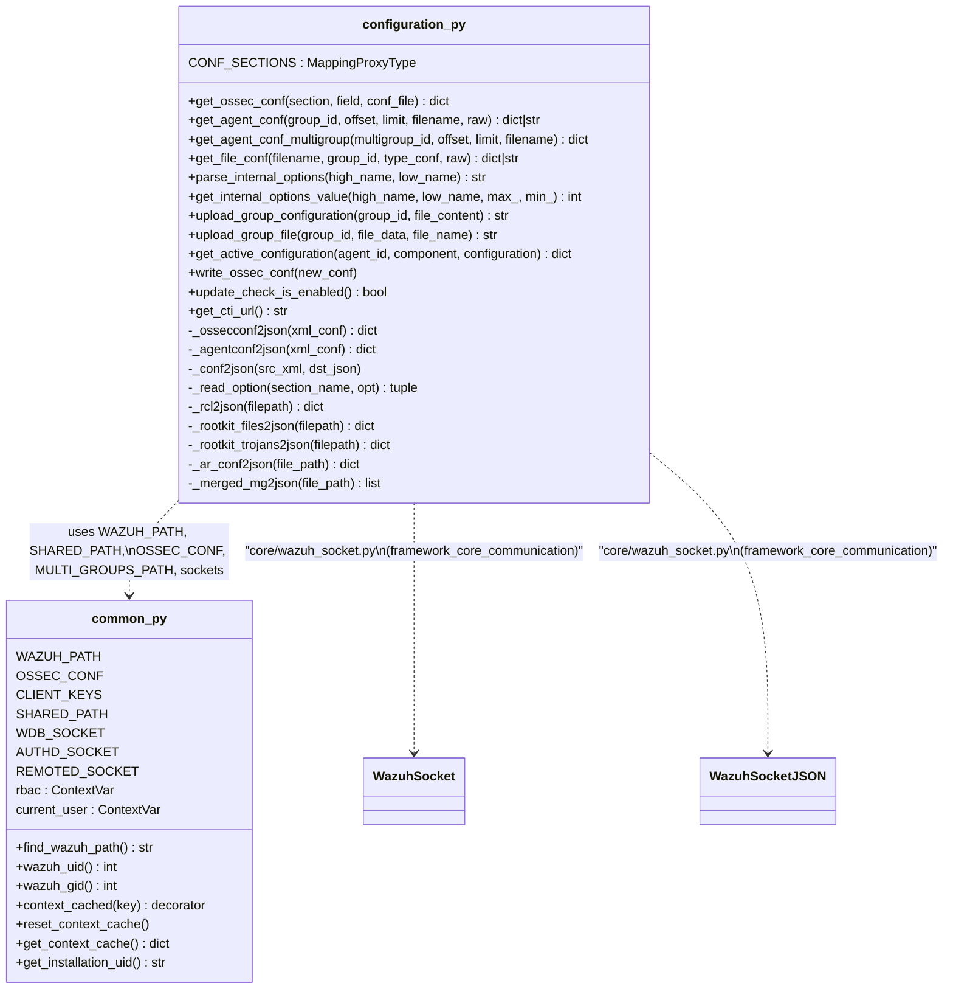
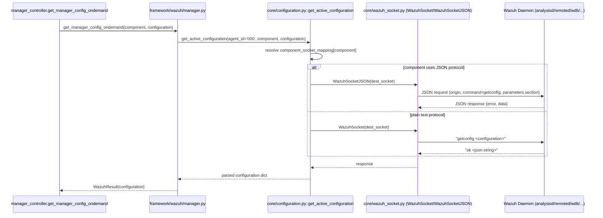
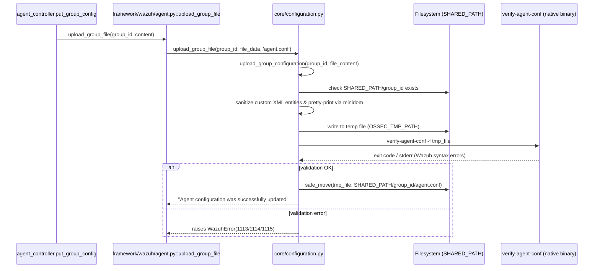
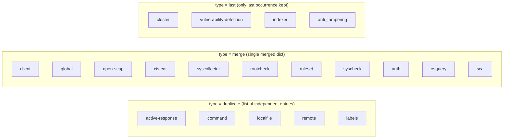

# Framework Core Utils: Paths & Configuration

## Introduction

`framework_core_utils_paths_config` is a foundational sub-module of the Wazuh Python **Framework** layer. It provides two closely related capabilities that almost every other framework module depends on, directly or indirectly:

1. **Installation path & runtime constant resolution** (`framework/wazuh/core/common.py`) — discovers where Wazuh is installed on disk and exposes a large catalog of well-known paths (sockets, configuration files, databases, ruleset directories, etc.) as module-level constants, plus small utilities for per-request caching (`context_cached`, `get_context_cache`) used throughout the RBAC and API layers.
2. **Configuration file parsing, retrieval and mutation** (`framework/wazuh/core/configuration.py`) — converts Wazuh's native XML configuration (`ossec.conf`, `agent.conf`, CDB lists helpers, RCL rules, etc.) into JSON-serializable Python dictionaries, exposes helpers to read/write `agent.conf` per group or multi-group, reads `internal_options.conf`, and fetches manager/agent **active configuration** live from running daemons via Unix sockets.

Because almost every higher-level module (agents, manager, security/RBAC, syscheck, rules, decoders, etc.) needs to know *where* Wazuh files live and *how* to read/write its XML configuration, this module sits at the very bottom of the framework's dependency graph — it has no dependencies on other framework modules, but nearly all of them depend on it.

This document describes the module's internal architecture, its role in the wider system, and the main data/control flows implemented here. For related utilities that live alongside this module inside `framework_core_utils`, see:

- [framework_core_utils_query_engine.md](framework_core_utils_query_engine.md) — WazuhDBQuery family, `WazuhVersion`, hashing/file helpers.
- [framework_core_utils_results.md](framework_core_utils_results.md) — `WazuhResult` / `AffectedItemsWazuhResult`, used to wrap the data this module returns before it reaches the API layer.
- [framework_core_utils_daemon_info.md](framework_core_utils_daemon_info.md) — the top-level `Wazuh` class and daemon process helpers that consume path constants defined here.
- [framework_core_communication.md](framework_core_communication.md) — socket/queue primitives (`WazuhSocket`, `WazuhSocketJSON`) used by `configuration.py` to talk to running daemons.

## Position in the overall architecture

## Component overview

### 1. `core/common.py`

| Responsibility | Details |
|---|---|
| **Installation path discovery** | `find_wazuh_path()` walks up the filesystem from the current file's location until it finds the `framework` directory segment, reconstructing the Wazuh installation root. The result is cached via `@lru_cache` and stored in module constant `WAZUH_PATH`. |
| **Derived path constants** | Dozens of `os.path.join(WAZUH_PATH, ...)` constants are computed at import time: configuration files (`OSSEC_CONF`, `INTERNAL_OPTIONS_CONF`, `AR_CONF`, `CLIENT_KEYS`), sockets (`ANALYSISD_SOCKET`, `AUTHD_SOCKET`, `WDB_SOCKET`, `REMOTED_SOCKET`, ...), ruleset directories (`RULES_PATH`, `DECODERS_PATH`, `LISTS_PATH`), database paths (`DATABASE_PATH`, `DATABASE_PATH_GLOBAL`), and misc (`BACKUP_PATH`, `MULTI_GROUPS_PATH`, `STATS_PATH`). |
| **User/group resolution** | `wazuh_uid()` / `wazuh_gid()` resolve the `wazuh` OS user/group numeric IDs (cached in `_WAZUH_UID` / `_WAZUH_GID`), used whenever the framework needs to `chown`/`chmod` files it writes. |
| **Per-request caching** | `context_cached(key)` is a decorator factory that memoizes a function's result in a `ContextVar`-backed dictionary (`_context_cache`) for the duration of a single async request; `get_context_cache()` exposes this dict (e.g., for RBAC's cache reset at request teardown) and `reset_context_cache()` clears it. |
| **Context variables** | `rbac`, `current_user`, `broadcast`, `cluster_nodes`, `origin_module`, `mp_pools` — `ContextVar`s that carry request-scoped state (RBAC permissions, requesting user, cluster broadcast flag) across async call stacks without explicit parameter threading. Used extensively by [security_rbac_module](security_rbac_module.md) and the cluster DAPI. |
| **Installation UID** | `get_installation_uid()` creates/reads a persistent UUID file used to uniquely identify a Wazuh installation (e.g. for telemetry/update-check). |
| **Numeric/size limits** | Constants such as `MAX_SOCKET_BUFFER_SIZE`, `DATABASE_LIMIT`, `MAXIMUM_DATABASE_LIMIT`, `MAX_GROUPS_PER_MULTIGROUP`, and version constants (`AR_LEGACY_VERSION`, `ACTIVE_CONFIG_VERSION`) referenced by query/validation logic across the framework. |

### 2. `core/configuration.py`

| Responsibility | Details |
|---|---|
| **XML to JSON conversion** | `_ossecconf2json`, `_agentconf2json`, `_conf2json`, `_read_option`, `_insert`, `_insert_section` implement a recursive parser that walks the `defusedxml`-parsed tree of `ossec.conf`/`agent.conf` and produces nested dictionaries, honoring the `CONF_SECTIONS` policy table which classifies each top-level section as `duplicate` (multiple independent entries kept as a list), `merge` (multiple sections combined into one dict), or `last` (only last occurrence kept, with a warning). |
| **Specialized file parsers** | `_rcl2json` (rootcheck RCL rule files), `_rootkit_files2json` / `_rootkit_trojans2json` (rootkit signature databases), `_ar_conf2json` (active response conf, returned as raw lines), `_merged_mg2json` (parses the `merged.mg` shared-file bundle format used to distribute grouped agent files). |
| **Public read APIs** | `get_ossec_conf()` — read manager `ossec.conf`, optionally filtered by section/field, with distinct-value support for ruleset section; `get_agent_conf()` — read a group's `agent.conf` (JSON or raw); `get_agent_conf_multigroup()` — same for merged multi-group configuration; `get_file_conf()` — generic dispatcher used by [cdb_list_module](cdb_list_module.md)/[rule_module](rule_module.md)/[decoder_module](decoder_module.md) controllers to fetch any shared group file (agent.conf, rootkit files, ar.conf, merged.mg, RCL rules) either as parsed JSON or raw text. |
| **internal_options.conf handling** | `parse_internal_options()` reads a `high_name.low_name` key first from `local_internal_options.conf` (override) then falls back to `internal_options.conf`; `get_internal_options_value()` wraps this with type/range validation (digit check, min/max bounds) — used e.g. by [manager_module](manager_module.md) and [stats_module](stats_module.md) to read tunable daemon parameters. |
| **Group file mutation** | `upload_group_configuration()` validates and beautifies an XML fragment, invokes the native `verify-agent-conf` binary to validate Wazuh-specific syntax, then atomically moves the validated file into the group's shared folder with correct ownership/permissions; `upload_group_file()` is the public entry point restricting remote updates to `agent.conf` only. Both are consumed by [agent_module](agent_module.md)'s `upload_group_file` wrapper. |
| **Live "active configuration" retrieval** | `get_active_configuration()` implements the logic to query a **running daemon** (manager or agent) for its currently loaded configuration section, dispatching over Unix domain sockets. It distinguishes plain-text socket protocols vs. JSON-socket protocols (`sockets_json_protocol`), builds the correct request per component (`component_socket_mapping`, `component_socket_dir_mapping`), and for agents proxies the request through `remoted` using the `agent_id component getconfig section` wire format. It relies on [framework_core_communication](framework_core_communication.md)'s `WazuhSocket` / `WazuhSocketJSON` classes. |
| **ossec.conf writing** | `write_ossec_conf()` overwrites the manager's `ossec.conf` file with new content — used by [manager_module](manager_module.md)'s configuration update endpoint. |
| **Update-check / CTI URL** | `update_check_is_enabled()` and `get_cti_url()` read the `<global>` section to determine if update checking is enabled and which CTI service URL to use (defaulting to `https://cti.wazuh.com`), consumed by manager info endpoints and the [engine_module](engine_module.md)/vulnerability detection configuration flow. |

## Class/Function relationship diagram

## Data flow: reading manager active configuration

## Data flow: updating a group's agent.conf

## XML to JSON section classification (`CONF_SECTIONS`)

`configuration.py` treats different `ossec.conf` sections differently depending on how the native daemons interpret repetition:

This classification directly drives `_insert_section()`'s behavior and is essential for correctly reproducing legacy Wazuh XML semantics in JSON form.

## Key constants exposed by `common.py` (selected)

| Category | Examples |
|---|---|
| Config files | `OSSEC_CONF`, `INTERNAL_OPTIONS_CONF`, `LOCAL_INTERNAL_OPTIONS_CONF`, `AR_CONF`, `CLIENT_KEYS` |
| Directories | `SHARED_PATH`, `MULTI_GROUPS_PATH`, `BACKUP_PATH`, `STATS_PATH`, `RULESET_PATH`, `RULES_PATH`, `DECODERS_PATH`, `LISTS_PATH`, `USER_RULES_PATH`, `USER_DECODERS_PATH`, `USER_LISTS_PATH` |
| Databases | `DATABASE_PATH`, `DATABASE_PATH_GLOBAL`, `WDB_PATH` |
| Sockets | `ANALYSISD_SOCKET`, `AR_SOCKET`, `EXECQ_SOCKET`, `AUTHD_SOCKET`, `WCOM_SOCKET`, `LOGTEST_SOCKET`, `UPGRADE_SOCKET`, `REMOTED_SOCKET`, `TASKS_SOCKET`, `WDB_SOCKET`, `WDB_HTTP_SOCKET`, `WMODULES_SOCKET`, `QUEUE_SOCKET` |
| Limits | `MAX_SOCKET_BUFFER_SIZE`, `MAX_QUERY_FILTERS_RESERVED_SIZE`, `AGENT_NAME_LEN_LIMIT`, `DATABASE_LIMIT`, `MAXIMUM_DATABASE_LIMIT`, `MAX_GROUPS_PER_MULTIGROUP` |
| Version/commands | `WPK_REPO_URL_4_X`, `AGENT_COMPONENT_STATS_REQUIRED_VERSION`, `AR_LEGACY_VERSION`, `ACTIVE_CONFIG_VERSION`, `CHECK_CONFIG_COMMAND`, `RESTART_WAZUH_COMMAND` |
| Installation identity | `SECURITY_PATH`, `INSTALLATION_UID_PATH` |

## Consumers across the system

Because this module defines *the* canonical set of filesystem/socket paths and the only XML configuration parser in the framework, it is transitively used by nearly every business-logic module:

- **[agent_module](agent_module.md)** — `upload_group_file`, `get_agent_conf`, `get_file_conf`, `get_agent_conf_multigroup` for group configuration management; path constants for `SHARED_PATH`.
- **[manager_module](manager_module.md)** — `get_ossec_conf`, `write_ossec_conf`, `get_active_configuration`, `get_internal_options_value`, `update_check_is_enabled`, `get_cti_url` power the manager configuration and info endpoints (see `framework/wazuh/manager.py`).
- **[cdb_list_module](cdb_list_module.md)**, **[rule_module](rule_module.md)**, **[decoder_module](decoder_module.md)** — use `get_file_conf` and path constants (`RULES_PATH`, `DECODERS_PATH`, `LISTS_PATH`) to locate and read/write ruleset files.
- **[security_rbac_module](security_rbac_module.md)** — heavily relies on `common.py`'s `ContextVar`s (`rbac`, `current_user`, `broadcast`) and `context_cached`/`get_context_cache`/`reset_context_cache` for per-request RBAC permission caching.
- **[framework_core_utils_daemon_info](framework_core_utils_daemon_info.md)** (`Wazuh` class, `pyDaemonModule.py`) — uses `WAZUH_PATH` and process/socket constants to introspect daemon state.
- **[framework_core_communication](framework_core_communication.md)** — `configuration.py`'s `get_active_configuration` is one of the primary callers of `WazuhSocket`/`WazuhSocketJSON`.
- **[api_core_infrastructure](api_core_infrastructure.md)** — the API layer's authentication/configuration bootstrap (`api/api/configuration.py::init_auth_worker`) indirectly depends on paths such as `AUTHD_SOCKET` and `SECURITY_PATH`/`INSTALLATION_UID_PATH`.
- **Cluster subsystem** (cluster_module and children) — uses `common.py` context variables (`cluster_nodes`, `broadcast`) when distributing requests across nodes via the DAPI.

## Error handling

Both files raise the framework's standard typed exceptions (`WazuhError`, `WazuhInternalError`, `WazuhResourceNotFound`) with well-known numeric codes, allowing the API layer's exception handler to translate them into consistent HTTP error responses. Notable codes used in this module:

| Code | Meaning |
|---|---|
| 1006 | Configuration file does not exist / permission problem |
| 1101 | Requested component/type does not exist |
| 1102 / 1103 | Invalid section / invalid field in section |
| 1104 | Invalid file type requested via `get_file_conf` |
| 1106 | Requested section not present in configuration |
| 1107 / 1108 | `internal_options.conf` not found / option missing |
| 1109 / 1110 | Internal option value not numeric / out of allowed range |
| 1111 / 1112 | Remote group file update restricted to `agent.conf` / empty file rejected |
| 1113 / 1114 / 1115 | XML syntax error / Wazuh syntax error / `verify-agent-conf` execution error |
| 1116 / 1117 | Active configuration retrieval error (daemon-reported error / missing file or send failure) |
| 1118 | Socket receive failure |
| 1121 | Component socket missing or socket creation failure |
| 1126 | Error writing `ossec.conf` |
| 1710 | Group not found |
| 1743 | Error running the Wazuh syntax validator binary |

## Summary

`framework_core_utils_paths_config` is the low-level "plumbing" module that (1) tells the rest of the framework *where things are* on disk and over sockets, and (2) knows *how to speak* Wazuh's XML configuration dialect, both for static files on disk and for live daemon queries. Its stability and correctness are critical since virtually every other framework and API module — from agent/group management to RBAC, rules, and cluster orchestration — depends on the constants and parsing logic it provides.
