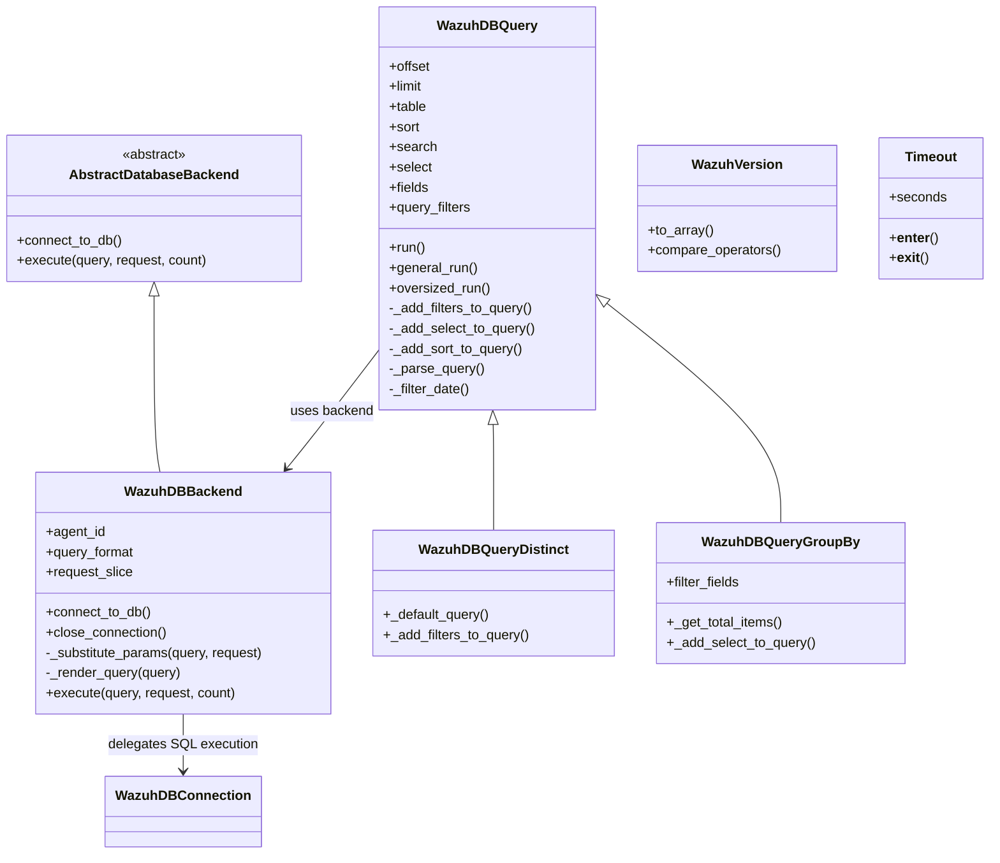
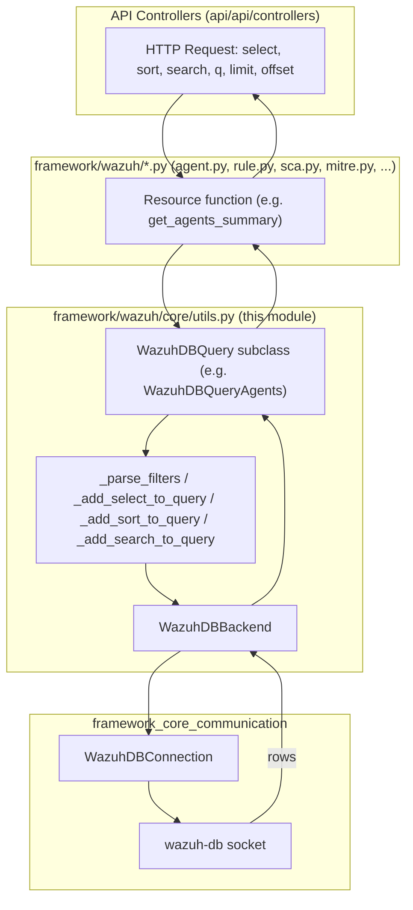
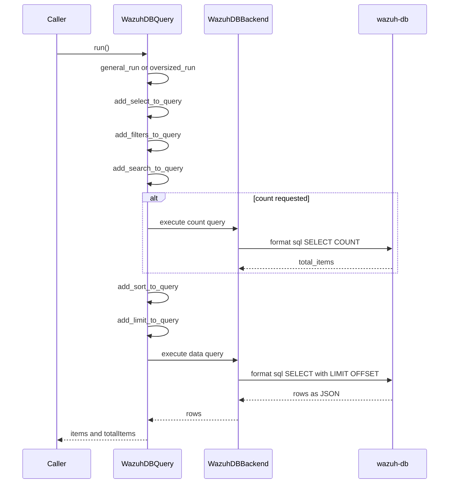
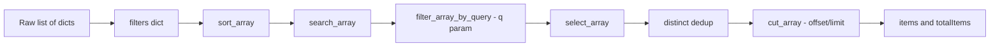
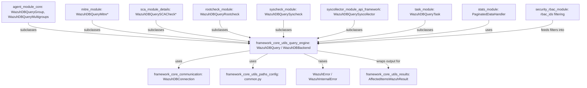

# Framework Core Utils — Query Engine

## Introduction

The **Query Engine** module is the heart of Wazuh's data-access layer for the Python framework. It lives in `framework/wazuh/core/utils.py` and provides the generic, reusable machinery that every high-level API resource (agents, rules, decoders, SCA, MITRE, rootcheck, syscheck, syscollector, tasks, stats, etc.) uses to turn raw HTTP request parameters (`select`, `sort`, `search`, `q`, `filters`, `limit`, `offset`) into SQL queries executed against Wazuh's SQLite databases through `wazuh-db`.

In addition to the query-building engine, this module exposes a handful of general-purpose utilities (semantic version comparison, file-mode formatting, hashing helpers, date helpers, a `Timeout` context manager, etc.) that are used throughout the whole Python codebase.

This document explains the internal architecture of the query engine, how it cooperates with the rest of `framework_core_utils` and `framework_core_communication`, and how downstream modules (agent, rule, decoder, SCA, MITRE, rootcheck, syscheck, syscollector, task, stats, security/RBAC…) build on top of it.

---

## 1. Purpose & Scope

| Responsibility | Component(s) |
|---|---|
| Translate REST-style query parameters into SQL | `WazuhDBQuery`, `WazuhDBQueryDistinct`, `WazuhDBQueryGroupBy` |
| Execute SQL against `wazuh-db` sockets | `WazuhDBBackend` |
| In-memory list processing (no DB) | `process_array`, `sort_array`, `search_array`, `select_array`, `cut_array`, `filter_array_by_query` |
| Version comparison for agents/manager | `WazuhVersion` |
| Misc. helper utilities | `filemode`, `get_hash_str`, `previous_month`, `to_relative_path`, `Timeout` |

The module purposefully has **no knowledge** of any specific resource (agent, rule, group, …). Concrete resource modules (e.g. `framework/wazuh/core/agent.py`, `framework/wazuh/core/mitre.py`, `framework/wazuh/core/sca.py`) subclass `WazuhDBQuery` and supply resource-specific table names, field mappings and filters. This keeps the query-building logic centralized (DRY) while allowing each resource to customize behavior.

---

## 2. Component Overview



### Key classes

- **`AbstractDatabaseBackend`** — Minimal interface (`connect_to_db`, `execute`) that any backend must implement.
- **`WazuhDBBackend`** — Concrete backend that talks to the `wazuh-db` daemon socket via `WazuhDBConnection` (see [framework_core_communication](framework_core_communication.md)). It renders queries with the correct prefix (`agent <id> sql ...`, `global sql ...`, `mitre sql ...`, `task sql ...`) and substitutes bind parameters because `wazuh-db`'s socket protocol does not support native parameter binding like `sqlite3` does.
- **`WazuhDBQuery`** — The main query builder. It receives declarative parameters (offset, limit, sort, search, select, filters, query string `q`) and incrementally builds a parameterized SQL string, delegating actual execution to the backend. It supports two execution modes:
  - `general_run()` — Standard path.
  - `oversized_run()` — Used when the RBAC filter list (`rbac_ids`) is too large to fit in a single socket message; it performs an ID-based two-pass filtering strategy.
- **`WazuhDBQueryDistinct`** — Specialization that returns unique values for a single field (`SELECT DISTINCT`).
- **`WazuhDBQueryGroupBy`** — Specialization that adds `GROUP BY` support and injects a synthetic `count` field.
- **`WazuhVersion`** — Parses and compares Wazuh version strings (`vX.Y.Zalpha/beta/rcN`), used for agent/manager compatibility checks.
- **`Timeout`** — A `SIGALRM`-based context manager used to bound the execution time of blocking operations.
- Utility functions: `filemode` (mode bits → `-rwxr-xr-x` style string), `get_hash_str` (hash of a string using any `hashlib` algorithm), `previous_month` (first day of N months ago), `to_relative_path` (strip the Wazuh installation prefix from an absolute path).

---

## 3. Architecture & Data Flow



1. An API controller parses HTTP query params (see [api_core_infrastructure_request_utils](api_core_infrastructure_request_utils.md) for `_parse_q_param`, `_parse_search_param`, `_parse_sort_param`).
2. The business-logic layer (e.g. `framework/wazuh/agent.py`) instantiates a resource-specific subclass of `WazuhDBQuery` (defined in `framework/wazuh/core/agent.py`, `core/mitre.py`, `core/sca.py`, `core/rootcheck.py`, `core/syscheck.py`, `core/syscollector.py`, `core/task.py`) with those parameters.
3. `WazuhDBQuery.run()` decides between `general_run()` and `oversized_run()` (RBAC ID list size) and builds the final SQL string using the regex-based `q` parser, `select`/`sort`/`search`/`filters` handling.
4. The `WazuhDBBackend` renders the query with the appropriate `wazuh-db` command prefix and substitutes bind parameters (`_substitute_params`) because the wire protocol is not a normal DB-API driver.
5. `WazuhDBConnection` (from `framework_core_communication`) sends the request over the Unix socket to the `wazuh-db` daemon and returns parsed JSON rows.
6. Results propagate back up, get formatted via `_format_data_into_dictionary()`, and are eventually wrapped in `AffectedItemsWazuhResult` / `WazuhResult` (see [framework_core_utils_results](framework_core_utils_results.md)).

---

## 4. Query Building Internals

### 4.1 The `q` Parameter Grammar

`WazuhDBQuery` compiles a regular expression (`self.query_regex`) capable of parsing expressions like:

```
(status=active;os.platform=ubuntu),group=default
```

into filter clauses with:
- **field** — must exist in `self.fields` (validated against `WazuhError(1408)`).
- **operator** — one of `= != < > ~` (validated against `WazuhError(1409)`).
- **value** — any allowed literal (dates, numbers, strings, arrays).
- **separator** — `;` (AND) or `,` (OR).
- **parenthesis level** — supports nested grouping.

### 4.2 Filter Pipeline



### 4.3 Oversized RBAC Queries

When RBAC (`framework/wazuh/rbac`, part of [security_rbac_module](security_rbac_module.md)) resolves a user's permitted resource IDs, the resulting `rbac_ids` set can be very large. Since `wazuh-db`'s socket has a maximum message size, `WazuhDBQuery.run()` automatically switches to `oversized_run()`:

1. First it queries **only the primary key column** (`id` for agents, `name` for groups) for the full result set (no RBAC filter yet).
2. It filters that ID list in Python against the `rbac_ids` set (honoring `rbac_negate`).
3. It re-executes the full `general_run()` using the reduced, size-bounded final ID list as the new `rbac_ids` filter.

This trades one extra lightweight query for the ability to bypass the socket payload limit.

### 4.4 Backend Rendering (`WazuhDBBackend`)

`WazuhDBBackend._render_query()` prefixes the SQL with the target scope expected by the `wazuh-db` protocol:

| `query_format` | Rendered prefix |
|---|---|
| `agent` (default) | `agent <agent_id> sql ...` |
| `global` | `global sql ...` |
| `mitre` | `mitre sql ...` |
| `task` | `task sql ...` |

`_substitute_params()` manually inlines bind parameters (escaping quotes/backslashes) since the `wazuh-db` text protocol has no native parameter binding — unlike direct `sqlite3` cursors used elsewhere.

---

## 5. In-Memory List Utilities

Not every Wazuh resource is backed by `wazuh-db` (some come from files, sockets, or external processes). For those, `utils.py` offers a parallel, in-memory equivalent pipeline:



`process_array()` orchestrates this pipeline and is used, for example, by resources such as `mitre_module`, `overview_module`, or any function that fetches a full JSON/list payload before applying pagination logic — mirroring the semantics of `WazuhDBQuery` but without needing a database round trip.

---

## 6. Other Utilities in this Module

| Function/Class | Purpose |
|---|---|
| `WazuhVersion` | Parses `Wazuh vX.Y.Z-{alpha,beta,rc}N` strings and implements rich comparison operators (`__eq__`, `__ge__`, `__gt__`, …). Used for agent/manager upgrade compatibility checks (see [agent_module](agent_module.md), `agent_upgrade_module`). |
| `filemode(mode)` | Converts a POSIX file mode integer into a `-rwxr-xr-x`-style string. Used by file-listing endpoints (`cdb_list_module`, rule/decoder file management). |
| `get_hash_str(my_str, hash_algorithm)` | Computes the hash of a string using any algorithm supported by `hashlib`. Complements the file-hashing functions (`get_hash`, `md5`, `blake2b`) also defined in this file. |
| `previous_month(n)` | Returns the first day of the month `n` months ago — used by statistics/log rotation endpoints ([stats_module](stats_module.md), [manager_module](manager_module.md)). |
| `to_relative_path(full_path, prefix)` | Strips the Wazuh installation path prefix to return API-safe relative paths. |
| `Timeout` | `SIGALRM`-based context manager to bound blocking calls (e.g. socket reads) with a `TimeoutError`. |

---

## 7. Relationship to Other Modules



- **[framework_core_communication](framework_core_communication.md)** — Supplies `WazuhDBConnection`/`AsyncWazuhDBConnection`, the actual socket client that `WazuhDBBackend` wraps.
- **[framework_core_utils_paths_config](framework_core_utils_paths_config.md)** — Provides `common.py` constants (`WDB_PATH`, `DATABASE_LIMIT`, `MAXIMUM_DATABASE_LIMIT`, `MAX_QUERY_FILTERS_RESERVED_SIZE`) consumed throughout this module.
- **[framework_core_utils_results](framework_core_utils_results.md)** — Downstream consumers wrap the `items`/`totalItems` dictionaries returned by `WazuhDBQuery.run()`/`process_array()` into `AffectedItemsWazuhResult`/`WazuhResult` objects for API responses.
- **Resource modules** (`agent_module`, `mitre_module`, `sca_module`, `rootcheck_module`, `syscheck_module`, `syscollector_module`, `task_module`) — Each defines its own `WazuhDBQuery<Resource>` subclass in their respective `core/*.py` file, overriding `table`, `fields`, and sometimes `_filter_status`/`_filter_date`/`_default_query` to implement resource-specific behavior.
- **[security_rbac_module](security_rbac_module.md)** — RBAC resolves the list of resource IDs a user can access (`rbac_ids`) and passes it as a legacy filter into `WazuhDBQuery`, triggering the `oversized_run()` path when the list is large.
- **[stats_module](stats_module.md)** — `PaginatedDataHandler` uses `cut_array`/`process_array`-style pagination for the daemon-stats endpoints when data does not come from `wazuh-db`.

---

## 8. Typical Usage Example (Conceptual)

```python
from wazuh.core.utils import WazuhDBQuery, WazuhDBBackend

class WazuhDBQueryExample(WazuhDBQuery):
    def __init__(self, agent_id, offset=0, limit=500, sort=None, search=None,
                 select=None, query='', filters=None):
        backend = WazuhDBBackend(agent_id=agent_id)
        super().__init__(
            offset=offset, limit=limit, table='example_table',
            sort=sort, search=search, select=select, query=query,
            fields={'id': 'id', 'name': 'name', 'date': 'date_add'},
            default_sort_field='id', count=True, get_data=True,
            backend=backend, filters=filters or {},
            date_fields={'date'}
        )

result = WazuhDBQueryExample(agent_id='001', query='name~server').run()
# -> {'items': [...], 'totalItems': N}
```

This mirrors exactly how `framework/wazuh/core/agent.py::WazuhDBQueryGroup`, `framework/wazuh/core/mitre.py::WazuhDBQueryMitreTechniques`, `framework/wazuh/core/sca.py::WazuhDBQuerySCACheck`, etc., are implemented.

---

## 9. Error Handling

The query engine raises typed `WazuhError` exceptions for invalid client input, which propagate up and are converted into HTTP error responses by the API layer (see [api_core_infrastructure](api_core_infrastructure.md)):

| Code | Condition |
|---|---|
| 1400 / 1401 | Invalid `offset` / `limit` |
| 1402 | Invalid `sort_ascending` |
| 1403 | Invalid sort field |
| 1405 / 1406 | Limit exceeds maximum / limit is zero |
| 1407 | Malformed `q` parameter |
| 1408 | Unknown field used in `q` |
| 1409 | Invalid operator used in `q` |
| 1410 | More than one field requested for `WazuhDBQueryDistinct` |
| 1412 | Invalid date value in a date filter |
| 1724 | Invalid `select` field(s) |
| 2007 | Agent DB not found (raised by `WazuhDBBackend.__init__`) |

---

## 10. Summary

The Query Engine is the shared contract between Wazuh's REST API and its per-agent/global SQLite databases. By centralizing pagination, sorting, searching, filtering (`q` DSL), and RBAC-aware oversized-query handling in `WazuhDBQuery`/`WazuhDBBackend`, every resource module gains consistent, secure, and efficient querying semantics without reimplementing SQL-building logic. Its close cooperation with [framework_core_communication](framework_core_communication.md) (transport), [framework_core_utils_paths_config](framework_core_utils_paths_config.md) (configuration constants) and [framework_core_utils_results](framework_core_utils_results.md) (response formatting) makes it a foundational building block of the entire `API_&_Management_Framework_(Python)` component.
