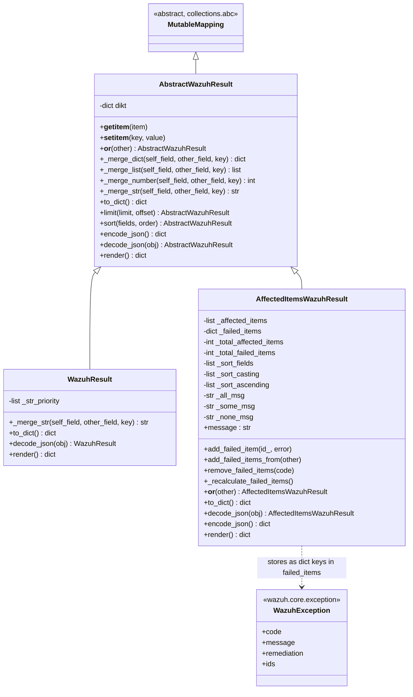
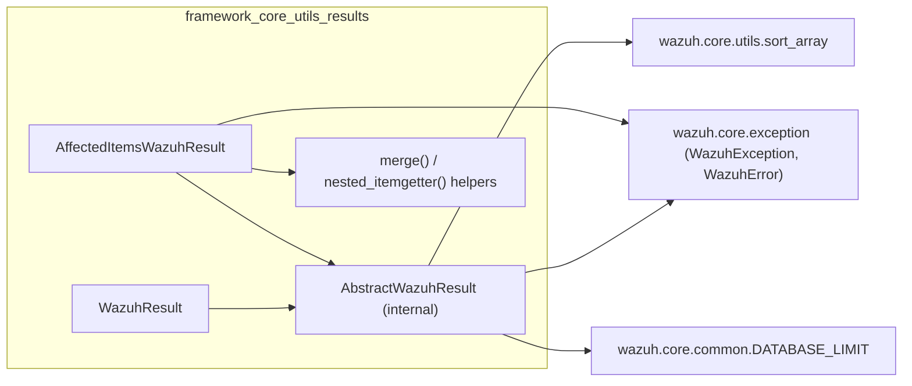
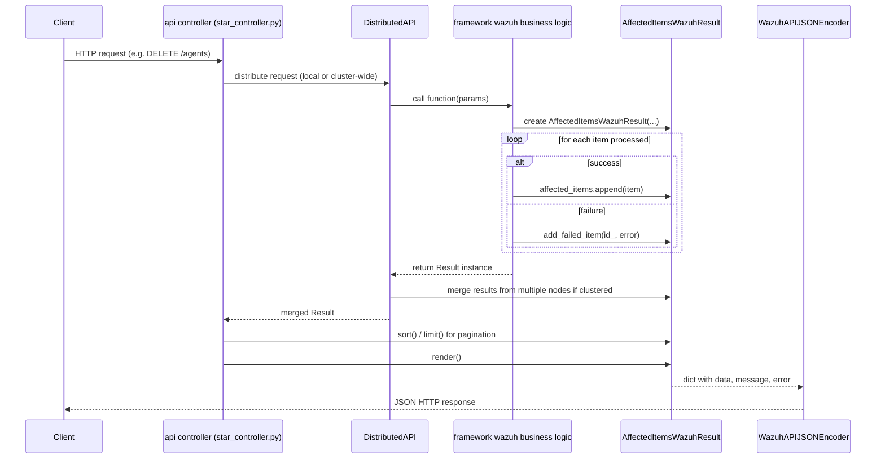
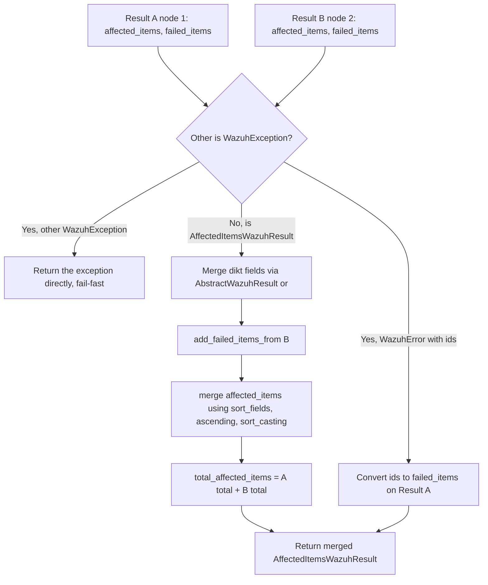

# Framework Core Utils — Results

## Introduction

The **framework_core_utils_results** module defines the standard *response envelope* types used by every business-logic function in the Wazuh Python framework (`framework/wazuh/*.py`) before the response reaches the REST API layer. It lives in a single file, `framework/wazuh/core/results.py`, and exposes two public classes:

- **`WazuhResult`** — a lightweight wrapper for simple, single-value or informational responses.
- **`AffectedItemsWazuhResult`** — the workhorse class used by almost all list/bulk-operation endpoints (agents, groups, rules, decoders, security entities, etc.) to report which items succeeded (`affected_items`) and which failed (`failed_items`), together with pagination/sorting metadata and human-readable messages.

Both classes derive from an internal abstract base, `AbstractWazuhResult`, which implements dictionary-like behavior (`collections.abc.MutableMapping`), a powerful `__or__` (`|`) merge operator, JSON encode/decode hooks, and helpers for sorting/limiting result sets.

This module is a leaf dependency of [`framework_core_utils`](framework_core_utils.md) (the parent grouping that also contains [`framework_core_utils_paths_config`](framework_core_utils_paths_config.md) and [`framework_core_utils_query_engine`](framework_core_utils_query_engine.md)). It has no outgoing dependencies of its own beyond `wazuh.core.exception` (for error typing) and `wazuh.core.utils.sort_array` (for the query-engine's sorting utility), but it is depended upon by virtually **every** business-domain module in the system (agents, rules, decoders, security/RBAC, stats, tasks, mitre, sca, syscheck, cluster, etc.).

---

## Purpose and Core Functionality

| Responsibility | Implementation |
|---|---|
| Provide a uniform response contract for framework functions | `AbstractWazuhResult` (dict-like interface) |
| Represent a single generic payload (e.g. basic info, config dump) | `WazuhResult` |
| Represent the outcome of an operation over a *collection* of items (agents, rules, users…) | `AffectedItemsWazuhResult` |
| Track partial failures per item without failing the whole request | `AffectedItemsWazuhResult.add_failed_item` / `failed_items` |
| Combine results from multiple nodes/workers in a Wazuh cluster (map-reduce style) | `__or__` merge operator on both classes |
| Serialize/deserialize results across process boundaries (e.g. cluster RPC, DAPI) | `encode_json` / `decode_json` |
| Produce the final JSON-serializable payload returned by the REST API | `render()` |
| Apply pagination (`limit`) and sorting (`sort`) generically | `AbstractWazuhResult.limit`, `.sort`, module-level `merge()` helper |

### Why this abstraction exists

Wazuh's API controllers (see [`api_core_infrastructure`](api_core_infrastructure.md) and the various `*_controller.py` files across domain modules such as [`agent_module`](agent_module.md), [`rule_module`](rule_module.md), [`security_rbac_module`](security_rbac_module.md)) call into framework business-logic functions (`framework/wazuh/agent.py`, `framework/wazuh/rule.py`, `framework/wazuh/security.py`, etc.). In a clustered deployment, the **Distributed API (DAPI)** may need to run the same function on multiple nodes and then **merge** the partial results into one coherent response. The `AbstractWazuhResult.__or__` merge protocol is exactly what makes that possible without every framework function having to know about clustering.

---

## Architecture

### Class Hierarchy



### Module Dependencies



---

## Data Flow: From Business Logic to API Response

`AffectedItemsWazuhResult` and `WazuhResult` are the **return type** contract for nearly every function in the domain modules. The following diagram shows a representative round trip through the [`agent_module`](agent_module.md) stack, but the same pattern applies to [`rule_module`](rule_module.md), [`decoder_module`](decoder_module.md), [`security_rbac_module`](security_rbac_module.md), [`sca_module`](sca_module.md), [`syscheck_module`](syscheck_module.md), [`mitre_module`](mitre_module.md), [`stats_module`](stats_module.md), [`task_module`](task_module.md), and more.



---

## Component Details

### `AbstractWazuhResult` (internal base class)

Implements Python's `MutableMapping` protocol over an internal `dikt` dictionary, so instances behave like dicts (`result['key']`, `len(result)`, iteration, etc.). Key capabilities:

- **Merging (`__or__` / `|`)**: Recursively merges two results field by field:
  - `dict` fields → merged recursively via `_merge_dict` (re-wrapping in the same subclass).
  - `list` fields → concatenated, de-duplicated via `_merge_list`.
  - Numeric fields → summed via `_merge_number`.
  - String fields → joined with `"|"` unless equal, via `_merge_str` (overridable per subclass, e.g. priority-based in `WazuhResult`).
  - If merged with a `WazuhException`, the exception "wins" and is returned as-is (fail-fast semantics for cluster-wide errors).
- **`limit()` / `sort()`**: Generic pagination and sorting hooks operating on a conventional `data.items` list structure; delegates sorting to `wazuh.core.utils.sort_array` (part of [`framework_core_utils_query_engine`](framework_core_utils_query_engine.md)).
- **`encode_json()` / `decode_json()`**: Serialization contract used when results must cross process/network boundaries — e.g., between cluster nodes in the DAPI/cluster RPC layer.
- **`render()`**: Produces the final dict handed to the API encoder.

### `WazuhResult`

A minimal envelope for endpoints that return a single object/value or a static payload — e.g., manager configuration retrieval (`framework/wazuh/manager.py` in [`manager_module`](manager_module.md)) or basic info endpoints. Adds:

- **`str_priority`**: An ordered list of string values determining which value "wins" when merging conflicting string fields across nodes (e.g., a status string like `'active'` vs `'disconnected'` might need `disconnected` to take priority).
- **`render()`** always injects `'error': 0` since a `WazuhResult` inherently represents a fully successful, singular response.

### `AffectedItemsWazuhResult`

The primary result type for **bulk/collection operations**. Core state:

| Attribute | Description |
|---|---|
| `affected_items` | List of items successfully processed. |
| `failed_items` | Dict keyed by `WazuhException` instance → set of item IDs that failed with that specific error (deduplicates identical errors across many IDs). |
| `total_affected_items` / `total_failed_items` | Counts, which may differ from `len(affected_items)` (e.g., when only a summary count is relevant, not the full list). |
| `sort_fields` / `sort_casting` / `sort_ascending` | Metadata describing how `affected_items` should be ordered when merged from multiple sources — consumed by the module-level `merge()` function. |
| `all_msg` / `some_msg` / `none_msg` | Templated messages selected automatically via the `message` property based on the ratio of successes to failures. |

Key methods:

- **`add_failed_item(id_, error)`**: Registers a failure, grouping identical `WazuhException` instances together.
- **`add_failed_items_from(other)`**: Bulk-imports failed items from another `AffectedItemsWazuhResult` (used during merges).
- **`remove_failed_items(code)`**: Strips out failures matching specific error code(s) — useful for filtering "expected" errors before surfacing to the client.
- **`__or__`**: Cluster-aware merge — combines `affected_items` (using the module-level `merge()`, which performs an order-preserving k-way merge based on `sort_fields`/`sort_casting`/`sort_ascending`), unions `failed_items`, and sums totals. If merged with a `WazuhError` carrying explicit `ids`, those IDs are automatically converted into failed items.
- **`render()`**: Builds the final API payload with `data.affected_items`, `data.total_affected_items`, `data.total_failed_items`, `data.failed_items`, a top-level `message`, and a top-level `error` code where `error` is `0` (complete success), `1` (complete failure), or `2` (partial success) — computed by `set_error_code()`.

### Module-level helpers

- **`nested_itemgetter(*expressions)`**: Builds an accessor function for nested dictionary paths (e.g., `'a.b'` → `d['a']['b']`), supporting escaped dots (literal `.` in a key). Used to extract sort keys from complex item dictionaries.
- **`_goes_before_than(a, b, ascending, casters)`**: Lexicographic-like comparator respecting per-field ascending/descending order and type casting.
- **`merge(*iterables, criteria, ascending, types)`**: A k-way merge of already-sorted iterables (typically `affected_items` lists coming from different cluster nodes), preserving global order according to `criteria`/`ascending`/`types` — this is what powers correct pagination/ordering of cluster-wide bulk results without needing a full re-sort.

---

## Process Flow: Merge Operation



---

## Integration Points

- **Business logic layer** (`framework/wazuh/*.py`): Every domain module (agent, rule, decoder, security, sca, syscheck, mitre, stats, task, manager, cluster, etc.) constructs and returns `AffectedItemsWazuhResult` or `WazuhResult` instances. See, for example, [`agent_module`](agent_module.md), [`rule_module`](rule_module.md), [`security_rbac_module`](security_rbac_module.md), [`sca_module`](sca_module.md), [`mitre_module`](mitre_module.md), [`stats_module`](stats_module.md), [`task_module`](task_module.md), [`syscheck_module`](syscheck_module.md), [`manager_module`](manager_module.md).
- **Cluster / DAPI layer**: The Distributed API relies on `encode_json`/`decode_json` and the `__or__` merge operator to combine responses gathered from multiple cluster nodes. The generic serialization envelope used for transmitting these objects over the wire is implemented in the cluster common protocol layer of the cluster module.
- **API encoding layer**: The rendered dict produced by `render()` is what ultimately gets serialized by `WazuhAPIJSONEncoder` (see [`api_core_infrastructure_models`](api_core_infrastructure_models.md)) and returned as the HTTP response body by the API controllers (see [`api_core_infrastructure`](api_core_infrastructure.md)).
- **Query/sorting engine**: `AbstractWazuhResult.sort()` and the internal pagination helpers delegate to `wazuh.core.utils.sort_array`, part of [`framework_core_utils_query_engine`](framework_core_utils_query_engine.md), keeping sorting semantics consistent between database queries and in-memory result post-processing.
- **Exception model**: `wexception.WazuhException` / `wexception.WazuhError` (not included in this module) are the types stored as keys in `failed_items`; their `code`, `message`, `remediation`, and (for `WazuhError`) `ids` attributes are consumed directly by `render()` and the merge logic.

---

## Usage Pattern (Typical)

```python
from wazuh.core.results import AffectedItemsWazuhResult
import wazuh.core.exception as wexception

result = AffectedItemsWazuhResult(
    all_msg='All items were processed successfully',
    some_msg='Some items could not be processed',
    none_msg='No items could be processed'
)

for item_id in requested_ids:
    try:
        process(item_id)
        result.affected_items.append(item_id)
    except SomeDomainError:
        result.add_failed_item(id_=item_id, error=wexception.WazuhError(1701))

result.affected_items = sorted(result.affected_items)
result.total_affected_items = len(result.affected_items)

# Later, in the controller:
return result.render()
```

This pattern is repeated (with domain-specific messages and error codes) across nearly all `*_controller.py` and corresponding `framework/wazuh/*.py` files in the system.

---

## Summary

| Aspect | Detail |
|---|---|
| **File** | `framework/wazuh/core/results.py` |
| **Public classes** | `WazuhResult`, `AffectedItemsWazuhResult` |
| **Internal base** | `AbstractWazuhResult` (implements `MutableMapping`) |
| **Key capability** | Uniform, mergeable, sortable, paginated, serializable API response objects |
| **Primary consumers** | All `framework/wazuh/*.py` business-logic modules and the Distributed API / cluster layer |
| **Related documentation** | [`framework_core_utils`](framework_core_utils.md), [`framework_core_utils_query_engine`](framework_core_utils_query_engine.md), [`framework_core_utils_paths_config`](framework_core_utils_paths_config.md), [`api_core_infrastructure_models`](api_core_infrastructure_models.md), [`api_core_infrastructure`](api_core_infrastructure.md) |
