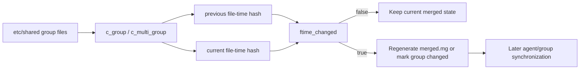
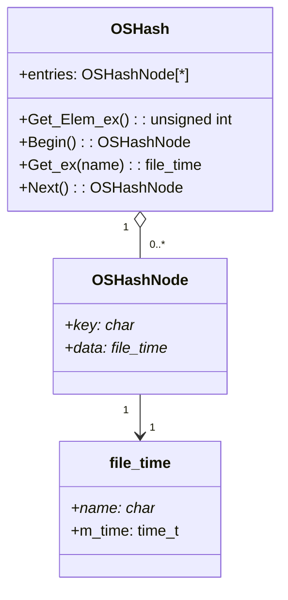
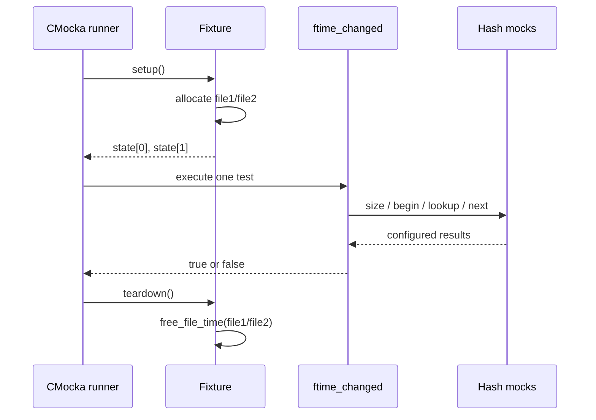
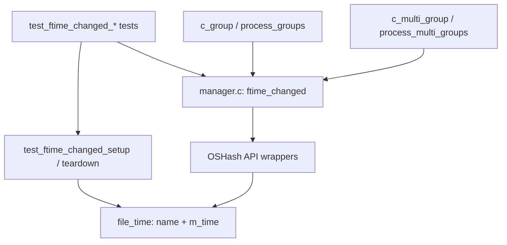
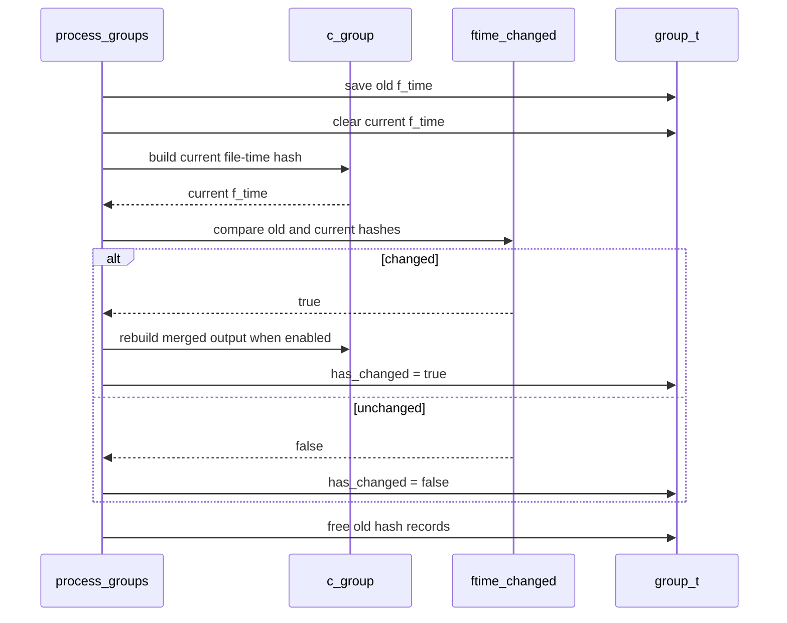

# `ftime_changed_tests`

`ftime_changed_tests` is the focused CMocka test slice for the static `ftime_changed` helper in the remoted manager. The helper compares two filename-to-modification-time hash tables and tells the shared-file manager whether a group’s source files changed. The tests cover equality, changed timestamps, missing files, cardinality differences, and null inputs.

## Scope and location

| Item | Location |
|---|---|
| Test source | [`src/unit_tests/remoted/test_manager.c`](/home/anhnh/CodeWiki-journal/repos/wazuh/src/unit_tests/remoted/test_manager.c) |
| Production implementation | [`src/remoted/manager.c`](/home/anhnh/CodeWiki-journal/repos/wazuh/src/remoted/manager.c) |
| Test framework | CMocka, with project wrapper/mocking helpers |
| Production symbol | `STATIC bool ftime_changed(OSHash *old_time, OSHash *new_time)` |
| Test registration | `main()` in `test_manager.c` |

The source file contains tests for several remoted-manager responsibilities. This document covers only the six tests registered under the `// Test ftime_changed` section and their setup/teardown fixture.

## Role in the remoted manager

The remoted manager builds a `file_time` hash for each shared group. During a later scan, it builds a new hash and uses `ftime_changed` before deciding whether to regenerate the merged group file. The same comparison is used for multigroups when their constituent groups have not already caused an update.



For the broader shared-file lifecycle, see [`c_group_tests.md`](c_group_tests.md). The security and transport context of remoted is covered separately in [`remoted_secure_connection.md`](remoted_secure_connection.md).

## Data model

`manager.c` defines the private record used by the comparison:

```c
typedef struct _file_time {
    char *name;
    time_t m_time;
} file_time;
```

Each `OSHash` is expected to contain `file_time` records keyed by the file name. `ftime_changed` does not compare hash iteration order. It compares the number of entries, looks up every old record in the new hash using `file_old->name`, and compares the two records’ `m_time` values.



## Comparison contract

The function follows this decision sequence:

1. If both inputs are null, return `false`.
2. If exactly one input is null, return `true`.
3. Compare the entry counts. Different counts return `true` immediately.
4. Iterate the old hash. For each old `file_time`, look up the same filename in the new hash.
5. A missing filename returns `true`.
6. A different `m_time` returns `true`.
7. If all records match, return `false`.

The comparison is therefore about the set of filenames and their modification times; it does not use the `OSHash` node order. The test fixture’s “different sum” case returns a record with a different timestamp, while the “different name” case models a failed lookup for the old filename.

```mermaid
flowchart TD
    S([ftime_changed(old, new)]) --> N{old or new is null?}
    N -->|both null| SAME([false])
    N -->|one null| DIFF([true])
    N -->|neither| C[Read entry counts]
    C --> Z{counts equal?}
    Z -->|no| DIFF
    Z -->|yes| I[Iterate old hash]
    I --> L[Look up old filename in new hash]
    L --> F{Record found?}
    F -->|no| DIFF
    F --> T{m_time equal?}
    T -->|no| DIFF
    T -->|yes| M{More old records?}
    M -->|yes| I
    M -->|no| SAME
```

## Test fixture and isolation

`test_ftime_changed_setup` temporarily disables `test_mode`, allocates two `file_time` records, and stores them in CMocka state:

| Fixture record | `name` | `m_time` |
|---|---|---:|
| `state[0]` | `file1` | `123456789` |
| `state[1]` | `file2` | `123456798` |

The setup restores `test_mode` before the test executes. `test_ftime_changed_teardown` disables it again, releases both records with `free_file_time`, and restores the test-mode value. The explicit teardown matters because `free_file_time` releases both the dynamically allocated name and the enclosing record.

The tests use fake `OSHash *` values and mocked hash operations rather than constructing real hash tables. This isolates the helper’s control flow and makes each expected lookup, iteration, and early return observable.



## Test cases

| Test | Scenario | Expected result | Important interaction |
|---|---|---:|---|
| `test_ftime_changed_same_fsum` | Both hashes have the same mocked size; `file1` is found with the same timestamp. | `false` | Exercises `Get_Elem_ex`, `Begin`, filename lookup, and `Next`. |
| `test_ftime_changed_different_fsum_sum` | Equal-sized hashes; the matching lookup returns the second fixture record with a different `m_time`. | `true` | Verifies timestamp mismatch detection. |
| `test_ftime_changed_different_fsum_name` | Equal-sized hashes; lookup for `file1` returns null. | `true` | Verifies missing filename detection. |
| `test_ftime_changed_different_size` | Old and new hash sizes are `2` and `1`. | `true` | Verifies the size fast path; no iteration is expected. |
| `test_ftime_changed_one_null` | Old hash is non-null and new hash is null. | `true` | Verifies asymmetric absence. |
| `test_ftime_changed_both_null` | Both hashes are null. | `false` | Verifies the empty-to-empty case; this test has no fixture teardown registration. |

The first five tests use `cmocka_unit_test_setup_teardown` with the dedicated fixture. The both-null case does not need allocated records or mocked hash calls and is registered with `cmocka_unit_test`.

## Component interaction



`ftime_changed` is a private production helper. The unit-test file includes `manager.c` directly, allowing the tests to call the static symbol while replacing external hash, filesystem, logging, and allocation behavior with wrappers. This is why the test module is coupled to the private structure and helper names in `manager.c`.

## Process flows in production

For a normal group scan, the manager keeps the previous hash, creates a new one, and invokes the comparator. A difference marks the group as changed and may trigger a second merge that regenerates `merged.mg`.



For multigroups, `process_multi_groups` first checks whether a constituent group changed. If not, it uses `ftime_changed` to detect external modifications to the multigroup’s generated files and can regenerate them unless `nocmerged` is enabled.

## Failure and boundary coverage

The suite intentionally covers the boundaries that can otherwise produce false negatives:

- null versus non-null state, including the empty-to-empty case;
- different cardinality before any record traversal;
- a record that exists under the expected filename but has a different timestamp;
- an expected filename that is absent from the new hash;
- equal hashes reaching the end of iteration without a mismatch.

The suite does not test real filesystem enumeration, hash allocation, or timestamp collection. Those behaviors are covered by neighboring `manager.c` tests such as `c_group`, `validate_shared_files`, and `process_groups`; this module only verifies the comparison decision logic. See [`c_group_tests.md`](c_group_tests.md) for the adjacent shared-file merge tests.

## Maintenance guidance

Update this test slice if any of the following changes:

- `file_time` identity changes from filename-based matching to another key;
- comparison semantics include additional metadata beyond `m_time`;
- null hashes acquire a different meaning;
- the hash implementation stops exposing the mocked `Get_Elem_ex`/iteration behavior;
- `manager.c` is no longer included directly by the unit-test translation unit.

When extending coverage, preserve at least one test for each early-return path and one complete equal-hash traversal. If the helper begins comparing additional fields, add a test where the filename and timestamp match but the new field differs.

## References

- [`src/remoted/manager.c`](/home/anhnh/CodeWiki-journal/repos/wazuh/src/remoted/manager.c) — `file_time`, `free_file_time`, `ftime_changed`, and its group/multigroup callers.
- [`src/unit_tests/remoted/test_manager.c`](/home/anhnh/CodeWiki-journal/repos/wazuh/src/unit_tests/remoted/test_manager.c) — fixture, test cases, mocks, and CMocka registration.
- [`c_group_tests.md`](c_group_tests.md) — neighboring tests for shared-file grouping and merged-file generation.
- [`remoted_secure_connection.md`](remoted_secure_connection.md) — related remoted subsystem documentation.
