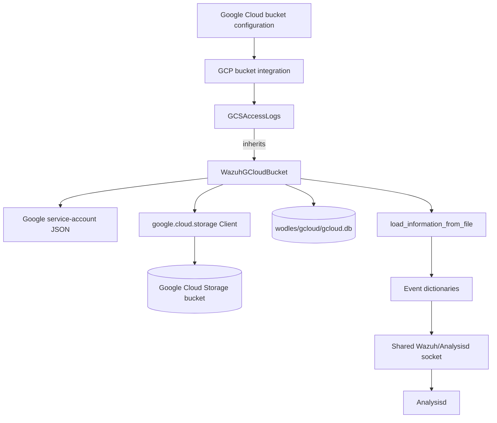
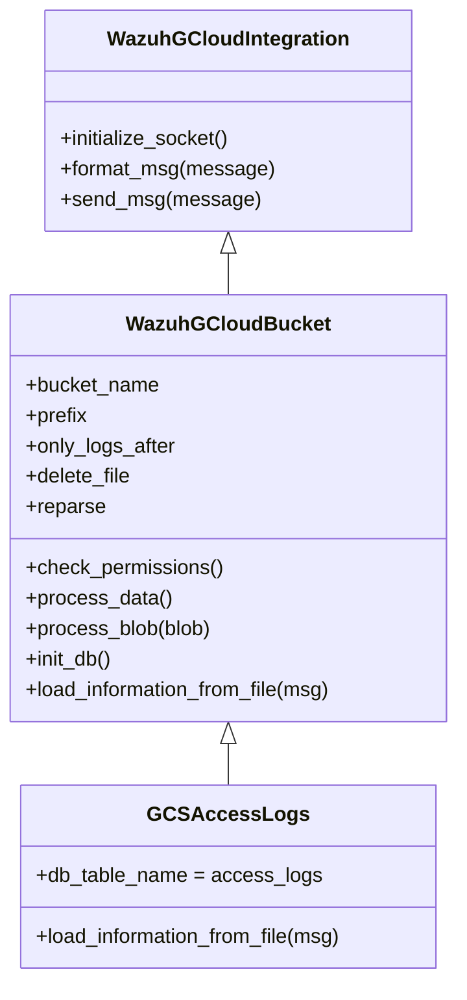
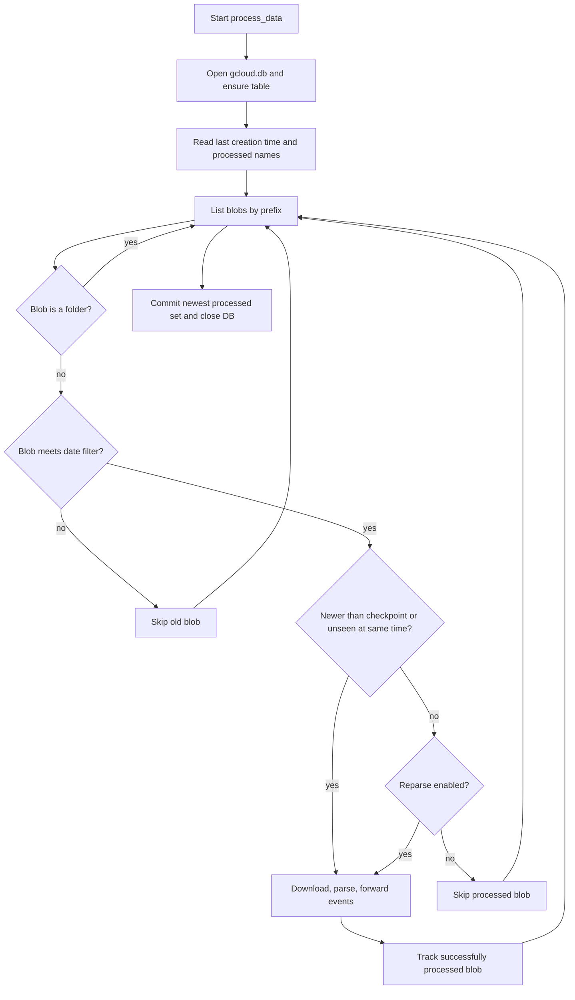
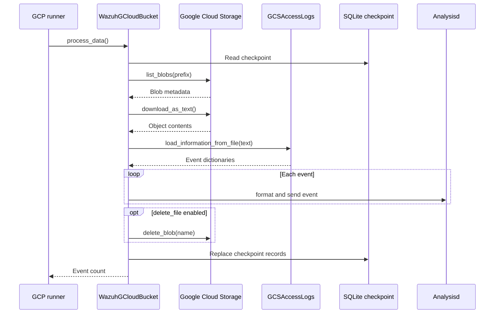
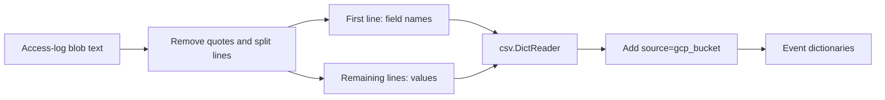

# GCP Cloud Storage Buckets

The `gcloud_buckets` module ingests log objects from Google Cloud Storage into Wazuh. It authenticates with a Google service-account JSON file, filters objects by bucket, prefix, and creation time, parses each object into event dictionaries, forwards those events to Analysisd through the shared Google Cloud integration, and optionally deletes successfully processed objects.

This document covers `wodles/gcloud/buckets`. The surrounding Google Cloud module and daemon lifecycle are documented in [wazuh_modules_core_cloud_integrations_gcp.md](wazuh_modules_core_cloud_integrations_gcp.md) and [wazuh_modules_core_cloud_integrations.md](wazuh_modules_core_cloud_integrations.md).

## Scope and responsibilities

The module has two layers:

| Component | Responsibility |
| --- | --- |
| `WazuhGCloudBucket` | Shared bucket client, authentication, permission checks, object discovery, SQLite checkpointing, event forwarding, and optional deletion. |
| `GCSAccessLogs` | Specialized parser for Google Cloud Storage access-log objects. It extracts the header row, maps subsequent CSV rows to fields, and marks events with `source='gcp_bucket'`. |

The base class deliberately leaves `load_information_from_file()` abstract. Additional bucket formats can reuse the lifecycle and implement only their parser.

## Architecture

### Component relationships

`GCSAccessLogs` is a thin format adapter. Its constructor calls the base constructor and assigns `db_table_name = "access_logs"`, which gives this parser an isolated checkpoint table. The base class owns all external-resource and delivery behavior.

## Initialization and configuration

`WazuhGCloudBucket.__init__()` performs the following setup:

1. Initializes the shared `WazuhGCloudIntegration` state.
2. Creates a Google Storage client using `storage.client.Client.from_service_account_json(credentials_file)`.
3. Stores the project ID returned by the client and normalizes the prefix so a non-empty prefix ends in `/`.
4. Stores the processing policy: `delete_file`, `only_logs_after`, and `reparse`.
5. Sets the default comparison date to midnight UTC for the current day.
6. Selects the SQLite state database at `<Wazuh installation>/wodles/gcloud/gcloud.db`.

Missing or malformed credentials are translated into Wazuh-specific `GCloudError` exceptions. Missing optional Google dependencies cause a `WazuhIntegrationException` during import. The parent integration supplies the socket and message-formatting details; see [wazuh_modules_core_cloud_integrations_gcp.md](wazuh_modules_core_cloud_integrations_gcp.md) for the generated GCP component overview.

## Bucket access and permission checks

`check_permissions()` resolves the configured bucket with `client.get_bucket(bucket_name)` and caches the resulting bucket object. It maps Google API failures to explicit Wazuh errors:

| Google result | Meaning | Wazuh behavior |
| --- | --- | --- |
| `NotFound` | Bucket does not exist | Raises `GCloudError(1100)`. |
| `Forbidden` | Service account lacks `storage.buckets.get` | Raises `GCloudError(1101)`. |
| Success | Bucket is accessible | Stores the bucket client in `self.bucket`. |

This check is separate from object processing, allowing startup/configuration validation to fail before ingestion begins.

## Incremental processing and checkpointing

The module uses SQLite to make object processing resumable. Each concrete parser supplies a table name; for access logs the table is `access_logs`. The primary key is the tuple `(project_id, bucket_name, prefix, blob_name)`, so multiple projects, buckets, and prefixes can share one database without colliding.

The checkpoint stores the creation time for each successfully processed blob. At the beginning of a run, the module reads:

- the newest stored creation time via `_get_last_creation_time()`;
- all blobs at that creation time via `_get_last_processed_files()`.

An object is processed when its creation time is newer than the checkpoint, or when it has the same creation time but is not already recorded. This tie-breaker prevents objects created in the same timestamp interval from being lost. Objects older than `only_logs_after` (or today’s UTC midnight when the option is absent) are skipped.

After iteration, `_update_last_processed_files()` replaces the records for the current project/bucket/prefix with the blobs processed in the newest creation-time group. The transaction is committed and the connection closed in `finally`, including when processing raises an exception.

### Reparse behavior

With `reparse=False`, checkpointed blobs are skipped. With `reparse=True`, checkpointed blobs that pass the date filter are downloaded and parsed again. Reparsed blobs are still included in the processed set, so the state remains consistent after the run.

## Object processing pipeline

`process_blob()` downloads the object as text, delegates parsing to `load_information_from_file()`, and sends every resulting event through the inherited integration API. A socket is opened for the event batch using `initialize_socket()` and each dictionary is serialized with `json.dumps()` before being passed through `format_msg()` and `send_msg()`.

If `delete_file=True`, deletion occurs after parsing and event forwarding. A missing object during processing is logged as a warning and does not abort the entire bucket scan. The method returns the number of events sent, while `process_data()` aggregates that count across blobs.

## GCS access-log parsing

`GCSAccessLogs.load_information_from_file()` assumes the object format used by Google Cloud Storage access logs:

1. Remove double-quote characters and split the object into lines.
2. Treat the first line as comma-separated field names, trimming whitespace around each name.
3. Treat remaining lines as data rows and feed them to `csv.DictReader` with those field names.
4. Convert each row to a dictionary and add `source: 'gcp_bucket'`.

The result is a list of event dictionaries. Empty or trailing lines are passed through the CSV reader and therefore depend on Python’s CSV handling; callers should treat malformed source objects as input-quality issues rather than as a different parser mode.

## Error handling and operational considerations

- Credential parsing and file-access errors are converted to Wazuh integration errors during construction.
- Bucket existence and authorization are checked explicitly through Google API exception types.
- SQLite table-exists and checkpoint-delete operational errors are intentionally tolerated to support repeated initialization and cleanup.
- The database commit is performed in `finally`; however, a failure while parsing or sending can still prevent later blobs from being processed in that invocation.
- Only blobs that reach the processed list are checkpointed. This avoids marking an object complete before its events have been delivered.
- Folder marker objects ending in `/` are ignored.
- Event delivery and bucket deletion are coupled to successful parsing; deletion is not attempted for a missing object.

## Extension points

To support another GCS object format, subclass `WazuhGCloudBucket` and implement `load_information_from_file(msg)`. The subclass should also set a unique `db_table_name`. The inherited implementation then provides authentication, filtering, resumability, socket delivery, optional deletion, and event counting. Keep parser output as dictionaries so the base class can serialize and forward it uniformly.

## Related documentation

- [wazuh_modules_core_cloud_integrations_gcp.md](wazuh_modules_core_cloud_integrations_gcp.md) — native GCP module structures and cloud-integration placement.
- [wazuh_modules_core_cloud_integrations.md](wazuh_modules_core_cloud_integrations.md) — shared Wazuh modules cloud-integration architecture.
- [cloudwatch_logs.md](cloudwatch_logs.md) — another cloud log ingestion component documented in this workspace.
