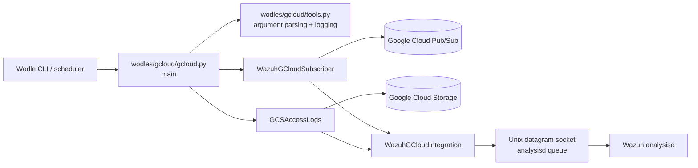
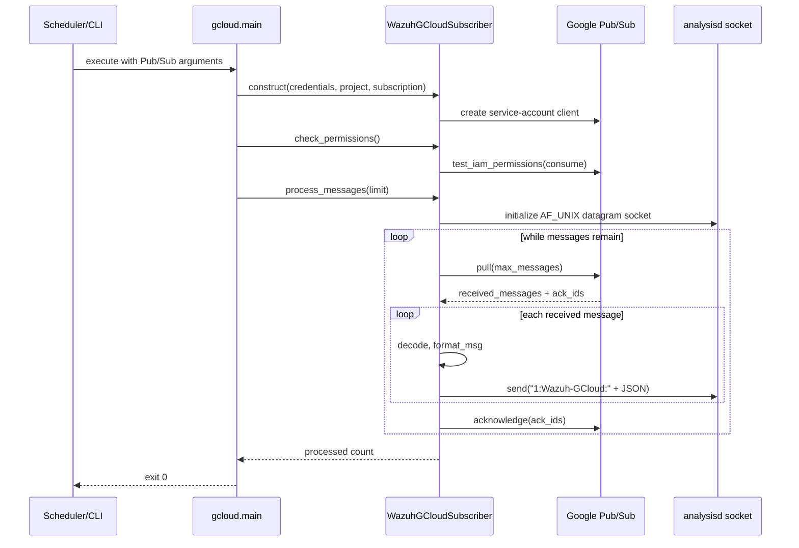
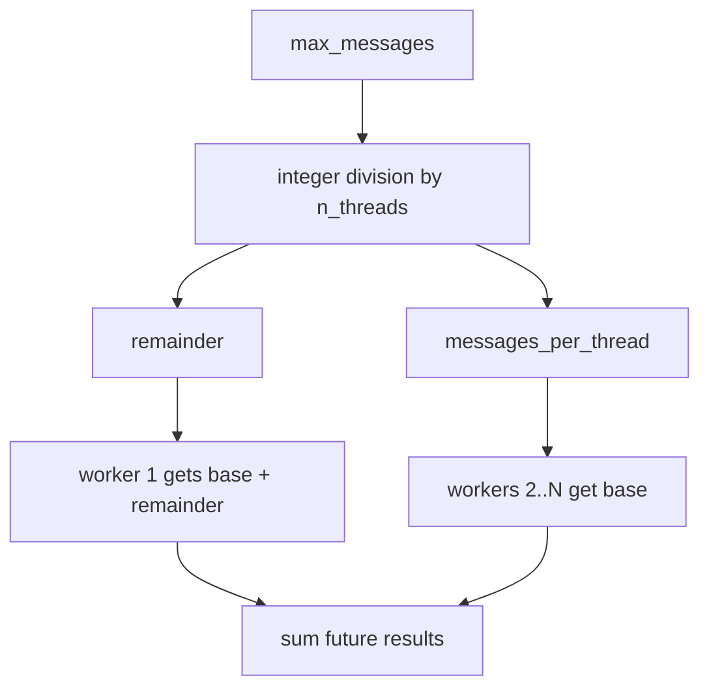
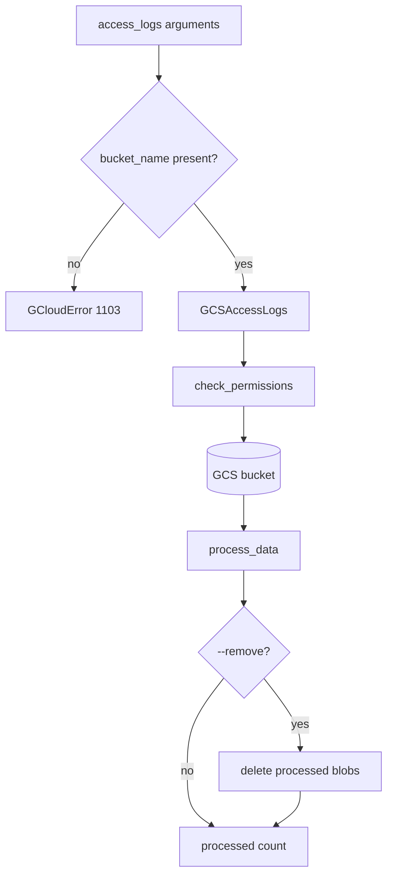

# gcloud_core

`gcloud_core` is the command-line orchestration layer for the Wazuh Google Cloud wodle. It accepts integration-specific arguments, validates the execution configuration, checks Google Cloud permissions, pulls or parses Google Cloud data, and forwards normalized events to Wazuh `analysisd`.

The module supports two execution modes:

- `pubsub`: pull messages from a Google Cloud Pub/Sub subscription, wrap each payload as a Wazuh GCP event, send it to `analysisd`, and acknowledge successfully forwarded messages.
- `access_logs`: process log objects from a Google Cloud Storage bucket. The bucket-specific implementation is documented in [gcloud_buckets.md](gcloud_buckets.md).

## Scope and system position

The module is a short-lived integration process rather than a long-running consumer. `main()` performs one bounded run, reports the number of processed messages, and exits with a Wazuh integration error code or zero on success.



## Component architecture

### `gcloud.py::main`

`main()` is the process entry point and mode dispatcher.

1. Creates the stdout logger and parses command-line arguments.
2. Selects `pubsub` or `access_logs` from `integration_type`.
3. Validates mode-specific required values and numeric bounds.
4. Constructs the selected integration and checks its cloud permissions.
5. Processes a bounded number of messages.
6. Converts Wazuh integration exceptions into logged messages and exit codes.

For Pub/Sub, the requested thread count is capped at `cpu_count() * 5` (falling back to five if CPU detection returns `None`). The total message limit is divided between workers; the first worker receives the remainder so the requested total is preserved.

### `integration.py::WazuhGCloudIntegration`

This is the common integration contract and Wazuh transport adapter.

| Member | Responsibility |
| --- | --- |
| `header` | Prepends `1:Wazuh-GCloud:` to outbound events. |
| `key_name` | Identifies the integration payload key as `gcp`. |
| `format_msg(msg)` | Wraps a provider payload as `{"integration": "gcp", "gcp": ...}`. |
| `initialize_socket()` | Opens and connects an AF_UNIX datagram socket to `ANALYSISD`. |
| `send_msg(msg)` | Encodes and sends the Wazuh-framed event; warns when it exceeds `MAX_EVENT_SIZE`. |
| `check_permissions()` | Abstract operation implemented by concrete integrations. |
| `process_data()` | Abstract operation implemented by concrete integrations. |

Socket failures are translated into `WazuhIntegrationInternalError` values. The socket is owned by the concrete processing operation and is used as a context manager in the Pub/Sub path.

### `pubsub/subscriber.py::WazuhGCloudSubscriber`

`WazuhGCloudSubscriber` extends the base transport with the Google Cloud Pub/Sub client.

- Builds a service-account subscriber client from `credentials_file`.
- Builds a fully qualified subscription path from `project` and `subscription_id`.
- Checks the `pubsub.subscriptions.consume` IAM permission.
- Pulls messages synchronously with a bounded `max_messages` value.
- Decodes message bytes using replacement semantics for invalid UTF-8.
- Formats and sends each message before collecting its acknowledgement ID.
- Acknowledges all messages from the pull request after forwarding them.
- Repeats pulls until the requested limit is reached or a pull returns no messages.

The Google client dependency is imported at module load time. If it is unavailable, the module raises `GCloudError(1003)` identifying the missing package.

### `tools.py::arg_valid_date`

`arg_valid_date()` is the `argparse` converter for `--only_logs_after`. It accepts `YYYY-MMM-DD`, where `MMM` is parsed through Python's `%b` directive, and returns a UTC-aware `datetime`. Invalid values raise `argparse.ArgumentTypeError`.

The same file also defines the command-line surface used by `main()`:

| Option | Purpose |
| --- | --- |
| `--integration_type` | Required mode: `pubsub` or `access_logs`. |
| `--credentials_file` | Required service-account credentials path. |
| `--project`, `--subscription_id` | Pub/Sub project and subscription. |
| `--max_messages` | Maximum messages pulled in one run; default `100`. |
| `--num_threads` | Pub/Sub worker count; default `1`. |
| `--bucket_name`, `--prefix` | GCS access-log bucket and object prefix. |
| `--remove` | Delete processed GCS objects. |
| `--only_logs_after` | UTC lower bound for access-log processing. |
| `--reparse` | Reprocess previously parsed access-log objects. |
| `--log_level` | `0` warning, `1` info, `2` debug. |

## Pub/Sub data flow



The acknowledgement boundary is important: the implementation adds an acknowledgement ID before sending, but calls Pub/Sub `acknowledge()` only after all messages in the pull response have been sent. A send failure aborts the processing operation and prevents the acknowledgement call for that batch.

## Threading and work allocation

`main()` creates a `ThreadPoolExecutor` for Pub/Sub mode. It performs the permission check once using the first subscriber, then submits one processing task per active worker.



Workers are independent subscriber instances and sockets. When `max_messages < n_threads`, only the first task is submitted with the full remainder-inclusive allocation; the remaining workers are not created because their allocation is zero.

Numeric constraints enforced by `main()` are:

- `n_threads >= 1` (`GCloudError(1202)` otherwise).
- `max_messages >= 1` (`GCloudError(1203)` otherwise).
- Requested threads above the computed maximum are truncated with a warning.

## Access-log path

For `access_logs`, `main()` constructs `GCSAccessLogs` with the bucket name, prefix, deletion flag, date boundary, and reparse flag. It checks permissions and calls `process_data()`. The concrete bucket parsing, state, and object lifecycle belong to the [gcloud bucket module](gcloud_buckets.md).



## Error handling and exit behavior

There are two error layers:

1. Known `WazuhIntegrationException` failures are logged at `error` level, except internal failures which use `critical`. Debug tracebacks are included when `log_level == 1`. The process exits with the exception's `errcode`.
2. Unexpected exceptions are logged as critical with a traceback and exit with `UNKNOWN_ERROR_ERRCODE`.

Successful execution logs a count. Pub/Sub success uses the wording “Received and acknowledged”; access-log success uses “Received”. The process then exits with code `0`.

Typical known failures include missing Pub/Sub project or subscription, invalid numeric arguments, missing credentials files, malformed service-account JSON, missing Google client libraries, missing IAM permissions, inaccessible subscriptions, analysisd socket failures, and pull deadlines.

## Event contract

For a Pub/Sub message whose decoded data is `M`, the transport produces the following logical payload before adding the Wazuh transport header:

```json
{"integration": "gcp", "gcp": M}
```

`M` is inserted as JSON text, so the expected source message is JSON-compatible. The final bytes sent to `analysisd` are:

```text
1:Wazuh-GCloud:{"integration": "gcp", "gcp": M}
```

The base class does not serialize or validate `M`; provider payload validation is therefore delegated to the upstream Google service and downstream Wazuh processing.

## Maintenance notes

- Keep the base transport independent of provider-specific clients; concrete integrations should implement only permission checks and data processing.
- Preserve the send-before-ack ordering to avoid acknowledging messages that were not delivered to `analysisd`.
- Changes to `MAX_EVENT_SIZE`, `ANALYSISD`, or integration error codes should be reviewed with the shared wodle utilities and exception definitions.
- Any change to access-log semantics should be made and documented in [gcloud_buckets.md](gcloud_buckets.md), then reflected here only at the orchestration boundary.
- The module uses synchronous Pub/Sub pulls inside executor threads; changing to streaming pull would alter acknowledgement, shutdown, and message-limit semantics.

## Source map

| Concern | Source |
| --- | --- |
| Process entry point and mode dispatch | `wodles/gcloud/gcloud.py` |
| Common Wazuh transport | `wodles/gcloud/integration.py` |
| Pub/Sub client and pull loop | `wodles/gcloud/pubsub/subscriber.py` |
| CLI arguments, logging, and date validation | `wodles/gcloud/tools.py` |
| GCS access-log implementation | [gcloud_buckets.md](gcloud_buckets.md) |
