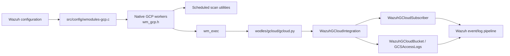
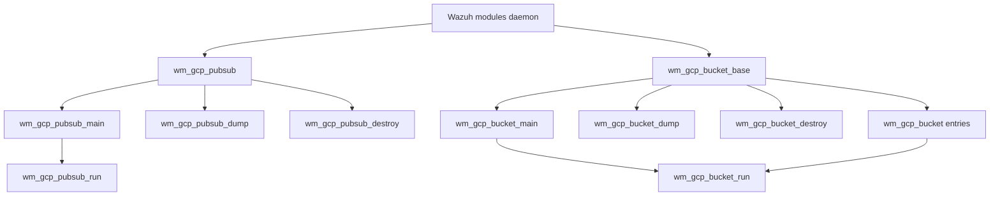
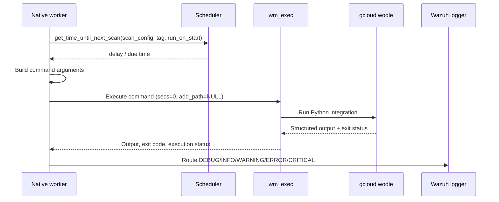
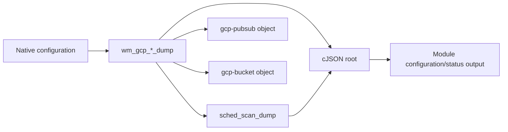

# GCP integration module

The GCP module is a Wazuh modules-daemon integration for collecting Google Cloud data. It has two native C workers: Pub/Sub subscription polling and Google Cloud Storage bucket analysis. The workers schedule executions, translate configuration into command-line arguments, invoke the Python `gcloud` wodle, and relay the wodle's structured log output through Wazuh logging.

The supplied implementation evidence is the module tree and `src/unit_tests/wazuh_modules/gcp/test_wm_gcp.c`. The tree identifies the public configuration types in `src/wazuh_modules/wm_gcp.h` and the Python integration components; the test file is the authoritative behavioral contract for the functions described below.

## Position in Wazuh

GCP is one of the cloud integrations hosted by the Wazuh modules daemon. Configuration is parsed by the C module configuration layer, while provider-specific Google Cloud SDK work is delegated to Python. This keeps daemon lifecycle, scheduling, memory ownership, and logging in the native module and keeps Google API interaction in the wodle.

Related documentation: [Wazuh modules daemon](wazuh_modules.md), [AWS integration](aws.md), [Azure integration](azure.md), and [Python cloud wodles](wodles.md).



## Architecture

### Native layer

The native layer exposes two parallel worker families.

| Worker | Configuration | Main operation | Python mode |
| --- | --- | --- | --- |
| Pub/Sub | `wm_gcp_pubsub` | `wm_gcp_pubsub_main` → `wm_gcp_pubsub_run` | `--integration_type pubsub` |
| Storage bucket | `wm_gcp_bucket_base` containing `wm_gcp_bucket` entries | `wm_gcp_bucket_main` → `wm_gcp_bucket_run` | `--integration_type access_logs` or another bucket type |

Both families also provide a dump function for diagnostics and a destroy function for owned allocations:



### Python layer

The native workers do not implement Google API calls directly. They construct an argv-equivalent command string and execute `wodles/gcloud/gcloud`. The Python entry point selects the integration and delegates to the corresponding subscriber or bucket implementation.

Relevant components from the module tree are:

- `wodles/gcloud/gcloud.py::main`: command-line entry point.
- `wodles/gcloud/integration.py::WazuhGCloudIntegration`: integration orchestration.
- `wodles/gcloud/pubsub/subscriber.py::WazuhGCloudSubscriber`: Pub/Sub consumption.
- `wodles/gcloud/buckets/bucket.py::WazuhGCloudBucket`: bucket abstraction.
- `wodles/gcloud/buckets/access_logs.py::GCSAccessLogs`: access-log bucket processing.
- `wodles/gcloud/tools.py::arg_valid_date`: date argument validation.

The GCP module therefore follows the same native-worker/Python-wodle boundary used by other cloud integrations; see [AWS integration](aws.md) and [Azure integration](azure.md) for sibling-module context.

## Configuration model

### Pub/Sub

`wm_gcp_pubsub` contains the provider identity, subscription settings, execution controls, and scheduled-scan state:

| Field | Role |
| --- | --- |
| `enabled` | Enables or disables the worker. |
| `pull_on_start` | Requests an immediate first pull instead of waiting for the next scheduled time. |
| `project_id` | Google Cloud project identifier. |
| `subscription_name` | Pub/Sub subscription identifier. |
| `credentials_file` | Service-account credentials path. |
| `max_messages` | Maximum messages requested per pull. |
| `num_threads` | Subscriber worker-thread count. |
| `scan_config` | Shared Wazuh scheduling state. |

Configuration tests cover missing `project_id`, `subscription_name`, and `credentials_file`; empty or non-digit `max_messages` and `num_threads`; and empty, missing, nonexistent, or overly long credential-file values.

The command shape verified by the tests is:

```text
wodles/gcloud/gcloud --integration_type pubsub \
  --project <project_id> \
  --subscription_id <subscription_name> \
  --credentials_file <credentials_file> \
  --max_messages <max_messages> \
  --num_threads <num_threads> [--log_level <debug_level>]
```

### Storage buckets

`wm_gcp_bucket_base` owns common worker state and a collection of `wm_gcp_bucket` entries:

| Field | Role |
| --- | --- |
| Base `enabled` | Enables or disables bucket processing. |
| Base `run_on_start` | Requests an immediate first analysis. |
| Entry `bucket` | GCS bucket name. |
| Entry `type` | Bucket integration type, such as `access_logs`. |
| Entry `credentials_file` | Service-account credentials path. |
| Entry `prefix` | Object-name prefix to inspect. |
| Entry `only_logs_after` | Lower time boundary for object/log processing. |
| Entry `remove_from_bucket` | Adds `--remove`, allowing processed objects to be removed. |
| Base `scan_config` | Shared Wazuh scheduling state. |

Configuration tests cover missing bucket entries, bucket name/type/credentials, optional path and time-boundary cases, and the remove option. Credential-file validation is also tested for empty, missing, nonexistent, and overly long values.

The access-log command shape verified by the tests is:

```text
wodles/gcloud/gcloud --integration_type access_logs \
  --bucket_name <bucket> \
  --credentials_file <credentials_file> \
  --prefix <prefix> \
  --only_logs_after <date> [--remove] [--log_level <debug_level>]
```

## Execution and scheduling

Each enabled worker logs `Module started.`, asks the shared scheduler for the delay until its next scan, optionally logs the target timestamp, then performs a fetch. The test suite stubs `FOREVER` to terminate after one iteration, showing that production workers are loop-based and return `NULL` when their loop exits.

```mermaid
flowchart TD
    Start[Worker main] --> Enabled{enabled?}
    Enabled -- no --> Disabled[Log "Module disabled. Exiting."]
    Enabled -- yes --> Started[Log "Module started."]
    Started --> Delay[sched_scan_get_time_until_next_scan]
    Delay --> Due{Due now?}
    Due -- no --> Sleep[Log target time and sleep]
    Sleep --> Fetch
    Due -- yes --> Fetch[Log "Starting fetching of logs."]
    Fetch --> Run[Build command and call wm_exec]
    Run --> Report[Route wodle output and status]
    Report --> Finish[Log "Fetching logs finished."]
    Finish --> Loop[Wait for next scheduled iteration]
    Loop --> Delay
```

Pub/Sub uses `pull_on_start`; buckets use `run_on_start`. In both cases the flag is passed to the scheduler, so the worker does not duplicate scheduling policy. A scheduled future run is rendered with a timestamp obtained through the shared time utility.

## Command execution and output handling

`wm_gcp_pubsub_run` and `wm_gcp_bucket_run` follow the same sequence:

1. Log `Create argument list`.
2. Build the mode-specific command, adding `--log_level` when the native debug level requires it.
3. Log `Launching command: ...`.
4. Call `wm_exec` with zero timeout and no extra path.
5. Interpret the execution status and command exit code.
6. Parse one or more `:gcloud_wodle:` output records and map their severity to Wazuh logging.



The tests establish these status rules:

- An internal execution failure logs `Internal error. Exiting...` at error level.
- A nonzero command exit code logs `Command returned exit code N` at warning level.
- Debug, info, warning, error, and critical wodle records are routed to the corresponding native logging function.
- Debug records may be discarded when the current debug level does not allow them.
- Multiple records and multiline messages are preserved as separate log messages where the `:gcloud_wodle:` marker identifies a new record.

## Diagnostics dumps

The dump functions produce cJSON diagnostics and include the scheduled-scan dump generated by the common scheduler utility.



The Pub/Sub dump is rooted at `gcp-pubsub` and represents enabled state, pull-on-start state, message/thread limits, project, subscription, credentials, and scheduling information. The bucket dump is rooted at `gcp-bucket` and represents enabled state, run-on-start state, bucket entries, and scheduling information. Bucket entries include the provider fields needed to reconstruct execution.

Allocation failures are handled defensively: failure to allocate the root returns `NULL`; failure to allocate subordinate objects leaves the available root usable where the implementation can do so. The tests explicitly exercise root and scheduler-object allocation failures.

## Memory ownership and lifecycle

The destroy functions are responsible for nested configuration memory. Pub/Sub owns its project, subscription, and credentials strings. Bucket configuration owns the bucket list and each entry's bucket, type, credentials, prefix, and date strings. The unit tests invoke destruction under leak checking; they intentionally make no value assertions because the contract is complete cleanup.

## Testing

The GCP tests use CMocka and wrapper functions for cJSON, debug-level checks, scheduling/time utilities, and `wm_exec`.

| Test file | Coverage |
| --- | --- |
| `src/unit_tests/wazuh_modules/gcp/test_wm_gcp.c` | Pub/Sub and bucket run paths, scheduling/lifecycle, dumps, command construction, output severity routing, error handling, and destruction. |
| `src/unit_tests/wazuh_modules/gcp/test_wmodules_gcp.c` | Configuration parsing, required fields, numeric validation, credential-file validation, and bucket option combinations. |

The test fixture sets `test_mode` during the group setup, allocates isolated configuration objects, injects mocked scheduler and executor results, and restores/free resources during teardown. When changing command-line construction or log parsing, update both the success/error tests and the debug-level variants because the expected command and output routing depend on the current native debug level.

## Maintenance notes

- Keep the native command contract synchronized with `wodles/gcloud/gcloud.py`; a renamed option affects both worker families and their tests.
- Preserve the `:gcloud_wodle:` record prefix and severity format because the native workers use it as the boundary between Python output and Wazuh logging.
- Reuse common scheduler, time, execution, cJSON, and logging utilities rather than adding GCP-specific equivalents.
- Treat credential paths as validated configuration data; the parser tests show that empty, missing, nonexistent, and oversized values are expected failure cases.
- When adding a bucket type, implement the Python bucket specialization and extend the native type-to-command contract and dump tests together.

## Source map

- Native configuration types: `src/wazuh_modules/wm_gcp.h`.
- GCP configuration parser: `src/config/wmodules-gcp.c`.
- Python entry point and integration: `wodles/gcloud/gcloud.py`, `wodles/gcloud/integration.py`.
- Pub/Sub implementation: `wodles/gcloud/pubsub/subscriber.py`.
- Bucket implementations: `wodles/gcloud/buckets/bucket.py`, `wodles/gcloud/buckets/access_logs.py`.
- Runtime tests: `src/unit_tests/wazuh_modules/gcp/test_wm_gcp.c`.
- Configuration tests: `src/unit_tests/wazuh_modules/gcp/test_wmodules_gcp.c`.
