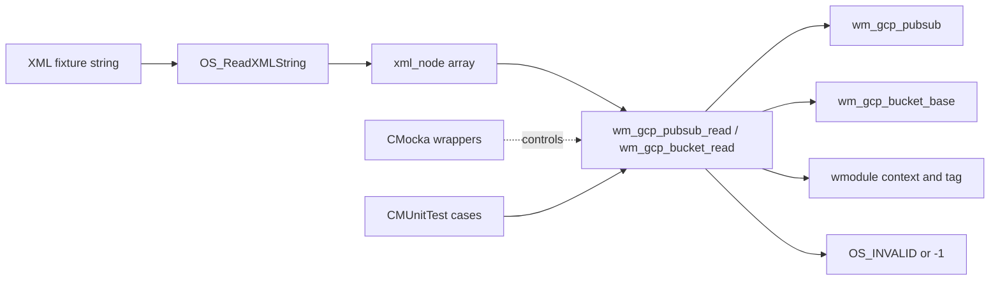
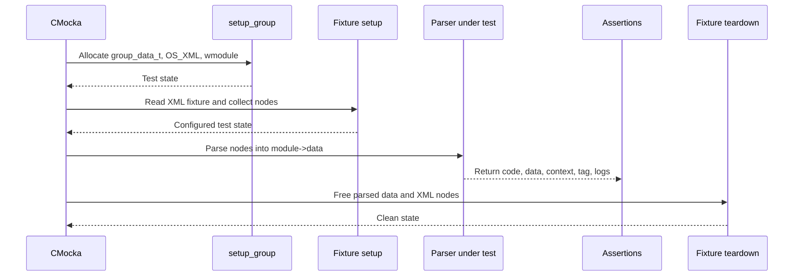
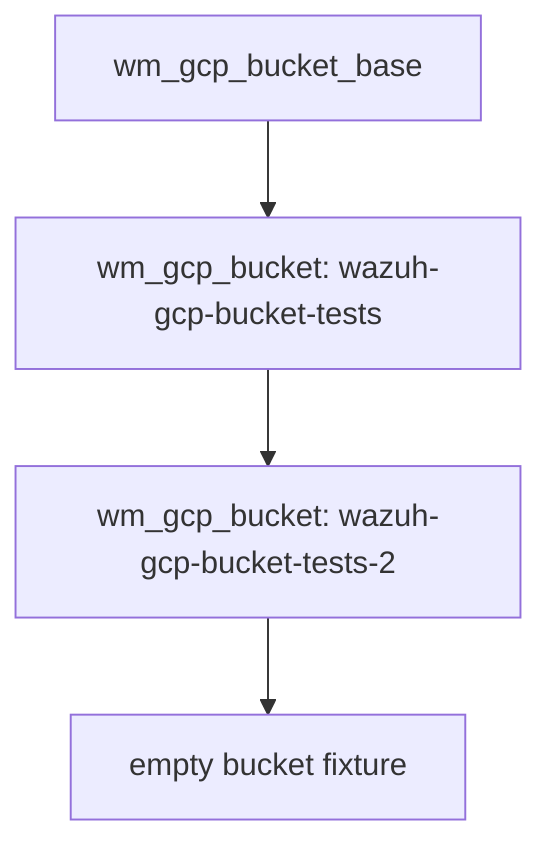
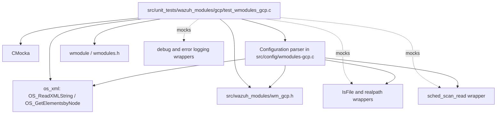
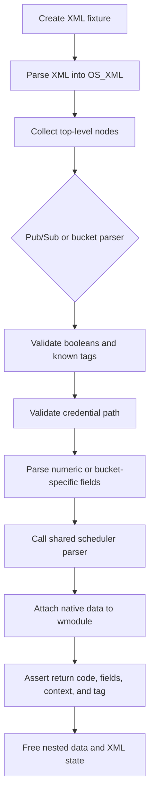

# GCP Wmodules Configuration Tests

## Introduction

`gcp_wmodules` is the unit-test module for the native GCP wodule configuration readers. It verifies that XML nodes for the `<gcp-pubsub>` and `<gcp-bucket>` integrations are converted into valid Wazuh module structures, while malformed, incomplete, or unsafe values are rejected.

The tests are implemented in `src/unit_tests/wazuh_modules/gcp/test_wmodules_gcp.c` with CMocka. They exercise the configuration boundary rather than Google Cloud API communication or worker execution. For the production parser and runtime, see [Wmodules_Config_gcp](Wmodules_Config_gcp.md), [wazuh_modules_core_cloud_integrations_gcp](wazuh_modules_core_cloud_integrations_gcp.md), and [gcp](gcp.md).

## Scope and position in the system

The test module sits between the XML utility layer and the native GCP configuration parser:



The tested parser is responsible for populating the structures defined in `wm_gcp.h`. The resulting structures are later consumed by the runtime documented in [wazuh_modules_core_cloud_integrations_gcp](wazuh_modules_core_cloud_integrations_gcp.md); this test file does not launch the Python `gcloud` integration.

## Test architecture

### Test lifecycle

`main()` creates a CMocka test table and runs it with the common `setup_group` and `teardown_group` callbacks. Each test receives a `group_data_t` object containing:

| Field | Purpose |
| --- | --- |
| `xml` | Allocated `OS_XML` document used to parse an XML fixture. |
| `nodes` | Top-level `xml_node**` returned by `OS_GetElementsbyNode`. |
| `module` | Allocated generic `wmodule` receiving parser output. |



`teardown_test_pubsub` frees the Pub/Sub strings and structure. `teardown_test_bucket` walks the bucket linked list and frees each owned string and node. This makes cleanup part of the test contract and prevents one malformed configuration case from contaminating later tests.

### Fixture mutation helpers

The test file builds a valid baseline and mutates individual XML values to isolate validation rules:

- `replace_configuration_value()` changes a top-level tag such as `enabled`, `project_id`, or `max_messages`.
- `replace_bucket_configuration_value()` changes a child tag inside the first `<bucket>`.
- `replace_bucket_configuration_attribute()` changes the `<bucket>` attribute, primarily `type`.

These helpers deliberately operate on the parsed XML tree, so each test verifies parser behavior against the same representation used by production configuration loading.

## Pub/Sub configuration coverage

`setup_test_pubsub()` creates a complete fixture containing:

```xml
<enabled>yes</enabled>
<pull_on_start>no</pull_on_start>
<project_id>wazuh-gcp-pubsub-tests</project_id>
<subscription_name>testing-id</subscription_name>
<credentials_file>credentials.json</credentials_file>
<max_messages>100</max_messages>
<num_threads>2</num_threads>
<day>15</day>
```

The successful test verifies that `wm_gcp_pubsub_read()`:

- enables the module;
- preserves `pull_on_start = no`;
- copies project, subscription, and credential values;
- parses numeric values into `max_messages` and `num_threads`;
- delegates scheduling to `sched_scan_read()` with `GCP_PUBSUB_WM_NAME`;
- attaches `WM_GCP_PUBSUB_CONTEXT` and the `gcp-pubsub` tag to the `wmodule`.

The validation matrix is:

| Case | Expected result |
| --- | --- |
| Missing `project_id` or `subscription_name` | `OS_INVALID`; required-value error. |
| Missing or empty `credentials_file` | `OS_INVALID`; required-value error. |
| Credential path cannot be resolved by `realpath()` | `OS_INVALID`; file-not-found error. |
| Resolved credential path is not a file | `OS_INVALID`; configuration error. |
| Credential path exceeds `PATH_MAX` | `OS_INVALID`. |
| Empty or non-boolean `enabled` / `pull_on_start` | `OS_INVALID`. |
| Empty or non-numeric `max_messages` / `num_threads` | `OS_INVALID`. |
| Invalid top-level tag, NULL element, or NULL node array | `-1` and an error log. |
| Scheduler rejects the fixture | `-1`. |

The tests also cover absolute credential paths. In that case the parser validates the supplied path and retains it in the resulting structure rather than replacing it with a relative fixture value.

## Bucket configuration coverage

`setup_test_bucket()` creates two valid access-log buckets and one empty bucket:



Each valid bucket includes a name, `type='access_logs'`, credentials file, object prefix, cutoff date, and remove flag. The successful test confirms that the first bucket is parsed correctly, that two credential files are validated, that scheduling is delegated with `GCP_BUCKET_WM_NAME`, and that the module receives `WM_GCP_BUCKET_CONTEXT` and the `gcp-bucket` tag.

Bucket validation is tested at both attribute and child-element levels:

| Area | Cases covered | Expected result |
| --- | --- | --- |
| Module flags | Invalid `enabled` or `run_on_start` | `OS_INVALID`. |
| Bucket existence | No `<bucket>` entries | `OS_INVALID`. |
| Type attribute | Missing, empty, invalid, or unknown attribute name | `OS_INVALID`; only `access_logs` is accepted. |
| Bucket children | Unknown child tag or NULL element | `OS_INVALID` or `-1`. |
| Name | Missing or empty `name` | `OS_INVALID`. |
| Credentials | Missing, empty, unresolved, non-file, or oversized path | `OS_INVALID`. |
| Prefix | Empty `path` | `OS_INVALID`. |
| Time filter | Empty `only_logs_after` | `OS_INVALID`. |
| Removal | Empty or invalid `remove_from_bucket` | `OS_INVALID`. |
| Scheduling | `sched_scan_read()` failure | `-1`. |
| Input pointer | NULL node array | `-1`. |

The `no_credentials_file` fixture demonstrates that validation is performed independently for every linked-list bucket: an earlier valid entry does not make a later incomplete entry acceptable.

## Dependency and interaction model



Important test doubles include:

- file-system wrappers for `realpath()` and `IsFile()`;
- scheduler wrappers for `sched_scan_read()`;
- logging wrappers used to assert exact error messages;
- debug wrappers used by bucket parsing;
- standard allocation and string helpers supplied by the Wazuh test framework.

The wrappers keep tests deterministic: no real credential file, scheduler clock, or Google service is required.

## Process flow for a successful parse



For an invalid parse, the flow exits at the first invalid field, emits the expected diagnostic through a mocked logger, and returns either `OS_INVALID` for semantic configuration errors or `-1` for malformed parser input/internal traversal failures.

## Test organization

`main()` registers the tests in two groups:

1. Pub/Sub parser tests: full configuration, scheduling failure, flags, required fields, credentials, numeric fields, invalid tags/elements, and NULL input.
2. Bucket parser tests: full configuration, scheduling failure, module and bucket flags, bucket attributes, child tags, credentials, linked-list entries, invalid tags/elements, and NULL input.

The neighboring runtime suite, `src/unit_tests/wazuh_modules/gcp/test_wm_gcp.c`, covers worker loops, command construction, wodle output routing, dumps, and destruction. Keeping the suites separate makes failures easier to interpret:

| Failure location | Likely concern |
| --- | --- |
| `test_wmodules_gcp.c` | XML schema, validation, allocation, or module registration. |
| `test_wm_gcp.c` | Scheduling loop, subprocess invocation, output handling, or runtime cleanup. |

See [Unit_Tests_-_Wazuh_Modules_(Cloud_Misc)](Unit_Tests_-_Wazuh_Modules_(Cloud_Misc).md) for the broader cloud-module test catalog and [Wmodules_Config_gcp](Wmodules_Config_gcp.md) for the production validation rules.

## Maintenance guidance

When adding a GCP configuration field:

1. Add it to the relevant valid fixture.
2. Add a success assertion for the resulting `wm_gcp_pubsub` or `wm_gcp_bucket` field.
3. Add missing, empty, and malformed-value tests where applicable.
4. Add wrapper expectations for file, scheduler, or logging side effects.
5. Update the production configuration documentation and the native data-contract documentation.

When adding a new bucket type, update the type attribute fixtures, the accepted-value assertions, and the linked-list success case. Runtime behavior should remain documented separately in [gcp](gcp.md).

## Summary

`gcp_wmodules` protects the XML-to-native-configuration boundary for Wazuh GCP integrations. Its tests establish that valid Pub/Sub and Storage bucket configurations are fully materialized and correctly registered, while invalid booleans, missing identifiers, unsafe credential paths, malformed numeric values, invalid bucket schemas, and scheduler failures are rejected deterministically.
