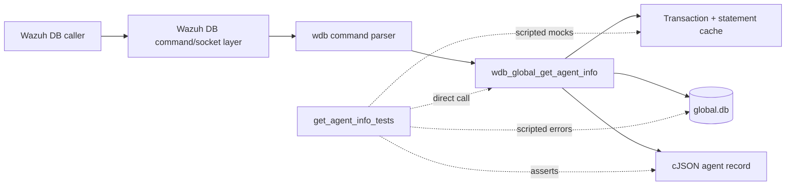
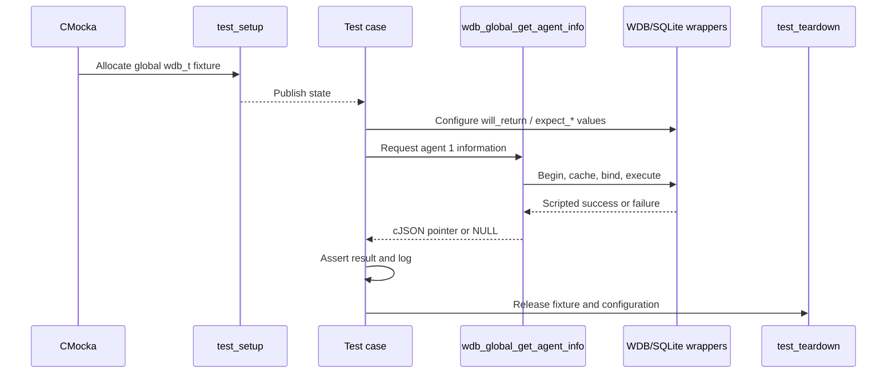
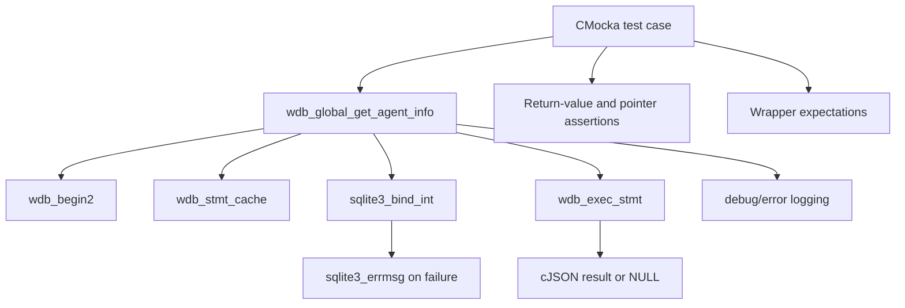
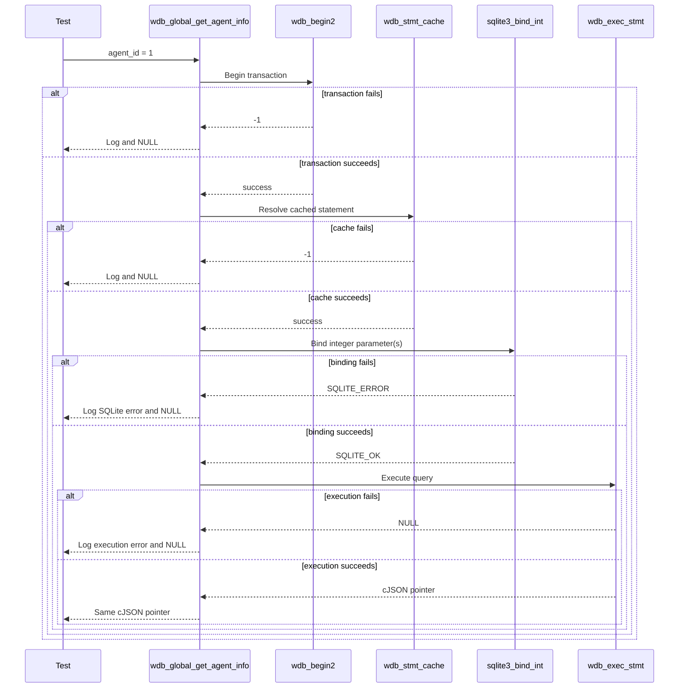

# `get_agent_info_tests`

## Introduction

`get_agent_info_tests` documents the CMocka tests for `wdb_global_get_agent_info()`, the Wazuh DB global-database operation that retrieves one agent's persisted metadata and returns it as a `cJSON *` result.

The module is a focused test slice of `src/unit_tests/wazuh_db/test_wdb_global.c`. It validates the common database pipeline—transaction startup, prepared-statement caching, agent-ID binding, statement execution, and result propagation—without opening a real SQLite database. Shared fixture behavior is documented in [`test_wdb_global_test_infrastructure.md`](test_wdb_global_test_infrastructure.md); the surrounding global database test suite is documented in [`test_wdb_global.md`](test_wdb_global.md).

## Position in the system

At runtime, callers send a global-agent information request to `wazuh-db`. The command parser dispatches the request to the global database implementation, which queries `global.db` and builds the JSON response. This test module invokes the implementation directly and replaces database and logging boundaries with CMocka wrappers.



The production daemon, command protocol, and SQLite connection management are described in [`wazuh_db_daemon_core.md`](wazuh_db_daemon_core.md), [`wazuh_db_command_parser.md`](wazuh_db_command_parser.md), [`wazuh_db_global.md`](wazuh_db_global.md), and [`wazuh_db_engine.md`](wazuh_db_engine.md), where available.

## Scope and contract under test

The tested operation accepts a `wdb_t *` for the global database and an integer `agent_id`. Its observable contract is:

1. Start or join the current transaction.
2. Resolve the cached statement for the agent-information query.
3. Bind the agent ID as SQLite parameter 1.
4. Execute the statement through `wdb_exec_stmt()`.
5. Return the resulting JSON pointer unchanged on success.
6. Return `NULL` and emit a diagnostic when any prerequisite or execution step fails.

```mermaid
flowchart TD
    Start([wdb_global_get_agent_info(wdb, agent_id)]) --> Begin{wdb_begin2 succeeds?}
    Begin -- no --> TxError[Log Cannot begin transaction] --> Null[Return NULL]
    Begin -- yes --> Cache{wdb_stmt_cache succeeds?}
    Cache -- no --> CacheError[Log Cannot cache statement] --> Null
    Cache -- yes --> Bind{sqlite3_bind_int parameter 1 succeeds?}
    Bind -- no --> BindError[Log SQLite bind error] --> Null
    Bind -- yes --> Execute{wdb_exec_stmt succeeds?}
    Execute -- no --> ExecError[Log execution error] --> Null
    Execute -- yes --> Result[Return cJSON result]
```

The tests do not assert the SQL text or the complete agent JSON schema. Those are implementation and schema concerns owned by the global database module. Here, the important guarantees are call ordering, parameter binding, short-circuit failure behavior, and pointer propagation.

## Test fixture and isolation

Each test is registered with `cmocka_unit_test_setup_teardown(test, test_setup, test_teardown)`.

`test_setup()` creates a minimal `test_struct_t` containing:

- a synthetic `wdb_t` whose ID is `"global"`;
- storage for a synthetic `sqlite3 *` slot;
- a 256-byte output buffer shared by other tests in `test_wdb_global.c`;
- initialized Wazuh DB configuration through `wdb_init_conf()`.

No real database is opened. `test_teardown()` releases the allocated fixture and calls `wdb_free_conf()`, ensuring that wrapper return values and configuration do not leak between cases. The complete lifecycle is maintained in [`test_wdb_global_test_infrastructure.md`](test_wdb_global_test_infrastructure.md).



## Dependencies and interaction boundaries

| Dependency | Role in these tests |
|---|---|
| `wdb.h` | Declares `wdb_t` and the production function contract. |
| `wdb_global_get_agent_info()` | Function under test. |
| `wdb_begin2` wrapper | Controls transaction-start success or failure. |
| `wdb_stmt_cache` wrapper | Controls statement-cache success or failure. |
| `sqlite3_bind_int` wrapper | Verifies the agent ID is bound at parameter index 1 and controls bind failure. |
| `sqlite3_errmsg` wrapper | Supplies deterministic SQLite error text. |
| `wdb_exec_stmt` wrapper | Supplies a JSON result or simulates query execution failure. |
| Debug wrappers | Verify the expected diagnostic message for each failure branch. |
| cJSON | Represents the function's JSON result; the success case uses a sentinel pointer. |
| CMocka | Registers cases, scripts mocks, and performs assertions. |



## Test scenarios

| Test case | Simulated condition | Expected behavior |
|---|---|---|
| `test_wdb_global_get_agent_info_transaction_fail` | `wdb_begin2()` returns `-1`. | Expects `Cannot begin transaction` and returns `NULL`; later database stages are not configured or called. |
| `test_wdb_global_get_agent_info_cache_fail` | Transaction succeeds, then `wdb_stmt_cache()` returns `-1`. | Expects `Cannot cache statement` and returns `NULL`. |
| `test_wdb_global_get_agent_info_bind_fail` | Statement cache succeeds, but binding agent ID `1` at index `1` returns `SQLITE_ERROR`. | Supplies `ERROR MESSAGE` through `sqlite3_errmsg`, expects `DB(global) sqlite3_bind_int(): ERROR MESSAGE`, and returns `NULL`. |
| `test_wdb_global_get_agent_info_exec_fail` | Transaction, cache, and all integer binds succeed; `wdb_exec_stmt()` returns `NULL`. | Expects `wdb_exec_stmt(): ERROR MESSAGE` and returns `NULL`. `expect_any_always` is used because this operation may bind more than one integer internally. |
| `test_wdb_global_get_agent_info_success` | Transaction, cache, binding, and execution succeed; execution returns `(cJSON *)1`. | Returns the exact sentinel pointer, proving successful result propagation without transforming or replacing it. |

The failure cases deliberately isolate one boundary at a time. This verifies that the implementation short-circuits immediately rather than attempting to bind or execute after an earlier failure.

## Component interaction flow



## Return and diagnostic behavior

The module establishes a consistent error contract for this lookup:

- database preparation failures return `NULL` and use debug-level diagnostics;
- SQLite parameter failures return `NULL` and include the database ID and SQLite error text;
- query execution failures return `NULL` and include the execution error text;
- successful execution returns the JSON object produced by the database layer without changing its identity.

This contract is representative of the transaction/cache/bind/execute pattern used by neighboring global operations such as [`test_wdb_global_find_group_tests.md`](test_wdb_global_find_group_tests.md). Broader agent metadata, labels, connection status, and pagination behavior should be read from [`test_wdb_global_helpers.md`](test_wdb_global_helpers.md) and [`test_wdb_global.md`](test_wdb_global.md), rather than inferred from this five-case leaf.

## Maintenance guidance

When changing `wdb_global_get_agent_info()` or its statement path:

1. Preserve one test for each pipeline boundary: transaction, cache, bind, execution, and success.
2. Keep the bind assertion at parameter index 1 unless the production statement contract intentionally changes.
3. Update expected diagnostic text when logging contracts change.
4. Continue using the shared fixture and wrappers so the test remains isolated from SQLite files and daemon state.
5. Add JSON-shape assertions only when this module explicitly takes ownership of the response schema; otherwise keep schema coverage in the global database implementation or helper tests.

## Source reference

- Production test source: `src/unit_tests/wazuh_db/test_wdb_global.c`
- Focused functions: `test_wdb_global_get_agent_info_transaction_fail`, `..._cache_fail`, `..._bind_fail`, `..._exec_fail`, and `..._success`
- Registered under the `/* Tests wdb_global_get_agent_info */` section in `main()`
