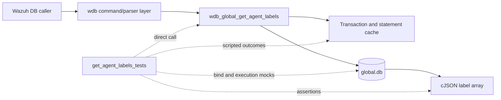
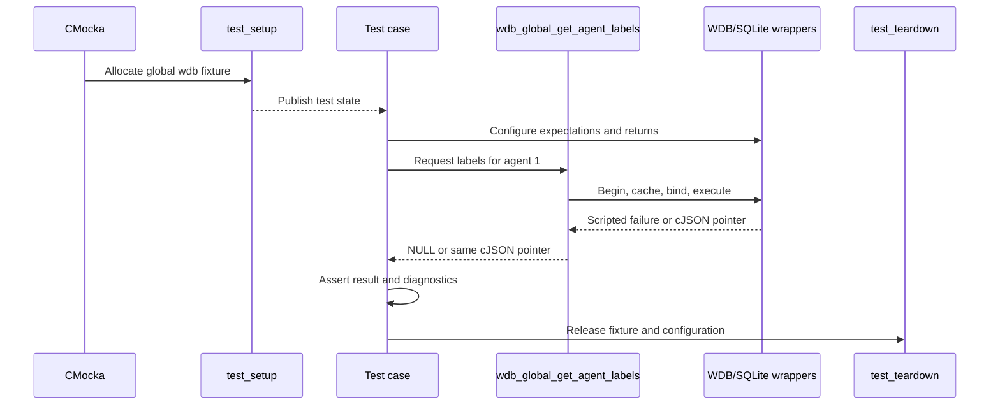
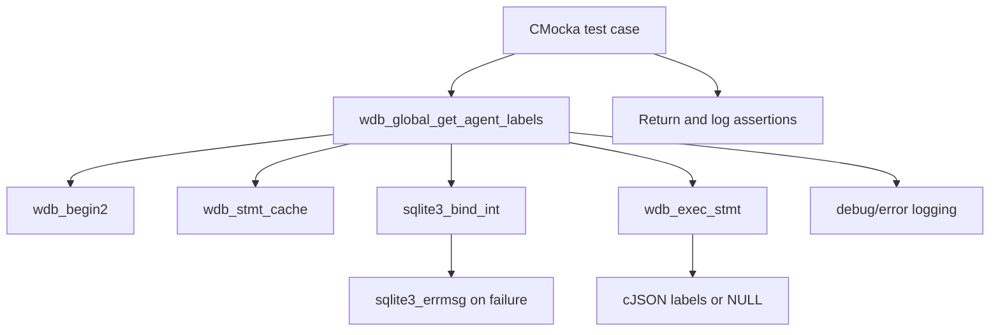
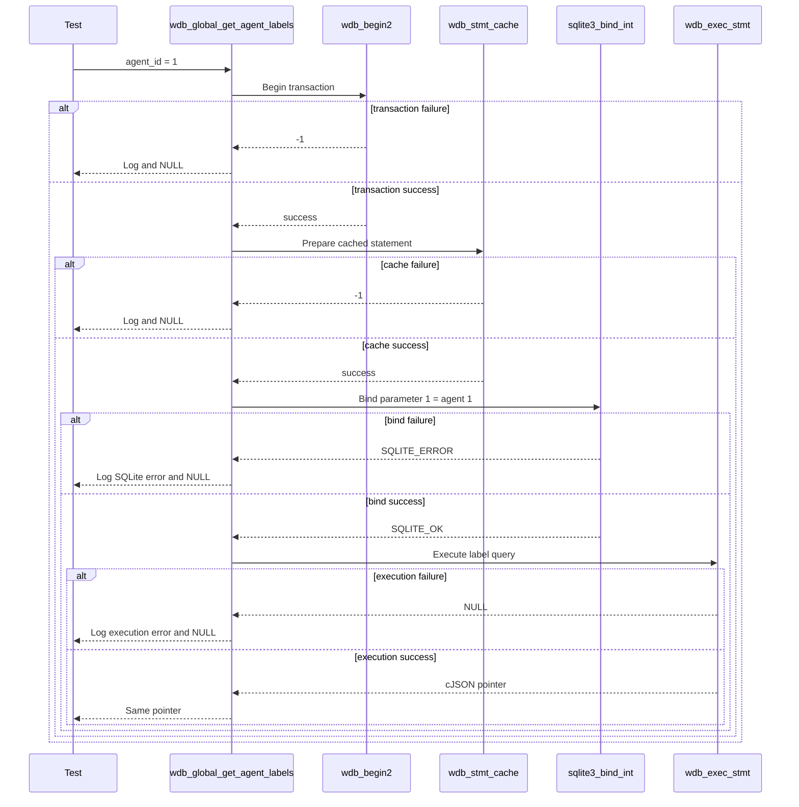

# `get_agent_labels_tests`

## Introduction

`get_agent_labels_tests` documents the CMocka tests for `wdb_global_get_agent_labels()`, the Wazuh DB global-database lookup that retrieves the labels associated with one agent and returns them as a `cJSON *` array.

The module is a focused slice of `src/unit_tests/wazuh_db/test_wdb_global.c`. Its five supplied cases isolate transaction startup, statement caching, agent-ID binding, statement execution, and successful result propagation. The tests use linker wrappers rather than a live SQLite database. The broader suite is described in [`test_wdb_global.md`](test_wdb_global.md), and the reusable fixture is described in [`test_wdb_global_test_infrastructure.md`](test_wdb_global_test_infrastructure.md).

> Scope note: `test_wdb_global.c` contains many other global-database test groups. They are outside this leaf module unless explicitly referenced by the five core components listed in the module definition.

## Position in the system

Agent labels are persisted in the global Wazuh database and are consumed as part of agent metadata and synchronization workflows. In production, a caller reaches the global database layer through the Wazuh DB command path. This module calls the target function directly and replaces the database and logging seams with deterministic CMocka wrappers.



The database engine and daemon boundaries are documented in [`wazuh_db_engine.md`](wazuh_db_engine.md), [`wazuh_db_daemon_core.md`](wazuh_db_daemon_core.md), and [`wazuh_db_command_parser.md`](wazuh_db_command_parser.md), where available.

## Contract under test

The tested operation accepts a global `wdb_t *` and an integer `agent_id`. The expected pipeline is:

1. Begin or join a database transaction through `wdb_begin2()`.
2. Obtain the cached statement through `wdb_stmt_cache()`.
3. Bind the agent ID as SQLite parameter 1 using `sqlite3_bind_int()`.
4. Execute the label query through `wdb_exec_stmt()`.
5. Return the resulting `cJSON *` unchanged.
6. On any failure, log the relevant diagnostic and return `NULL`.

```mermaid
flowchart TD
    Start([wdb_global_get_agent_labels(wdb, agent_id)]) --> Begin{wdb_begin2 succeeds?}
    Begin -- no --> TxError[Log: Cannot begin transaction] --> Null[Return NULL]
    Begin -- yes --> Cache{wdb_stmt_cache succeeds?}
    Cache -- no --> CacheError[Log: Cannot cache statement] --> Null
    Cache -- yes --> Bind{sqlite3_bind_int succeeds?}
    Bind -- no --> BindError[Log global DB SQLite bind error] --> Null
    Bind -- yes --> Execute{wdb_exec_stmt returns JSON?}
    Execute -- no --> ExecError[Log execution error] --> Null
    Execute -- yes --> Result[Return cJSON label array]
```

The tests verify control flow and return behavior; they do not assert the SQL text or impose a complete label schema. Those concerns belong to the production global-database implementation and its broader integration tests.

## Fixture and isolation

Each case is registered with `cmocka_unit_test_setup_teardown()`. The shared `test_setup()` allocates a `test_struct_t`, a synthetic `wdb_t` with ID `"global"`, a placeholder `sqlite3 *` slot, and a 256-byte output buffer, then calls `wdb_init_conf()`. No real database connection is opened.

`test_teardown()` releases those allocations and calls `wdb_free_conf()`. The complete lifecycle and wrapper catalog are maintained in [`test_wdb_global_test_infrastructure.md`](test_wdb_global_test_infrastructure.md).



## Dependencies and component relationships

| Dependency | Role in these tests |
|---|---|
| `wdb.h` | Declares `wdb_t` and the function under test. |
| `wdb_global_get_agent_labels()` | Production operation being exercised. |
| `wdb_begin2` wrapper | Controls transaction-start success or failure. |
| `wdb_stmt_cache` wrapper | Controls statement-cache success or failure. |
| `sqlite3_bind_int` wrapper | Verifies parameter index `1`, agent ID `1`, and bind status. |
| `sqlite3_errmsg` wrapper | Supplies deterministic SQLite error text. |
| `wdb_exec_stmt` wrapper | Returns a label result or simulates query failure. |
| Debug/error wrappers | Verify the expected diagnostic message. |
| cJSON | Represents the label-array result; success uses a sentinel pointer. |
| CMocka | Registers tests, scripts wrappers, and performs assertions. |



## Test scenarios

| Test case | Simulated condition | Expected behavior |
|---|---|---|
| `test_wdb_global_get_agent_labels_transaction_fail` | `wdb_begin2()` returns `-1`. | Expects `Cannot begin transaction`; returns `NULL` and does not proceed to cache, bind, or execute. |
| `test_wdb_global_get_agent_labels_cache_fail` | Transaction succeeds; `wdb_stmt_cache()` returns `-1`. | Expects `Cannot cache statement`; returns `NULL`. |
| `test_wdb_global_get_agent_labels_bind_fail` | Cache succeeds; binding agent `1` at parameter index `1` returns `SQLITE_ERROR`. | Supplies `ERROR MESSAGE` through `sqlite3_errmsg`, expects `DB(global) sqlite3_bind_int(): ERROR MESSAGE`, and returns `NULL`. |
| `test_wdb_global_get_agent_labels_exec_fail` | Transaction, cache, and integer binding succeed; `wdb_exec_stmt()` returns `NULL`. | Expects `wdb_exec_stmt(): ERROR MESSAGE` and returns `NULL`. |
| `test_wdb_global_get_agent_labels_success` | All preparation steps succeed; execution returns `(cJSON *)1`. | Returns the exact sentinel pointer, proving result identity is preserved. |

The cases deliberately configure only the dependencies needed for the selected branch. This makes short-circuit behavior observable: a failure at one stage cannot be hidden by later wrapper calls.

## Component interaction flow



## Return and diagnostic behavior

This leaf establishes the lookup's observable error contract:

- transaction and statement-cache failures return `NULL` with debug diagnostics;
- SQLite bind failures return `NULL` with the global database ID and SQLite error text;
- execution failures return `NULL` with the execution error text;
- successful execution returns the JSON pointer supplied by the database wrapper without transformation.

Label mutation and synchronization behavior are covered by neighboring global-database tests and should be read from [`test_wdb_global.md`](test_wdb_global.md) and [`test_wdb_global_helpers.md`](test_wdb_global_helpers.md), rather than duplicated here.

## Maintenance guidance

When changing `wdb_global_get_agent_labels()` or its prepared-statement path:

1. Preserve coverage for transaction, cache, bind, execution, and success boundaries.
2. Keep the agent ID binding assertion at parameter index `1` unless the SQL statement contract changes.
3. Update exact diagnostic assertions when logging messages intentionally change.
4. Continue using the shared fixture and wrappers so the test remains independent of SQLite files and daemon state.
5. Add label-schema assertions only if this leaf becomes the owner of that schema contract.

## Source reference

- Production test source: `src/unit_tests/wazuh_db/test_wdb_global.c`
- Focused cases: `test_wdb_global_get_agent_labels_transaction_fail`, `..._cache_fail`, `..._bind_fail`, `..._exec_fail`, and `..._success`
- Registered under the `/* Tests wdb_global_get_agent_labels */` section in `main()`
