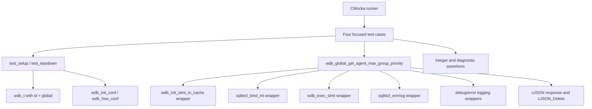
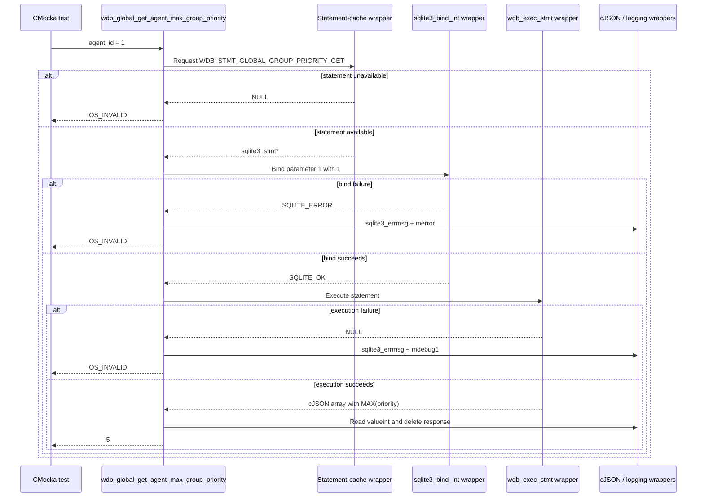
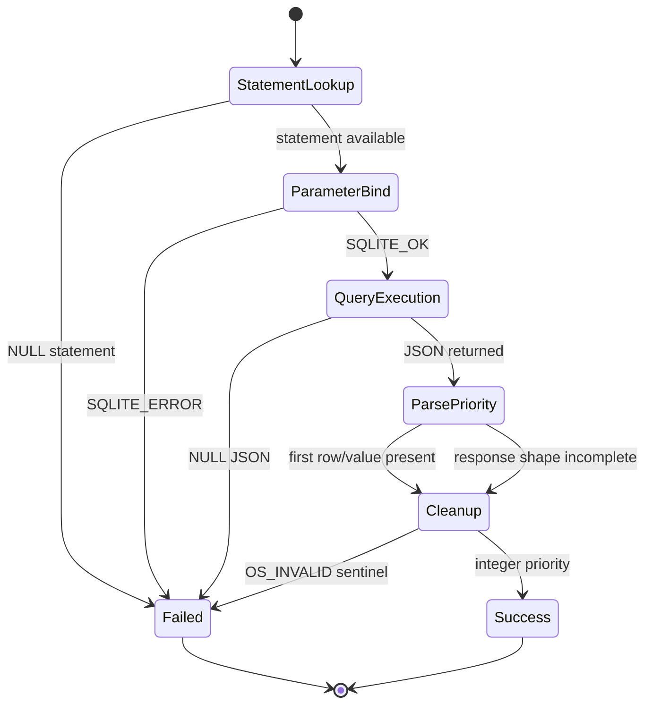

# `get_agent_max_group_priority_tests`

## Introduction

`get_agent_max_group_priority_tests` documents the four CMocka tests for `wdb_global_get_agent_max_group_priority()`, the Wazuh DB operation that reads the highest group-assignment priority currently associated with an agent.

The tests are defined in `src/unit_tests/wazuh_db/test_wdb_global.c`, but this module is intentionally limited to the four `test_wdb_global_get_agent_max_group_priority_*` cases. The surrounding global-database test harness is described in [`test_wdb_global_test_infrastructure.md`](test_wdb_global_test_infrastructure.md), and the production global database layer is described in [`wazuh_db_global.md`](wazuh_db_global.md).

## Role in the system

The function belongs to the group-management portion of `wdb_global.c`. It is used when group membership is being added, removed, or re-established: callers use the maximum existing priority to select the next priority, or interpret `OS_INVALID` as “the agent has no group priority / the lookup failed” depending on the caller's flow.

In production, callers normally reach this function through the `wazuh-db` command parser and Unix-socket protocol. These unit tests call it directly and replace the SQLite/Wazuh DB boundaries with linker-wrapped mocks.

```mermaid
flowchart LR
    Caller[Group-management caller] --> Parser[wazuh-db command parser]
    Parser --> Global[wdb_global_get_agent_max_group_priority]
    Global --> Engine[wdb statement-cache / execution engine]
    Engine --> DB[(global.db)]
    DB --> Row[JSON row: MAX(priority)]

    Tests[get_agent_max_group_priority_tests] -. direct call .-> Global
    Tests -. scripted wrapper results .-> Engine
    Tests -. assertions .-> Result[integer priority or OS_INVALID]
```

For the broader architecture and related group, synchronization, and hash operations, see [`wazuh_db_global.md`](wazuh_db_global.md). The parent test collection is documented in [`test_wdb_global.md`](test_wdb_global.md).

## Contract under test

The operation has the effective contract:

```text
int wdb_global_get_agent_max_group_priority(wdb_t *wdb, int agent_id)
```

Its observable sequence is:

1. Retrieve the cached prepared statement identified by `WDB_STMT_GLOBAL_GROUP_PRIORITY_GET`.
2. Bind `agent_id` to SQLite parameter `1`.
3. Execute the statement with `wdb_exec_stmt()`.
4. If a JSON result exists, read the first row's value (`MAX(priority)`) and return its integer value.
5. Delete the returned cJSON tree before returning.
6. Return `OS_INVALID` for statement initialization, bind, or execution failure.

The implementation initializes the result to `OS_INVALID`. A valid JSON response whose first row contains a child value replaces that sentinel with the returned priority. If execution returns `NULL`, the function logs the SQLite error and preserves the failure value.

```mermaid
flowchart TD
    Start([Call with wdb and agent_id]) --> Init{Cached statement available?}
    Init -- no --> Invalid1[Return OS_INVALID]
    Init -- yes --> Bind{Bind parameter 1 = agent_id}
    Bind -- SQLITE_ERROR --> LogBind[Log DB(global) sqlite3_bind_int error] --> Invalid2[Return OS_INVALID]
    Bind -- SQLITE_OK --> Exec{wdb_exec_stmt returns JSON?}
    Exec -- no --> LogExec[Log wdb_exec_stmt SQLite error] --> Invalid3[Return OS_INVALID]
    Exec -- yes --> Shape{First row has a value?}
    Shape -- yes --> Read[Read valueint from MAX(priority)]
    Shape -- no --> Keep[Keep OS_INVALID]
    Read --> Delete[Delete cJSON response]
    Keep --> Delete
    Delete --> Return[Return priority or OS_INVALID]
```

## Architecture and dependencies

The leaf module has no independent production implementation. It is a test projection of one function in `wdb_global.c`.



| Dependency | Purpose in this module |
|---|---|
| `wdb.h` | Supplies `wdb_t` and the production function declaration. |
| `wdb_global.c` | Contains the implementation under test. |
| `WDB_STMT_GLOBAL_GROUP_PRIORITY_GET` | Identifies the cached priority query. |
| `wdb_init_stmt_in_cache` wrapper | Simulates statement lookup success or failure. |
| `sqlite3_bind_int` wrapper | Verifies parameter index `1`, the agent ID, and SQLite status. |
| `wdb_exec_stmt` wrapper | Supplies the JSON query result or simulates execution failure. |
| `sqlite3_errmsg` wrapper | Supplies deterministic error text for failure assertions. |
| cJSON wrappers / real cJSON | Model the query response and verify cleanup. |
| CMocka | Registers tests, scripts wrapper behavior, and asserts results. |

The common fixture allocates a synthetic `wdb_t`, sets its identifier to `"global"`, allocates a placeholder SQLite pointer slot, and initializes Wazuh DB configuration. It does not open a real SQLite database. See [`test_wdb_global_test_infrastructure.md`](test_wdb_global_test_infrastructure.md) for fixture ownership and wrapper conventions.

## Test scenarios

| Test | Simulated condition | Expected behavior |
|---|---|---|
| `test_wdb_global_get_agent_max_group_priority_statement_fail` | `wdb_init_stmt_in_cache(WDB_STMT_GLOBAL_GROUP_PRIORITY_GET)` returns `NULL`. | Returns `OS_INVALID`; no bind or execution is attempted. |
| `test_wdb_global_get_agent_max_group_priority_bind_fail` | Statement exists, but binding agent `1` at parameter `1` returns `SQLITE_ERROR`. | Expects `DB(global) sqlite3_bind_int(): ERROR MESSAGE`; returns `OS_INVALID`. |
| `test_wdb_global_get_agent_max_group_priority_step_fail` | Binding succeeds, but `wdb_exec_stmt()` returns `NULL`. | Expects `wdb_exec_stmt(): ERROR MESSAGE`; returns `OS_INVALID`. |
| `test_wdb_global_get_agent_max_group_priority_success` | Execution returns `[{"MAX(priority)":5}]`. | Deletes the result tree and returns integer priority `5`. |

The tests use `agent_id = 1` consistently. The success case uses the real cJSON parser to construct the same response shape expected from the database adapter, while the failure cases use wrapper return values to isolate the branch under test.

## Component interaction flow



## Process and failure semantics

The cases establish short-circuit behavior: each failure prevents later database stages from being invoked. This matters because the production function does not recover by retrying or opening a new statement; it reports the failure through `OS_INVALID`.



Error diagnostics are part of the tested behavior:

- Statement initialization failure is represented by the return code; this case does not require a log assertion.
- Bind failures include the database ID (`global`) and SQLite's error message.
- Execution failures identify `wdb_exec_stmt()` and include SQLite's error message.
- The successful path verifies both the numeric result and the expected cJSON cleanup call.

## Relationship to callers

The priority lookup is a supporting operation rather than a public API on its own. Related group workflows use it to decide whether an agent already has groups and what priority should be assigned next. The broader production relationships are maintained in [`wazuh_db_global.md`](wazuh_db_global.md), especially the group-management and group-integrity sections.

```mermaid
flowchart TD
    SetGroups[wdb_global_set_agent_groups] --> Priority[wdb_global_get_agent_max_group_priority]
    Unassign[wdb_global_unassign_agent_group] --> Priority
    DeleteGroup[wdb_global_delete_group] --> Priority
    Priority --> Query[Cached MAX(priority) query]
    Query --> Decision{Priority >= 0?}
    Decision -- yes --> Next[Continue with existing group priority context]
    Decision -- OS_INVALID --> Empty[Use empty/no-priority path or report lookup failure]
```

The exact caller-specific interpretation is intentionally not duplicated here; consult the production module documentation and the related leaf test documents such as [`set_agent_groups_tests.md`](set_agent_groups_tests.md) and [`test_wdb_global.md`](test_wdb_global.md) when available.

## Test registration and maintenance

All four cases are registered in `main()` with `cmocka_unit_test_setup_teardown()`, using the shared `test_setup` and `test_teardown` callbacks. When changing the production contract or adding coverage:

1. Preserve the staged expectation order: statement lookup, bind, execute, result cleanup.
2. Assert the exact statement identifier and bind index when those are contractually relevant.
3. Keep SQLite error text deterministic through `__wrap_sqlite3_errmsg`.
4. Add a result-shape test if the JSON response schema changes.
5. Free any real cJSON tree created by a test.

This module validates control flow and error propagation; SQL text, schema migrations, and live-database integration belong to the broader Wazuh DB tests and production documentation.
