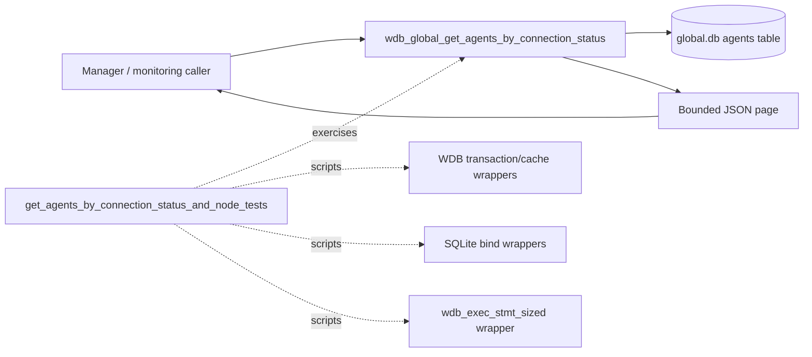
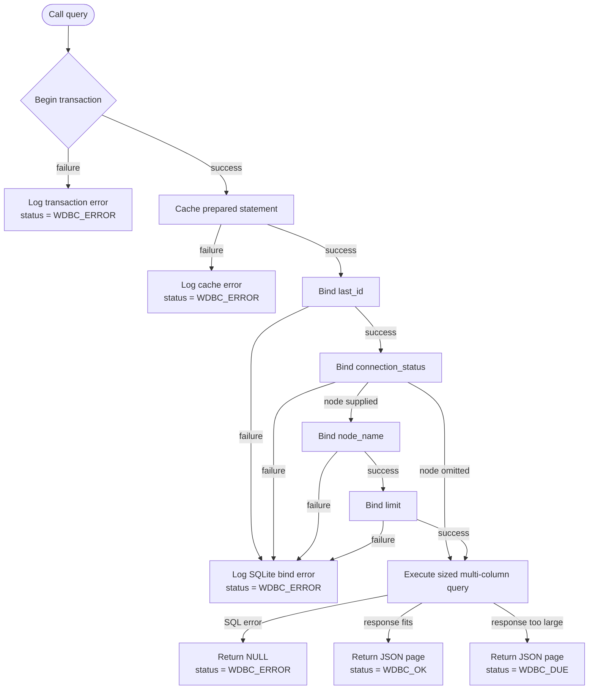
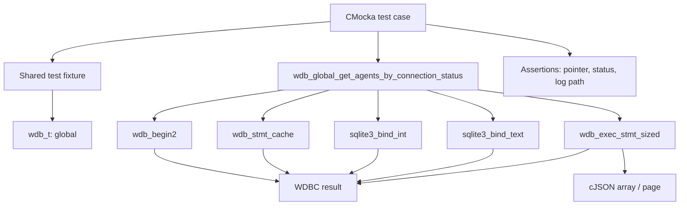
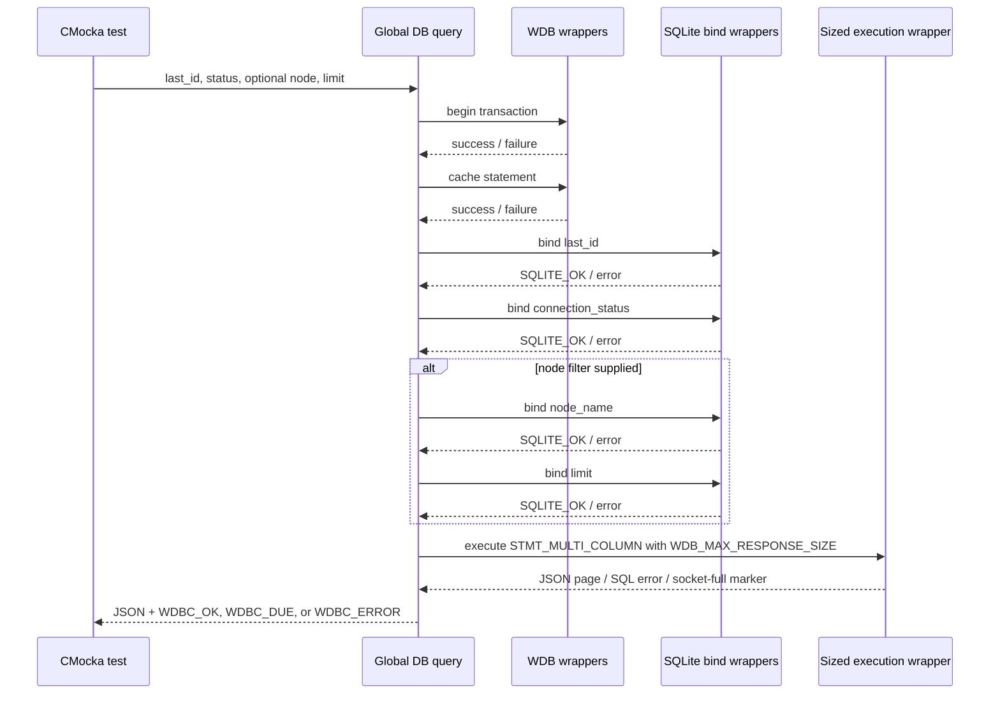
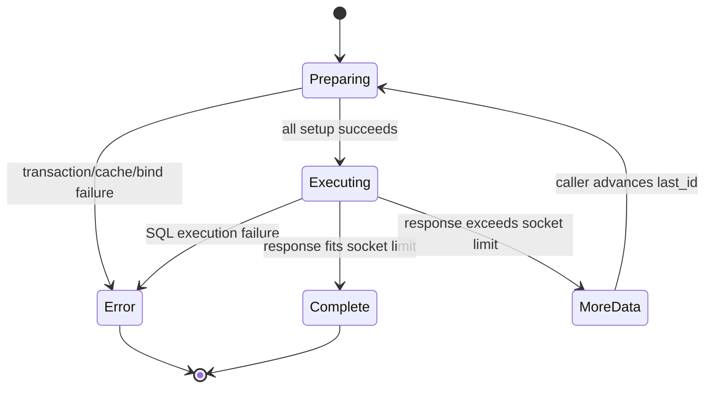

# `get_agents_by_connection_status_and_node_tests`

## Introduction

`get_agents_by_connection_status_and_node_tests` documents the focused CMocka coverage for the connection-status agent query in `src/unit_tests/wazuh_db/test_wdb_global.c`. The tests verify `wdb_global_get_agents_by_connection_status()` when it is used either as a status-only query or with an additional manager-node filter and result limit.

This is a test module, not an independent production service. It protects the global Wazuh DB query boundary used by higher-level manager and monitoring flows. The shared fixture, wrapper conventions, and test registration model are described in [`test_wdb_global_test_infrastructure.md`](test_wdb_global_test_infrastructure.md). Broader global-database behavior is covered by [`wazuh_db_global.md`](wazuh_db_global.md) and the parent test module [`test_wdb_global.md`](test_wdb_global.md).

## Role in the system

The production operation reads a page of agents from the global database. Its inputs are a pagination cursor (`last_id`), a connection status, an optional node name, and a limit. The tests do not open SQLite or validate SQL text; they control the wrapped database stages and assert the returned JSON pointer, status code, and failure behavior.



The query is part of the global database layer. It is also relevant to manager-side agent monitoring; see [`monitord_agent_monitoring.md`](monitord_agent_monitoring.md) for the surrounding monitoring workflow.

## Function contract under test

The exercised call shape is:

```c
wdb_global_get_agents_by_connection_status(
    wdb_t *wdb,
    int last_id,
    const char *connection_status,
    const char *node_name,
    int limit,
    wdbc_result *status);
```

The test source demonstrates two modes:

| Mode | `node_name` | `limit` | Parameters expected by the test |
|---|---|---:|---|
| Status-only | `NULL` | `-1` | `last_id`, then `connection_status` |
| Status and node | `"node01"` | `-1` | `last_id`, `connection_status`, `node_name`, then `limit` |

`last_id` is the pagination cursor. The query result is produced through `wdb_exec_stmt_sized()` with `WDB_MAX_RESPONSE_SIZE` and `STMT_MULTI_COLUMN`. A successful query returns a non-null cJSON array and sets the out-parameter to `WDBC_OK`. A response that exceeds the socket response budget still returns the accumulated JSON object but sets the result to `WDBC_DUE`, signaling that the caller must continue pagination. SQL or setup failures set `WDBC_ERROR` and return `NULL`.



The exact SQL statement and schema remain owned by the production global DB implementation; see [`wazuh_db_global.md`](wazuh_db_global.md) rather than duplicating those details here.

## Architecture and dependencies

Each case uses the common `test_setup`/`test_teardown` lifecycle. The fixture creates a synthetic `wdb_t` identified as `global`, initializes Wazuh DB configuration, and supplies storage for a SQLite pointer. The database itself is fully mocked.



Relevant boundaries are:

| Dependency | Test responsibility |
|---|---|
| `wdb_begin2` | Simulates transaction setup success or failure. |
| `wdb_stmt_cache` | Simulates prepared-statement cache success or failure. |
| `sqlite3_bind_int` | Verifies `last_id` and, in node mode, `limit`; injects bind errors. |
| `sqlite3_bind_text` | Verifies `connection_status` and `node_name`; injects bind errors. |
| `wdb_exec_stmt_sized` | Supplies a multi-column JSON page, an SQL failure, or a socket-size condition. |
| cJSON | Builds deterministic agent arrays and verifies non-null result propagation. |
| CMocka logging wrappers | Verify the production path reports the expected diagnostic before returning `WDBC_ERROR`. |

The wrapper behavior is intentionally configured at the test boundary. Details of the reusable sized-execution helpers are maintained in [`test_wdb_global_test_infrastructure.md`](test_wdb_global_test_infrastructure.md).

## Test scenarios

### Status-only query

`test_wdb_global_get_agents_by_connection_status_ok` supplies ten synthetic agent objects, binds `last_id = 0` and `connection_status = "active"`, and returns a successful multi-column page. It expects `WDBC_OK` and a non-null result.

`test_wdb_global_get_agents_by_connection_status_due` uses the same input and result shape but configures the sized execution wrapper to report that the socket response is full. The returned page remains non-null and the status becomes `WDBC_DUE`.

`test_wdb_global_get_agents_by_connection_status_err` makes sized execution fail. The function must return `NULL` and set `WDBC_ERROR`.

### Status-and-node query

The node-filtered cases use `connection_status = "active"`, `node_name = "node01"`, `last_id = 0`, and `limit = -1`.

| Test case | Injected condition | Expected result |
|---|---|---|
| `test_wdb_global_get_agents_by_connection_status_and_node_cache_fail` | Statement cache returns failure. | `NULL`, `WDBC_ERROR`; no bind or execution stage is reached. |
| `test_wdb_global_get_agents_by_connection_status_and_node_bind3_fail` | Binding parameter 3 (`node_name`) fails. | `NULL`, `WDBC_ERROR`; SQLite error is logged. |
| `test_wdb_global_get_agents_by_connection_status_and_node_bind4_fail` | Binding parameter 4 (`limit`) fails. | `NULL`, `WDBC_ERROR`; SQLite error is logged. |
| `test_wdb_global_get_agents_by_connection_status_and_node_ok` | All four binds and sized execution succeed. | Non-null JSON page and `WDBC_OK`. |
| `test_wdb_global_get_agents_by_connection_status_and_node_due` | Sized execution reports response overflow. | Non-null JSON page and `WDBC_DUE`. |
| `test_wdb_global_get_agents_by_connection_status_and_node_err` | Sized execution returns SQL failure. | `NULL`, `WDBC_ERROR`. |

The neighboring status-only cases also cover transaction failure, statement-cache failure, first integer bind failure, and connection-status text bind failure. Together, the two modes establish that adding the optional node filter extends the bind sequence without changing the common transaction, bounded execution, or result-status contract.

## Component interaction flow



## Failure and pagination semantics

The test matrix confirms short-circuit behavior: a failure at transaction setup, statement caching, or parameter binding prevents later stages from being called. This matters because callers can distinguish infrastructure failure from an intentionally truncated page.



`WDBC_DUE` is therefore not equivalent to a database error. It indicates that the caller received a valid partial page and should use the query’s pagination mechanism to request the next portion. This is the same bounded-response convention used by related global agent queries documented in [`wazuh_db_global.md`](wazuh_db_global.md).

## Maintenance guidance

When changing this query or its caller contract:

- Keep separate coverage for status-only and node-filtered parameter ordering.
- Update the expected bind index whenever the SQL parameter order changes.
- Preserve both normal and socket-full `wdb_exec_stmt_sized()` paths so `WDBC_OK` and `WDBC_DUE` remain distinguishable.
- Keep execution failures separate from response-size conditions.
- Assert `WDBC_ERROR` and a null result for setup/SQL failures unless the production API intentionally changes its ownership contract.
- If the function begins transforming agent JSON, extend the success assertions to inspect fields rather than only checking non-null propagation.

The source-level test definitions remain in [`test_wdb_global.c`](../../src/unit_tests/wazuh_db/test_wdb_global.c). The parent module owns registration in `main()`; this document focuses only on the six node/status query cases and their directly related status-only cases.
