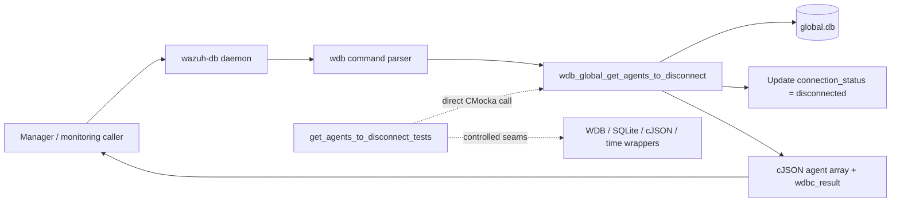
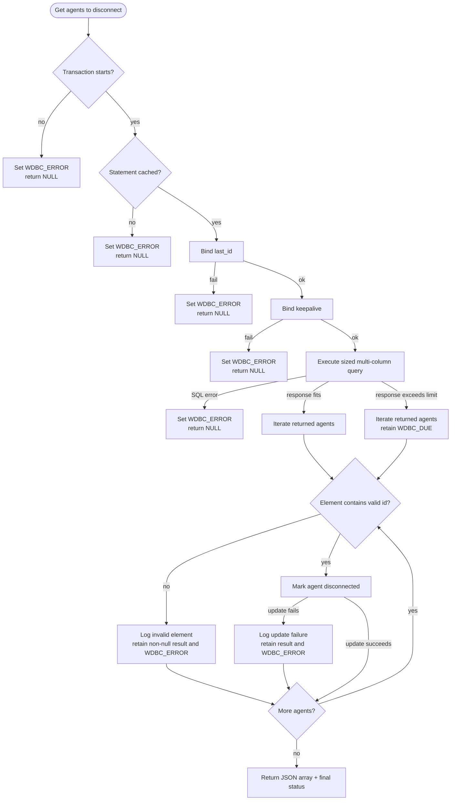
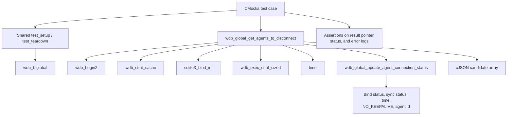
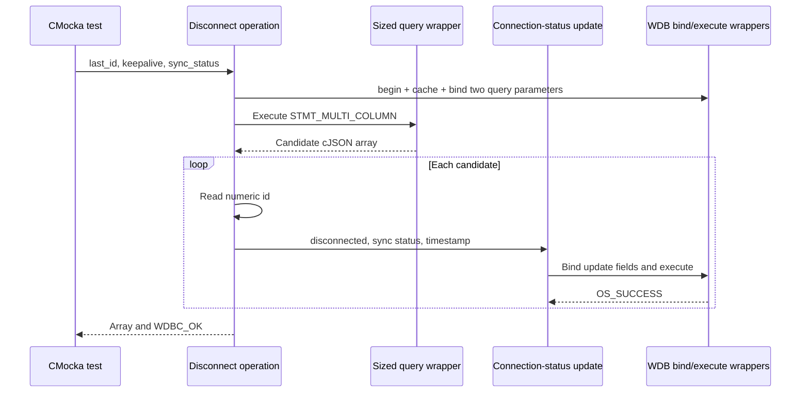

# `get_agents_to_disconnect_tests`

## Introduction

`get_agents_to_disconnect_tests` documents the CMocka coverage for
`wdb_global_get_agents_to_disconnect()`, the global-database operation that
finds agents whose keepalive state requires disconnection and marks each
returned agent as disconnected.

This is a focused leaf of [`test_wdb_global.md`](test_wdb_global.md). The
production operation belongs to the Wazuh DB global layer described in
[`wazuh_db_global.md`](wazuh_db_global.md); this page documents the observable
behavior asserted by the tests rather than duplicating that module’s database
schema and daemon details.

## Position in the system

Wazuh DB clients such as `remoted`, manager monitoring code, the cluster
module, and the API communicate with the `wazuh-db` daemon through its command
interface. The daemon routes the request to the global database implementation,
which reads candidate agents and updates their connection state.



See [`wazuh_db.md`](wazuh_db.md) for the daemon request path and
[`wazuh_db_command_parser.md`](wazuh_db_command_parser.md) for command
dispatch. The sibling status-query tests are documented in
[`get_agents_by_connection_status_tests.md`](get_agents_by_connection_status_tests.md).

## Function contract under test

The exercised call shape is:

```c
wdb_global_get_agents_to_disconnect(
    wdb_t *wdb,
    int last_id,
    int keepalive,
    const char *sync_status,
    wdbc_result *status);
```

The inputs have these roles:

| Input | Role |
|---|---|
| `wdb` | Synthetic `global` database context supplied by the shared fixture. |
| `last_id` | Pagination cursor for the candidate-agent query. |
| `keepalive` | Keepalive threshold used by the SQL query. |
| `sync_status` | Synchronization value written while marking candidates disconnected. |
| `status` | Output status: `WDBC_OK`, `WDBC_DUE`, or `WDBC_ERROR`. |

The test evidence establishes this sequence:

1. Begin a Wazuh DB transaction.
2. Cache the disconnect query statement.
3. Bind `last_id` at parameter 1 and `keepalive` at parameter 2.
4. Execute a bounded `STMT_MULTI_COLUMN` query using `WDB_MAX_RESPONSE_SIZE`.
5. Iterate over the returned JSON array.
6. For every valid agent ID, set connection status to `disconnected`, preserve
   the supplied synchronization status, set the current time as the update
   value, and use `NO_KEEPALIVE`.
7. Return the candidate array and the accumulated `wdbc_result` status.



## Test architecture and dependencies

The cases call the production function directly. They do not open SQLite or
depend on live agents. The shared setup allocates a minimal `wdb_t`, assigns
the ID `global`, initializes Wazuh DB configuration, and the teardown releases
all allocations. The common lifecycle and wrapper catalog are documented in
[`test_wdb_global_test_infrastructure.md`](test_wdb_global_test_infrastructure.md)
and [`wazuh_db_wrappers_global.md`](wazuh_db_wrappers_global.md).



| Dependency | What the tests control or verify |
|---|---|
| `wdb_begin2` | Initial query transaction and each per-agent update transaction. |
| `wdb_stmt_cache` | Statement preparation success and failure. |
| `sqlite3_bind_int` | `last_id`, `keepalive`, timestamp, `NO_KEEPALIVE`, and agent ID bindings. |
| `sqlite3_bind_text` | `disconnected` and the supplied `synced` status. |
| `wdb_exec_stmt_sized` | Candidate JSON, socket-size overflow, or SQL failure. |
| `time` | Deterministic timestamp for the disconnect update. |
| cJSON | Synthetic candidate arrays and malformed elements. |
| CMocka/logging wrappers | Exact call expectations and diagnostic paths. |

## Test scenarios

### Setup and binding failures

The following tests verify early exits. Each returns a null result and sets the
out-parameter to `WDBC_ERROR`:

| Test | Injected failure |
|---|---|
| `test_wdb_global_get_agents_to_disconnect_transaction_fail` | `wdb_begin2()` fails. |
| `test_wdb_global_get_agents_to_disconnect_cache_fail` | `wdb_stmt_cache()` fails. |
| `test_wdb_global_get_agents_to_disconnect_bind1_fail` | Binding `last_id` fails. |
| `test_wdb_global_get_agents_to_disconnect_bind2_fail` | Binding `keepalive` fails. |
| `test_wdb_global_get_agents_to_disconnect_err` | Sized query execution fails. |

SQLite failures are accompanied by the mocked SQLite error message and the
expected Wazuh logging call. No per-agent update is attempted when the initial
query cannot be prepared or executed.

### Successful candidate processing

`test_wdb_global_get_agents_to_disconnect_ok` supplies ten candidate objects.
The query succeeds, every candidate is processed, and the final status is
`WDBC_OK` with a non-null cJSON result. For each agent, the test verifies the
disconnect update bindings:



### Response-size overflow

`test_wdb_global_get_agents_to_disconnect_due` configures
`wdb_exec_stmt_sized()` to report a full socket response. The returned array is
still non-null, each returned candidate is processed, and the final status is
`WDBC_DUE`. This status signals that the caller must continue with pagination;
it is distinct from a database error.

### Invalid result elements

`test_wdb_global_get_agents_to_disconnect_invalid_elements` returns an object
without an `id`. The function logs `Invalid element returned by disconnect
query`, returns a non-null result array, and sets `WDBC_ERROR`. This preserves
the query response for the caller while reporting that the batch was not fully
valid.

### Per-agent update failure

`test_wdb_global_get_agents_to_disconnect_update_status_fail` returns one valid
agent, then makes the update’s statement cache fail. The function logs
`Cannot set connection_status for agent 10`, returns the non-null candidate
array, and sets `WDBC_ERROR`. This distinguishes an initial query failure from
a failure while applying the state transition to an individual agent.

## Result and error matrix

| Stage | Result pointer | Output status |
|---|---|---|
| Transaction, cache, bind, or query execution failure | `NULL` | `WDBC_ERROR` |
| Valid batch, response within size limit, all updates succeed | Non-null cJSON array | `WDBC_OK` |
| Response exceeds socket size limit; candidates processed | Non-null cJSON array | `WDBC_DUE` |
| Invalid candidate element | Non-null cJSON array | `WDBC_ERROR` |
| Candidate state update fails | Non-null cJSON array | `WDBC_ERROR` |

The tests therefore treat `WDBC_DUE` as a transport/pagination condition, not
as a failed query. They also show that processing can produce a partial JSON
result even when a malformed element or a later state update causes the final
status to become `WDBC_ERROR`.

## Maintenance guidance

When changing this operation or its SQL statement:

- update the parameter-order assertions for `last_id` and `keepalive`;
- preserve separate coverage for transaction, cache, each bind, query error,
  success, and response-size overflow;
- keep the per-agent update assertions aligned with the connection-status
  update contract, especially `disconnected`, `sync_status`, timestamp,
  `NO_KEEPALIVE`, and agent ID;
- retain tests for malformed candidate objects and partial-batch update errors;
- update exact log-message assertions when diagnostics intentionally change;
- use [`test_wdb_global.md`](test_wdb_global.md) for cross-cutting global DB
  behavior instead of duplicating it in this leaf.

## Source references

- Test source: `src/unit_tests/wazuh_db/test_wdb_global.c`
- Target function: `wdb_global_get_agents_to_disconnect()`
- Registration block: `/* Tests wdb_global_get_agents_to_disconnect */`
- Parent module: [`test_wdb_global.md`](test_wdb_global.md)
- Shared fixture: [`test_wdb_global_test_infrastructure.md`](test_wdb_global_test_infrastructure.md)
- Production global layer: [`wazuh_db_global.md`](wazuh_db_global.md)
- Wazuh DB daemon overview: [`wazuh_db.md`](wazuh_db.md)
