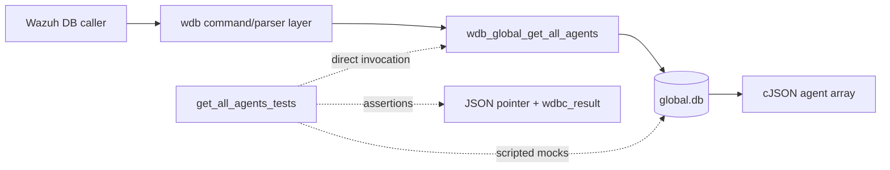
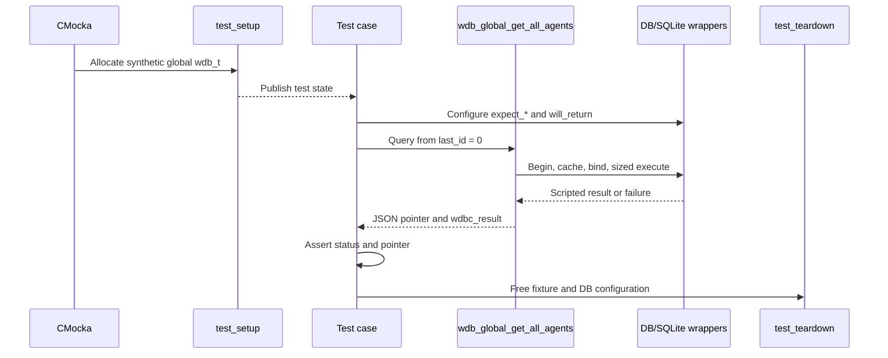
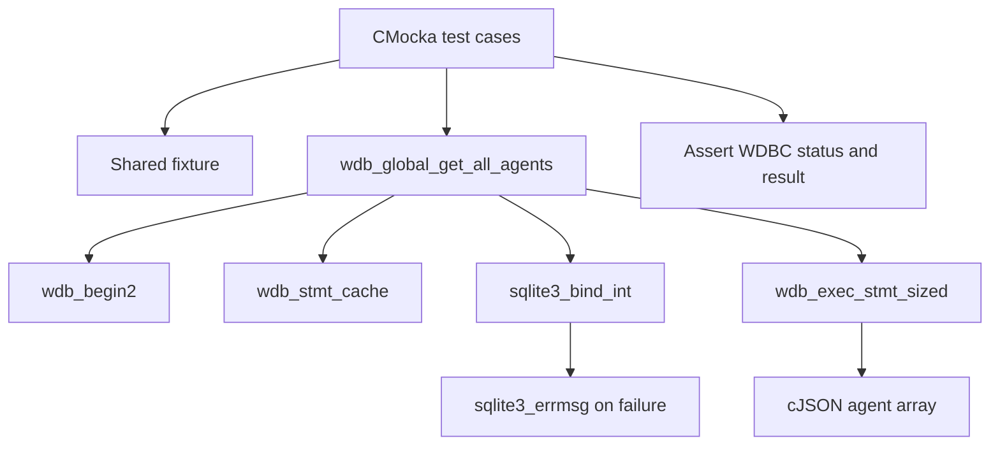
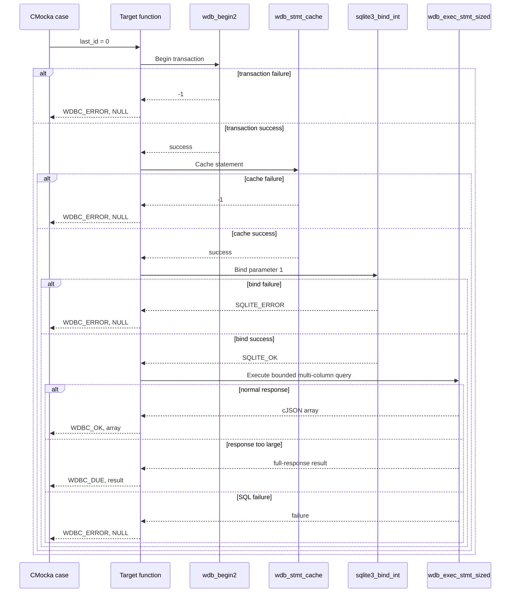

# `get_all_agents_tests`

## Introduction

`get_all_agents_tests` documents the CMocka coverage for
`wdb_global_get_all_agents()`, the Wazuh DB global-database query that returns
agents after a supplied ID cursor. The function is tested directly from
`src/unit_tests/wazuh_db/test_wdb_global.c`; SQLite and Wazuh DB boundaries are
replaced with deterministic wrappers.

This is a focused leaf of [`test_wdb_global.md`](test_wdb_global.md). The
shared fixture, linker-wrapper mechanics, and general global database context
are documented there and in [`wazuh_db_wrappers.md`](wazuh_db_wrappers.md).

## Purpose and system position

The operation supports paginated access to agent records stored in the global
Wazuh database. A caller supplies a `last_id` cursor and receives a JSON array
plus a `wdbc_result` status describing success, an oversized response, or an
error.



The production command routing and database lifecycle are outside this leaf;
see [`wazuh_db_daemon_core.md`](wazuh_db_daemon_core.md),
[`wazuh_db_command_parser.md`](wazuh_db_command_parser.md), and the broader
[`test_wdb_global.md`](test_wdb_global.md) page where available.

## Contract under test

The tested call has the following shape:

```c
wdb_global_get_all_agents(wdb, last_id, &status);
```

The expected pipeline is:

1. Begin or join a database transaction with `wdb_begin2()`.
2. Resolve the cached global-agent statement with `wdb_stmt_cache()`.
3. Bind `last_id` as SQLite parameter 1.
4. Execute the query through `wdb_exec_stmt_sized()` using
   `WDB_MAX_RESPONSE_SIZE` and `STMT_MULTI_COLUMN`.
5. Return the JSON result and set `status` to `WDBC_OK`, `WDBC_DUE`, or
   `WDBC_ERROR`.

```mermaid
flowchart TD
    Start([wdb_global_get_all_agents(wdb, last_id, &status)]) --> Tx{Transaction starts?}
    Tx -- no --> TxErr[Log Cannot begin transaction] --> Error[status = WDBC_ERROR\nreturn NULL]
    Tx -- yes --> Cache{Statement cache succeeds?}
    Cache -- no --> CacheErr[Log Cannot cache statement] --> Error
    Cache -- yes --> Bind{Bind last_id at index 1?}
    Bind -- no --> BindErr[Log SQLite bind error] --> Error
    Bind -- yes --> Exec{Sized multi-column execution}
    Exec -- SQL error --> ExecErr[status = WDBC_ERROR\nreturn NULL]
    Exec -- fits response limit --> Ok[status = WDBC_OK\nreturn cJSON array]
    Exec -- exceeds socket limit --> Due[status = WDBC_DUE\nreturn non-null result]
```

`last_id` is the pagination cursor. The tests use `0` as the initial cursor
and verify the function's result status and pointer behavior; they do not
assert the SQL text or the complete agent-record schema.

## Test architecture

Each case is registered with CMocka setup and teardown. The common fixture
creates a synthetic `wdb_t` with ID `"global"`, a database pointer slot, an
output buffer used by neighboring tests, and initialized Wazuh DB
configuration. It does not open a real SQLite database. See the shared
fixture documentation linked from [`test_wdb_global.md`](test_wdb_global.md).



## Dependencies and interaction boundaries

| Dependency | Role in this leaf |
|---|---|
| `wdb.h` | Declares `wdb_t`, `wdbc_result`, and the target function. |
| `wdb_global_get_all_agents()` | Production operation under test. |
| `wdb_begin2` wrapper | Controls transaction setup. |
| `wdb_stmt_cache` wrapper | Controls prepared-statement caching. |
| `sqlite3_bind_int` wrapper | Verifies parameter 1 receives `last_id`. |
| `sqlite3_errmsg` wrapper | Supplies deterministic bind-error text. |
| `wdb_exec_stmt_sized` wrapper | Simulates a normal, oversized, or failed query. |
| cJSON | Builds synthetic agent arrays returned by the query. |
| CMocka | Registers tests, scripts wrappers, and performs assertions. |



## Test scenarios

| Test case | Simulated condition | Expected behavior |
|---|---|---|
| `test_wdb_global_get_all_agents_transaction_fail` | `wdb_begin2()` returns `-1`. | Logs `Cannot begin transaction`; sets `WDBC_ERROR`; returns `NULL`. |
| `test_wdb_global_get_all_agents_cache_fail` | Transaction succeeds, then `wdb_stmt_cache()` returns `-1`. | Logs `Cannot cache statement`; sets `WDBC_ERROR`; returns `NULL`. |
| `test_wdb_global_get_all_agents_bind_fail` | Binding `last_id` at SQLite index 1 returns `SQLITE_ERROR`. | Includes the supplied SQLite error text in the diagnostic; sets `WDBC_ERROR`; returns `NULL`. |
| `test_wdb_global_get_all_agents_ok` | Binding succeeds and sized execution returns ten synthetic agent objects. | Sets `WDBC_OK` and returns a non-null JSON array. |
| `test_wdb_global_get_all_agents_due` | Sized execution reports that the socket response is full. | Sets `WDBC_DUE` while preserving a non-null result. |
| `test_wdb_global_get_all_agents_err` | Sized execution reports an execution failure. | Sets `WDBC_ERROR` and returns `NULL`. |

The cases isolate one pipeline boundary at a time. Consequently, a failure
before execution proves that later stages are short-circuited, while the
success cases prove that the wrapper-produced JSON pointer is propagated.

## Component interaction flow



## Maintenance guidance

When changing the global-agent statement or pagination behavior:

- preserve coverage for transaction, cache, bind, successful execution, and
  execution-error boundaries;
- update the parameter assertion if the SQL statement changes its bind order;
- retain explicit assertions for `WDBC_OK`, `WDBC_DUE`, and `WDBC_ERROR`;
- keep response-size behavior covered through `WDB_MAX_RESPONSE_SIZE` and
  `STMT_MULTI_COLUMN`;
- update expected diagnostics when logging contracts change.

JSON schema changes belong in the broader global database implementation or
schema-focused tests. This leaf should continue to focus on pagination,
bounded response handling, dependency sequencing, and status propagation.

## Source reference

- Production test source: `src/unit_tests/wazuh_db/test_wdb_global.c`
- Focused tests: `test_wdb_global_get_all_agents_transaction_fail`,
  `..._cache_fail`, `..._bind_fail`, `..._ok`, `..._due`, and `..._err`
- Registration: the `/* Tests wdb_global_get_all_agents */` section in `main()`
- Related module: [`test_wdb_global.md`](test_wdb_global.md)
