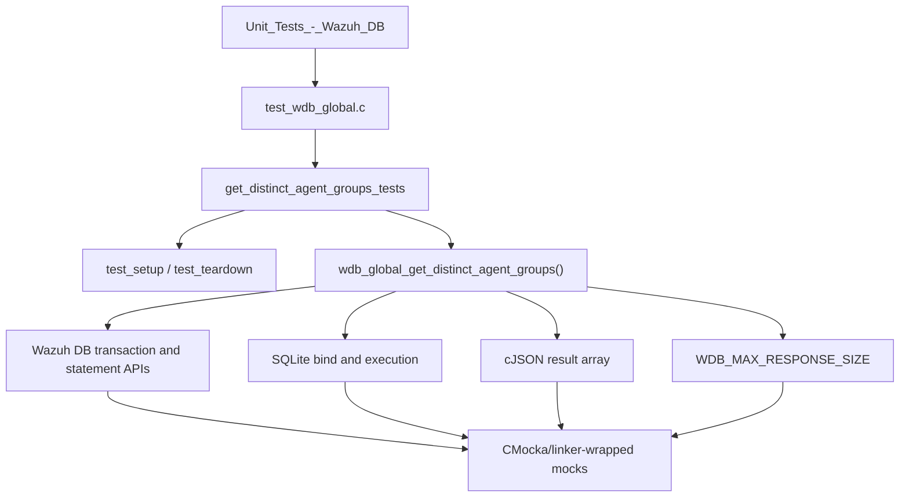
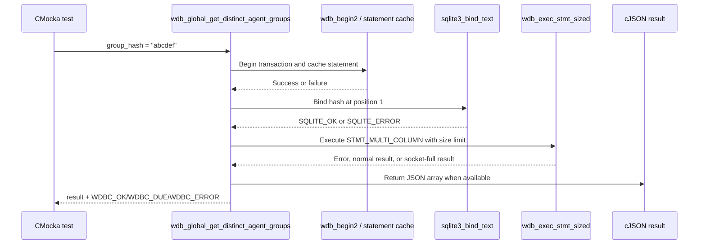
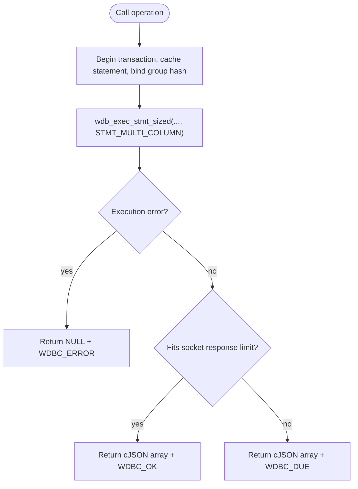
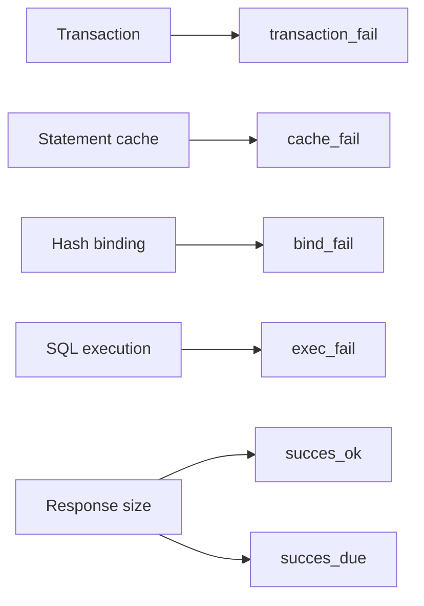

# `get_distinct_agent_groups_tests`

## Introduction

`get_distinct_agent_groups_tests` is the focused CMocka test group for `wdb_global_get_distinct_agent_groups()`, the Wazuh DB operation that retrieves distinct agent-group records associated with a supplied global group hash. The tests verify transaction setup, statement caching, SQLite parameter binding, bounded response execution, and the distinction between a normal response and a response that exceeds the socket-size budget.

The production operation belongs to the global SQLite database layer; see [`wazuh_db_global.md`](wazuh_db_global.md). The fixture and linker-wrapper conventions are shared with the surrounding `test_wdb_global.c` suite and are described in [`test_wdb_global_test_infrastructure.md`](test_wdb_global_test_infrastructure.md).

## Module scope

The module contains six test cases from `src/unit_tests/wazuh_db/test_wdb_global.c`:

| Test | Scenario | Expected result |
|---|---|---|
| `test_wdb_global_get_distinct_agent_groups_transaction_fail` | Transaction cannot be started | `NULL` result and `WDBC_ERROR` |
| `test_wdb_global_get_distinct_agent_groups_cache_fail` | Prepared statement cannot be cached | `NULL` result and `WDBC_ERROR` |
| `test_wdb_global_get_distinct_agent_groups_bind_fail` | Group hash parameter binding fails | `NULL` result and `WDBC_ERROR` |
| `test_wdb_global_get_distinct_agent_groups_exec_fail` | Bounded SQL execution fails | `NULL` result and `WDBC_ERROR` |
| `test_wdb_global_get_distinct_agent_groups_succes_due` | Response exceeds socket capacity | Returned JSON and `WDBC_DUE` |
| `test_wdb_global_get_distinct_agent_groups_succes_ok` | Response fits within the response limit | Returned JSON and `WDBC_OK` |

The names `succes_due` and `succes_ok` reproduce the spelling used in the source test suite.

## Architecture and relationships



The test does not open a real database. `test_setup()` allocates a minimal `wdb_t`, assigns it the identifier `global`, allocates storage for its SQLite pointer, initializes Wazuh DB configuration, and exposes the fixture through CMocka state. `test_teardown()` frees those allocations and releases the configuration. Detailed lifecycle and wrapper behavior are maintained in [`test_wdb_global_test_infrastructure.md`](test_wdb_global_test_infrastructure.md).

## Production operation under test

`wdb_global_get_distinct_agent_groups(wdb, group_hash, &status)` is a read-oriented, paginated global-database operation. Based on the test contract, it:

1. Starts or joins a Wazuh DB transaction.
2. Retrieves or caches the statement for the distinct-group query.
3. Binds the caller-provided `group_hash` as the first text parameter.
4. Executes through `wdb_exec_stmt_sized()` in `STMT_MULTI_COLUMN` mode, bounded by `WDB_MAX_RESPONSE_SIZE`.
5. Returns a cJSON array and reports a `wdbc_result` status.

The representative JSON shape asserted by the tests is:

```json
[
  {"group":"group1","group_hash":"ec282560"}
]
```

The exact SQL text and statement-cache identifier are implementation details of `wdb_global.c`; this test group intentionally verifies the observable database interaction rather than duplicating SQL definitions. The broader operation families and statement-cache design are documented in [`wazuh_db_global.md`](wazuh_db_global.md) and [`wazuh_db_engine.md`](wazuh_db_engine.md).

## Execution flow



## Failure behavior

The failure tests isolate one stage at a time. Transaction and cache failures are represented by negative wrapper returns and produce the expected debug messages (`Cannot begin transaction` or `Cannot cache statement`). Binding failure supplies `SQLITE_ERROR`, a synthetic SQLite error message, and verifies the database error log. Execution failure uses the shared failed-response helper, which returns `SQLITE_ERROR` and no JSON response.

In all four failure cases, the API returns `NULL` and writes `WDBC_ERROR` through the status pointer. This makes the operation safe for callers that use the status value to distinguish an unavailable result from a valid empty/partial response.

## Response-size and pagination semantics



The `succes_ok` test supplies a JSON array through `wrap_wdb_exec_stmt_sized_success_call()` and expects `WDBC_OK`. The `succes_due` test supplies the same logical response through `wrap_wdb_exec_stmt_sized_socket_full_call()` and expects `WDBC_DUE`, while preserving the returned JSON. This confirms that response-size pressure is reported as a pagination/continuation condition rather than silently converting a valid response into an execution error.

## Test doubles and assertions

The tests use the shared wrappers declared by the Wazuh DB, SQLite, cJSON, logging, and support wrapper headers included by `test_wdb_global.c`. The relevant expectations are:

| Dependency seam | What is controlled |
|---|---|
| `__wrap_wdb_begin2` | Transaction start success/failure |
| `__wrap_wdb_stmt_cache` | Statement-cache success/failure |
| `__wrap_sqlite3_bind_text` | Parameter position, hash value, and SQLite return code |
| `__wrap_wdb_exec_stmt_sized` | Multi-column mode, response-size outcome, SQLite result code, and JSON payload |
| `__wrap_sqlite3_errmsg` | Diagnostic text for binding/execution failures |
| `__wrap__mdebug1` / `__wrap__merror` | Expected operational diagnostics |

The successful tests build the expected JSON with `cJSON_Parse`, invoke the operation, serialize the returned result with `cJSON_PrintUnformatted`, and compare it with the expected compact representation. Returned JSON is explicitly deleted with the real cJSON destructor, preserving ownership hygiene in the test.

## Coverage matrix



This is a deliberately narrow unit boundary: it covers the operation’s control-flow exits and status protocol, but it does not validate the underlying SQL query contents, database indexes, or the callers that consume the distinct-group response. Those concerns belong to the production global DB documentation, schema-level tests, and higher-level synchronization/cluster tests linked from [`wazuh_db_global.md`](wazuh_db_global.md).

## Maintenance notes

When changing `wdb_global_get_distinct_agent_groups()` or its statement definition, preserve the following externally visible contracts unless the API is intentionally changed:

- the group hash is bound as a text value at parameter position 1;
- execution uses the multi-column response mode and the common Wazuh DB response-size limit;
- SQL/setup failures set `WDBC_ERROR` and return `NULL`;
- an oversized but otherwise valid response reports `WDBC_DUE` and retains the JSON payload;
- a response within the limit reports `WDBC_OK` and retains the JSON payload.

The test is registered in the `main()` CMocka table in `test_wdb_global.c`, with `test_setup` and `test_teardown` applied to every case.

