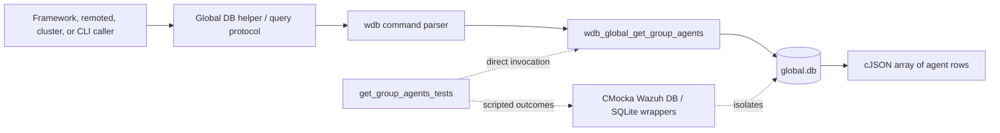
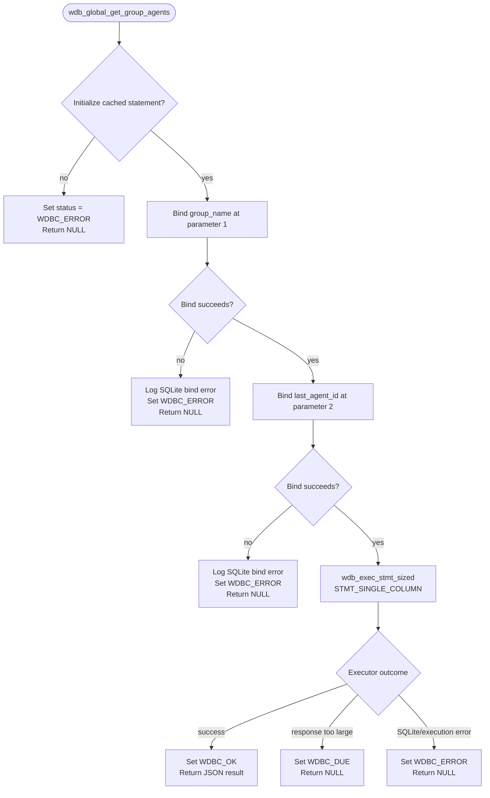
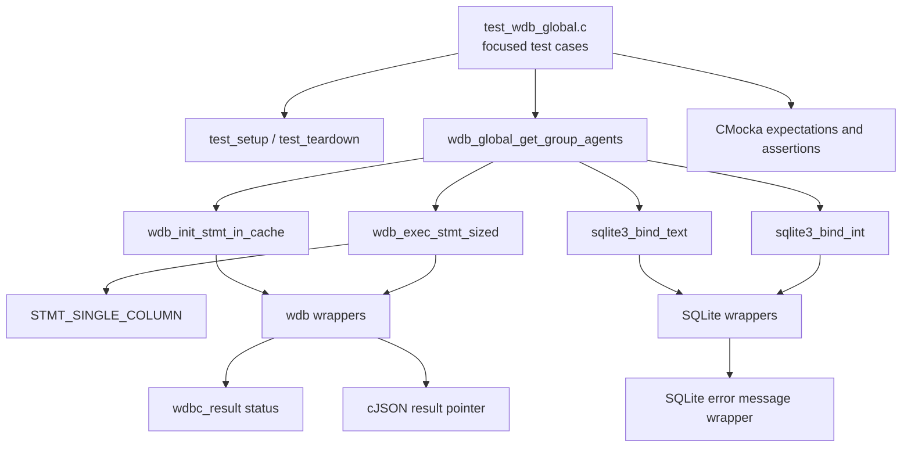
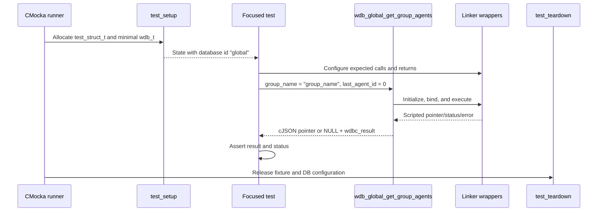
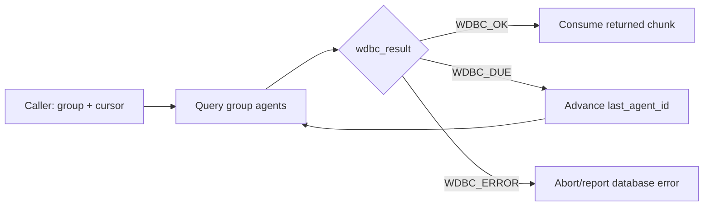

# `get_group_agents_tests`

## Introduction

`get_group_agents_tests` documents the focused CMocka tests for `wdb_global_get_group_agents()`. The operation retrieves the agents associated with a named group from Wazuh's global database, using a cursor (`last_agent_id`) and a response-size-aware statement executor.

This leaf covers the five named core components supplied for the module and the adjacent execution-error case present in the source: statement-cache initialization failure, text binding failure, integer binding failure, successful execution, response-size overflow, and execution failure. The broader global database suite is documented in [`test_wdb_global.md`](test_wdb_global.md); the production group-management layer is described in [`wazuh_db_global.md`](wazuh_db_global.md).

## Role in the system

The function is part of the Wazuh DB global-data layer. In production, callers request group membership through the Wazuh DB command/parser and receive JSON over the local database socket. The test calls the core function directly and replaces SQLite/database seams with linker-wrapped mocks.



The group-membership schema and adjacent operations—group lookup, agent/group membership changes, group hashing, and synchronization—belong to [`wazuh_db_global.md`](wazuh_db_global.md). This document focuses on the observable contract of the retrieval function.

## Operation contract

The tested signature is conceptually:

```c
cJSON *wdb_global_get_group_agents(
    wdb_t *wdb,
    wdbc_result *status,
    const char *group_name,
    int last_agent_id);
```

The implementation uses the cached statement identified by `WDB_STMT_GLOBAL_GROUP_BELONG_GET`, binds two parameters, and executes it through `wdb_exec_stmt_sized()` in `STMT_SINGLE_COLUMN` mode:

| Parameter | Bound value | Purpose |
|---|---:|---|
| SQLite parameter 1 | `group_name` | Select memberships for the requested group. |
| SQLite parameter 2 | `last_agent_id` | Cursor for continuing a paginated response. |

The result is communicated through two channels:

- the return value is a `cJSON *` result, or `NULL` when the query fails or the response is too large;
- `*status` is set to `WDBC_OK`, `WDBC_DUE`, or `WDBC_ERROR`.

The supplied success test passes a `NULL` JSON pointer through the wrapper and verifies that the operation still reports `WDBC_OK`; this isolates status propagation and does not define the production JSON payload shape.

## Control flow



Unlike many higher-level `wdb_global_*` operations, these tests do not mock `wdb_begin2()` or `wdb_stmt_cache()`. The target uses `wdb_init_stmt_in_cache()` directly, so statement initialization is the first observable boundary in this leaf.

## Component and dependency relationships



Important dependencies:

- `wdb.h` supplies `wdb_t`, statement identifiers, and the target declaration.
- `wdb_init_stmt_in_cache()` supplies the prepared statement for `WDB_STMT_GLOBAL_GROUP_BELONG_GET`.
- `sqlite3_bind_text()` checks the group name at position `1`.
- `sqlite3_bind_int()` checks the cursor at position `2`.
- `wdb_exec_stmt_sized()` is configured for `STMT_SINGLE_COLUMN`, matching the group-agent query's result mode.
- `sqlite3_errmsg()` provides deterministic error text for bind failures.
- CMocka verifies call order, argument values, status, and returned pointers.

The shared wrapper design and ownership conventions are documented in [`wazuh_db_wrappers.md`](wazuh_db_wrappers.md). The common global test fixture is described in [`test_wdb_global_test_infrastructure.md`](test_wdb_global_test_infrastructure.md), where available.

## Test lifecycle and isolation

Each case is registered with `cmocka_unit_test_setup_teardown()`.



The setup allocates a synthetic `wdb_t`, assigns the ID `"global"`, allocates a placeholder database pointer, creates an output buffer, and initializes Wazuh DB configuration. It does not open a real SQLite file. Teardown frees the fixture and calls `wdb_free_conf()`.

## Test scenarios

| Test case | Injected condition | Expected behavior |
|---|---|---|
| `test_wdb_global_get_group_agents_cache_fail` | `wdb_init_stmt_in_cache(WDB_STMT_GLOBAL_GROUP_BELONG_GET)` returns `NULL`. | Returns `NULL` and sets `status` to `WDBC_ERROR`; no bind or execution occurs. |
| `test_wdb_global_get_group_agents_bind_text_fail` | Binding `group_name` at position `1` returns `SQLITE_ERROR`. | Logs `DB(global) sqlite3_bind_text(): ERROR MESSAGE`, returns `NULL`, and sets `WDBC_ERROR`. |
| `test_wdb_global_get_group_agents_bind_int_fail` | Binding cursor `last_agent_id = 0` at position `2` returns `SQLITE_ERROR`. | Logs `DB(global) sqlite3_bind_int(): ERROR MESSAGE`, returns `NULL`, and sets `WDBC_ERROR`. |
| `test_wdb_global_get_group_agents_stmt_ok` | Both binds succeed; sized execution is successful in `STMT_SINGLE_COLUMN` mode. | Returns the wrapper's result pointer and sets `status` to `WDBC_OK`. |
| `test_wdb_global_get_group_agents_stmt_due` | Sized execution reports a full socket response. | Returns `NULL` and sets `status` to `WDBC_DUE`, allowing a caller to retry with a later cursor. |
| `test_wdb_global_get_group_agents_stmt_error` | Sized execution reports an execution/SQLite error. | Returns `NULL` and sets `status` to `WDBC_ERROR`. |

## Pagination and response-size behavior

The `last_agent_id` argument is a continuation cursor rather than an agent-selection filter alone. A caller can use `WDBC_DUE` to request another chunk with an updated cursor. The leaf tests do not implement the retry loop; that responsibility belongs to the client helper/protocol layer.



`wdb_exec_stmt_sized()` enforces the socket response boundary. `WDBC_DUE` means the query path recognized a size-limit condition, not that the SQL operation failed. This distinction is important for callers that support chunked synchronization.

## Failure and diagnostic contract

The tests establish these invariants:

- statement initialization failure is represented as `NULL` plus `WDBC_ERROR`;
- each SQLite bind is short-circuiting: a failed bind prevents later binds and execution;
- bind diagnostics include the database ID (`global`) and wrapper-supplied SQLite text;
- successful execution maps to `WDBC_OK` even when the mock result pointer is `NULL`;
- response overflow maps to `WDBC_DUE`, separating retryable transport sizing from database failure;
- execution failure maps to `WDBC_ERROR`.

## Maintenance guidance

When changing `wdb_global_get_group_agents()` or its prepared SQL statement:

1. Preserve coverage for statement initialization, both bind positions, successful sized execution, response overflow, and execution failure.
2. Update `WDB_STMT_GLOBAL_GROUP_BELONG_GET` expectations if the statement-cache identifier changes.
3. Keep parameter-position assertions synchronized with the SQL statement.
4. Treat changes from `WDBC_DUE` to `WDBC_ERROR`—or vice versa—as a protocol change requiring review of the helper and cluster synchronization callers.
5. Add payload/schema assertions here only if this leaf becomes responsible for the returned JSON shape; otherwise keep that contract in the production global DB and integration documentation.

## Source references

- Production test source: `src/unit_tests/wazuh_db/test_wdb_global.c`
- Focused functions: `test_wdb_global_get_group_agents_cache_fail`, `..._bind_text_fail`, `..._bind_int_fail`, `..._stmt_ok`, `..._stmt_due`, and `..._stmt_error`
- Production implementation: `src/wazuh_db/wdb_global.c`
- Public DB declarations: `src/wazuh_db/wdb.h`
- Broader suite: [`test_wdb_global.md`](test_wdb_global.md)
- Global DB architecture: [`wazuh_db_global.md`](wazuh_db_global.md)
