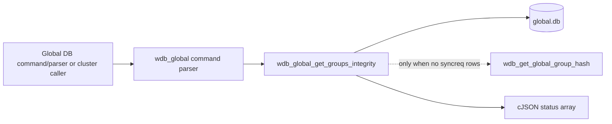
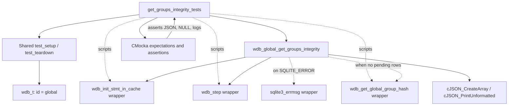
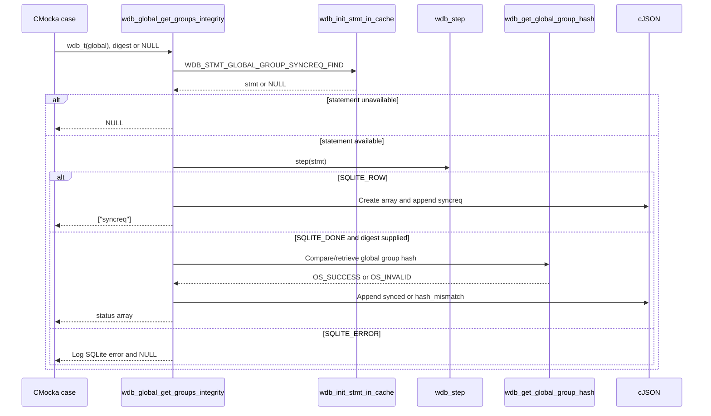

# `get_groups_integrity_tests`

## Introduction

`get_groups_integrity_tests` documents the CMocka coverage for
`wdb_global_get_groups_integrity()`, the global-database operation that reports
whether agent-group synchronization is pending or whether the local global
group hash agrees with a caller-provided digest.

The tests are implemented in
[`src/unit_tests/wazuh_db/test_wdb_global.c`](../../src/unit_tests/wazuh_db/test_wdb_global.c)
and registered in the `Unit_Tests_-_Wazuh_DB` suite. This is a focused leaf of
the larger global database test module; fixture allocation, wrapper conventions,
and teardown are described in
[`test_wdb_global_test_infrastructure.md`](test_wdb_global_test_infrastructure.md),
while the complete neighboring behavior is catalogued by
[`test_wdb_global.md`](test_wdb_global.md).

## Purpose and system position

The operation is used by the Wazuh DB global-group synchronization path. It
queries the global database for agents whose group synchronization state is
`syncreq`. If no such rows exist, it optionally compares the supplied digest
with the manager-side global group hash and reports either `synced` or
`hash_mismatch`.



The function itself does not calculate a digest directly. It delegates hash
retrieval to `wdb_get_global_group_hash()`, which belongs to the broader
integrity/checksum subsystem described in
[`wazuh_db_integrity.md`](wazuh_db_integrity.md). The command-level validation
and request decoding are covered by the related parser tests, including the
`wdb_parse_global_get_groups_integrity_*` cases; see
[`test_wdb_global_parser.md`](test_wdb_global_parser.md).

## Function contract exercised

The test target has the effective contract:

```c
cJSON *wdb_global_get_groups_integrity(wdb_t *wdb, os_sha1 digest);
```

The `digest` argument may be `NULL`. A `NULL` digest means that the test only
asks whether there are pending group synchronization requests. A non-`NULL`
digest is compared only after the pending-request query returns no rows.

The result is a cJSON array containing one status string:

| Condition | Expected JSON result |
|---|---|
| At least one row is returned by `WDB_STMT_GLOBAL_GROUP_SYNCREQ_FIND` | `["syncreq"]` |
| No rows and the local hash does not match / cannot be obtained | `["hash_mismatch"]` |
| No rows and the local hash matches | `["synced"]` |
| Statement initialization or SQLite stepping fails | `NULL` |

The hash helper is called with the empty string as its output buffer in these
tests. The test does not assert the digest algorithm or database SQL; those
responsibilities belong to the production integrity and global-database
modules.

## Architecture and dependencies



### Production boundary

`wdb_global_get_groups_integrity()` receives a synthetic `wdb_t` whose ID is
`"global"`. It uses the cached prepared statement identified by
`WDB_STMT_GLOBAL_GROUP_SYNCREQ_FIND`, then calls `wdb_step()` to distinguish a
pending row, an empty result, and an SQLite error.

### Test boundary

The suite does not open SQLite or populate a real `global.db`. Linker-wrapped
functions provide deterministic behavior:

- `__wrap_wdb_init_stmt_in_cache` controls statement availability.
- `__wrap_wdb_step` supplies `SQLITE_ROW`, `SQLITE_DONE`, or `SQLITE_ERROR`.
- `__wrap_sqlite3_errmsg` supplies stable error text for the error branch.
- `__wrap_wdb_get_global_group_hash` controls hash comparison success or
  failure.
- `__wrap_cJSON_CreateArray` supplies the array object used by the production
  function.

The reusable wrapper inventory is maintained by
[`wazuh_db_wrappers_global.md`](wazuh_db_wrappers_global.md); this leaf only
describes the wrappers that affect the four target cases.

## Control flow

```mermaid
flowchart TD
    Start([Call wdb_global_get_groups_integrity]) --> Init{Initialize cached statement}
    Init -- failure --> Null1[Return NULL]
    Init -- success --> Step{wdb_step()}
    Step -- SQLITE_ERROR --> Log[Log DB(global) SQLite error] --> Null2[Return NULL]
    Step -- SQLITE_ROW --> Pending[Create array; add "syncreq"] --> Out1([Return cJSON array])
    Step -- SQLITE_DONE --> Digest{digest supplied?}
    Digest -- no --> Uncovered[No hash-comparison assertion in this leaf]
    Digest -- yes --> Hash[wdb_get_global_group_hash]
    Hash -- OS_SUCCESS --> Synced[Add "synced"] --> Out3([Return cJSON array])
    Hash -- OS_INVALID --> Mismatch[Add "hash_mismatch"] --> Out4([Return cJSON array])
```

The `digest == NULL` case is represented by
`test_wdb_global_get_groups_integrity_syncreq`; it proves that a pending row
short-circuits hash evaluation. This leaf does not assert a no-pending-row
result with a `NULL` digest. The two non-`NULL` cases both force `SQLITE_DONE`,
so they isolate the hash helper’s result.

## Test scenarios

### Statement initialization failure

`test_wdb_global_get_groups_integrity_statement_fail` makes
`__wrap_wdb_init_stmt_in_cache()` return `NULL` for
`WDB_STMT_GLOBAL_GROUP_SYNCREQ_FIND`. The function must return `NULL` without
attempting to step the statement, construct a response, or calculate a hash.

This case protects the prepared-statement boundary and ensures an unavailable
statement is not mistaken for a clean synchronization state.

### Pending synchronization request

`test_wdb_global_get_groups_integrity_syncreq` returns `SQLITE_ROW` from the
wrapped step operation and passes `NULL` as the digest. The result is printed
and compared with:

```json
["syncreq"]
```

This verifies the highest-priority status: pending synchronization is reported
before any global hash comparison.

### Hash mismatch

`test_wdb_global_get_groups_integrity_hash_mismatch` returns `SQLITE_DONE`,
then makes `__wrap_wdb_get_global_group_hash()` return `OS_INVALID`. The
function returns:

```json
["hash_mismatch"]
```

The test also verifies that the helper receives the supplied digest buffer.
Although the wrapper returns an error rather than a concrete unequal digest,
the observable contract is that the integrity result is not `synced`.

### Synchronized groups

`test_wdb_global_get_groups_integrity_synced` returns `SQLITE_DONE` and makes
the global hash helper return `OS_SUCCESS`. The expected result is:

```json
["synced"]
```

This is the clean path after the database confirms that no agent is waiting for
group synchronization.

### SQLite step error

The source also contains an error-path test adjacent to the four focused leaf
cases: `test_wdb_global_get_groups_integrity_error`. It returns
`SQLITE_ERROR`, supplies `ERROR MESSAGE` through `sqlite3_errmsg`, expects the
`DB(global) SQLite: ERROR MESSAGE` diagnostic, and asserts a `NULL` result.
This complements the initialization-failure case by covering failure after a
valid statement has been acquired.

## Interaction sequence



## Fixture lifecycle and assertions

Each case uses `cmocka_unit_test_setup_teardown`. The common setup allocates a
minimal `wdb_t`, sets its ID to `global`, allocates a synthetic SQLite pointer
slot, and initializes Wazuh DB configuration. Teardown frees those objects and
restores the configuration. No state is shared between cases.

Assertions cover both the return shape and the failure behavior:

- `cJSON_PrintUnformatted()` makes status-array comparisons independent of
  formatting whitespace.
- `assert_null()` verifies short-circuit error handling.
- CMocka `expect_value()` verifies the exact prepared-statement index.
- CMocka `expect_string()` verifies the digest passed to the hash helper and
  the expected SQLite diagnostic.
- Real cJSON deletion is used after assertions to avoid leaking the returned
  array.

## Maintenance guidance

When changing this production path, keep the cases aligned with these stable
boundaries:

1. Statement lookup must remain distinguishable from an SQLite step failure.
2. `SQLITE_ROW` must continue to represent a pending `syncreq` result.
3. Hash evaluation must remain unreachable when a pending row exists.
4. Hash success and hash failure must remain observable as distinct status
   values.
5. SQLite failures should preserve the diagnostic and `NULL` result contract.

If request syntax, hash-length validation, or command response parsing changes,
update the parser test documentation and cases rather than expanding this leaf.
For checksum-cache implementation changes, update
[`wazuh_db_integrity.md`](wazuh_db_integrity.md) and its related tests; this
module should continue to mock the helper at the global-database boundary.
