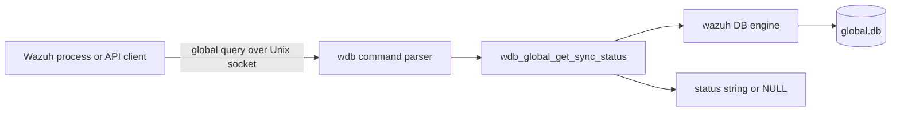
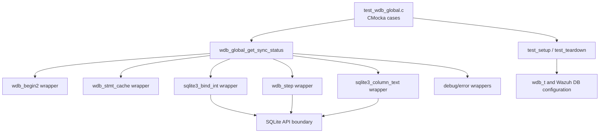
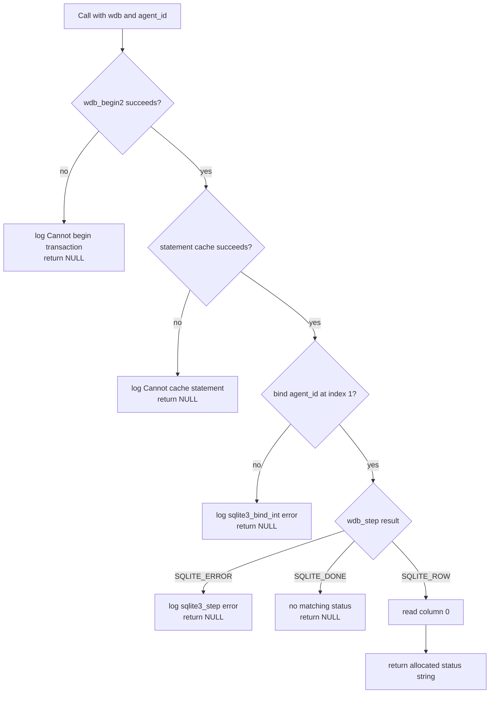
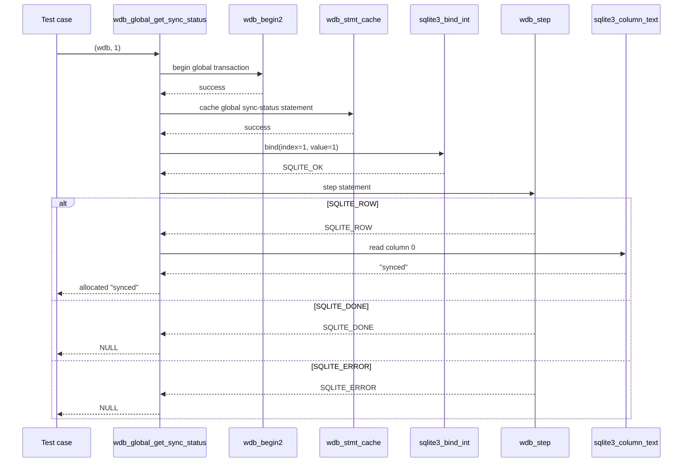
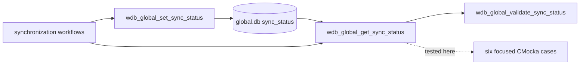

# `get_sync_status_tests`

## Introduction

`get_sync_status_tests` is the focused CMocka test slice for
`wdb_global_get_sync_status()`, the Wazuh DB global-database operation that reads an
agent's synchronization status from `global.db`. The tests verify the complete
read path: transaction start, prepared-statement caching, agent-ID binding,
SQLite stepping, optional column extraction, and the returned heap-allocated
status string.

The tests are implemented in
[`src/unit_tests/wazuh_db/test_wdb_global.c`](https://github.com/wazuh/wazuh/blob/master/src/unit_tests/wazuh_db/test_wdb_global.c),
but are documented separately because the source file also contains the much
larger global-agent, group, backup, and connection-management test suite. For
that broader view, see [`test_wdb_global.md`](test_wdb_global.md). The production
operation belongs to [`wazuh_db_global.md`](wazuh_db_global.md), while generic
transactions, statement caching, and SQLite result handling are described in
[`wazuh_db_engine.md`](wazuh_db_engine.md).

## Scope and system position

The test target exercises a server-side function inside the `wazuh-db` daemon.
It does not open a real database or communicate over the Wazuh DB socket. The
normal runtime path is:



In this module, the client, parser, engine, and SQLite database are replaced by
linker-wrapped mocks. This keeps the test limited to the behavior of
`wdb_global_get_sync_status()` and makes each failure boundary deterministic.

## Responsibilities

| Component | Responsibility in this test slice |
|---|---|
| `test_wdb_global_get_sync_status_*` | Defines the six behavior cases and assertions. |
| `test_setup()` | Allocates a minimal `test_struct_t`, `wdb_t`, database identifier, output buffer, and database-handle slot; initializes Wazuh DB configuration. |
| `test_teardown()` | Frees fixture allocations and releases Wazuh DB configuration. |
| `wdb_global_get_sync_status()` | Function under test; reads one status by agent ID. |
| `__wrap_wdb_begin2` | Controls transaction-start success or failure. |
| `__wrap_wdb_stmt_cache` | Controls statement-cache success or failure. |
| `__wrap_sqlite3_bind_int` | Verifies that parameter 1 receives the requested agent ID and injects binding results. |
| `__wrap_wdb_step` | Simulates `SQLITE_ROW`, `SQLITE_DONE`, or `SQLITE_ERROR`. |
| `__wrap_sqlite3_column_text` | Supplies the status text from result column 0. |
| `__wrap_sqlite3_errmsg` and `__wrap__mdebug1`/`__wrap__merror` | Supply and verify diagnostic messages. |

## Architecture and dependencies



The test includes `wdb.h`, Wazuh DB wrappers, SQLite wrappers, debug wrappers,
and CMocka. The source file also includes wrappers for other global operations,
but those dependencies are outside this module's six core components and are
not part of the focused behavior described here.

## Test fixture lifecycle

Each case is registered with `cmocka_unit_test_setup_teardown`, so every test
gets an isolated fixture.

```mermaid
sequenceDiagram
    participant C as CMocka runner
    participant Setup as test_setup
    participant T as test case
    participant SUT as wdb_global_get_sync_status
    participant Tear as test_teardown

    C->>Setup: allocate test_struct_t and wdb_t
    Setup->>Setup: id = "global"; allocate db slot and output buffer
    Setup->>Setup: wdb_init_conf()
    C->>T: execute one scenario
    T->>SUT: agent_id = 1
    SUT-->>T: status string or NULL
    T->>T: assert return and mocked interactions
    C->>Tear: cleanup
    Tear->>Tear: free allocations; wdb_free_conf()
```

The fixture intentionally provides only enough state for the function under
test. No SQLite file is created, and the `sqlite3 *` slot is allocated but
never used as a real connection.

## Function contract exercised

The tested operation follows this logical sequence:

1. Begin a transaction with `wdb_begin2()`.
2. Obtain/cache the global synchronization-status statement with
   `wdb_stmt_cache()`.
3. Bind the input `agent_id` as SQLite parameter `1`.
4. Step the statement.
5. If a row is available, read column `0` and return a duplicated status string.
6. If no row is available, return `NULL`.
7. If any database preparation, binding, or stepping operation fails, log the
   relevant diagnostic and return `NULL`.



The operation is read-only from the perspective of the status field. The
transaction and statement-cache calls are still validated because they are
part of the Wazuh DB access protocol and determine whether the read can be
performed safely.

## Test cases

All cases use `agent_id = 1` and the `global` database fixture.

| Test | Injected condition | Expected result | Diagnostic expectation |
|---|---|---|---|
| `test_wdb_global_get_sync_status_transaction_fail` | `wdb_begin2()` returns `-1` | `NULL` | `Cannot begin transaction` via debug logging. |
| `test_wdb_global_get_sync_status_cache_fail` | `wdb_stmt_cache()` returns `-1` after transaction start | `NULL` | `Cannot cache statement`. |
| `test_wdb_global_get_sync_status_bind1_fail` | Binding parameter 1 returns `SQLITE_ERROR` | `NULL` | `DB(global) sqlite3_bind_int(): ERROR MESSAGE` via error logging. |
| `test_wdb_global_get_sync_status_step_fail` | `wdb_step()` returns `SQLITE_ERROR` | `NULL` | `sqlite3_step(): ERROR MESSAGE`. |
| `test_wdb_global_get_sync_status_success_no_status` | `wdb_step()` returns `SQLITE_DONE` | `NULL` | No status row is available; no error is expected. |
| `test_wdb_global_get_sync_status_success` | `wdb_step()` returns `SQLITE_ROW`; column 0 is `"synced"` | Allocated string equal to `"synced"` | No error is expected. |

The success case also verifies the exact SQLite interaction: parameter index 1
receives value 1, and result column index 0 is read. The test frees the returned
status with `os_free()`, confirming the ownership convention expected by the
caller.

## Data and control flow



The error cases stop at the first failing boundary. Consequently, a failed
transaction does not attempt statement caching, and a failed bind does not
attempt stepping. These expectations make the tests useful as regression
checks for both return values and control-flow short-circuiting.

## Error-handling model

The cases establish a consistent failure policy for this read operation:

- Infrastructure failures return `NULL` rather than a partially populated
  status.
- SQLite bind and step failures include the mocked SQLite error text in the
  expected diagnostic.
- A normal `SQLITE_DONE` result is not an error; it represents an agent with no
  stored synchronization-status row.
- A row result transfers a newly allocated status string to the caller, which
  is responsible for freeing it.

This distinction between `SQLITE_DONE` and `SQLITE_ERROR` is important to
callers that use a missing status as a valid state while treating database
failures as an unavailable result.

## Relationship to synchronization logic

`wdb_global_get_sync_status()` is a small read primitive used alongside the
global synchronization operations. It should be understood together with the
status mutation and validation functions documented in
[`wazuh_db_global.md`](wazuh_db_global.md), especially
`wdb_global_set_sync_status()`, `wdb_global_validate_sync_status()`, and the
agent/group synchronization flows. The focused tests do not validate status
transition policy; they validate only retrieval and low-level database error
handling.



## Running and extending the tests

Build the native Wazuh unit-test targets using the repository's normal CMake
configuration, then run the generated `test_wdb_global` binary or its CTest
target. The exact binary path is build-configuration dependent. The focused
cases require CMocka and the Wazuh linker-wrapper test configuration, but no
running `wazuh-db` daemon or populated SQLite database.

When extending this slice, preserve the existing boundaries:

- Add a separate case for each new transaction, cache, bind, step, or result
  condition.
- Assert both the return value and the expected wrapper interaction.
- Use `os_free()` for returned status strings.
- Keep broader synchronization transitions and group-integrity behavior linked
  to the subsystem documentation rather than duplicating them here.

## Related documentation

- [`test_wdb_global.md`](test_wdb_global.md) — complete global database test module.
- [`wazuh_db_global.md`](wazuh_db_global.md) — production global database operations and synchronization context.
- [`wazuh_db_engine.md`](wazuh_db_engine.md) — `wdb_t`, transactions, statement caching, and SQLite execution primitives.
- [`wazuh_db_command_parser.md`](wazuh_db_command_parser.md) — dispatch from the Wazuh DB command protocol to global operations.
- [`wazuh_db_daemon_core.md`](wazuh_db_daemon_core.md) — daemon lifecycle and runtime context.
