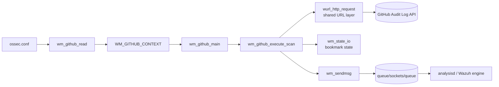
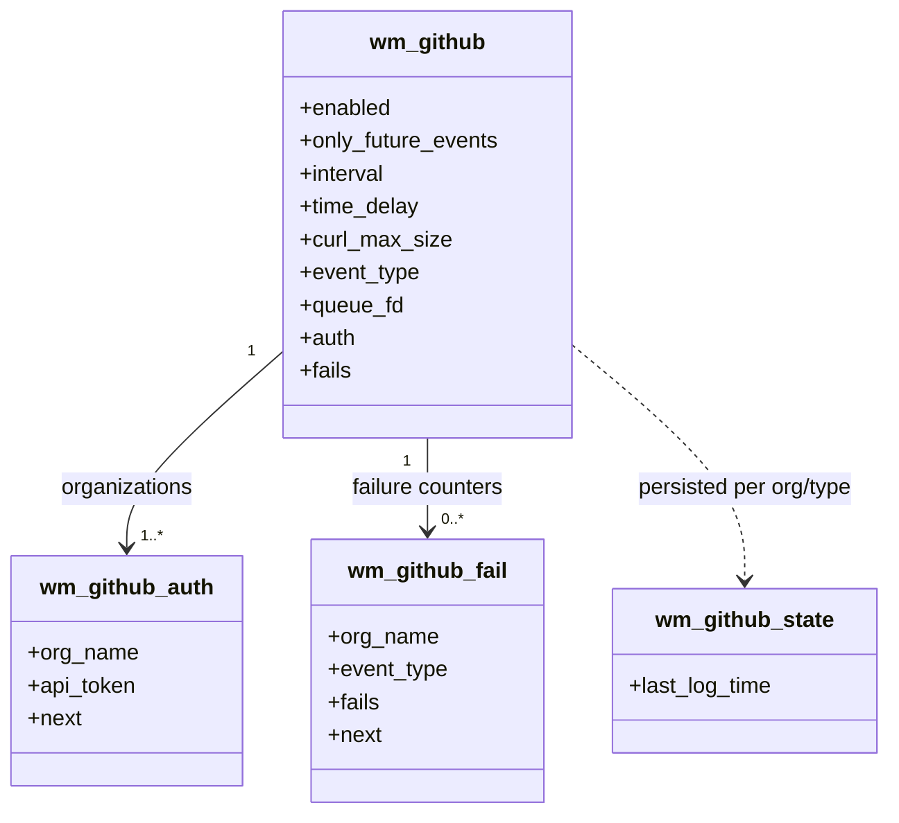
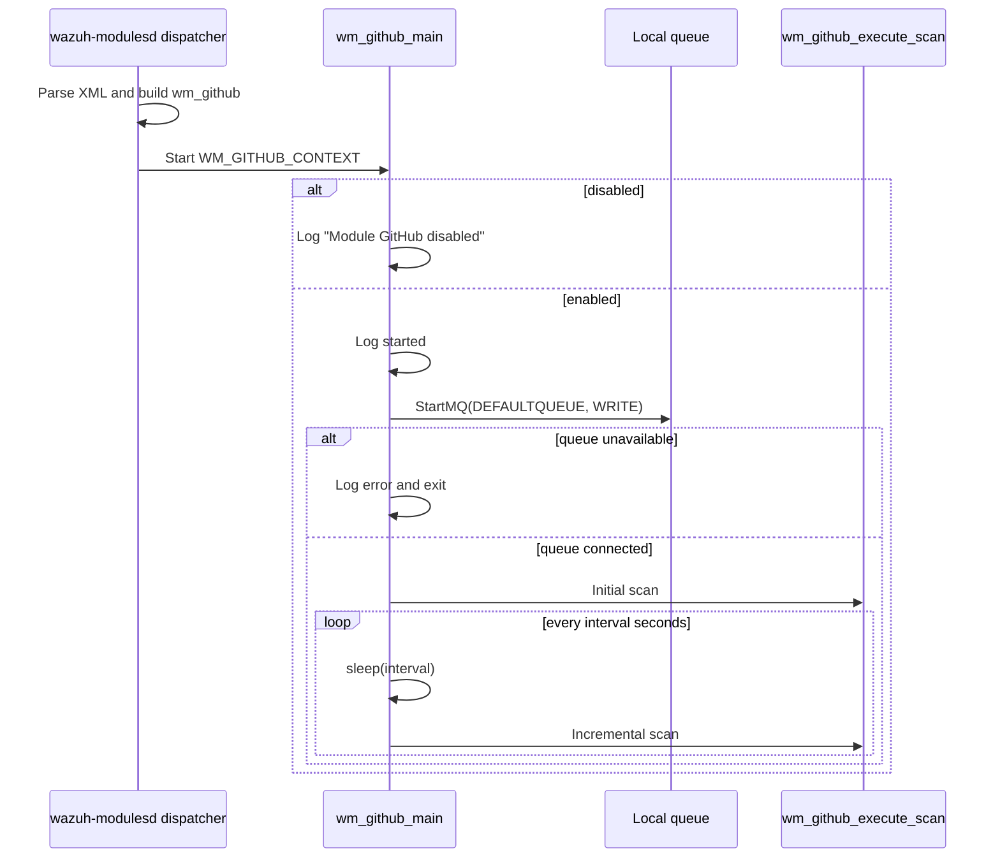
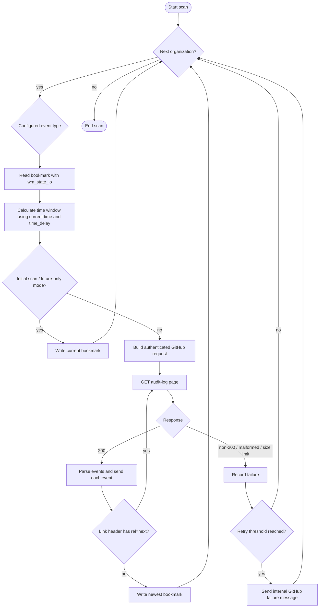
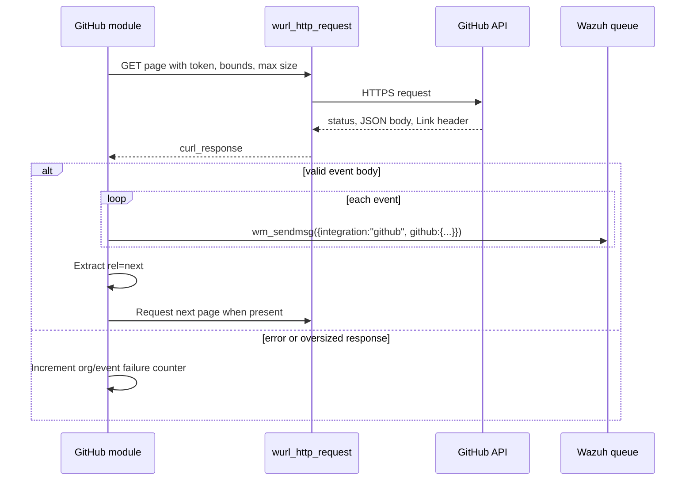

# GitHub integration module

The GitHub module (`wm_github`) is a native C integration hosted by
`wazuh-modulesd`. It periodically reads GitHub organization audit events over
HTTPS, maintains per-organization/event-type bookmarks, and forwards normalized
JSON messages to Wazuh's local message queue for analysis and alerting.

The implementation belongs to the cloud-integration family described in
[wazuh_modules_core_cloud_integrations_github.md](wazuh_modules_core_cloud_integrations_github.md).
This page is the focused entry point for the module; shared daemon lifecycle,
HTTP, queue, and scheduling behavior is documented in
[wazuh_modules_core_lifecycle.md](wazuh_modules_core_lifecycle.md),
[shared_lib_networking.md](shared_lib_networking.md),
[test_url.md](test_url.md), and
[shared_lib_system_utils_config_scheduling.md](shared_lib_system_utils_config_scheduling.md).

## System position



The module is an inbound data adapter, not an API endpoint. It owns the
provider-specific URL construction, pagination, response parsing, and
bookmark semantics; generic Wazuh services own thread registration, HTTP
transport, queue delivery, logging, and state-file mechanics.

## Components

| Component | Responsibility |
| --- | --- |
| `src/wazuh_modules/wm_github.c` | Runtime loop, scanning, HTTP response handling, pagination, bookmark updates, failure reporting, configuration dump, and destruction. |
| `src/wazuh_modules/wm_github.h` | `wm_github`, `wm_github_auth`, `wm_github_state`, and `wm_github_fail` data structures plus GitHub constants. |
| `src/wazuh_modules/wmodules.c` | Generic module dispatcher, `wm_state_io`, queue helpers, and module lifecycle integration. |
| `src/shared/url.c` | Libcurl-backed `wurl_http_request` and `curl_response`; see [test_url.md](test_url.md). |
| `src/shared/mq_op.c` | Local queue connection and message delivery primitives. |
| `src/unit_tests/wazuh_modules/github/test_wm_github.c` | CMocka tests for lifecycle, parsing, state, pagination, failure behavior, and XML configuration. |

### Runtime data model



`wm_github_auth` is a linked list, so multiple `<api_auth>` blocks are
supported. State is keyed by organization and event type (for example,
`github-Wazuh-git`). Failure records are also keyed by that pair and are
created lazily when a scan fails.

## Configuration

The parser accepts the following XML elements inside the GitHub module block.
Values are converted to the internal units shown below.

| Element | Meaning | Defaults / accepted values |
| --- | --- | --- |
| `enabled` | Enables the worker. | `yes` or `no`; default `yes`. |
| `interval` | Delay between scan cycles. | Duration such as `10`, `50s`, `1m`, `2h`, or `3d`; default `60` seconds. |
| `time_delay` | Safety overlap/subtraction used when constructing the time window. | Duration; default `30` seconds. |
| `curl_max_size` | Maximum HTTP response size. | Byte-size values such as `2048` or `2k`; minimum is 1 KB. |
| `only_future_events` | Avoids historical events on the first scan by initializing the bookmark. | `yes` or `no`; default `yes`. |
| `api_auth/org_name` | GitHub organization to scan. | Required and non-empty. |
| `api_auth/api_token` | Token used for the organization API request. | Required and non-empty. |
| `api_parameters/event_type` | Audit stream selection. | `git`, `web`, or `all`; default `all`. |

Example:

```xml
<wodle name="github">
  <enabled>yes</enabled>
  <interval>10m</interval>
  <time_delay>30s</time_delay>
  <curl_max_size>2k</curl_max_size>
  <only_future_events>yes</only_future_events>
  <api_auth>
    <org_name>Wazuh</org_name>
    <api_token>REDACTED</api_token>
  </api_auth>
  <api_parameters>
    <event_type>all</event_type>
  </api_parameters>
</wodle>
```

Configuration parsing rejects unknown tags, missing organization/token values,
invalid durations, unsupported event types, invalid booleans, and response
limits below 1 KB. Repeated `api_auth` blocks append credentials; repeated
`api_parameters` blocks use the later event type, as covered by the unit tests.

## Lifecycle and scheduling



The generic module manager calls the module's dump and destroy hooks. Cleanup
releases authentication entries, failure entries, event-type storage, and the
top-level configuration object. Queue connection and scheduling behavior are
shared conventions; see [wazuh_modules_core_lifecycle.md](wazuh_modules_core_lifecycle.md).

## Scan and bookmark flow



For each organization, the module processes the selected audit streams
(`git` and/or `web`). The initial future-only path deliberately writes a
bookmark without requesting old data. Subsequent scans use the saved timestamp
as the lower bound and advance the bookmark only after the response has been
handled. This prevents a failed request from silently losing the time window.

## HTTP and pagination

The module delegates transport to `wurl_http_request`, passing the configured
maximum response size, the standard GitHub request timeout, headers containing
the organization token, and TLS verification settings. A response is represented
by `curl_response` and may contain status code, body, headers, or a
`max_size_reached` flag.

`wm_read_http_header_element` extracts the next-page URL from GitHub's `Link`
header using the regular expression `<(\\S+)>;\\s*rel="next"`. The helper
handles three failure classes: regex compilation failure, no match, and a
match without a captured element. In all cases it returns no next page and the
scan terminates safely.



## Message and failure behavior

Successful events are wrapped with GitHub integration metadata before being
sent to the local queue. A representative failure message is:

```json
{
  "integration": "github",
  "github": {
    "actor": "wazuh",
    "organization": "Wazuh",
    "event_type": "git",
    "response": "Unknown error"
  }
}
```

Failure counters are maintained per organization/event type. A new failure
creates a linked-list record; repeated failures increment it. Once the retry
threshold is reached, `wm_github_scan_failure_action` sends an internal
message through `wm_sendmsg`, while preserving the counter for the next scan.
Queue-send failures are logged separately. Error strings that are JSON are
escaped before inclusion in the wrapper; otherwise the response is normalized
to `Unknown error`.

## Testing and maintenance

The focused CMocka suite in
`src/unit_tests/wazuh_modules/github/test_wm_github.c` covers:

- enabled, disabled, and queue-start failure lifecycle paths;
- default and explicit configuration values, duration suffixes, and size units;
- multiple organization credentials and repeated tags;
- invalid tags, values, and missing authentication fields;
- initial versus incremental scans, state read/write, and bookmark formatting;
- HTTP status handling, malformed/empty bodies, response-size limits, and
  pagination header parsing;
- failure-counter creation, incrementing, alert emission, and queue errors.

When changing this module, update both the XML parser tests and runtime scan
tests. Prefer the shared HTTP and queue contracts instead of introducing a
provider-specific transport or scheduler. For broader cloud-integration
comparisons, see [wazuh_modules_core_cloud_integrations.md](wazuh_modules_core_cloud_integrations.md).
