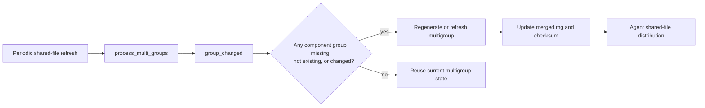
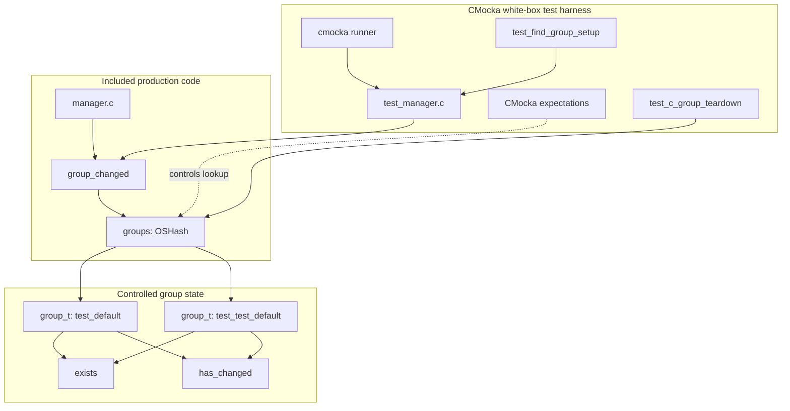
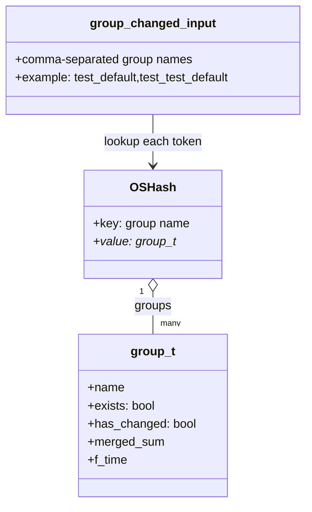
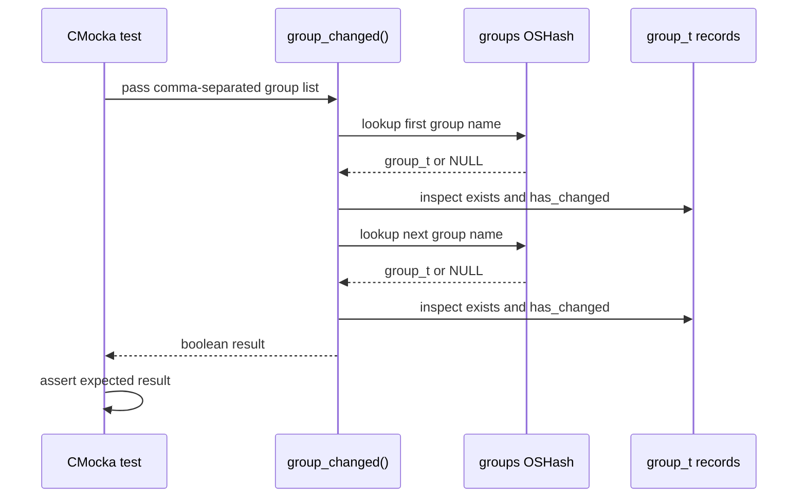
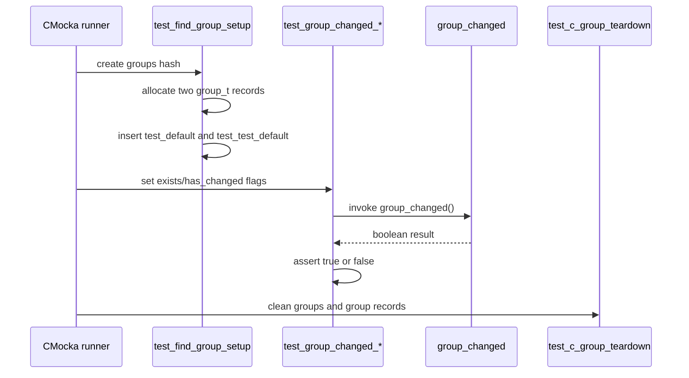

# `group_changed_tests`

## Introduction

`group_changed_tests` documents the focused CMocka coverage for `group_changed()`, an internal helper in `src/remoted/manager.c`. The helper evaluates a comma-separated list of agent groups and reports whether the multigroup configuration is no longer usable because a member group is missing, does not currently exist, or has changed.

The tests are part of `src/unit_tests/remoted/test_manager.c`. That translation unit directly includes `manager.c`, allowing the suite to exercise implementation-level state and replace `OSHash_Get_ex()` with deterministic CMocka expectations. The broader fixture and wrapper design is documented in [`test_manager_remoted_test_infrastructure`](test_manager_remoted_test_infrastructure.md); the production group-management workflow is documented in [Remoted Group Management](remoted_group_management.md).

## Scope and system role

The helper sits in the multigroup refresh path. A multigroup is represented by a comma-separated group name such as `test_default,test_test_default`. Before a cached multigroup can be reused, Remoted must confirm that each component group still exists and that none of them has been modified.



This module documents only the predicate and its unit tests. Directory scanning, merged-file generation, stale-entry deletion, and agent delivery are covered by [c_group tests](c_group_tests.md), [c_multi_group tests](c_multi_group_tests.md), [c_files tests](c_files_tests.md), and [Remoted Group Management](remoted_group_management.md).

## Architecture



### Component responsibilities

| Component | Responsibility |
| --- | --- |
| `manager.c::group_changed` | Evaluates every group named in the input list and returns the aggregate changed/not-usable result. |
| `groups` | Global `OSHash` keyed by group name; it supplies the `group_t` record for each lookup. |
| `group_t::exists` | Indicates whether the group was present in the latest group-processing view. |
| `group_t::has_changed` | Indicates that the group’s shared content or derived state changed. |
| `test_find_group_setup` | Creates the `groups` hash and two named `group_t` fixtures used by the core tests. |
| `__wrap_OSHash_Get_ex` | Makes each lookup explicit: the test checks both the hash object and exact key. |
| `test_c_group_teardown` | Cleans the shared group hash and frees the fixture records after each test. |

## Data model and predicate



The test contract is:

```text
group_changed(group_list) == true
    if any lookup returns NULL
    or any group has exists == false
    or any group has has_changed == true

group_changed(group_list) == false
    only when every listed group is found, exists == true,
    and has_changed == false
```

This is the behavioral contract established by the tests; the implementation remains the source of truth for tokenization and evaluation order.

## Core test matrix

The three core tests all use the same input and fixture records. Only the state of the second group changes.

| Test | `test_default` | `test_test_default` | Expected result | Meaning |
| --- | --- | --- | --- | --- |
| `test_group_changed_not_changed` | `exists=true`, `has_changed=false` | `exists=true`, `has_changed=false` | `false` | All component groups are valid and current. |
| `test_group_changed_has_changed` | `exists=true`, `has_changed=false` | `exists=true`, `has_changed=true` | `true` | One component group requires refresh. |
| `test_group_changed_not_exists` | `exists=true`, `has_changed=false` | `exists=false`, `has_changed=false` | `true` | A component group is no longer present in the current scan. |

The same source registration also includes `test_group_changed_invalid_group`, which returns `true` when the third lookup returns `NULL`. That adjacent case confirms that an unknown group is treated as unsafe to reuse, rather than as unchanged.

## Data flow

```mermaid
flowchart TD
    I["group_changed(\"test_default,test_test_default\")"] --> P[Split or iterate group names]
    P --> L1[OSHash_Get_ex(groups, "test_default")]
    L1 --> V1{Record found?}
    V1 -- no --> Y[Return true]
    V1 -- yes --> S1{exists && !has_changed?}
    S1 -- no --> Y
    S1 -- yes --> L2[OSHash_Get_ex(groups, "test_test_default")]
    L2 --> V2{Record found?}
    V2 -- no --> Y
    V2 -- yes --> S2{exists && !has_changed?}
    S2 -- no --> Y
    S2 -- yes --> N[Return false]
```

The important property is short-circuit safety: any invalid member makes the entire multigroup require attention. A multigroup cannot be considered current merely because some of its component groups are current.

## Component interaction



The wrapper expectations also verify the lookup keys and ordering. This prevents a test from passing merely because the final boolean is correct while the helper queries the wrong hash or group name.

## Fixture lifecycle and registration



The tests are registered with setup/teardown hooks:

```c
cmocka_unit_test_setup_teardown(
    test_group_changed_not_changed,
    test_find_group_setup,
    test_c_group_teardown)
```

The `has_changed` and `exists` flags are assigned inside each test after setup. This keeps the fixture reusable while making each scenario’s state transition explicit.

## Dependencies and boundaries

| Dependency | Test treatment | Why it matters |
| --- | --- | --- |
| `src/remoted/manager.c` | Included directly | Enables white-box access to the internal helper and global `groups` state. |
| `OSHash` | Lookup is wrapped with `__wrap_OSHash_Get_ex` | Isolates the predicate from hash implementation details and verifies exact keys. |
| `group_t` | Allocated as fixture data | Supplies the two state dimensions used by the predicate. |
| Filesystem, Wazuh DB, sockets, and network | Not exercised by the core tests | These are outside the helper’s direct boundary; they belong to the surrounding Remoted workflows. |
| CMocka setup/teardown | Creates and destroys global state | Prevents one test’s group flags or hash entries from leaking into another test. |

No real directory scan, checksum calculation, database query, or agent connection is required for these cases. That makes the tests fast and deterministic, while the linked Remoted and adjacent test documents cover integration with those boundaries.

## Maintenance guidance

When changing `group_changed()` or `group_t`:

1. Preserve the invariant that a missing, non-existing, or changed component invalidates the complete multigroup.
2. Update wrapper expectations if lookup order, hash ownership, or key normalization changes.
3. Add a focused case for new states rather than expanding these tests with filesystem or Wazuh DB setup.
4. Keep fixture cleanup aligned with the ownership rules documented in [`test_manager_remoted_test_infrastructure`](test_manager_remoted_test_infrastructure.md).
5. Recheck neighboring coverage in [c_multi_group tests](c_multi_group_tests.md), especially when the meaning of “changed” affects regeneration or deletion.

The source of truth for the registered cases is `src/unit_tests/remoted/test_manager.c`; the source of truth for production behavior is `src/remoted/manager.c`.

